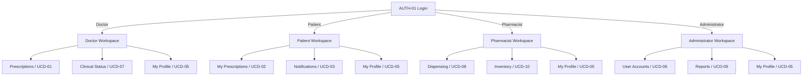
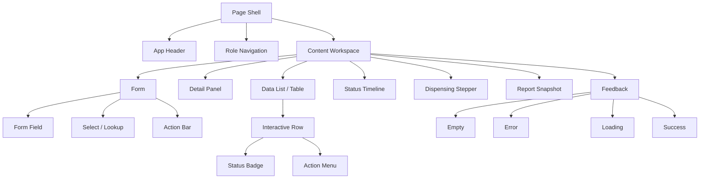
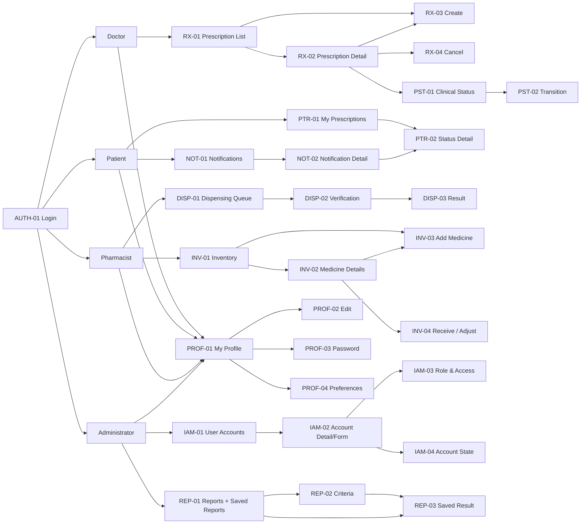

# Pharmacy Inventory & Prescription System — Spring Boot + Java + JSP High-Fidelity Desktop UI Implementation Plan — Fixed-Structure Revision

**Deliverable type:** Complete Figma-to-Spring-MVC/JSP implementation specification  
**Technology target:** Spring Boot · Java · Spring MVC · JSP/JSTL · HTML · CSS · progressive JavaScript  
**Figma reference:** `Hn3t09dEGtunesiH5ytytn` / Page `0:1` · 32 named UI frames  
**Architecture source:** `compact structure(3).md` — fixed/non-negotiable Java package and file foundation  
**Class-diagram sources:** UCD-01, UCD-02, UCD-03, UCD-04, UCD-05, UCD-06, UCD-07, UCD-08, UCD-09, UCD-10 supplied class diagrams  
**Scope:** Entire application; not a 3A-only appendix. Every screen retains its UI/Figma plan and receives a Java/JSP delivery contract.

**Document Type:** Desktop UI / High-Fidelity Prototype Behaviour & Component Specification  
**Status:** Complete desktop high-fidelity master specification — all architecture, shell, modules, 32 screens, component placement, prototype states and Figma delivery guidance  
**Platform Scope:** Desktop web application or Windows-style desktop application. The interaction model is mouse + keyboard first, with persistent navigation and dense information workspaces.  
**Purpose:** Define implementation-oriented behaviour, component composition, navigation targets, state variants, critical-data treatment and Figma prototype interactions for every listed UI surface without duplicating sequence diagrams, class diagrams, or full use-case descriptions.

## Source-of-Truth Rule

> **Architecture lock for this revision:** `compact structure(3).md` is non-negotiable. The UCD class diagrams are used to merge repeated responsibilities into those existing files. No service/DTO/repository/config layer is introduced. Any additional Java presentation helper must live under `view`.


This document translates the approved requirements and UCD boundaries into UI behaviour. It does not redefine domain ownership.

When a UI surface displays data owned by another domain, that information is contextual/read-only unless the owning UCD explicitly authorises mutation.

The clarified specification adds several UI-visible rules that were not explicit in the earlier UI document:

- a Patient business record may exist without login access;
- a Doctor may create the Patient business record needed for clinical work but may not administer Patient credentials or permissions;
- an Administrator may later provision/link login access to an existing Patient record;
- a Prescription contains one or more Prescription Items;
- Draft prescriptions are not visible to Patients;
- a Prescription becomes Expired one month after issue and Expired prescriptions are not dispensable;
- cancelled prescriptions are final in the current scope;
- partial dispensing and repeat dispensing are not supported;
- stock availability is aggregated across eligible non-expired batches and allocated earliest-expiry-first;
- stock is deducted only at final dispensing confirmation;
- manual stock adjustment requires a reason;
- in-system notifications are persisted and retain read/delivery state;
- generated reports are persisted as historical snapshots and PDF export uses the saved snapshot;
- minimum password length is eight characters;
- authenticated sessions expire after one hour.

These rules are incorporated into the cells below rather than documented as separate duplicate workflows.

# 0. High-Fidelity Desktop UI Rules

This revision uses the same notation logic as the supplied High-Fidelity UI Component Matrix, but adapts it for a desktop clinical/administrative application rather than a mobile/public application.

## 0.1 Component notation

`Component · pattern — [size | placement | hierarchy | target/state]`

### Size
- `sm` = icon button, badge, metadata, compact utility.
- `md` = normal desktop input, button, filter, row action, compact card.
- `lg` = primary command, substantial form group, summary card, confirmation region.
- `xl` = major table, form, details panel, drawer or dialog.
- `xxl` = dominant application workspace or analytical/reporting surface.

### Hierarchy
- `P` = **Primary** — dominant task, current destination or critical decision.
- `S` = **Secondary** — meaningful alternative, persistent navigation or supporting action.
- `I` = **Informational** — inspection, read-only context, drill-down or supporting evidence.
- `HI` = **Hidden / low-emphasis** — overflow, recovery, audit metadata or rarely used action.

### Desktop navigation rule
Every interactive navigation control must name its destination explicitly:

`Open Prescription · table row → RX-02 — [md | workspace | I | target:RX-02]`

`Create Prescription · primary command → RX-03 — [md | command-bar | P | target:RX-03]`

For role navigation, the active module is `P`; other permitted modules are `S`. Back/Close is normally `S`; recovery or overflow actions are `HI` unless they are the only safe way forward.

## 0.2 Desktop design language

| Area | High-fidelity desktop rule |
|---|---|
| **Application shell** | Persistent left navigation + top command/header region + central workspace. Navigation is role-filtered, supports active indicator and may collapse to icon rail without changing information architecture. |
| **Page header** | Breadcrumb/record context, page title, authoritative status and page-level actions remain visible. Important transactional screens use a sticky command area so context is not lost while scrolling. |
| **Buttons** | Filled primary command, tonal/outlined secondary actions, icon buttons for row utilities, destructive emphasis only for irreversible/high-impact actions. One visually dominant primary command per task region. |
| **Inputs** | Label-above desktop fields, searchable comboboxes, date pickers, masked password inputs, structured quantity fields and inline validation. Do not depend on placeholders as labels. |
| **Filtering** | Horizontal filter toolbar above data grid; saved/clear filters where useful; compact popovers for secondary filter options. Active filters remain visible as removable tokens or populated controls. |
| **Data grids** | Sticky header, sortable columns, keyboard row navigation, row selection/hover, optional column resize/pinning, empty/filtered-empty/loading/error/stale variants. Row actions appear in a stable trailing action column or contextual menu. |
| **Master-detail** | Use split-view or details page where list context matters. Selection should not silently discard filters/search. Contextual edit can use a right drawer; large multi-section transactions remain a page. |
| **Drawers** | Right-side contextual panel for create/edit or secondary inspection when keeping the parent workspace visible improves orientation. Drawer supports dirty state, validation, retry and close confirmation. |
| **Dialogs** | Focused confirmation/atomic transaction only. Dialog contains object identity, current state, intended change, consequence and explicit Confirm/Cancel. Long workflows do not belong in a dialog. |
| **Status** | Status badges combine text + icon/shape; never colour alone. Clinical status and fulfilment status remain separate semantic components. |
| **Feedback** | Skeleton for initial load; inline field errors; contextual banner for business restrictions; toast for routine success; explicit result surface for dispensing/report generation; retry with preserved safe context on failure. |
| **Keyboard** | `Tab` follows visual task order; `Enter` submits only when safe; `Esc` closes non-destructive overlay; row activation supports Enter/double-click only when unambiguous; destructive actions always require explicit confirmation. |
| **Motion** | Short state transitions for drawers/dialogs/status change. Use motion to preserve spatial continuity, not as decoration. Critical clinical/stock confirmation must remain legible and stable. |
| **Accessibility** | Visible focus, semantic headings/labels, screen-reader names for icon actions, non-colour state cues, logical table headers, announced validation and no hover-only essential information. |

## 0.3 Figma prototype construction rules

| Pattern | Figma implementation |
|---|---|
| **Persistent shell** | Build `AppShell/Desktop` as a component with role variants: Doctor, Patient, Pharmacist, Administrator. Use nested navigation-item components with `Active / Default / Hover / Focus` states. |
| **Navigation** | Use `Navigate to` for full workspace changes. Preserve shell position visually across frames. Use component properties for active navigation state rather than duplicating unrelated shell designs. |
| **Table drill-down** | Row `On click` → Navigate to detail frame, or `Open overlay` for quick preview only. Filter/search values should be represented by matching return-state variants when demonstrating back navigation. |
| **Drawer** | `Open overlay` from the right with fixed position. Drawer has `Default / Dirty / Validating / Saving / Save error / Stale data` variants. Close from Dirty state opens unsaved-changes confirmation. |
| **Dialog** | `Open overlay` centred; background interaction blocked. Confirm button swaps to `Submitting`, then closes only after success-state transition. Failure swaps dialog to inline-error variant and keeps it open. |
| **Form validation** | Input components use variants `Default / Focus / Populated / Invalid / Read-only / Disabled`. Submission from invalid form changes only affected components and focuses/scrolls to first invalid group in the simulated flow. |
| **Loading & refresh** | Swap the workspace component to `Skeleton`, then `Populated`; refresh uses `Refreshing` without blanking current data. Stale state adds a persistent banner with `Reload latest`. |
| **Concurrent update** | Action → `Stale/Conflict` variant. `Reload latest` navigates/swaps to refreshed authoritative frame; no prototype path should show a successful commit from stale data. |
| **Permission/session** | Direct forbidden navigation → AUTH-04. Session-expired mutation → auth overlay/frame; after re-authentication, return to a safe revalidated state rather than jumping directly to success. |
| **Critical result** | Dispensing and report generation navigate to immutable result/snapshot frames. Toast alone is not used as proof of completion. |

## 0.4 Critical-data annotation notation

Critical data is annotated using:

`Source | Freshness | Confidence | Persistence | Retention`

- **Source**: authoritative domain/service or persisted snapshot.
- **Freshness**: `live`, `on-open`, `on-refresh`, `transaction-revalidated`, or `historical snapshot`.
- **Confidence**: `authoritative`, `computed from authoritative data`, or `contextual/read-only`.
- **Persistence**: whether data is transient UI state, persisted business data, audit/event history or saved snapshot.
- **Retention**: `current record`, `historical/audit`, `session`, or `saved report history` according to the approved domain behaviour. The UI does not invent a legal retention period when none is specified.

# 1. Overall UI Architecture

The UI uses one authenticated application shell with role-filtered navigation. Authentication and permission evaluation remain UCD-04 responsibilities; role/account administration remains UCD-06. Clinical and fulfilment state are displayed separately even when a Patient-facing timeline combines them visually.



# 2. Global Desktop Application Shell

| Region | Detailed desktop UI / behaviour contract |
| --- | --- |
| **Role Navigation Sidebar** | Persistent left navigation after sign-in. Doctor: Prescriptions, My Profile; Patient: My Prescriptions, Notifications, My Profile; Pharmacist: Dispensing, Inventory, My Profile; Administrator: User Accounts, Reports, My Profile, plus any already-authorised system access. Active destination uses a strong indicator; unavailable modules are omitted instead of disabled. Direct protected-route attempts resolve to AUTH-04. |
| **Top Header / Command Context** | Shows current module/page title, breadcrumb or parent-record identity, current authoritative status, unread indicator where relevant, current user identity/role and profile/logout menu. The header never exposes editable RBAC controls. High-value record context stays visible during edits/transactions. |
| **Command Bar** | Contains page-level commands valid for actor + record state: Create Prescription, Change Clinical Status, Add Medicine, Receive Stock, Generate Report, etc. Primary action is visually dominant; dangerous commands are separated from ordinary save/edit controls. Invalid/forbidden actions are removed from normal command sets. |
| **Main Workspace** | Dense desktop content region containing list, detail, master-detail, form, timeline, transactional workflow or report result. Read-only cross-domain data uses display components rather than disabled form fields. Workspaces may use split panes where it improves comparison/context. |
| **Data Table Region** | Sticky column headers, compact row density, keyboard focus, row hover/selected state, sortable/filterable columns, trailing row actions, loading skeleton, populated, empty, filtered-empty, refreshing, stale and error variants. Tables preserve current filter/search state when returning from details where practical. |
| **Context Panel / Drawer** | Right-side panel for contextual create/edit/inspection when the parent record/list should remain visible. It must support validation, dirty state, save progress, stale/concurrent state, retry and unsaved-change confirmation. |
| **Status & Business Rules** | Inline contextual banners communicate Expired, insufficient stock, disabled account, non-dispensable batch, stale version and other business restrictions. Clinical and fulfilment states stay visually separate. Colour is never the sole state indicator. |
| **Status Feedback** | Field validation stays beside the input; business restrictions use inline alerts; routine successful saves use toast/snackbar + authoritative refresh; persistence failures preserve context + retry; dispensing uses DISP-03; report generation uses persisted REP-03. |
| **Critical Confirmation** | Centred modal/focused surface for prescription cancellation, account-state change where required, clinical transition, final dispensing and stock adjustment. Show target, current state, requested state/change, consequence, revalidation/loading state and explicit confirm/cancel. |
| **Session / Security State** | Authenticated session lifetime is one hour. A protected mutation checks current validity. On expiry, stop the operation, preserve safe unsaved work where possible, authenticate again, then revalidate state before allowing the mutation. Never show success for an operation that was not committed. |
| **Desktop Interaction** | Mouse + keyboard first. `Tab`/focus order mirrors visual task order, `Enter` activates safe primary actions, `Esc` closes non-destructive overlays, tables expose keyboard focus and no critical function depends exclusively on hover. |
| **Window / Browser Behaviour** | The information architecture is identical whether hosted as desktop web or packaged Windows application. Native browser/window chrome is outside the application design; app-internal navigation, dialogs, tables, validation and state handling remain consistent. |

# 3. Complete UI Screen / Surface Listing

The current design contains **32 primary prototype surfaces**. Reusable component states, drawers, alerts, modals, loading states, and validation variants should not be counted as separate full screens.

| ID | UCD | Prototype Screen / Surface | Source View | Dense Purpose / Behaviour |
| --- | --- | --- | --- | --- |
| AUTH-01 | 04 | Login | `LoginFormView` | Entry point for all users; validates identifier/password, establishes one-hour session, then routes to the workspace authorised for the account's assigned authorised role/permission context. |
| AUTH-02 | 04 | Password Recovery | `AuthenticateAuthoriseView` | Recovery initiation; collects registered identity/contact value, avoids account-enumeration wording, and moves to a safe confirmation/recovery continuation. |
| AUTH-03 | 04 | Reset Password | `AuthenticateAuthoriseView` | Sets a replacement password using valid recovery context; enforces minimum eight characters and confirmation match before returning to Login. |
| AUTH-04 | 04 | Access Denied | `AccessDeniedView` | Protected-route denial surface for insufficient permission; gives safe reason/context and a route back to an authorised location without exposing security internals. |
| RX-01 | 01 | Prescription Workspace / List | `ManagePrescriptionView` | Doctor's primary prescription workspace; search/filter clinical records, identify Draft/Issued/On Hold/Cancelled/Expired states, create a new prescription, and open an existing record. |
| RX-02 | 01 | Prescription Details | `ManagePrescriptionView` + `PrescriptionItemView` | Read-focused Doctor detail showing Patient, one-to-many medication items, clinical status, and contextual read-only fulfilment information; routes to edit/status/cancel only when permitted. |
| RX-03 | 01 | Create / Edit Prescription | `PrescriptionFormView` + `PrescriptionItemView` | Clinical form for Patient selection plus one-to-many Prescription Items; supports contextual Patient creation when no business record exists, without giving the Doctor account/credential administration. |
| RX-04 | 01 | Cancel Prescription | Contextual confirmation modal | Final cancellation command; identifies the prescription, shows consequence/current state, captures reason where required, prevents duplicate submission, and does not provide restore. |
| PST-01 | 07 | Clinical Status Management | `UpdatePrescriptionStatusView` | Doctor-only status surface showing current clinical state, expiry/ineligibility context, and only currently permitted clinical transitions. |
| PST-02 | 07 | Status Transition | `PrescriptionStatusFormView` | Focused transition form/confirmation for target clinical state and required reason; revalidates current state before commit. |
| PTR-01 | 02 | My Prescriptions | `ViewPrescriptionStatusView` | Patient-only read view of own visible prescriptions; Draft excluded, Expired clearly labelled, clinical and fulfilment status presented separately but compactly. |
| PTR-02 | 02 | Prescription Status Details | `PrescriptionStatusDetailsView` | Read-only Patient detail with medication instructions plus a patient-readable clinical/fulfilment timeline; Cancelled/Expired/Dispensed are handled as clear terminal or blocking states. |
| NOT-01 | 03 | Notification Centre | `NotificationView` | Persistent in-system notification history for the signed-in Patient; unread/read filtering, chronological ordering, related prescription context, and mark-read behaviour. |
| NOT-02 | 03 | Notification Detail | `NotificationView` | Full persisted notification message and metadata safe for Patient display; marks read and can deep-link to the related Patient prescription detail. |
| PROF-01 | 05 | My Profile | `ManageProfileView` + `ProfileDetailsView` | Self-service profile summary for the current authenticated user only; separates editable personal information from protected role/account/system identifiers. |
| PROF-02 | 05 | Edit Profile | `ProfileFormView` | Edits permitted current-user personal/contact fields with validation, version/concurrency handling, and unsaved-change protection; cannot modify RBAC/account state. |
| PROF-03 | 05 | Change Password | Profile security surface | Current-password/new-password/confirmation workflow; minimum eight-character rule, mismatch feedback, safe success return, and no role/account changes. |
| PROF-04 | 05 | Notification Preferences | Profile preferences surface | Current-user preference controls only; baseline in-system notification remains supported and event-generation ownership remains UCD-03. |
| IAM-01 | 06 | User Account Management | `ManageUserAccountView` + `UserAccountListView` | Administrator account workspace; search/filter account lifecycle state and role, create account, open account detail, and identify Patient records that may require login provisioning. |
| IAM-02 | 06 | Create / Edit Account | `UserAccountFormView` | Administrator account form for identity/access lifecycle data; validates duplicate username/email and supports linking a Patient-role account to an existing Patient business record instead of duplicating it. |
| IAM-03 | 06 | Role & Account Access | `UserAccountFormView` | Administrator-only access configuration; assigned role/permission set per account, account state/approval context, permission summary, and Patient-account linkage context where applicable. |
| IAM-04 | 06 | Disable / Enable / Unlock | Contextual confirmation modal | Focused account-state command; shows current account, requested state, impact, optional reason where the existing design requires it, and refreshes authoritative state after commit. |
| DISP-01 | 08 | Dispensing Queue | `DispenseMedicationView` | Pharmacist queue of eligible fulfilments; surfaces clinical eligibility, fulfilment state, Patient, and blocking states such as Cancelled/Expired/already Dispensed. |
| DISP-02 | 08 | Verification & Dispensing | `DispenseFormView` | Controlled transaction: verify Patient/prescription, show all prescription items and full required quantities, aggregate eligible stock across non-expired batches, preview earliest-expiry-first allocation, and confirm full handover only. |
| DISP-03 | 08 | Dispensing Result | `DispenseResultView` | Dedicated immutable transaction outcome; success shows recorded DispenseRecord, deducted quantities/batches and timestamp; failure never appears as success and retains a safe route back for correction/retry. |
| INV-01 | 10 | Medicine Inventory | `ManageMedicineInventoryView` + `MedicineListView` | Pharmacist inventory overview of medicine master plus aggregate dispensable stock; visually separates normal/low/out/expiring/expired/inactive states and supports search/filter/sort. |
| INV-02 | 10 | Medicine / Batch Details | `ManageMedicineInventoryView` | Medicine detail plus all batches, including expired batches retained for records; shows dispensable vs physical/on-hand quantity, expiry ordering, and stock-movement context. |
| INV-03 | 10 | Add / Edit Medicine | `MedicineFormView` | Medicine master-data form for code/name/generic/form/strength/unit/description and active state; duplicate and field validation; does not directly change stock quantity. |
| INV-04 | 10 | Receive / Adjust Stock | `StockAdjustmentView` | Transactional stock drawer/modal for receiving or adjustment; quantity/batch/expiry inputs as applicable, mandatory adjustment reason for manual adjustment, current/projected balance, negative-balance prevention. |
| REP-01 | 09 | Reports Home / Saved Reports | `GenerateReportsView` | Administrator reporting entry; four required report categories plus persisted historical report list with type, generated timestamp, generated-by, row count, and open/export actions. |
| REP-02 | 09 | Report Criteria | `ReportCriteriaView` | Criteria builder for Prescription, Dispensing, Inventory, or User/Access report; validates date/filter combinations and preserves criteria if generation returns no data. |
| REP-03 | 09 | Report Result / Snapshot | `ReportResultView` | Read-only generated historical snapshot with title/criteria/timestamp/row count, summary visualisation/detail table as appropriate, save state, and PDF export from persisted snapshot rather than live recalculation. |

# 3A. Figma Desktop Delivery Foundation
This is a **global delivery layer for the entire file**, not a screen subsection. Every screen in Sections 4–13 inherits these scale, naming, Auto Layout and component-library rules unless a screen explicitly overrides them.

## 3A.1 Desktop scale and hierarchy baseline
| Token | Figma recommendation | Use |
|---|---|---|
| Reference frame | `1440×900` | Primary prototype frame; also review at 1280 px and 1920 px widths. |
| Sidebar | `248 px` expanded / `72 px` collapsed | Persistent role navigation. |
| Top bar | `64 px` | Current module/page context, current user and global utilities. |
| Outer workspace padding | `32 px` | Standard page edge spacing after shell. |
| Grid | `12 columns`, `24 px` gutter | Desktop page composition. |
| Control height | `40 px` normal; `32–36 px` compact | Inputs, filters, command buttons and utility icon controls. |
| Data-grid row | `44–48 px` | Dense operational tables; increase only for multi-line content. |
| Type hierarchy | Page 28–32; section 20–24; body 14–16; metadata 12–13 | Keep the operational decision above IDs/audit metadata. |
| Motion | ~160–240 ms | Drawers/dialogs/state continuity only; critical transactions stay stable and legible. |

## 3A.2 Required Figma component families
`AppShell/Desktop`, `NavigationItem`, `PageHeader`, `CommandBar`, `Button`, `IconButton`, `Field`, `TextArea`, `Combobox`, `DateField`, `FilterToolbar`, `StatusBadge/Clinical`, `StatusBadge/Fulfilment`, `StatusBadge/Inventory`, `StatusBadge/Account`, `DataGrid`, `DataGridRow`, `InlineBanner`, `EmptyState`, `ErrorState`, `Skeleton`, `RightDrawer`, `CriticalDialog`, `StickyActionBar`, `Timeline`, `Stepper`, `TransactionResult`, `ReportSnapshot`.

## 3A.3 Frame and variant naming
Use `Sxx_<SCREEN-ID>_<Name>/<State>`, for example `S05_RX-01_PrescriptionWorkspace/Populated`. Routine states stay inside the same primary screen family: `Loading`, `Populated`, `Empty`, `FilteredEmpty`, `Invalid`, `Dirty`, `Saving`, `Stale`, `Error`, `Success` as applicable.

## 3A.4 Position notation applied throughout the file

Every component uses:

`Component · pattern — [size | position | hierarchy | target]`

`position` must be a named desktop region such as `shell.sidebar`, `shell.topbar`, `page-header`, `command-bar`, `filter-toolbar`, `workspace-main`, `workspace-aside`, `data-grid`, `sticky-action-bar`, `right-drawer`, `dialog.body`, or `dialog.footer-actions`. `target` is either a destination screen (`target:RX-02`), a state (`state:loading`), an overlay (`overlay:INV-04`), or authoritative contextual data (`data:prescription-status`). This notation is required for the screen-level component matrices below.


# 3B. Spring Boot + Java + JSP Delivery Foundation — **Fixed Structure**

## 3B.1 Non-negotiable architecture precedence

The Java project structure below is the **implementation foundation and must not be replaced, normalised, or expanded with parallel architectural layers**.

Implementation precedence for this document is:

1. **Fixed project/package/file structure** from `compact structure(3).md`.
2. **UCD class diagrams** for class ownership, existing attributes/methods, dependencies, and storage responsibilities.
3. **UI behaviour matrix and Figma frames** for screen composition, interaction, position, hierarchy, and visual states.
4. **Spring Boot/JSP adaptation** only inside those boundaries.

Therefore:

- do **not** introduce top-level Java packages such as `service/`, `dto/`, `repository/`, `mapper/`, `config/`, `security/`, `facade/`, or `usecase/`;
- do **not** create a second controller for a UCD that already has a controller;
- do **not** create a second repository abstraction when an existing `*Storage.java` owns persistence;
- do **not** duplicate a model because the same class appears in several class diagrams;
- if extra Java classes are necessary purely for UI/JSP composition, they may be created **only below the relevant `view/...` package**, preferably inside `components/`;
- JSP/CSS/JS deployment resources may live in the normal Spring Boot web-resource directories; these are deployment assets, **not additional Java architecture packages**.

## 3B.2 Fixed Java structure — authoritative

```text
src/main/java/pharmacy_system/
├── Main.java
├── model/
│   ├── security_user/
│   │   ├── UserAccount.java
│   │   ├── Credential.java
│   │   ├── RolePermission.java
│   │   └── profile/
│   │       ├── UserProfile.java
│   │       ├── DoctorProfile.java
│   │       ├── PatientProfile.java
│   │       ├── PharmacyProfile.java
│   │       └── AdminProfile.java
│   ├── clinical_prescription/
│   │   ├── Prescription.java
│   │   ├── PrescriptionItem.java
│   │   └── PrescriptionStatus.java
│   ├── patient_information/
│   │   ├── PrescriptionStatusSummary.java
│   │   └── Notification.java
│   ├── pharmacy_operations/
│   │   ├── DispenseRecord.java
│   │   ├── Medicine.java
│   │   ├── InventoryItem.java
│   │   └── StockMovement.java
│   └── management_dss/
│       ├── Report.java
│       └── ReportCriteria.java
│
├── view/
│   ├── security_user/
│   │   ├── ucd04_authenticate_authorise/
│   │   │   ├── AuthenticateAuthoriseView.java
│   │   │   └── components/
│   │   │       ├── LoginFormView.java
│   │   │       └── AccessDeniedView.java
│   │   ├── ucd05_manage_profile/
│   │   │   ├── ManageProfileView.java
│   │   │   └── components/
│   │   │       ├── ProfileDetailsView.java
│   │   │       └── ProfileFormView.java
│   │   └── ucd06_manage_user_account/
│   │       ├── ManageUserAccountView.java
│   │       └── components/
│   │           ├── UserAccountListView.java
│   │           └── UserAccountFormView.java
│   ├── clinical_prescription/
│   │   ├── ucd01_manage_prescription/
│   │   │   ├── ManagePrescriptionView.java
│   │   │   └── components/
│   │   │       ├── PrescriptionFormView.java
│   │   │       └── PrescriptionItemView.java
│   │   └── ucd07_update_prescription_status/
│   │       ├── UpdatePrescriptionStatusView.java
│   │       └── components/
│   │           └── PrescriptionStatusFormView.java
│   ├── patient_information/
│   │   ├── ucd02_view_prescription_status/
│   │   │   ├── ViewPrescriptionStatusView.java
│   │   │   └── components/
│   │   │       └── PrescriptionStatusDetailsView.java
│   │   └── ucd03_send_alerts_notifications/
│   │       ├── SendAlertsNotificationsView.java
│   │       └── components/
│   │           └── NotificationView.java
│   ├── pharmacy_operations/
│   │   ├── ucd08_dispense_medication/
│   │   │   ├── DispenseMedicationView.java
│   │   │   └── components/
│   │   │       ├── DispenseFormView.java
│   │   │       └── DispenseResultView.java
│   │   └── ucd10_manage_medicine_inventory/
│   │       ├── ManageMedicineInventoryView.java
│   │       └── components/
│   │           ├── MedicineListView.java
│   │           ├── MedicineFormView.java
│   │           └── StockAdjustmentView.java
│   └── management_dss/
│       └── ucd09_generate_reports/
│           ├── GenerateReportsView.java
│           └── components/
│               ├── ReportCriteriaView.java
│               └── ReportResultView.java
│
├── controller/
│   ├── common/
│   │   ├── NavigationController.java
│   │   └── SessionController.java
│   ├── security_user/
│   │   ├── AuthenticateAuthoriseController.java
│   │   ├── ManageProfileController.java
│   │   └── ManageUserAccountController.java
│   ├── clinical_prescription/
│   │   ├── ManagePrescriptionController.java
│   │   └── UpdatePrescriptionStatusController.java
│   ├── patient_information/
│   │   ├── ViewPrescriptionStatusController.java
│   │   └── SendAlertsNotificationsController.java
│   ├── pharmacy_operations/
│   │   ├── DispenseMedicationController.java
│   │   └── ManageMedicineInventoryController.java
│   └── management_dss/
│       └── GenerateReportsController.java
│
└── storage/
    ├── security_user/
    │   ├── UserAccountStorage.java
    │   ├── CredentialStorage.java
    │   ├── RolePermissionStorage.java
    │   └── ProfileStorage.java
    ├── clinical_prescription/
    │   └── PrescriptionStorage.java
    ├── patient_information/
    │   └── NotificationStorage.java
    ├── pharmacy_operations/
    │   ├── DispenseStorage.java
    │   ├── MedicineStorage.java
    │   └── InventoryStorage.java
    └── management_dss/
        └── ReportStorage.java
```

This tree is not a recommendation. It is the required Java source foundation.

## 3B.3 Reconcile repeated class-diagram definitions into the existing files

Several UCD diagrams reference the **same physical class** from different use cases. They are not separate implementations. The final Java file carries the compatible union of the responsibilities already documented for that class.

| Fixed file | UCD diagrams using it | Consolidation rule |
|---|---|---|
| `model/security_user/UserAccount.java` | UCD-04, UCD-06 | One account class. Authentication fields/behaviour and administrative lifecycle fields/behaviour stay in this same file. `AccountStatus` must not become a new top-level file; if an enum is needed, keep it nested in or otherwise contained by an existing fixed file. |
| `model/security_user/RolePermission.java` | UCD-04, UCD-06 | One role/permission class; reuse the same permission set for authentication and administration. |
| `controller/common/SessionController.java` | UCD-04 and reused by UCD-01/05/06/07 | One session/authorisation component. Merge the documented `establishSession`, identity, expiry, permission-check and `requirePermission` responsibilities here. |
| `model/clinical_prescription/Prescription.java` | UCD-01, UCD-07, cross-domain read in UCD-08 | One aggregate root. Prescription content, cancellation, clinical status transition, version/concurrency and dispensing eligibility belong to the same file. |
| `model/clinical_prescription/PrescriptionItem.java` | UCD-01, UCD-07 | One item class. Do not create `PrescriptionItemStorage`; UCD-01 explicitly persists the aggregate through `PrescriptionStorage`. |
| `model/clinical_prescription/PrescriptionStatus.java` | UCD-01, UCD-07 | One status type. Transition rules belong here / in `Prescription`, not in JSP. |
| `storage/clinical_prescription/PrescriptionStorage.java` | UCD-01, UCD-02, UCD-07, UCD-08, UCD-09 | One storage class containing the required read/write/report-query methods. No per-UCD duplicate repository. |
| `model/pharmacy_operations/DispenseRecord.java` | UCD-08; read by UCD-02 | One dispense record. Patient-facing UCD-02 reads it; only UCD-08 changes fulfilment. |
| `storage/pharmacy_operations/DispenseStorage.java` | UCD-02, UCD-08, UCD-09 | One storage class for fulfilment read/write/report read. |
| `model/pharmacy_operations/InventoryItem.java` | UCD-08, UCD-10 | One batch/stock-position class. Merge availability/deduction behaviour from dispensing with receive/adjust/low-stock behaviour from inventory management. |
| `storage/pharmacy_operations/InventoryStorage.java` | UCD-08, UCD-10, UCD-09 | One storage class. It owns stock persistence, stock deduction, movement persistence and report reads. |
| `model/pharmacy_operations/StockMovement.java` | UCD-10 | Stock audit trail stays here. The class diagram defines `StockMovementType`, but the fixed structure has no `StockMovementType.java`; keep the type inside an existing fixed file rather than adding a top-level model file. |
| `storage/security_user/UserAccountStorage.java` | UCD-04, UCD-06, UCD-09 | One account storage implementation for authentication, admin operations and report reads. |
| `model/patient_information/Notification.java` | UCD-03 | `notificationType` and `deliveryStatus` remain attributes on this existing class; do not add `NotificationType.java` or `DeliveryStatus.java`. |
| `model/management_dss/Report.java` + `ReportCriteria.java` | UCD-09 | Reuse these two files. `reportType` remains a String as documented; do not add a `ReportType` class just for the UI. |

### Explicitly forbidden duplicate files

Do not add any of the following merely to make Spring MVC look more layered:

```text
service/*
dto/*
repository/*
mapper/*
config/*
PrescriptionItemStorage.java
StockMovementStorage.java
NotificationType.java
DeliveryStatus.java
ReportType.java
AccountStatus.java           // if not already represented inside a fixed file
StockMovementType.java       // if not already represented inside a fixed file
*ViewModel.java              // use existing boundary View classes
*FormDTO.java / *Request.java // use existing View/component form-backing classes
```

## 3B.4 How the supplied `view` classes map to Spring MVC/JSP

The class diagrams already define boundary classes. For this project, those classes replace the extra DTO/ViewModel layer that would otherwise be common in a larger Spring application.

| Boundary type | Spring/JSP use |
|---|---|
| UCD parent view, e.g. `ManagePrescriptionView` | Page-level JSP state: selected record, list, success/error state, current context. |
| Form component, e.g. `PrescriptionFormView` | `@ModelAttribute` form-backing object for editable fields. |
| Repeated item component, e.g. `PrescriptionItemView` | Nested form/list item state; maps directly to repeated JSP medication rows. |
| Detail component, e.g. `PrescriptionStatusDetailsView` | Read-only projection used by JSP detail regions. |
| Result component, e.g. `DispenseResultView` | Immutable/high-impact result state rendered after the controller has persisted the outcome. |

Do not create `PrescriptionViewModel`, `PrescriptionFormDTO`, `DispenseRequest`, etc. If a screen requires a small state object not represented at all, place it only under the relevant `view/.../components/` package and keep it presentation-only.

## 3B.5 Spring Boot runtime resources — not Java architecture packages

The fixed Java package tree remains unchanged. JSP and static files are deployable resources, so they may use conventional locations:

```text
src/main/webapp/WEB-INF/jsp/
├── auth/
├── prescription/
├── prescription-status/
├── patient/
├── notifications/
├── profile/
├── admin/users/
├── dispensing/
├── inventory/
├── reports/
└── fragments/

src/main/resources/
├── application.properties
└── static/
    ├── css/
    ├── js/
    └── images/
```

Recommended JSP resolver configuration can stay in `application.properties` rather than creating a Java `config` package:

```properties
spring.mvc.view.prefix=/WEB-INF/jsp/
spring.mvc.view.suffix=.jsp
```

## 3B.6 Spring Boot class roles without adding layers

- `Main.java`: becomes the Spring Boot bootstrap class (`@SpringBootApplication`).
- Existing `controller/.../*Controller.java`: own HTTP mappings **and** coordinate their documented UCD operation. If extra handler methods are needed for GET/POST routing, add them inside the existing controller file.
- Existing `storage/.../*Storage.java`: own persistence/query logic. They are the repository boundary; do not add Spring Data repository interfaces in parallel unless the fixed structure is explicitly revised.
- Existing `model/...`: own domain state and domain rules already present in the diagrams.
- Existing `view/...`: own form-backing state and presentation state for JSP.
- JSP: render only. No scriptlet business rules and no direct storage access.

A straightforward implementation can use `JdbcTemplate` inside the existing `*Storage.java` files, which avoids introducing extra repository classes while remaining compatible with Spring Boot.

## 3B.7 Controller-to-view flow

### GET/read screen

```java
@GetMapping("/doctor/prescriptions")
public String openPrescriptionManagement(Model model) {
    long doctorId = sessionController.getCurrentUserId();
    sessionController.requirePermission("PRESCRIPTION_VIEW");

    List<Prescription> prescriptions =
        prescriptionStorage.findByDoctorId(doctorId);

    ManagePrescriptionView view = new ManagePrescriptionView();
    view.displayPrescriptionList(prescriptions);

    model.addAttribute("view", view);
    return "prescription/list";
}
```

The example uses only classes already present in the fixed structure. In the actual implementation, the controller may call its documented `loadDoctorPrescriptions(...)` method rather than access storage inline; the important rule is **no new service layer**.

### POST/form screen

```java
@PostMapping("/doctor/prescriptions/{id}/status")
public String updateStatus(
        @PathVariable long id,
        @ModelAttribute("form") PrescriptionStatusFormView form,
        BindingResult bindingResult,
        RedirectAttributes redirectAttributes) {

    sessionController.requirePermission("PRESCRIPTION_STATUS_UPDATE");

    if (bindingResult.hasErrors()) {
        return "prescription-status/transition";
    }

    boolean updated = updateStatus(
        id,
        form.getSelectedStatus(),
        form.getReason()
    );

    if (!updated) {
        form.showSaveError();
        return "prescription-status/transition";
    }

    redirectAttributes.addFlashAttribute("statusUpdated", true);
    return "redirect:/doctor/prescriptions/" + id + "/status";
}
```

The handler remains inside `UpdatePrescriptionStatusController.java`; `PrescriptionStatusFormView` is the existing boundary component. No `StatusService` or `StatusRequestDTO` is created.

## 3B.8 Persistence/concurrency rules inherited from the class diagrams

- `PrescriptionStorage.update(prescription, expectedVersion)` performs optimistic concurrency for UCD-01/UCD-07.
- `UserAccountStorage.update(account, expectedVersion)` protects administrative updates.
- `ProfileStorage.update(profile, expectedVersion)` protects self-service profile updates.
- `InventoryItem.version` / storage update protects stock from concurrent deduction or adjustment.
- `DispenseStorage.existsCompletedDispense(prescriptionId)` prevents duplicate fulfilment.
- `InventoryStorage` revalidates stock at deduction time; the View never changes stock directly.
- `InventoryStorage.receiveStock(...)` / `adjustStock(...)` persist the stock balance and `StockMovement` together because no `StockMovementStorage.java` exists.
- UCD-09 reads operational storages but must not mutate prescriptions, dispensing, inventory or user accounts.

## 3B.9 Figma/JSP position implementation

The UI notation remains:

`Component — [size | position | hierarchy | target]`

Figma positions such as `page-header`, `command-bar`, `filter-toolbar`, `workspace-main`, `workspace-aside`, `sticky-action-bar`, `right-drawer` and `dialog.footer-actions` map to semantic CSS Grid/Flex regions. JSP source order follows task/reading order; CSS supplies desktop placement.

Do not create Java layout classes for these positions. Positioning is a **view concern** handled by JSP structure + CSS.

## 3B.10 Architecture gaps must be explicit, not solved by invented classes

Where a Figma/UI flow requests behaviour that the fixed diagrams do not currently expose, mark it as an implementation gap and stop at the existing boundary. Examples relevant to this file:

- RX-03 patient business-record search/create is not represented by a patient/profile storage dependency in UCD-01.
- IAM-02 account-to-existing-Patient linkage is not represented by the UCD-06 model/storage relationships.
- PROF-03 authenticated change-password command is not explicitly defined; UCD-04 currently defines recovery/reset.
- DISP-01 true queue enumeration needs a list/query method in an existing fixed storage/controller file.
- REP-01 saved-report listing needs a query/list method in existing `ReportStorage.java`.

If these behaviours are approved, **extend methods/dependencies inside existing fixed files** or add only presentation helpers under `view`; do not create a new architectural layer.


# 4. UCD-04 — Authentication Prototype & Figma Plan

UCD-04 owns authentication, session establishment, identity verification and RBAC permission evaluation. It must not become a user/role administration screen.

**Screens in this module:** AUTH-01, AUTH-02, AUTH-03, AUTH-04.

## 4.1 — AUTH-01 Login

**Owner:** UCD-04  
**Role context:** Unauthenticated  
**Figma primary frame:** `S01_AUTH_01_Login/Default`  
**Surface archetype:** `auth`

### A. Single-screen planning matrix

| Matrix cell | Figma / UI planning detail |
|---|---|
| **Screen** | **AUTH-01 Login** — UCD-04; Unauthenticated context. |
| **Inputs / Actions** | Identifier/username or email according to current account model; password; submit. Password field supports show/hide. Empty values validate inline before submission; authentication failures remain generic. |
| **Data / Visualisation** | **Data:** Current account lookup, credential verification result, account active/disabled/locked state, assigned role/permission set, permission set, session expiry metadata. Never expose password/hash or internal denial details. **Visual treatment:** System/brand title; identifier + password fields; primary Sign In; Forgot Password link; generic invalid-credential alert; specific safe states for disabled/locked account where approved; loading state during verification. Do not show a role selector at login; assigned roles/permissions are resolved from the authenticated account. |
| **Surfaces / Layout** | Unauthenticated centred authentication workspace; no sidebar. Compact brand/system header + fixed-width credential panel. Source layout contract: Unauthenticated full page with centred auth card; inline alert region; optional compact recovery link. No application sidebar before session establishment. Single vertical form: identity/brand header → identifier → password → error area → Sign In → recovery. Keep security feedback near the form and avoid unrelated content. |
| **Navigation — priority + destination** | Forgot Password → AUTH-02 `[S]`; Sign In success → role workspace `[P]`; forbidden deep-link after sign-in → AUTH-04 `[S]`. |
| **High-Fidelity Component Upgrade** | Identifier text field; password field with reveal icon; Sign In filled button; Forgot Password text action; generic alert banner; Caps Lock hint. Figma handling: `AuthCard` variants + input variants; Sign In `On click` → authenticating variant; success `Navigate to` role frame; failure `Change to` error variant. |
| **Interaction / State Model** | Idle → focus → invalid local input → authenticating → invalid credentials / disabled / locked / network failure → success. Prevent duplicate submit. |
| **Utilities** | Enter submits when valid; show/hide password; disable duplicate submit while authenticating; keyboard focus order; preserve identifier after failed authentication but clear/retain password according to safe implementation choice. |
| **Adaptive / Accessibility** | Desktop centred layout; keep the credential card readable from 1280×720 upward and cap the form width rather than stretching it. Use visible keyboard focus, persistent labels, announced validation, Enter-to-submit only when valid, and a labelled show/hide-password control. Do not disclose account-existence/security internals through error wording. |
| **Existing Content Hierarchy** | Source hierarchy: **P:** successful sign-in action and current error; **S:** credentials; **T:** recovery/help. Security state is clear without exposing implementation metadata. High-fidelity hierarchy: **P:** Sign In/error outcome; **S:** credentials; **I:** safe account state; **HI:** recovery/help. |

### B. Figma frame anatomy and scale

- **Reference frame:** 1440×900 reference; centre content within full canvas
- **Grid / scale:** No app sidebar. 12-column canvas used only for centring; auth panel spans ~4 columns / 420–480 px.
- **Region order:** brand/header → auth-card → inline feedback → secondary recovery action
- **Scroll behaviour:** Prefer no page scroll at reference size; card content may scroll only at reduced height.
- **Density:** Comfortable form density; 16–24 px vertical rhythm.
- **Spacing basis:** 8 px base unit; prefer 8/12/16/24/32 px increments. Primary desktop controls 40 px high; compact icon actions 32–36 px; data rows 44–48 px unless a screen-specific component requires more vertical content.

### C. Component position matrix

| Component | Figma construction | `[size \| position \| hierarchy \| target]` | Scale / constraint | Placement intent | Variant / behaviour detail |
|---|---|---|---|---|---|
| **Identifier text field** | Interactive component / Field | `[md \| auth-card.form-stack \| S \| state:form-data]` | 40 px high; 240–360 px typical, stretch in form columns | auth-card → form-stack | Nested reusable component with Hug/Fill constraints appropriate to parent Auto Layout. |
| **password field with reveal icon** | Interactive component / Field | `[md \| auth-card.form-stack \| S \| state:form-data]` | 40 px high; 240–360 px typical, stretch in form columns | auth-card → form-stack | Nested reusable component with Hug/Fill constraints appropriate to parent Auto Layout. |
| **Sign In filled button** | Nested component / content | `[md \| auth-card.actions \| I \| state:local-interaction]` | fit content; align to parent Auto Layout | auth-card → actions | Primary command uses Default / Hover / Focus / Pressed / Loading / Disabled variants; loading prevents duplicate activation. |
| **Forgot Password text action** | Interactive component / Field | `[md \| auth-card.form-stack \| S \| state:form-data]` | 40 px high; 240–360 px typical, stretch in form columns | auth-card → form-stack | Nested reusable component with Hug/Fill constraints appropriate to parent Auto Layout. |
| **generic alert banner** | Interactive component / Field | `[lg \| auth-card.feedback \| I \| data:authoritative-context]` | fill parent region; typically 100% width | auth-card → feedback | Inline feedback component; never rely on toast alone for blocking/high-impact state. |
| **Caps Lock hint** | Component set / Feedback | `[sm \| auth-card.feedback \| I \| data:authoritative-context]` | 24–32 px high / auto width | auth-card → feedback | Inline feedback component; never rely on toast alone for blocking/high-impact state. |

### D. Prototype state and navigation wiring

- **State sequence:** Idle → focus → invalid local input → authenticating → invalid credentials / disabled / locked / network failure → success. Prevent duplicate submit.
- **Figma handling:** `AuthCard` variants + input variants; Sign In `On click` → authenticating variant; success `Navigate to` role frame; failure `Change to` error variant.
- **Navigation contract:** Forgot Password → AUTH-02 `[S]`; Sign In success → role workspace `[P]`; forbidden deep-link after sign-in → AUTH-04 `[S]`.
- **Return-state rule:** when the user returns from a detail/edit surface, preserve the meaningful list/filter context in the demonstrated prototype unless the source workflow requires an authoritative refresh.

### E. Critical data annotation

`Account/role permission result | transaction-time authentication | authoritative | session/security state | session; account lifecycle remains persisted by UCD-06.`

For Figma annotations, attach the five-part note `Source | Freshness | Confidence | Persistence | Retention` to the closest data-owning group rather than to decorative labels.

### F. Figma acceptance checklist

- [ ] All interactive controls are instances of reusable Figma components; do not detach merely to create hover/error states.
- [ ] Every navigation-producing control has an explicit prototype destination or overlay target; read-only data has no misleading click affordance.
- [ ] Loading, empty, error, validation, stale/concurrent and success states are component/workspace variants, not additional primary screens.
- [ ] Primary, secondary, informational and low-emphasis content remain visually distinguishable without depending on colour alone.
- [ ] Cross-domain information stays visually read-only when the owning UCD does not authorise mutation.

---


### G. Spring Boot / Java / JSP delivery contract — fixed-structure mapping

| Engineering item | Screen-specific contract |
|---|---|
| **Figma source frame** | `AUTH-01` → node `3:8`; inspected canvas size **1440×900**. Use it for scale/composition, not domain-rule authority. |
| **JSP view** | `/WEB-INF/jsp/auth/login.jsp` |
| **Existing boundary/page class** | `AuthenticateAuthoriseView` |
| **Existing component/form boundary** | `LoginFormView` |
| **Existing Spring MVC controller** | `AuthenticateAuthoriseController` |
| **Route ownership** | `GET /login · POST /login`. HTTP handler methods belong inside the existing controller file; no parallel web controller is introduced. |
| **Existing model classes** | `UserAccount, Credential, RolePermission` |
| **Existing storage classes** | `UserAccountStorage, CredentialStorage, RolePermissionStorage` |
| **Existing common dependency** | `SessionController, NavigationController` |
| **Authority / ownership** | Unauthenticated entry; successful authentication establishes session from assigned role/permission data. |
| **Structure support** | Supported directly by the supplied compact structure and class diagram; do not add a parallel class. |
| **No-new-layer rule** | Do not add `service`, `dto`, `repository`, `mapper`, or `config` Java packages for this screen. Use the existing controller + model + storage + view boundary classes. |

**Controller/JSP flow:** route → existing controller authorisation/state check → existing storage/model operation → populate the existing boundary View/component object → JSP render. For POST, bind to the existing View/component form-backing class when one exists, validate both input and domain state, persist through the existing `*Storage.java`, then use PRG only after successful commit.

### H. JSP component-position delivery map

The complete per-component `[size | position | hierarchy | target]` plan remains authoritative in **Section C** above. Spring/JSP must realise those positions without adding another Java presentation layer.

| UI region | JSP / HTML realisation | Fixed Java binding |
|---|---|---|
| **Page / shell context** | Semantic page header, breadcrumb, sidebar, `<main>` workspace | `AuthenticateAuthoriseView` plus existing authenticated/session context |
| **Editable controls** | `<form>`, Spring form tags or semantic HTML inputs with persistent labels | `LoginFormView`; if no dedicated field exists, use a request parameter or a view-only helper under the same UCD `view/.../components/` package |
| **Read-only data / visualisation** | Table, detail list, cards, status chips, timeline, report region | Existing model data loaded by `AuthenticateAuthoriseController` through `UserAccountStorage, CredentialStorage, RolePermissionStorage` |
| **Primary / destructive action** | `<button type="submit">` in a POST form; never a mutating GET link | Existing controller command/domain method; server rechecks permission and current state |
| **Feedback / validation** | Inline field errors + semantic alert/banner + success flash state | Existing boundary View/component error/success methods; no `*ViewModel` or `*FormDTO` class |
| **Navigation target** | `<a>` for safe GET destinations; POST/redirect after successful mutation | Target route stays inside one of the fixed controller files |

**Position rule:** the Figma coordinates define visual proportions; JSP uses CSS Grid/Flex and semantic DOM order. No Java class is created to represent `page-header`, `command-bar`, `workspace-main`, `right-drawer`, etc.

### I. Request, validation and state model

- **Architecture binding:** state must be represented by the existing fixed model/view/controller/storage classes listed in Section G. UI-only transient state may exist under `view`; it must not create a new domain/service layer.
- **Primary server flow:** `GET → render → user edit → POST bind/validate → business revalidation → commit → redirect → authoritative GET`.
- **Loading:** initial page navigation uses normal browser progress; for enhanced lookups/submits, use a local busy state with `aria-busy="true"` and submit lock, without blanking authoritative content.
- **Validation:** render field errors from `BindingResult`; render business/state errors in the page alert region. Keep entered non-sensitive values on recoverable validation failure.
- **Stale/concurrent state:** where a version is present, a conflicting POST rerenders a `Stale data` banner and `Reload latest` action. Never overwrite silently.
- **Permission:** an unauthorised direct route resolves to AUTH-04 or the configured security handler. Do not render an empty page and do not disclose raw permission internals.
- **Session expiry:** reject protected command execution; redirect/re-authenticate safely and never show the command as successful.
- **Failure:** controller/storage/domain failure remains failure. For high-impact transactions, do not redirect to a success/result page without a persisted result identifier.

### J. JSP accessibility and desktop acceptance

- [ ] Source order is sidebar → topbar → page heading → primary task → secondary/contextual content; visual CSS reflow does not reverse semantic order.
- [ ] Every input has a persistent `<label>` and server-rendered error association; required state is communicated semantically, not by colour alone.
- [ ] GET navigation is an `<a>`; state mutation is a `<button>` inside a POST form. No destructive mutation is implemented as a GET link.
- [ ] Table headings use `<th scope="col">`; row action labels include the record context for screen readers when necessary.
- [ ] Status badges include readable text; clinical and fulfilment status remain separate fields/components.
- [ ] Focus remains visible at desktop keyboard scale; modal/drawer enhancement traps/restores focus only while actually open.
- [ ] JavaScript is progressive enhancement. The server-rendered form/route still produces a safe outcome when enhancement is unavailable, except interactions inherently requiring a richer lookup where a server fallback must be supplied.
- [ ] Figma-derived visual tokens are implemented through shared CSS classes/variables, not copied Tailwind class strings or page-by-page inline styles.
- [ ] JSP contains no domain logic or Java scriptlets; business decisions are supplied by the Java layer as explicit view-model state.

---
## 4.2 — AUTH-02 Password Recovery

**Owner:** UCD-04  
**Role context:** Unauthenticated  
**Figma primary frame:** `S02_AUTH_02_PasswordRecovery/Default`  
**Surface archetype:** `auth`

### A. Single-screen planning matrix

| Matrix cell | Figma / UI planning detail |
|---|---|
| **Screen** | **AUTH-02 Password Recovery** — UCD-04; Unauthenticated context. |
| **Inputs / Actions** | Registered email/identity value; submit; optional back-to-login. Validate required and basic format before requesting recovery. |
| **Data / Visualisation** | **Data:** Recovery lookup outcome, safe recovery eligibility, recovery request/token context if used. UI must not disclose whether an arbitrary account exists. **Visual treatment:** Recovery title, concise instructions, identity field, generic confirmation such as 'If the account can be recovered, follow the provided recovery process', validation error, progress state. |
| **Surfaces / Layout** | Unauthenticated auth workspace reusing the same shell footprint; form body swaps to recovery content. Source layout contract: Full-page auth card or same auth shell as Login; success may use an inline confirmation panel rather than a separate full frame. Narrow single column: explanation → field → primary Recover action → secondary Back to Sign In; confirmation replaces form body after successful request. |
| **Navigation — priority + destination** | Back → AUTH-01 `[S]`; valid recovery continuation → AUTH-03 `[P]`; expired/invalid context → AUTH-02 `[S]`. |
| **High-Fidelity Component Upgrade** | Identity/email field; Recover button; neutral confirmation panel; Back to Sign In. Figma handling: Same `AuthCard` instance with Recovery variant; successful request `Change to` neutral confirmation; continuation uses `Navigate to` AUTH-03. |
| **Interaction / State Model** | Pristine → invalid format → submitting → generic confirmation / request failure; never reveal whether arbitrary account exists. |
| **Utilities** | Email/identity formatting; duplicate-submit prevention; resend/retry only where existing workflow permits; keyboard-first interaction. |
| **Adaptive / Accessibility** | Desktop centred layout; keep the credential card readable from 1280×720 upward and cap the form width rather than stretching it. Use visible keyboard focus, persistent labels, announced validation, Enter-to-submit only when valid, and a labelled show/hide-password control. Do not disclose account-existence/security internals through error wording. |
| **Existing Content Hierarchy** | Source hierarchy: **P:** recovery action/status; **S:** instruction and entered identity; **T:** return-to-login. High-fidelity hierarchy: **P:** Recover/confirmation; **S:** identity instruction; **I:** safe feedback; **HI:** return link. |

### B. Figma frame anatomy and scale

- **Reference frame:** 1440×900 reference; centre content within full canvas
- **Grid / scale:** No app sidebar. 12-column canvas used only for centring; auth panel spans ~4 columns / 420–480 px.
- **Region order:** brand/header → auth-card → inline feedback → secondary recovery action
- **Scroll behaviour:** Prefer no page scroll at reference size; card content may scroll only at reduced height.
- **Density:** Comfortable form density; 16–24 px vertical rhythm.
- **Spacing basis:** 8 px base unit; prefer 8/12/16/24/32 px increments. Primary desktop controls 40 px high; compact icon actions 32–36 px; data rows 44–48 px unless a screen-specific component requires more vertical content.

### C. Component position matrix

| Component | Figma construction | `[size \| position \| hierarchy \| target]` | Scale / constraint | Placement intent | Variant / behaviour detail |
|---|---|---|---|---|---|
| **Identity/email field** | Interactive component / Field | `[md \| auth-card.form-stack \| S \| state:form-data]` | 40 px high; 240–360 px typical, stretch in form columns | auth-card → form-stack | Nested reusable component with Hug/Fill constraints appropriate to parent Auto Layout. |
| **Recover button** | Nested component / content | `[md \| auth-card.actions \| I \| state:local-interaction]` | fit content; align to parent Auto Layout | auth-card → actions | Primary command uses Default / Hover / Focus / Pressed / Loading / Disabled variants; loading prevents duplicate activation. |
| **neutral confirmation panel** | Component set / Feedback | `[lg \| auth-card.feedback \| I \| state:local-interaction]` | fill parent region; typically 100% width | auth-card → feedback | Primary command uses Default / Hover / Focus / Pressed / Loading / Disabled variants; loading prevents duplicate activation. |
| **Back to Sign In** | Interactive component / Button | `[md \| auth-card.actions \| S \| target:AUTH-01]` | 40 px high; width auto 96–176 px | auth-card → actions | Primary command uses Default / Hover / Focus / Pressed / Loading / Disabled variants; loading prevents duplicate activation. |

### D. Prototype state and navigation wiring

- **State sequence:** Pristine → invalid format → submitting → generic confirmation / request failure; never reveal whether arbitrary account exists.
- **Figma handling:** Same `AuthCard` instance with Recovery variant; successful request `Change to` neutral confirmation; continuation uses `Navigate to` AUTH-03.
- **Navigation contract:** Back → AUTH-01 `[S]`; valid recovery continuation → AUTH-03 `[P]`; expired/invalid context → AUTH-02 `[S]`.
- **Return-state rule:** when the user returns from a detail/edit surface, preserve the meaningful list/filter context in the demonstrated prototype unless the source workflow requires an authoritative refresh.

### E. Critical data annotation

`Recovery eligibility/context | on-submit | authoritative but deliberately obscured in UI | transient recovery/session context | recovery/session scope.`

For Figma annotations, attach the five-part note `Source | Freshness | Confidence | Persistence | Retention` to the closest data-owning group rather than to decorative labels.

### F. Figma acceptance checklist

- [ ] All interactive controls are instances of reusable Figma components; do not detach merely to create hover/error states.
- [ ] Every navigation-producing control has an explicit prototype destination or overlay target; read-only data has no misleading click affordance.
- [ ] Loading, empty, error, validation, stale/concurrent and success states are component/workspace variants, not additional primary screens.
- [ ] Primary, secondary, informational and low-emphasis content remain visually distinguishable without depending on colour alone.
- [ ] Cross-domain information stays visually read-only when the owning UCD does not authorise mutation.

---


### G. Spring Boot / Java / JSP delivery contract — fixed-structure mapping

| Engineering item | Screen-specific contract |
|---|---|
| **Figma source frame** | `AUTH-02` → node `3:37`; inspected canvas size **1440×900**. Use it for scale/composition, not domain-rule authority. |
| **JSP view** | `/WEB-INF/jsp/auth/password-recovery.jsp` |
| **Existing boundary/page class** | `AuthenticateAuthoriseView` |
| **Existing component/form boundary** | `LoginFormView (reuse where suitable; recovery email may be a request parameter)` |
| **Existing Spring MVC controller** | `AuthenticateAuthoriseController` |
| **Route ownership** | `GET /password/recovery · POST /password/recovery`. HTTP handler methods belong inside the existing controller file; no parallel web controller is introduced. |
| **Existing model classes** | `UserAccount, Credential` |
| **Existing storage classes** | `UserAccountStorage, CredentialStorage` |
| **Existing common dependency** | `NavigationController` |
| **Authority / ownership** | Unauthenticated recovery flow; avoid account-enumeration disclosure. |
| **Structure support** | Supported using the existing controller/model/storage classes; reuse existing boundary view classes rather than creating a new Java layer. |
| **No-new-layer rule** | Do not add `service`, `dto`, `repository`, `mapper`, or `config` Java packages for this screen. Use the existing controller + model + storage + view boundary classes. |

**Controller/JSP flow:** route → existing controller authorisation/state check → existing storage/model operation → populate the existing boundary View/component object → JSP render. For POST, bind to the existing View/component form-backing class when one exists, validate both input and domain state, persist through the existing `*Storage.java`, then use PRG only after successful commit.

### H. JSP component-position delivery map

The complete per-component `[size | position | hierarchy | target]` plan remains authoritative in **Section C** above. Spring/JSP must realise those positions without adding another Java presentation layer.

| UI region | JSP / HTML realisation | Fixed Java binding |
|---|---|---|
| **Page / shell context** | Semantic page header, breadcrumb, sidebar, `<main>` workspace | `AuthenticateAuthoriseView` plus existing authenticated/session context |
| **Editable controls** | `<form>`, Spring form tags or semantic HTML inputs with persistent labels | `LoginFormView (reuse where suitable; recovery email may be a request parameter)`; if no dedicated field exists, use a request parameter or a view-only helper under the same UCD `view/.../components/` package |
| **Read-only data / visualisation** | Table, detail list, cards, status chips, timeline, report region | Existing model data loaded by `AuthenticateAuthoriseController` through `UserAccountStorage, CredentialStorage` |
| **Primary / destructive action** | `<button type="submit">` in a POST form; never a mutating GET link | Existing controller command/domain method; server rechecks permission and current state |
| **Feedback / validation** | Inline field errors + semantic alert/banner + success flash state | Existing boundary View/component error/success methods; no `*ViewModel` or `*FormDTO` class |
| **Navigation target** | `<a>` for safe GET destinations; POST/redirect after successful mutation | Target route stays inside one of the fixed controller files |

**Position rule:** the Figma coordinates define visual proportions; JSP uses CSS Grid/Flex and semantic DOM order. No Java class is created to represent `page-header`, `command-bar`, `workspace-main`, `right-drawer`, etc.

### I. Request, validation and state model

- **Architecture binding:** state must be represented by the existing fixed model/view/controller/storage classes listed in Section G. UI-only transient state may exist under `view`; it must not create a new domain/service layer.
- **Primary server flow:** `GET → render → user edit → POST bind/validate → business revalidation → commit → redirect → authoritative GET`.
- **Loading:** initial page navigation uses normal browser progress; for enhanced lookups/submits, use a local busy state with `aria-busy="true"` and submit lock, without blanking authoritative content.
- **Validation:** render field errors from `BindingResult`; render business/state errors in the page alert region. Keep entered non-sensitive values on recoverable validation failure.
- **Stale/concurrent state:** where a version is present, a conflicting POST rerenders a `Stale data` banner and `Reload latest` action. Never overwrite silently.
- **Permission:** an unauthorised direct route resolves to AUTH-04 or the configured security handler. Do not render an empty page and do not disclose raw permission internals.
- **Session expiry:** reject protected command execution; redirect/re-authenticate safely and never show the command as successful.
- **Failure:** controller/storage/domain failure remains failure. For high-impact transactions, do not redirect to a success/result page without a persisted result identifier.

### J. JSP accessibility and desktop acceptance

- [ ] Source order is sidebar → topbar → page heading → primary task → secondary/contextual content; visual CSS reflow does not reverse semantic order.
- [ ] Every input has a persistent `<label>` and server-rendered error association; required state is communicated semantically, not by colour alone.
- [ ] GET navigation is an `<a>`; state mutation is a `<button>` inside a POST form. No destructive mutation is implemented as a GET link.
- [ ] Table headings use `<th scope="col">`; row action labels include the record context for screen readers when necessary.
- [ ] Status badges include readable text; clinical and fulfilment status remain separate fields/components.
- [ ] Focus remains visible at desktop keyboard scale; modal/drawer enhancement traps/restores focus only while actually open.
- [ ] JavaScript is progressive enhancement. The server-rendered form/route still produces a safe outcome when enhancement is unavailable, except interactions inherently requiring a richer lookup where a server fallback must be supplied.
- [ ] Figma-derived visual tokens are implemented through shared CSS classes/variables, not copied Tailwind class strings or page-by-page inline styles.
- [ ] JSP contains no domain logic or Java scriptlets; business decisions are supplied by the Java layer as explicit view-model state.

---
## 4.3 — AUTH-03 Reset Password

**Owner:** UCD-04  
**Role context:** Unauthenticated  
**Figma primary frame:** `S03_AUTH_03_ResetPassword/Default`  
**Surface archetype:** `auth`

### A. Single-screen planning matrix

| Matrix cell | Figma / UI planning detail |
|---|---|
| **Screen** | **AUTH-03 Reset Password** — UCD-04; Unauthenticated context. |
| **Inputs / Actions** | New password; confirm new password; valid reset/recovery context. Minimum length 8; confirmation must match; fields support show/hide. |
| **Data / Visualisation** | **Data:** Recovery/reset-token validity where used; password-policy result; account identity only if safe to display. No role/account administration data. **Visual treatment:** New-password form; concise 'minimum 8 characters' requirement; mismatch/invalid-token feedback; success confirmation. Avoid unnecessary complexity such as invented special-character rules. |
| **Surfaces / Layout** | Focused security form in unauthenticated shell; blocking invalid-token state replaces form if context is unusable. Source layout contract: Auth card/full page; invalid or expired context uses inline blocking state with recovery-again action. Single security form: heading → policy → new password → confirmation → inline errors → Reset Password → return link. |
| **Navigation — priority + destination** | Success → AUTH-01 `[P]`; invalid/expired recovery → AUTH-02 `[S]`; Cancel → AUTH-01 `[S]`. |
| **High-Fidelity Component Upgrade** | New password; confirm password; reveal controls; minimum-length checklist; Reset Password. Figma handling: Password inputs use `Default/Focus/Invalid/Valid`; submit swaps form to `Submitting`; success → success panel then `Navigate to` AUTH-01. |
| **Interaction / State Model** | Default → insufficient length / mismatch → valid → submitting → success; invalid/expired token is blocking; no duplicate submit. |
| **Utilities** | Live minimum-length and match feedback; show/hide password; disable submit until required values exist; prevent duplicate reset request. |
| **Adaptive / Accessibility** | Desktop centred layout; keep the credential card readable from 1280×720 upward and cap the form width rather than stretching it. Use visible keyboard focus, persistent labels, announced validation, Enter-to-submit only when valid, and a labelled show/hide-password control. Do not disclose account-existence/security internals through error wording. |
| **Existing Content Hierarchy** | Source hierarchy: **P:** establish valid new password; **S:** clear policy/match state; **T:** recovery fallback. High-fidelity hierarchy: **P:** valid reset; **S:** policy/match; **I:** context status; **HI:** recovery fallback. |

### B. Figma frame anatomy and scale

- **Reference frame:** 1440×900 reference; centre content within full canvas
- **Grid / scale:** No app sidebar. 12-column canvas used only for centring; auth panel spans ~4 columns / 420–480 px.
- **Region order:** brand/header → auth-card → inline feedback → secondary recovery action
- **Scroll behaviour:** Prefer no page scroll at reference size; card content may scroll only at reduced height.
- **Density:** Comfortable form density; 16–24 px vertical rhythm.
- **Spacing basis:** 8 px base unit; prefer 8/12/16/24/32 px increments. Primary desktop controls 40 px high; compact icon actions 32–36 px; data rows 44–48 px unless a screen-specific component requires more vertical content.

### C. Component position matrix

| Component | Figma construction | `[size \| position \| hierarchy \| target]` | Scale / constraint | Placement intent | Variant / behaviour detail |
|---|---|---|---|---|---|
| **New password** | Interactive component / Field | `[md \| auth-card.form-stack \| S \| state:form-data]` | 40 px high; 240–360 px typical, stretch in form columns | auth-card → form-stack | Nested reusable component with Hug/Fill constraints appropriate to parent Auto Layout. |
| **confirm password** | Interactive component / Button | `[md \| auth-card.form-stack \| P \| state:form-data]` | 40 px high; width auto 96–176 px | auth-card → form-stack | Primary command uses Default / Hover / Focus / Pressed / Loading / Disabled variants; loading prevents duplicate activation. |
| **reveal controls** | Nested component / content | `[sm \| auth-card.form-stack \| I \| state:visibility-toggle]` | 24–32 px high / auto width | auth-card → form-stack | Nested reusable component with Hug/Fill constraints appropriate to parent Auto Layout. |
| **minimum-length checklist** | Component set / Feedback | `[lg \| auth-card.feedback \| I \| data:authoritative-context]` | fill parent region; typically 100% width | auth-card → feedback | Nested reusable component with Hug/Fill constraints appropriate to parent Auto Layout. |
| **Reset Password** | Interactive component / Button | `[md \| auth-card.actions \| P \| state:form-data]` | 40 px high; width auto 96–176 px | auth-card → actions | Primary command uses Default / Hover / Focus / Pressed / Loading / Disabled variants; loading prevents duplicate activation. |

### D. Prototype state and navigation wiring

- **State sequence:** Default → insufficient length / mismatch → valid → submitting → success; invalid/expired token is blocking; no duplicate submit.
- **Figma handling:** Password inputs use `Default/Focus/Invalid/Valid`; submit swaps form to `Submitting`; success → success panel then `Navigate to` AUTH-01.
- **Navigation contract:** Success → AUTH-01 `[P]`; invalid/expired recovery → AUTH-02 `[S]`; Cancel → AUTH-01 `[S]`.
- **Return-state rule:** when the user returns from a detail/edit surface, preserve the meaningful list/filter context in the demonstrated prototype unless the source workflow requires an authoritative refresh.

### E. Critical data annotation

`Password policy + reset context | transaction-revalidated | authoritative | credential mutation persisted outside UI | account/security retention; token is transient.`

For Figma annotations, attach the five-part note `Source | Freshness | Confidence | Persistence | Retention` to the closest data-owning group rather than to decorative labels.

### F. Figma acceptance checklist

- [ ] All interactive controls are instances of reusable Figma components; do not detach merely to create hover/error states.
- [ ] Every navigation-producing control has an explicit prototype destination or overlay target; read-only data has no misleading click affordance.
- [ ] Loading, empty, error, validation, stale/concurrent and success states are component/workspace variants, not additional primary screens.
- [ ] Primary, secondary, informational and low-emphasis content remain visually distinguishable without depending on colour alone.
- [ ] Cross-domain information stays visually read-only when the owning UCD does not authorise mutation.

---


### G. Spring Boot / Java / JSP delivery contract — fixed-structure mapping

| Engineering item | Screen-specific contract |
|---|---|
| **Figma source frame** | `AUTH-03` → node `3:58`; inspected canvas size **1440×900**. Use it for scale/composition, not domain-rule authority. |
| **JSP view** | `/WEB-INF/jsp/auth/reset-password.jsp` |
| **Existing boundary/page class** | `AuthenticateAuthoriseView` |
| **Existing component/form boundary** | `No new controller/model class; reset fields are view-only state under UCD-04 if a typed backing object is needed` |
| **Existing Spring MVC controller** | `AuthenticateAuthoriseController` |
| **Route ownership** | `GET /password/reset · POST /password/reset`. HTTP handler methods belong inside the existing controller file; no parallel web controller is introduced. |
| **Existing model classes** | `Credential` |
| **Existing storage classes** | `CredentialStorage` |
| **Existing common dependency** | `NavigationController` |
| **Authority / ownership** | Valid recovery context/token required before resetPassword(...). |
| **Structure support** | Core behaviour is supported. If an extra typed backing object is useful for JSP binding, it may be added only below the relevant `view/.../components/` package. |
| **No-new-layer rule** | Do not add `service`, `dto`, `repository`, `mapper`, or `config` Java packages for this screen. Use the existing controller + model + storage + view boundary classes. |

**Controller/JSP flow:** route → existing controller authorisation/state check → existing storage/model operation → populate the existing boundary View/component object → JSP render. For POST, bind to the existing View/component form-backing class when one exists, validate both input and domain state, persist through the existing `*Storage.java`, then use PRG only after successful commit.

### H. JSP component-position delivery map

The complete per-component `[size | position | hierarchy | target]` plan remains authoritative in **Section C** above. Spring/JSP must realise those positions without adding another Java presentation layer.

| UI region | JSP / HTML realisation | Fixed Java binding |
|---|---|---|
| **Page / shell context** | Semantic page header, breadcrumb, sidebar, `<main>` workspace | `AuthenticateAuthoriseView` plus existing authenticated/session context |
| **Editable controls** | `<form>`, Spring form tags or semantic HTML inputs with persistent labels | `No new controller/model class; reset fields are view-only state under UCD-04 if a typed backing object is needed`; if no dedicated field exists, use a request parameter or a view-only helper under the same UCD `view/.../components/` package |
| **Read-only data / visualisation** | Table, detail list, cards, status chips, timeline, report region | Existing model data loaded by `AuthenticateAuthoriseController` through `CredentialStorage` |
| **Primary / destructive action** | `<button type="submit">` in a POST form; never a mutating GET link | Existing controller command/domain method; server rechecks permission and current state |
| **Feedback / validation** | Inline field errors + semantic alert/banner + success flash state | Existing boundary View/component error/success methods; no `*ViewModel` or `*FormDTO` class |
| **Navigation target** | `<a>` for safe GET destinations; POST/redirect after successful mutation | Target route stays inside one of the fixed controller files |

**Position rule:** the Figma coordinates define visual proportions; JSP uses CSS Grid/Flex and semantic DOM order. No Java class is created to represent `page-header`, `command-bar`, `workspace-main`, `right-drawer`, etc.

### I. Request, validation and state model

- **Architecture binding:** state must be represented by the existing fixed model/view/controller/storage classes listed in Section G. UI-only transient state may exist under `view`; it must not create a new domain/service layer.
- **Primary server flow:** `GET → render → user edit → POST bind/validate → business revalidation → commit → redirect → authoritative GET`.
- **Loading:** initial page navigation uses normal browser progress; for enhanced lookups/submits, use a local busy state with `aria-busy="true"` and submit lock, without blanking authoritative content.
- **Validation:** render field errors from `BindingResult`; render business/state errors in the page alert region. Keep entered non-sensitive values on recoverable validation failure.
- **Stale/concurrent state:** where a version is present, a conflicting POST rerenders a `Stale data` banner and `Reload latest` action. Never overwrite silently.
- **Permission:** an unauthorised direct route resolves to AUTH-04 or the configured security handler. Do not render an empty page and do not disclose raw permission internals.
- **Session expiry:** reject protected command execution; redirect/re-authenticate safely and never show the command as successful.
- **Failure:** controller/storage/domain failure remains failure. For high-impact transactions, do not redirect to a success/result page without a persisted result identifier.

### J. JSP accessibility and desktop acceptance

- [ ] Source order is sidebar → topbar → page heading → primary task → secondary/contextual content; visual CSS reflow does not reverse semantic order.
- [ ] Every input has a persistent `<label>` and server-rendered error association; required state is communicated semantically, not by colour alone.
- [ ] GET navigation is an `<a>`; state mutation is a `<button>` inside a POST form. No destructive mutation is implemented as a GET link.
- [ ] Table headings use `<th scope="col">`; row action labels include the record context for screen readers when necessary.
- [ ] Status badges include readable text; clinical and fulfilment status remain separate fields/components.
- [ ] Focus remains visible at desktop keyboard scale; modal/drawer enhancement traps/restores focus only while actually open.
- [ ] JavaScript is progressive enhancement. The server-rendered form/route still produces a safe outcome when enhancement is unavailable, except interactions inherently requiring a richer lookup where a server fallback must be supplied.
- [ ] Figma-derived visual tokens are implemented through shared CSS classes/variables, not copied Tailwind class strings or page-by-page inline styles.
- [ ] JSP contains no domain logic or Java scriptlets; business decisions are supplied by the Java layer as explicit view-model state.

---
## 4.4 — AUTH-04 Access Denied

**Owner:** UCD-04  
**Role context:** Role-context  
**Figma primary frame:** `S04_AUTH_04_AccessDenied/Default`  
**Surface archetype:** `status`

### A. Single-screen planning matrix

| Matrix cell | Figma / UI planning detail |
|---|---|
| **Screen** | **AUTH-04 Access Denied** — UCD-04; Role-context context. |
| **Inputs / Actions** | No editable input. Optional Back or Go to authorised home action. |
| **Data / Visualisation** | **Data:** Current authenticated session identity/role; requested route/module; permission denial result. Do not display raw permission internals unless intended for admin debugging outside this prototype. **Visual treatment:** Access Denied title/icon; concise explanation that current account cannot access the requested function; safe navigation choices. If denial is caused by expired session, route through authentication rather than presenting it as ordinary RBAC denial. |
| **Surfaces / Layout** | Minimal authenticated shell when session is valid; centred denial panel in workspace. No editable controls. Source layout contract: Protected-route status page within minimal authenticated shell or standalone denial state depending on session validity. Centred status panel with dominant denial message, short context, then recovery navigation. Avoid a blank page or disabled controls without explanation. |
| **Navigation — priority + destination** | Home → authorised role workspace `[P]`; Back → previous authorised page `[S]`; expired session → AUTH-01 `[P]`. |
| **High-Fidelity Component Upgrade** | Denial icon/title; safe explanation; Go to authorised home; Back when safe; optional Retry permissions. Figma handling: `AccessState` component variants; Home uses `Navigate to`; permission retry swaps to loading then authorised/denied variant. |
| **Interaction / State Model** | Permission denied / session expired / permission refreshed. Never render protected content behind the state. |
| **Utilities** | Retry/refresh permission check only if state could legitimately change; no mutation utilities. |
| **Adaptive / Accessibility** | Desktop-first responsive behaviour with persistent keyboard access, visible focus, semantic labels and non-colour state cues. |
| **Existing Content Hierarchy** | Source hierarchy: **P:** denial and safe recovery path; **S:** requested area context; **T:** support/reference information if any. High-fidelity hierarchy: **P:** safe recovery path; **S:** denial reason; **I:** requested module context; **HI:** support/reference. |

### B. Figma frame anatomy and scale

- **Reference frame:** 1440×900 desktop shell when session is valid
- **Grid / scale:** Persistent sidebar 248 px + 64 px top bar; centred status panel 520–640 px.
- **Region order:** shell → page workspace → centred status panel → recovery actions
- **Scroll behaviour:** No scroll unless support/reference content expands.
- **Density:** Low-density, high-clarity recovery surface.
- **Spacing basis:** 8 px base unit; prefer 8/12/16/24/32 px increments. Primary desktop controls 40 px high; compact icon actions 32–36 px; data rows 44–48 px unless a screen-specific component requires more vertical content.

### C. Component position matrix

| Component | Figma construction | `[size \| position \| hierarchy \| target]` | Scale / constraint | Placement intent | Variant / behaviour detail |
|---|---|---|---|---|---|
| **AppShell/Desktop** | Component set / shell | `[xxl \| shell.root \| S \| target:AUTH-04]` | Fill frame | Role variant: Role-context; contains sidebar + top bar + workspace slot. | Keep shell stable across navigation; do not duplicate shell structure per state. |
| **Role Navigation** | Component set / navigation | `[xl \| shell.sidebar \| S \| target:Authentication]` | 248 px expanded / 72 px collapsed | Active item: Authentication; other authorised modules remain secondary. | Nested item variants: Default / Hover / Focus / Active / Disabled-hidden by permission. |
| **Top Application Header** | Component / header | `[lg \| shell.topbar \| S \| target:PROF-01]` | 64 px high; fill remaining width | Page/module title context + current user/role + profile/logout utilities. | Fixed position; session-expiry handling must not imply a protected mutation succeeded. |
| **Denial icon/title** | Nested component / content | `[sm \| workspace.centre-status-panel \| I \| state:local-interaction]` | 24–32 px high / auto width | workspace → centre-status-panel | Nested reusable component with Hug/Fill constraints appropriate to parent Auto Layout. |
| **safe explanation** | Nested component / content | `[md \| workspace.centre-status-panel \| I \| state:local-interaction]` | fit content; align to parent Auto Layout | workspace → centre-status-panel | Nested reusable component with Hug/Fill constraints appropriate to parent Auto Layout. |
| **Go to authorised home** | Interactive component / Button | `[md \| workspace.centre-status-panel \| P \| target:authorised-role-workspace]` | 40 px high; width auto 96–176 px | workspace → centre-status-panel | Nested reusable component with Hug/Fill constraints appropriate to parent Auto Layout. |
| **Back when safe** | Interactive component / Button | `[md \| workspace.centre-status-panel \| S \| target:previous-authorised-page]` | 40 px high; width auto 96–176 px | workspace → centre-status-panel | Secondary/utility action; preserve context and return focus predictably. |
| **optional Retry permissions** | Nested component / content | `[md \| workspace.centre-status-panel \| I \| state:local-interaction]` | fit content; align to parent Auto Layout | workspace → centre-status-panel | Nested reusable component with Hug/Fill constraints appropriate to parent Auto Layout. |

### D. Prototype state and navigation wiring

- **State sequence:** Permission denied / session expired / permission refreshed. Never render protected content behind the state.
- **Figma handling:** `AccessState` component variants; Home uses `Navigate to`; permission retry swaps to loading then authorised/denied variant.
- **Navigation contract:** Home → authorised role workspace `[P]`; Back → previous authorised page `[S]`; expired session → AUTH-01 `[P]`.
- **Return-state rule:** when the user returns from a detail/edit surface, preserve the meaningful list/filter context in the demonstrated prototype unless the source workflow requires an authoritative refresh.

### E. Critical data annotation

`Permission evaluation | on-open/on-refresh | authoritative | session/authz decision | session; no protected record cached in denial view.`

For Figma annotations, attach the five-part note `Source | Freshness | Confidence | Persistence | Retention` to the closest data-owning group rather than to decorative labels.

### F. Figma acceptance checklist

- [ ] All interactive controls are instances of reusable Figma components; do not detach merely to create hover/error states.
- [ ] Every navigation-producing control has an explicit prototype destination or overlay target; read-only data has no misleading click affordance.
- [ ] Loading, empty, error, validation, stale/concurrent and success states are component/workspace variants, not additional primary screens.
- [ ] Primary, secondary, informational and low-emphasis content remain visually distinguishable without depending on colour alone.
- [ ] Cross-domain information stays visually read-only when the owning UCD does not authorise mutation.

---


### G. Spring Boot / Java / JSP delivery contract — fixed-structure mapping

| Engineering item | Screen-specific contract |
|---|---|
| **Figma source frame** | `AUTH-04` → node `3:93`; inspected canvas size **1440×900**. Use it for scale/composition, not domain-rule authority. |
| **JSP view** | `/WEB-INF/jsp/auth/access-denied.jsp` |
| **Existing boundary/page class** | `AccessDeniedView` |
| **Existing component/form boundary** | `AuthenticateAuthoriseView` |
| **Existing Spring MVC controller** | `AuthenticateAuthoriseController / NavigationController` |
| **Route ownership** | `GET /access-denied`. HTTP handler methods belong inside the existing controller file; no parallel web controller is introduced. |
| **Existing model classes** | `UserAccount, RolePermission` |
| **Existing storage classes** | `RolePermissionStorage (read through authorisation flow)` |
| **Existing common dependency** | `SessionController, NavigationController` |
| **Authority / ownership** | Authenticated denial state; no permission mutation. |
| **Structure support** | Supported directly by the supplied compact structure and class diagram; do not add a parallel class. |
| **No-new-layer rule** | Do not add `service`, `dto`, `repository`, `mapper`, or `config` Java packages for this screen. Use the existing controller + model + storage + view boundary classes. |

**Controller/JSP flow:** route → existing controller authorisation/state check → existing storage/model operation → populate the existing boundary View/component object → JSP render. For POST, bind to the existing View/component form-backing class when one exists, validate both input and domain state, persist through the existing `*Storage.java`, then use PRG only after successful commit.

### H. JSP component-position delivery map

The complete per-component `[size | position | hierarchy | target]` plan remains authoritative in **Section C** above. Spring/JSP must realise those positions without adding another Java presentation layer.

| UI region | JSP / HTML realisation | Fixed Java binding |
|---|---|---|
| **Page / shell context** | Semantic page header, breadcrumb, sidebar, `<main>` workspace | `AccessDeniedView` plus existing authenticated/session context |
| **Editable controls** | `<form>`, Spring form tags or semantic HTML inputs with persistent labels | `AuthenticateAuthoriseView`; if no dedicated field exists, use a request parameter or a view-only helper under the same UCD `view/.../components/` package |
| **Read-only data / visualisation** | Table, detail list, cards, status chips, timeline, report region | Existing model data loaded by `AuthenticateAuthoriseController / NavigationController` through `RolePermissionStorage (read through authorisation flow)` |
| **Primary / destructive action** | `<button type="submit">` in a POST form; never a mutating GET link | Existing controller command/domain method; server rechecks permission and current state |
| **Feedback / validation** | Inline field errors + semantic alert/banner + success flash state | Existing boundary View/component error/success methods; no `*ViewModel` or `*FormDTO` class |
| **Navigation target** | `<a>` for safe GET destinations; POST/redirect after successful mutation | Target route stays inside one of the fixed controller files |

**Position rule:** the Figma coordinates define visual proportions; JSP uses CSS Grid/Flex and semantic DOM order. No Java class is created to represent `page-header`, `command-bar`, `workspace-main`, `right-drawer`, etc.

### I. Request, validation and state model

- **Architecture binding:** state must be represented by the existing fixed model/view/controller/storage classes listed in Section G. UI-only transient state may exist under `view`; it must not create a new domain/service layer.
- **Primary server flow:** `GET → authorize/scope → query → render; filter/read actions issue a new safe GET or a narrowly scoped mark-read command`.
- **Loading:** initial page navigation uses normal browser progress; for enhanced lookups/submits, use a local busy state with `aria-busy="true"` and submit lock, without blanking authoritative content.
- **Validation:** render field errors from `BindingResult`; render business/state errors in the page alert region. Keep entered non-sensitive values on recoverable validation failure.
- **Stale/concurrent state:** where a version is present, a conflicting POST rerenders a `Stale data` banner and `Reload latest` action. Never overwrite silently.
- **Permission:** an unauthorised direct route resolves to AUTH-04 or the configured security handler. Do not render an empty page and do not disclose raw permission internals.
- **Session expiry:** reject protected command execution; redirect/re-authenticate safely and never show the command as successful.
- **Failure:** controller/storage/domain failure remains failure. For high-impact transactions, do not redirect to a success/result page without a persisted result identifier.

### J. JSP accessibility and desktop acceptance

- [ ] Source order is sidebar → topbar → page heading → primary task → secondary/contextual content; visual CSS reflow does not reverse semantic order.
- [ ] Every input has a persistent `<label>` and server-rendered error association; required state is communicated semantically, not by colour alone.
- [ ] GET navigation is an `<a>`; state mutation is a `<button>` inside a POST form. No destructive mutation is implemented as a GET link.
- [ ] Table headings use `<th scope="col">`; row action labels include the record context for screen readers when necessary.
- [ ] Status badges include readable text; clinical and fulfilment status remain separate fields/components.
- [ ] Focus remains visible at desktop keyboard scale; modal/drawer enhancement traps/restores focus only while actually open.
- [ ] JavaScript is progressive enhancement. The server-rendered form/route still produces a safe outcome when enhancement is unavailable, except interactions inherently requiring a richer lookup where a server fallback must be supplied.
- [ ] Figma-derived visual tokens are implemented through shared CSS classes/variables, not copied Tailwind class strings or page-by-page inline styles.
- [ ] JSP contains no domain logic or Java scriptlets; business decisions are supplied by the Java layer as explicit view-model state.

---
# 5. UCD-01 — Manage Prescription Prototype & Figma Plan

UCD-01 owns prescription clinical content only. Prescription composition supports one-to-many Prescription Items, and Doctor-side Patient business-record creation must remain separate from login/account administration.

**Screens in this module:** RX-01, RX-02, RX-03, RX-04.

## 5.1 — RX-01 Prescription Workspace

**Owner:** UCD-01  
**Role context:** Doctor  
**Figma primary frame:** `S05_RX_01_PrescriptionWorkspace/Default`  
**Surface archetype:** `list`

### A. Single-screen planning matrix

| Matrix cell | Figma / UI planning detail |
|---|---|
| **Screen** | **RX-01 Prescription Workspace** — UCD-01; Doctor context. |
| **Inputs / Actions** | Search by prescription/patient/medicine text as supported; patient filter; clinical-status filter; date filter if already available; Create Prescription action. Inputs affect only retrieval, not fulfilment state. |
| **Data / Visualisation** | **Data:** Doctor-authorised prescription summaries with prescription ID, Patient identity, issue/created date, clinical state, one-month expiry evaluation, item summary/count, current version; optional read-only fulfilment summary. Draft records remain Doctor-visible; Cancelled/Expired clearly retained. **Visual treatment:** Dense table/list: Prescription ID, Patient, date, medication/item summary, Clinical Status badge, optional Fulfilment Status badge in a distinct column, Expiry indicator, row action. Empty state offers Create Prescription; error state preserves filters. |
| **Surfaces / Layout** | Doctor workspace: sidebar + header/command bar + filter toolbar + dominant data grid; optional non-modal quick preview panel. Source layout contract: Main authenticated page; filter bar; table; optional quick-detail preview. Create opens RX-03 as page/drawer according to prototype implementation. Page header with title + Create action; compact filter row; results summary; dense table. Status columns stay visually separate: clinical first, fulfilment contextual second. |
| **Navigation — priority + destination** | Create → RX-03 `[P]`; row → RX-02 `[I]`; eligible status action → PST-01 `[S]`; sidebar My Profile → PROF-01 `[S]`. |
| **High-Fidelity Component Upgrade** | Search; Patient combobox; Clinical Status filter; date filter; Clear; Refresh; Create Prescription; sortable grid; status badges; row actions. Figma handling: Grid as component with state variants; row `On click` → RX-02; Create → RX-03; filters use interactive components and populated-result variants. |
| **Interaction / State Model** | Skeleton → populated / empty / filtered-empty / retrieval error; filter active; refreshing; stale-after-mutation; permission change. |
| **Utilities** | Search, filter, sort, refresh; clear filters; pagination only if needed by data volume; visible loading skeleton; no direct stock/dispense controls. Stale list refresh after mutation. |
| **Adaptive / Accessibility** | Desktop-first 12-column workspace for 1280–1920 px. At narrower desktop width, collapse optional columns/context before reducing the primary data grid; allow horizontal grid scroll only for genuinely tabular overflow. Support keyboard row navigation, visible focus, sortable-header semantics, accessible filter labels, and text/icon status cues rather than colour alone. |
| **Existing Content Hierarchy** | Source hierarchy: **P:** Patient + prescription identity + clinical state; **S:** medication summary/date/expiry; **T:** IDs, version/audit metadata. High-fidelity hierarchy: **P:** Patient/prescription/clinical status + Create; **S:** filters; **I:** fulfilment/date/item summary; **HI:** ID/version/audit. |

### B. Figma frame anatomy and scale

- **Reference frame:** 1440×900 reference; supports 1280–1920 px desktop widths
- **Grid / scale:** Persistent sidebar 248 px; content area uses 12 columns, 24 px gutters, 32 px outer padding.
- **Region order:** top bar → page header/command bar → filter toolbar → results summary → dominant data grid/list
- **Scroll behaviour:** Workspace scrolls vertically; grid header remains sticky. Sidebar/top shell remains fixed.
- **Density:** Compact enterprise density: 40–44 px controls, 44–48 px grid rows.
- **Spacing basis:** 8 px base unit; prefer 8/12/16/24/32 px increments. Primary desktop controls 40 px high; compact icon actions 32–36 px; data rows 44–48 px unless a screen-specific component requires more vertical content.

### C. Component position matrix

| Component | Figma construction | `[size \| position \| hierarchy \| target]` | Scale / constraint | Placement intent | Variant / behaviour detail |
|---|---|---|---|---|---|
| **AppShell/Desktop** | Component set / shell | `[xxl \| shell.root \| S \| target:RX-01]` | Fill frame | Role variant: Doctor; contains sidebar + top bar + workspace slot. | Keep shell stable across navigation; do not duplicate shell structure per state. |
| **Role Navigation** | Component set / navigation | `[xl \| shell.sidebar \| S \| target:Prescriptions]` | 248 px expanded / 72 px collapsed | Active item: Prescriptions; other authorised modules remain secondary. | Nested item variants: Default / Hover / Focus / Active / Disabled-hidden by permission. |
| **Top Application Header** | Component / header | `[lg \| shell.topbar \| S \| target:PROF-01]` | 64 px high; fill remaining width | Page/module title context + current user/role + profile/logout utilities. | Fixed position; session-expiry handling must not imply a protected mutation succeeded. |
| **Search** | Interactive component / Search field | `[md \| filter-toolbar \| S \| state:filtered-results]` | 40 px high; 240–360 px typical, stretch in form columns | filter-toolbar | Use interactive field/select variants; active value remains visible after result refresh. |
| **Patient combobox** | Interactive component / Select or Combobox | `[md \| filter-toolbar \| S \| state:filtered-results]` | 40 px high; 240–360 px typical, stretch in form columns | filter-toolbar | Use interactive field/select variants; active value remains visible after result refresh. |
| **Clinical Status filter** | Interactive component / Select or Combobox | `[md \| filter-toolbar \| S \| state:filtered-results]` | 40 px high; 240–360 px typical, stretch in form columns | filter-toolbar | Use interactive field/select variants; active value remains visible after result refresh. |
| **date filter** | Interactive component / Select or Combobox | `[md \| filter-toolbar \| S \| state:filtered-results]` | 40 px high; 240–360 px typical, stretch in form columns | filter-toolbar | Use interactive field/select variants; active value remains visible after result refresh. |
| **Clear** | Interactive component / Button | `[md \| filter-toolbar \| S \| action:reset]` | 40 px high; width auto 96–176 px | filter-toolbar | Secondary/utility action; preserve context and return focus predictably. |
| **Refresh** | Interactive component / Button | `[md \| filter-toolbar \| S \| action:refresh]` | 40 px high; width auto 96–176 px | filter-toolbar | Secondary/utility action; preserve context and return focus predictably. |
| **Create Prescription** | Interactive component / Button | `[md \| page-header.command-bar \| P \| target:RX-03]` | 40 px high; width auto 96–176 px | page-header → command-bar | Primary command uses Default / Hover / Focus / Pressed / Loading / Disabled variants; loading prevents duplicate activation. |
| **sortable grid** | Component set / DataGrid | `[xxl \| workspace-main.data-region \| P \| data:authoritative-context]` | fill available workspace; min 720 px wide | workspace-main → data-region | Use Auto Layout wrapper with sticky header representation; row components carry hover/focus/selected/state variants. |
| **status badges** | Component / Semantic status | `[sm \| record-header-or-row.status-slot \| I \| data:authoritative-context]` | 24–32 px high / auto width | record-header-or-row → status-slot | Semantic text + icon/shape. Clinical, fulfilment, inventory and account states remain separate component sets. |
| **row actions** | Nested component / content | `[md \| workspace-main.data-region.trailing-action-column \| I \| target:RX-02]` | fit content; align to parent Auto Layout | workspace-main → data-region → trailing-action-column | Nested reusable component with Hug/Fill constraints appropriate to parent Auto Layout. |

### D. Prototype state and navigation wiring

- **State sequence:** Skeleton → populated / empty / filtered-empty / retrieval error; filter active; refreshing; stale-after-mutation; permission change.
- **Figma handling:** Grid as component with state variants; row `On click` → RX-02; Create → RX-03; filters use interactive components and populated-result variants.
- **Navigation contract:** Create → RX-03 `[P]`; row → RX-02 `[I]`; eligible status action → PST-01 `[S]`; sidebar My Profile → PROF-01 `[S]`.
- **Return-state rule:** when the user returns from a detail/edit surface, preserve the meaningful list/filter context in the demonstrated prototype unless the source workflow requires an authoritative refresh.

### E. Critical data annotation

`Prescription summary + clinical status | on-open/on-refresh | authoritative; fulfilment summary contextual/read-only | persisted business record | current + historical cancelled/expired retained.`

For Figma annotations, attach the five-part note `Source | Freshness | Confidence | Persistence | Retention` to the closest data-owning group rather than to decorative labels.

### F. Figma acceptance checklist

- [ ] All interactive controls are instances of reusable Figma components; do not detach merely to create hover/error states.
- [ ] Every navigation-producing control has an explicit prototype destination or overlay target; read-only data has no misleading click affordance.
- [ ] Loading, empty, error, validation, stale/concurrent and success states are component/workspace variants, not additional primary screens.
- [ ] Primary, secondary, informational and low-emphasis content remain visually distinguishable without depending on colour alone.
- [ ] Cross-domain information stays visually read-only when the owning UCD does not authorise mutation.
- [ ] Keyboard focus and table/filter semantics remain usable without hover; optional columns collapse before primary decision data.

---


### G. Spring Boot / Java / JSP delivery contract — fixed-structure mapping

| Engineering item | Screen-specific contract |
|---|---|
| **Figma source frame** | `RX-01` → node `3:118`; inspected canvas size **1440×900**. Use it for scale/composition, not domain-rule authority. |
| **JSP view** | `/WEB-INF/jsp/prescription/list.jsp` |
| **Existing boundary/page class** | `ManagePrescriptionView` |
| **Existing component/form boundary** | `No additional Java boundary required for the list` |
| **Existing Spring MVC controller** | `ManagePrescriptionController` |
| **Route ownership** | `GET /doctor/prescriptions`. HTTP handler methods belong inside the existing controller file; no parallel web controller is introduced. |
| **Existing model classes** | `Prescription, PrescriptionStatus` |
| **Existing storage classes** | `PrescriptionStorage` |
| **Existing common dependency** | `SessionController` |
| **Authority / ownership** | Doctor-authorised read of own prescription workspace; requireDoctorAccess(). |
| **Structure support** | Supported directly by the supplied compact structure and class diagram; do not add a parallel class. |
| **No-new-layer rule** | Do not add `service`, `dto`, `repository`, `mapper`, or `config` Java packages for this screen. Use the existing controller + model + storage + view boundary classes. |

**Controller/JSP flow:** route → existing controller authorisation/state check → existing storage/model operation → populate the existing boundary View/component object → JSP render. For POST, bind to the existing View/component form-backing class when one exists, validate both input and domain state, persist through the existing `*Storage.java`, then use PRG only after successful commit.

### H. JSP component-position delivery map

The complete per-component `[size | position | hierarchy | target]` plan remains authoritative in **Section C** above. Spring/JSP must realise those positions without adding another Java presentation layer.

| UI region | JSP / HTML realisation | Fixed Java binding |
|---|---|---|
| **Page / shell context** | Semantic page header, breadcrumb, sidebar, `<main>` workspace | `ManagePrescriptionView` plus existing authenticated/session context |
| **Editable controls** | `<form>`, Spring form tags or semantic HTML inputs with persistent labels | `No additional Java boundary required for the list`; if no dedicated field exists, use a request parameter or a view-only helper under the same UCD `view/.../components/` package |
| **Read-only data / visualisation** | Table, detail list, cards, status chips, timeline, report region | Existing model data loaded by `ManagePrescriptionController` through `PrescriptionStorage` |
| **Primary / destructive action** | `<button type="submit">` in a POST form; never a mutating GET link | Existing controller command/domain method; server rechecks permission and current state |
| **Feedback / validation** | Inline field errors + semantic alert/banner + success flash state | Existing boundary View/component error/success methods; no `*ViewModel` or `*FormDTO` class |
| **Navigation target** | `<a>` for safe GET destinations; POST/redirect after successful mutation | Target route stays inside one of the fixed controller files |

**Position rule:** the Figma coordinates define visual proportions; JSP uses CSS Grid/Flex and semantic DOM order. No Java class is created to represent `page-header`, `command-bar`, `workspace-main`, `right-drawer`, etc.

### I. Request, validation and state model

- **Architecture binding:** state must be represented by the existing fixed model/view/controller/storage classes listed in Section G. UI-only transient state may exist under `view`; it must not create a new domain/service layer.
- **Primary server flow:** `GET → authorize/scope → query → render; filter/read actions issue a new safe GET or a narrowly scoped mark-read command`.
- **Loading:** initial page navigation uses normal browser progress; for enhanced lookups/submits, use a local busy state with `aria-busy="true"` and submit lock, without blanking authoritative content.
- **Validation:** render field errors from `BindingResult`; render business/state errors in the page alert region. Keep entered non-sensitive values on recoverable validation failure.
- **Stale/concurrent state:** where a version is present, a conflicting POST rerenders a `Stale data` banner and `Reload latest` action. Never overwrite silently.
- **Permission:** an unauthorised direct route resolves to AUTH-04 or the configured security handler. Do not render an empty page and do not disclose raw permission internals.
- **Session expiry:** reject protected command execution; redirect/re-authenticate safely and never show the command as successful.
- **Failure:** controller/storage/domain failure remains failure. For high-impact transactions, do not redirect to a success/result page without a persisted result identifier.

### J. JSP accessibility and desktop acceptance

- [ ] Source order is sidebar → topbar → page heading → primary task → secondary/contextual content; visual CSS reflow does not reverse semantic order.
- [ ] Every input has a persistent `<label>` and server-rendered error association; required state is communicated semantically, not by colour alone.
- [ ] GET navigation is an `<a>`; state mutation is a `<button>` inside a POST form. No destructive mutation is implemented as a GET link.
- [ ] Table headings use `<th scope="col">`; row action labels include the record context for screen readers when necessary.
- [ ] Status badges include readable text; clinical and fulfilment status remain separate fields/components.
- [ ] Focus remains visible at desktop keyboard scale; modal/drawer enhancement traps/restores focus only while actually open.
- [ ] JavaScript is progressive enhancement. The server-rendered form/route still produces a safe outcome when enhancement is unavailable, except interactions inherently requiring a richer lookup where a server fallback must be supplied.
- [ ] Figma-derived visual tokens are implemented through shared CSS classes/variables, not copied Tailwind class strings or page-by-page inline styles.
- [ ] JSP contains no domain logic or Java scriptlets; business decisions are supplied by the Java layer as explicit view-model state.

---
## 5.2 — RX-02 Prescription Details

**Owner:** UCD-01  
**Role context:** Doctor  
**Figma primary frame:** `S06_RX_02_PrescriptionDetails/Default`  
**Surface archetype:** `detail`

### A. Single-screen planning matrix

| Matrix cell | Figma / UI planning detail |
|---|---|
| **Screen** | **RX-02 Prescription Details** — UCD-01; Doctor context. |
| **Inputs / Actions** | Primarily read-only. Context actions: Edit when clinically permitted; Change Status; Cancel when permitted. No direct fulfilment or stock inputs. |
| **Data / Visualisation** | **Data:** Full Prescription aggregate; 1..* Prescription Items; Patient summary; Doctor identity; clinical status and status metadata; issue date and computed expiry; optional latest fulfilment status as read-only context; version for concurrency. **Visual treatment:** Header: prescription ID, Patient, Doctor/date, Clinical Status, Expired/Cancelled warning if applicable. Item table/cards: medicine, dosage, quantity, frequency, instructions for every item. Separate read-only Fulfilment section if available. Show final cancellation clearly and no restore action. |
| **Surfaces / Layout** | Record details workspace with sticky identity/status header; medication item table central; contextual fulfilment card secondary; command bar on top/right. Source layout contract: Detail page using summary header + medication-item section + clinical status panel + contextual fulfilment panel. Confirmation modal RX-04 overlays this page when cancelling. Top summary band → Patient/clinical context → one-to-many medication items → read-only fulfilment → audit/metadata collapsed or tertiary → action bar. |
| **Navigation — priority + destination** | Back → RX-01 `[S]`; Edit → RX-03 `[P]` when allowed; Status → PST-01 `[P]`; Cancel → RX-04 overlay `[P]`. |
| **High-Fidelity Component Upgrade** | Edit; Change Status; Cancel; medication item table; Patient summary; clinical badge; expiry/cancellation banner; read-only fulfilment block. Figma handling: Header/status component variants; Cancel uses `Open overlay` RX-04; stale banner `Reload latest`; command availability controlled by record-state variants. |
| **Interaction / State Model** | Loading → ready; expired/cancelled/non-editable; contextual fulfilment unavailable; stale/concurrent; not found; permission denied. |
| **Utilities** | Print/read-only rendering only if already desired; refresh latest; copy ID optional; no inventory mutation. Loading skeleton preserves section structure. |
| **Adaptive / Accessibility** | Use 8–9 column primary content plus 3–4 column context where width allows; below the comfortable split width, stack contextual read-only sections beneath primary details rather than turning them into hidden hover content. Maintain visible focus, semantic headings/table headers, keyboard-accessible actions and non-colour status labels. |
| **Existing Content Hierarchy** | Source hierarchy: **P:** medication instructions + current clinical state; **S:** Patient/date/expiry and contextual fulfilment; **T:** IDs/timestamps/version. High-fidelity hierarchy: **P:** medication instructions/current clinical state; **S:** Patient/date/expiry/actions; **I:** fulfilment; **HI:** audit/version. |

### B. Figma frame anatomy and scale

- **Reference frame:** 1440×900 reference; supports 1280–1920 px
- **Grid / scale:** Persistent sidebar + 12-column content. Main detail typically 8–9 columns, contextual aside 3–4 columns where useful.
- **Region order:** breadcrumb/back → sticky record header/status → primary detail body → contextual read-only blocks → tertiary metadata
- **Scroll behaviour:** Main workspace scrolls; record identity/status remains sticky or repeated in header.
- **Density:** Medium-dense record view; high-value data grouped before metadata.
- **Spacing basis:** 8 px base unit; prefer 8/12/16/24/32 px increments. Primary desktop controls 40 px high; compact icon actions 32–36 px; data rows 44–48 px unless a screen-specific component requires more vertical content.

### C. Component position matrix

| Component | Figma construction | `[size \| position \| hierarchy \| target]` | Scale / constraint | Placement intent | Variant / behaviour detail |
|---|---|---|---|---|---|
| **AppShell/Desktop** | Component set / shell | `[xxl \| shell.root \| S \| target:RX-02]` | Fill frame | Role variant: Doctor; contains sidebar + top bar + workspace slot. | Keep shell stable across navigation; do not duplicate shell structure per state. |
| **Role Navigation** | Component set / navigation | `[xl \| shell.sidebar \| S \| target:Prescriptions]` | 248 px expanded / 72 px collapsed | Active item: Prescriptions; other authorised modules remain secondary. | Nested item variants: Default / Hover / Focus / Active / Disabled-hidden by permission. |
| **Top Application Header** | Component / header | `[lg \| shell.topbar \| S \| target:PROF-01]` | 64 px high; fill remaining width | Page/module title context + current user/role + profile/logout utilities. | Fixed position; session-expiry handling must not imply a protected mutation succeeded. |
| **Edit** | Interactive component / Button | `[md \| record-header.command-bar \| S \| target:RX-03]` | 40 px high; width auto 96–176 px | record-header → command-bar | Nested reusable component with Hug/Fill constraints appropriate to parent Auto Layout. |
| **Change Status** | Interactive component / Button | `[md \| record-header.command-bar \| S \| target:PST-01]` | 40 px high; width auto 96–176 px | record-header → command-bar | Semantic text + icon/shape. Clinical, fulfilment, inventory and account states remain separate component sets. |
| **Cancel** | Interactive component / Button | `[md \| record-header.command-bar \| S \| target:RX-04]` | 40 px high; width auto 96–176 px | record-header → command-bar | Secondary/utility action; preserve context and return focus predictably. |
| **medication item table** | Component set / DataGrid | `[xxl \| workspace-main.detail-section \| P \| data:authoritative-context]` | fill available workspace; min 720 px wide | workspace-main → detail-section | Use Auto Layout wrapper with sticky header representation; row components carry hover/focus/selected/state variants. |
| **Patient summary** | Component / Content group | `[xl \| record-header.identity-status \| I \| data:authoritative-context]` | span 6–12 columns as allocated | record-header → identity-status | Nested reusable component with Hug/Fill constraints appropriate to parent Auto Layout. |
| **clinical badge** | Component / Semantic status | `[sm \| record-header-or-row.status-slot \| P \| data:authoritative-context]` | 24–32 px high / auto width | record-header-or-row → status-slot | Semantic text + icon/shape. Clinical, fulfilment, inventory and account states remain separate component sets. |
| **expiry/cancellation banner** | Component set / Feedback | `[lg \| workspace-main.inline-feedback \| S \| data:authoritative-context]` | fill parent region; typically 100% width | workspace-main → inline-feedback | Secondary/utility action; preserve context and return focus predictably. |
| **read-only fulfilment block** | Nested component / content | `[xl \| workspace-aside-or-secondary-section \| I \| state:local-interaction]` | span 6–12 columns as allocated | workspace-aside-or-secondary-section | Nested reusable component with Hug/Fill constraints appropriate to parent Auto Layout. |

### D. Prototype state and navigation wiring

- **State sequence:** Loading → ready; expired/cancelled/non-editable; contextual fulfilment unavailable; stale/concurrent; not found; permission denied.
- **Figma handling:** Header/status component variants; Cancel uses `Open overlay` RX-04; stale banner `Reload latest`; command availability controlled by record-state variants.
- **Navigation contract:** Back → RX-01 `[S]`; Edit → RX-03 `[P]` when allowed; Status → PST-01 `[P]`; Cancel → RX-04 overlay `[P]`.
- **Return-state rule:** when the user returns from a detail/edit surface, preserve the meaningful list/filter context in the demonstrated prototype unless the source workflow requires an authoritative refresh.

### E. Critical data annotation

`Full Prescription + Items | on-open/on-refresh | authoritative; fulfilment = contextual/read-only | persisted prescription aggregate | current + final cancelled/expired history.`

For Figma annotations, attach the five-part note `Source | Freshness | Confidence | Persistence | Retention` to the closest data-owning group rather than to decorative labels.

### F. Figma acceptance checklist

- [ ] All interactive controls are instances of reusable Figma components; do not detach merely to create hover/error states.
- [ ] Every navigation-producing control has an explicit prototype destination or overlay target; read-only data has no misleading click affordance.
- [ ] Loading, empty, error, validation, stale/concurrent and success states are component/workspace variants, not additional primary screens.
- [ ] Primary, secondary, informational and low-emphasis content remain visually distinguishable without depending on colour alone.
- [ ] Cross-domain information stays visually read-only when the owning UCD does not authorise mutation.

---


### G. Spring Boot / Java / JSP delivery contract — fixed-structure mapping

| Engineering item | Screen-specific contract |
|---|---|
| **Figma source frame** | `RX-02` → node `3:339`; inspected canvas size **1440×900**. Use it for scale/composition, not domain-rule authority. |
| **JSP view** | `/WEB-INF/jsp/prescription/detail.jsp` |
| **Existing boundary/page class** | `ManagePrescriptionView` |
| **Existing component/form boundary** | `PrescriptionItemView` |
| **Existing Spring MVC controller** | `ManagePrescriptionController` |
| **Route ownership** | `GET /doctor/prescriptions/{prescriptionId}`. HTTP handler methods belong inside the existing controller file; no parallel web controller is introduced. |
| **Existing model classes** | `Prescription, PrescriptionItem, PrescriptionStatus` |
| **Existing storage classes** | `PrescriptionStorage` |
| **Existing common dependency** | `SessionController` |
| **Authority / ownership** | Doctor-authorised read; edit/cancel availability comes from Prescription domain state. |
| **Structure support** | Supported directly by the supplied compact structure and class diagram; do not add a parallel class. |
| **No-new-layer rule** | Do not add `service`, `dto`, `repository`, `mapper`, or `config` Java packages for this screen. Use the existing controller + model + storage + view boundary classes. |

**Controller/JSP flow:** route → existing controller authorisation/state check → existing storage/model operation → populate the existing boundary View/component object → JSP render. For POST, bind to the existing View/component form-backing class when one exists, validate both input and domain state, persist through the existing `*Storage.java`, then use PRG only after successful commit.

### H. JSP component-position delivery map

The complete per-component `[size | position | hierarchy | target]` plan remains authoritative in **Section C** above. Spring/JSP must realise those positions without adding another Java presentation layer.

| UI region | JSP / HTML realisation | Fixed Java binding |
|---|---|---|
| **Page / shell context** | Semantic page header, breadcrumb, sidebar, `<main>` workspace | `ManagePrescriptionView` plus existing authenticated/session context |
| **Editable controls** | `<form>`, Spring form tags or semantic HTML inputs with persistent labels | `PrescriptionItemView`; if no dedicated field exists, use a request parameter or a view-only helper under the same UCD `view/.../components/` package |
| **Read-only data / visualisation** | Table, detail list, cards, status chips, timeline, report region | Existing model data loaded by `ManagePrescriptionController` through `PrescriptionStorage` |
| **Primary / destructive action** | `<button type="submit">` in a POST form; never a mutating GET link | Existing controller command/domain method; server rechecks permission and current state |
| **Feedback / validation** | Inline field errors + semantic alert/banner + success flash state | Existing boundary View/component error/success methods; no `*ViewModel` or `*FormDTO` class |
| **Navigation target** | `<a>` for safe GET destinations; POST/redirect after successful mutation | Target route stays inside one of the fixed controller files |

**Position rule:** the Figma coordinates define visual proportions; JSP uses CSS Grid/Flex and semantic DOM order. No Java class is created to represent `page-header`, `command-bar`, `workspace-main`, `right-drawer`, etc.

### I. Request, validation and state model

- **Architecture binding:** state must be represented by the existing fixed model/view/controller/storage classes listed in Section G. UI-only transient state may exist under `view`; it must not create a new domain/service layer.
- **Primary server flow:** `GET → authorize/scope → query → render; filter/read actions issue a new safe GET or a narrowly scoped mark-read command`.
- **Loading:** initial page navigation uses normal browser progress; for enhanced lookups/submits, use a local busy state with `aria-busy="true"` and submit lock, without blanking authoritative content.
- **Validation:** render field errors from `BindingResult`; render business/state errors in the page alert region. Keep entered non-sensitive values on recoverable validation failure.
- **Stale/concurrent state:** where a version is present, a conflicting POST rerenders a `Stale data` banner and `Reload latest` action. Never overwrite silently.
- **Permission:** an unauthorised direct route resolves to AUTH-04 or the configured security handler. Do not render an empty page and do not disclose raw permission internals.
- **Session expiry:** reject protected command execution; redirect/re-authenticate safely and never show the command as successful.
- **Failure:** controller/storage/domain failure remains failure. For high-impact transactions, do not redirect to a success/result page without a persisted result identifier.

### J. JSP accessibility and desktop acceptance

- [ ] Source order is sidebar → topbar → page heading → primary task → secondary/contextual content; visual CSS reflow does not reverse semantic order.
- [ ] Every input has a persistent `<label>` and server-rendered error association; required state is communicated semantically, not by colour alone.
- [ ] GET navigation is an `<a>`; state mutation is a `<button>` inside a POST form. No destructive mutation is implemented as a GET link.
- [ ] Table headings use `<th scope="col">`; row action labels include the record context for screen readers when necessary.
- [ ] Status badges include readable text; clinical and fulfilment status remain separate fields/components.
- [ ] Focus remains visible at desktop keyboard scale; modal/drawer enhancement traps/restores focus only while actually open.
- [ ] JavaScript is progressive enhancement. The server-rendered form/route still produces a safe outcome when enhancement is unavailable, except interactions inherently requiring a richer lookup where a server fallback must be supplied.
- [ ] Figma-derived visual tokens are implemented through shared CSS classes/variables, not copied Tailwind class strings or page-by-page inline styles.
- [ ] JSP contains no domain logic or Java scriptlets; business decisions are supplied by the Java layer as explicit view-model state.

---
## 5.3 — RX-03 Create / Edit Prescription

**Owner:** UCD-01  
**Role context:** Doctor  
**Figma primary frame:** `S07_RX_03_CreateEditPrescription/Default`  
**Surface archetype:** `form`

### A. Single-screen planning matrix

| Matrix cell | Figma / UI planning detail |
|---|---|
| **Screen** | **RX-03 Create / Edit Prescription** — UCD-01; Doctor context. |
| **Inputs / Actions** | Patient lookup/select; if Patient not found, contextual Create Patient action collecting Patient ID, full name, email, phone, date of birth, address, emergency contact. Prescription form contains one or more item rows: medicine, dosage, quantity, frequency, instructions. Add/remove item; Save/Cancel. Doctor cannot enter Patient login credentials, role or permissions. |
| **Data / Visualisation** | **Data:** Patient business record independent of login; medicine reference/master information; existing Prescription + Prescription Items for edit; current clinical state and edit eligibility; current version. Inventory availability may be looked up only as context if displayed and must not prevent clinically valid prescribing solely because stock is absent. **Visual treatment:** Patient selector with clear 'no login required' behaviour; selected Patient summary; optional inline Patient-create drawer; repeated Prescription Item blocks/table; validation messages per item; Draft/Issued behaviour follows current implementation; expired/cancelled/non-editable records show blocking banner instead of editable form. |
| **Surfaces / Layout** | Large desktop form page or right contextual drawer only if parent context remains useful. Patient section + repeatable item grid/cards + sticky action bar. Source layout contract: Full page or large drawer; nested Patient quick-create drawer/modal may be used from the Patient selector; repeated item component; sticky/anchored Save/Cancel action bar. Section 1 Patient → Section 2 Prescription Items (repeatable rows/cards) → Section 3 notes/instructions if separated → validation summary → action bar. Keep Patient identity visible while scrolling items. |
| **Navigation — priority + destination** | Save → RX-02 `[P]`; Cancel → previous `[S]`; Create Patient subflow → return RX-03 selected `[S]`; dirty close → discard confirmation `[P]`. |
| **High-Fidelity Component Upgrade** | Patient lookup; contextual Create Patient drawer; Add/Remove item; medicine lookup; dosage; quantity; frequency; instructions; Save/Cancel. Figma handling: `PrescriptionForm` variants; nested `PrescriptionItem` instances; Add item via variant/frame; Patient Create uses nested right overlay; dirty exit opens confirmation overlay. |
| **Interaction / State Model** | Pristine → editing/dirty → lookup searching/no-result → inline Patient create → field/item invalid → saving → success / persistence failure / stale version. |
| **Utilities** | Patient search; medicine lookup; Add item; Remove item with confirmation only if losing meaningful entered data; inline validation; dirty-state guard; duplicate-submit prevention; preserve entered values on recoverable persistence failure. |
| **Adaptive / Accessibility** | Keep the form within a readable 7–9 column measure; on narrower desktop widths stack multi-column fields while preserving label/input association and sticky Save/Cancel. Focus the first invalid field after validation, expose error text programmatically, preserve typed data on recoverable failures, and never rely on placeholder-only labels. |
| **Existing Content Hierarchy** | Source hierarchy: **P:** correct Patient + required medication instructions; **S:** item management and validation; **T:** record/version metadata. High-fidelity hierarchy: **P:** Patient + complete medication items + Save; **S:** item management; **I:** lookup/context; **HI:** version metadata. |

### B. Figma frame anatomy and scale

- **Reference frame:** 1440×900 reference; page form or wide right drawer only when parent context materially helps
- **Grid / scale:** Persistent sidebar + 12-column content. Form body 7–9 columns; optional context rail 3–4 columns.
- **Region order:** page header → section groups → inline validation → sticky action bar
- **Scroll behaviour:** Form body scrolls; Save/Cancel remains sticky at bottom or top command bar.
- **Density:** 40 px fields, 16–24 px group spacing, 32 px section separation.
- **Spacing basis:** 8 px base unit; prefer 8/12/16/24/32 px increments. Primary desktop controls 40 px high; compact icon actions 32–36 px; data rows 44–48 px unless a screen-specific component requires more vertical content.

### C. Component position matrix

| Component | Figma construction | `[size \| position \| hierarchy \| target]` | Scale / constraint | Placement intent | Variant / behaviour detail |
|---|---|---|---|---|---|
| **AppShell/Desktop** | Component set / shell | `[xxl \| shell.root \| S \| target:RX-03]` | Fill frame | Role variant: Doctor; contains sidebar + top bar + workspace slot. | Keep shell stable across navigation; do not duplicate shell structure per state. |
| **Role Navigation** | Component set / navigation | `[xl \| shell.sidebar \| S \| target:Prescriptions]` | 248 px expanded / 72 px collapsed | Active item: Prescriptions; other authorised modules remain secondary. | Nested item variants: Default / Hover / Focus / Active / Disabled-hidden by permission. |
| **Top Application Header** | Component / header | `[lg \| shell.topbar \| S \| target:PROF-01]` | 64 px high; fill remaining width | Page/module title context + current user/role + profile/logout utilities. | Fixed position; session-expiry handling must not imply a protected mutation succeeded. |
| **Patient lookup** | Interactive component / Select or Combobox | `[md \| form.section-primary \| S \| state:form-data]` | 40 px high; 240–360 px typical, stretch in form columns | form → section-primary | Use interactive field/select variants; active value remains visible after result refresh. |
| **contextual Create Patient drawer** | Component / Content group | `[md \| form.section-primary \| I \| state:local-interaction]` | fit content; align to parent Auto Layout | form → section-primary | Primary command uses Default / Hover / Focus / Pressed / Loading / Disabled variants; loading prevents duplicate activation. |
| **Add/Remove item** | Nested component / content | `[md \| form.section-body \| I \| state:local-interaction]` | fit content; align to parent Auto Layout | form → section-body | Nested reusable component with Hug/Fill constraints appropriate to parent Auto Layout. |
| **medicine lookup** | Interactive component / Select or Combobox | `[md \| form.section-primary \| S \| state:form-data]` | 40 px high; 240–360 px typical, stretch in form columns | form → section-primary | Use interactive field/select variants; active value remains visible after result refresh. |
| **dosage** | Interactive component / Field | `[md \| form.section-body \| S \| state:form-data]` | 40 px high; 240–360 px typical, stretch in form columns | form → section-body | Nested reusable component with Hug/Fill constraints appropriate to parent Auto Layout. |
| **quantity** | Interactive component / Field | `[md \| form.section-body \| S \| state:form-data]` | 40 px high; 240–360 px typical, stretch in form columns | form → section-body | Nested reusable component with Hug/Fill constraints appropriate to parent Auto Layout. |
| **frequency** | Interactive component / Field | `[md \| form.section-body \| S \| state:form-data]` | 40 px high; 240–360 px typical, stretch in form columns | form → section-body | Nested reusable component with Hug/Fill constraints appropriate to parent Auto Layout. |
| **instructions** | Interactive component / Field | `[md \| form.section-body \| I \| state:form-data]` | 40 px high; 240–360 px typical, stretch in form columns | form → section-body | Nested reusable component with Hug/Fill constraints appropriate to parent Auto Layout. |
| **Save/Cancel** | Interactive component / Button | `[md \| sticky-action-bar \| P \| target:RX-02]` | 40 px high; width auto 96–176 px | sticky-action-bar | Primary command uses Default / Hover / Focus / Pressed / Loading / Disabled variants; loading prevents duplicate activation. |

### D. Prototype state and navigation wiring

- **State sequence:** Pristine → editing/dirty → lookup searching/no-result → inline Patient create → field/item invalid → saving → success / persistence failure / stale version.
- **Figma handling:** `PrescriptionForm` variants; nested `PrescriptionItem` instances; Add item via variant/frame; Patient Create uses nested right overlay; dirty exit opens confirmation overlay.
- **Navigation contract:** Save → RX-02 `[P]`; Cancel → previous `[S]`; Create Patient subflow → return RX-03 selected `[S]`; dirty close → discard confirmation `[P]`.
- **Return-state rule:** when the user returns from a detail/edit surface, preserve the meaningful list/filter context in the demonstrated prototype unless the source workflow requires an authoritative refresh.

### E. Critical data annotation

`Patient business record + medicine master + prescription draft | lookup on-demand; save transaction-revalidated | authoritative; inventory if shown is contextual | persisted on successful save; unsaved fields local only | business-record history per domain; no invented retention period.`

For Figma annotations, attach the five-part note `Source | Freshness | Confidence | Persistence | Retention` to the closest data-owning group rather than to decorative labels.

### F. Figma acceptance checklist

- [ ] All interactive controls are instances of reusable Figma components; do not detach merely to create hover/error states.
- [ ] Every navigation-producing control has an explicit prototype destination or overlay target; read-only data has no misleading click affordance.
- [ ] Loading, empty, error, validation, stale/concurrent and success states are component/workspace variants, not additional primary screens.
- [ ] Primary, secondary, informational and low-emphasis content remain visually distinguishable without depending on colour alone.
- [ ] Cross-domain information stays visually read-only when the owning UCD does not authorise mutation.
- [ ] Dirty/submitting states prevent accidental duplicate or destructive actions; recoverable failure preserves safe entered context.

---


### G. Spring Boot / Java / JSP delivery contract — fixed-structure mapping

| Engineering item | Screen-specific contract |
|---|---|
| **Figma source frame** | `RX-03` → node `3:453`; inspected canvas size **1440×1204**. Use it for scale/composition, not domain-rule authority. |
| **JSP view** | `/WEB-INF/jsp/prescription/form.jsp` |
| **Existing boundary/page class** | `ManagePrescriptionView` |
| **Existing component/form boundary** | `PrescriptionFormView + PrescriptionItemView` |
| **Existing Spring MVC controller** | `ManagePrescriptionController` |
| **Route ownership** | `GET /doctor/prescriptions/new · GET /doctor/prescriptions/{id}/edit · POST /doctor/prescriptions · POST /doctor/prescriptions/{id}`. HTTP handler methods belong inside the existing controller file; no parallel web controller is introduced. |
| **Existing model classes** | `Prescription, PrescriptionItem, PrescriptionStatus` |
| **Existing storage classes** | `PrescriptionStorage` |
| **Existing common dependency** | `SessionController` |
| **Authority / ownership** | Doctor-authorised clinical mutation only. |
| **Structure support** | **Architecture gap:** the Figma/UI patient search/create flow is not represented by UCD-01 dependencies. Do not invent `PatientService`, `PatientStorage`, or a new top-level package. Keep the UI state as a prototype until an existing fixed class (for example `ProfileStorage`) is explicitly approved as an additional dependency of the existing controller. |
| **No-new-layer rule** | Do not add `service`, `dto`, `repository`, `mapper`, or `config` Java packages for this screen. Use the existing controller + model + storage + view boundary classes. |

**Controller/JSP flow:** route → existing controller authorisation/state check → existing storage/model operation → populate the existing boundary View/component object → JSP render. For POST, bind to the existing View/component form-backing class when one exists, validate both input and domain state, persist through the existing `*Storage.java`, then use PRG only after successful commit.

### H. JSP component-position delivery map

The complete per-component `[size | position | hierarchy | target]` plan remains authoritative in **Section C** above. Spring/JSP must realise those positions without adding another Java presentation layer.

| UI region | JSP / HTML realisation | Fixed Java binding |
|---|---|---|
| **Page / shell context** | Semantic page header, breadcrumb, sidebar, `<main>` workspace | `ManagePrescriptionView` plus existing authenticated/session context |
| **Editable controls** | `<form>`, Spring form tags or semantic HTML inputs with persistent labels | `PrescriptionFormView + PrescriptionItemView`; if no dedicated field exists, use a request parameter or a view-only helper under the same UCD `view/.../components/` package |
| **Read-only data / visualisation** | Table, detail list, cards, status chips, timeline, report region | Existing model data loaded by `ManagePrescriptionController` through `PrescriptionStorage` |
| **Primary / destructive action** | `<button type="submit">` in a POST form; never a mutating GET link | Existing controller command/domain method; server rechecks permission and current state |
| **Feedback / validation** | Inline field errors + semantic alert/banner + success flash state | Existing boundary View/component error/success methods; no `*ViewModel` or `*FormDTO` class |
| **Navigation target** | `<a>` for safe GET destinations; POST/redirect after successful mutation | Target route stays inside one of the fixed controller files |

**Position rule:** the Figma coordinates define visual proportions; JSP uses CSS Grid/Flex and semantic DOM order. No Java class is created to represent `page-header`, `command-bar`, `workspace-main`, `right-drawer`, etc.

### I. Request, validation and state model

- **Architecture binding:** state must be represented by the existing fixed model/view/controller/storage classes listed in Section G. UI-only transient state may exist under `view`; it must not create a new domain/service layer.
- **Primary server flow:** `GET → render → user edit → POST bind/validate → business revalidation → commit → redirect → authoritative GET`.
- **Loading:** initial page navigation uses normal browser progress; for enhanced lookups/submits, use a local busy state with `aria-busy="true"` and submit lock, without blanking authoritative content.
- **Validation:** render field errors from `BindingResult`; render business/state errors in the page alert region. Keep entered non-sensitive values on recoverable validation failure.
- **Stale/concurrent state:** where a version is present, a conflicting POST rerenders a `Stale data` banner and `Reload latest` action. Never overwrite silently.
- **Permission:** an unauthorised direct route resolves to AUTH-04 or the configured security handler. Do not render an empty page and do not disclose raw permission internals.
- **Session expiry:** reject protected command execution; redirect/re-authenticate safely and never show the command as successful.
- **Failure:** controller/storage/domain failure remains failure. For high-impact transactions, do not redirect to a success/result page without a persisted result identifier.

### J. JSP accessibility and desktop acceptance

- [ ] Source order is sidebar → topbar → page heading → primary task → secondary/contextual content; visual CSS reflow does not reverse semantic order.
- [ ] Every input has a persistent `<label>` and server-rendered error association; required state is communicated semantically, not by colour alone.
- [ ] GET navigation is an `<a>`; state mutation is a `<button>` inside a POST form. No destructive mutation is implemented as a GET link.
- [ ] Table headings use `<th scope="col">`; row action labels include the record context for screen readers when necessary.
- [ ] Status badges include readable text; clinical and fulfilment status remain separate fields/components.
- [ ] Focus remains visible at desktop keyboard scale; modal/drawer enhancement traps/restores focus only while actually open.
- [ ] JavaScript is progressive enhancement. The server-rendered form/route still produces a safe outcome when enhancement is unavailable, except interactions inherently requiring a richer lookup where a server fallback must be supplied.
- [ ] Figma-derived visual tokens are implemented through shared CSS classes/variables, not copied Tailwind class strings or page-by-page inline styles.
- [ ] JSP contains no domain logic or Java scriptlets; business decisions are supplied by the Java layer as explicit view-model state.

---
## 5.4 — RX-04 Cancel Prescription

**Owner:** UCD-01  
**Role context:** Doctor  
**Figma primary frame:** `S08_RX_04_CancelPrescription/Default`  
**Surface archetype:** `modal`

### A. Single-screen planning matrix

| Matrix cell | Figma / UI planning detail |
|---|---|
| **Screen** | **RX-04 Cancel Prescription** — UCD-01; Doctor context. |
| **Inputs / Actions** | Cancellation reason when the current status operation requires/supports one; explicit Cancel Prescription confirmation; secondary Keep Prescription/Close. |
| **Data / Visualisation** | **Data:** Prescription ID, Patient, current clinical state, fulfilment state for eligibility check, current version; cancellation eligibility. Cancelled is final for current scope. **Visual treatment:** Strong consequence statement naming prescription/Patient; current clinical state; warning that cancellation is final and may stop further fulfilment; reason field where required; validation or stale-state alert. |
| **Surfaces / Layout** | Focused destructive confirmation modal over RX-02; background inert but record identity remains visually recognisable. Source layout contract: Modal over RX-02 or contextual action surface; destructive primary action visually distinct from ordinary Save. Compact confirmation: object summary → consequence → reason → Cancel Prescription / Back. No unrelated prescription editing controls. |
| **Navigation — priority + destination** | Confirm → RX-02/RX-01 refreshed `[P]`; Keep/Close → RX-02 `[S]`; stale/invalid → remain modal + Reload latest `[P]`. |
| **High-Fidelity Component Upgrade** | Prescription/Patient summary; current state; consequence; reason if required; Cancel Prescription; Keep Prescription. Figma handling: `CriticalDialog` destructive variant; Confirm → submitting variant; success closes + navigates/refreshed state; error/stale stays open. |
| **Interaction / State Model** | Default → reason invalid → submitting → success-close; stale/current state changed; cancellation no longer allowed; persistence failure. |
| **Utilities** | Disable confirm during submission; require reason if rule says required; prevent double-submit; show persistence/concurrency failure inline without closing and pretending success. |
| **Adaptive / Accessibility** | Centre the dialog in the owning desktop frame; trap focus inside it, return focus to the invoking control on close, support Esc only for non-submitting/non-destructive cancellation, and keep consequence text readable without colour dependency. At reduced height, scroll the dialog body while title and action footer remain fixed. |
| **Existing Content Hierarchy** | Source hierarchy: **P:** irreversible cancellation consequence; **S:** reason/current state; **T:** ID metadata. High-fidelity hierarchy: **P:** irreversible consequence/confirm; **S:** current state/reason; **I:** Patient context; **HI:** IDs/version. |

### B. Figma frame anatomy and scale

- **Reference frame:** Overlay over owning desktop frame
- **Grid / scale:** Centred dialog 520–680 px wide; background inert and visually dimmed.
- **Region order:** object identity → current state → consequence/reason → validation → confirm/cancel
- **Scroll behaviour:** Avoid scroll; if content exceeds 70% viewport height, body scrolls while title/actions stay fixed.
- **Density:** Focused atomic decision; one dominant confirm action.
- **Spacing basis:** 8 px base unit; prefer 8/12/16/24/32 px increments. Primary desktop controls 40 px high; compact icon actions 32–36 px; data rows 44–48 px unless a screen-specific component requires more vertical content.

### C. Component position matrix

| Component | Figma construction | `[size \| position \| hierarchy \| target]` | Scale / constraint | Placement intent | Variant / behaviour detail |
|---|---|---|---|---|---|
| **AppShell/Desktop** | Component set / shell | `[xxl \| shell.root \| S \| target:RX-04]` | Fill frame | Role variant: Doctor; contains sidebar + top bar + workspace slot. | Keep shell stable across navigation; do not duplicate shell structure per state. |
| **Role Navigation** | Component set / navigation | `[xl \| shell.sidebar \| S \| target:Prescriptions]` | 248 px expanded / 72 px collapsed | Active item: Prescriptions; other authorised modules remain secondary. | Nested item variants: Default / Hover / Focus / Active / Disabled-hidden by permission. |
| **Top Application Header** | Component / header | `[lg \| shell.topbar \| S \| target:PROF-01]` | 64 px high; fill remaining width | Page/module title context + current user/role + profile/logout utilities. | Fixed position; session-expiry handling must not imply a protected mutation succeeded. |
| **Prescription/Patient summary** | Component / Content group | `[xl \| modal.body \| I \| data:authoritative-context]` | span 6–12 columns as allocated | modal → body | Nested reusable component with Hug/Fill constraints appropriate to parent Auto Layout. |
| **current state** | Nested component / content | `[md \| modal.body \| I \| data:authoritative-context]` | fit content; align to parent Auto Layout | modal → body | Nested reusable component with Hug/Fill constraints appropriate to parent Auto Layout. |
| **consequence** | Nested component / content | `[lg \| modal.body \| I \| state:local-interaction]` | fill parent region; typically 100% width | modal → body | Nested reusable component with Hug/Fill constraints appropriate to parent Auto Layout. |
| **reason if required** | Interactive component / Field | `[md \| modal.form-body \| S \| state:form-data]` | 40 px high; 240–360 px typical, stretch in form columns | modal → form-body | Nested reusable component with Hug/Fill constraints appropriate to parent Auto Layout. |
| **Cancel Prescription** | Interactive component / Button | `[md \| modal.footer-actions \| P \| state:local-interaction]` | 40 px high; width auto 96–176 px | modal → footer-actions | Secondary/utility action; preserve context and return focus predictably. |
| **Keep Prescription** | Interactive component / Button | `[md \| modal.footer-actions \| S \| state:local-interaction]` | 40 px high; width auto 96–176 px | modal → footer-actions | Secondary/utility action; preserve context and return focus predictably. |

### D. Prototype state and navigation wiring

- **State sequence:** Default → reason invalid → submitting → success-close; stale/current state changed; cancellation no longer allowed; persistence failure.
- **Figma handling:** `CriticalDialog` destructive variant; Confirm → submitting variant; success closes + navigates/refreshed state; error/stale stays open.
- **Navigation contract:** Confirm → RX-02/RX-01 refreshed `[P]`; Keep/Close → RX-02 `[S]`; stale/invalid → remain modal + Reload latest `[P]`.
- **Return-state rule:** when the user returns from a detail/edit surface, preserve the meaningful list/filter context in the demonstrated prototype unless the source workflow requires an authoritative refresh.

### E. Critical data annotation

`Prescription state + eligibility | transaction-revalidated | authoritative | cancellation persisted + audit/history | Cancelled is final and retained as record history.`

For Figma annotations, attach the five-part note `Source | Freshness | Confidence | Persistence | Retention` to the closest data-owning group rather than to decorative labels.

### F. Figma acceptance checklist

- [ ] All interactive controls are instances of reusable Figma components; do not detach merely to create hover/error states.
- [ ] Every navigation-producing control has an explicit prototype destination or overlay target; read-only data has no misleading click affordance.
- [ ] Loading, empty, error, validation, stale/concurrent and success states are component/workspace variants, not additional primary screens.
- [ ] Primary, secondary, informational and low-emphasis content remain visually distinguishable without depending on colour alone.
- [ ] Cross-domain information stays visually read-only when the owning UCD does not authorise mutation.
- [ ] Dirty/submitting states prevent accidental duplicate or destructive actions; recoverable failure preserves safe entered context.

---


### G. Spring Boot / Java / JSP delivery contract — fixed-structure mapping

| Engineering item | Screen-specific contract |
|---|---|
| **Figma source frame** | `RX-04` → node `3:604`; inspected canvas size **1440×900**. Use it for scale/composition, not domain-rule authority. |
| **JSP view** | `/WEB-INF/jsp/prescription/cancel.jsp` |
| **Existing boundary/page class** | `ManagePrescriptionView` |
| **Existing component/form boundary** | `No new class required; cancellation reason may be bound by a view-only helper under UCD-01 components if desired` |
| **Existing Spring MVC controller** | `ManagePrescriptionController` |
| **Route ownership** | `GET /doctor/prescriptions/{id}/cancel · POST /doctor/prescriptions/{id}/cancel`. HTTP handler methods belong inside the existing controller file; no parallel web controller is introduced. |
| **Existing model classes** | `Prescription, PrescriptionStatus` |
| **Existing storage classes** | `PrescriptionStorage` |
| **Existing common dependency** | `SessionController` |
| **Authority / ownership** | Doctor-authorised final cancellation; use cancelPrescription(...), canBeCancelled(), optimistic locking. |
| **Structure support** | Core behaviour is supported. If an extra typed backing object is useful for JSP binding, it may be added only below the relevant `view/.../components/` package. |
| **No-new-layer rule** | Do not add `service`, `dto`, `repository`, `mapper`, or `config` Java packages for this screen. Use the existing controller + model + storage + view boundary classes. |

**Controller/JSP flow:** route → existing controller authorisation/state check → existing storage/model operation → populate the existing boundary View/component object → JSP render. For POST, bind to the existing View/component form-backing class when one exists, validate both input and domain state, persist through the existing `*Storage.java`, then use PRG only after successful commit.

### H. JSP component-position delivery map

The complete per-component `[size | position | hierarchy | target]` plan remains authoritative in **Section C** above. Spring/JSP must realise those positions without adding another Java presentation layer.

| UI region | JSP / HTML realisation | Fixed Java binding |
|---|---|---|
| **Page / shell context** | Semantic page header, breadcrumb, sidebar, `<main>` workspace | `ManagePrescriptionView` plus existing authenticated/session context |
| **Editable controls** | `<form>`, Spring form tags or semantic HTML inputs with persistent labels | `No new class required; cancellation reason may be bound by a view-only helper under UCD-01 components if desired`; if no dedicated field exists, use a request parameter or a view-only helper under the same UCD `view/.../components/` package |
| **Read-only data / visualisation** | Table, detail list, cards, status chips, timeline, report region | Existing model data loaded by `ManagePrescriptionController` through `PrescriptionStorage` |
| **Primary / destructive action** | `<button type="submit">` in a POST form; never a mutating GET link | Existing controller command/domain method; server rechecks permission and current state |
| **Feedback / validation** | Inline field errors + semantic alert/banner + success flash state | Existing boundary View/component error/success methods; no `*ViewModel` or `*FormDTO` class |
| **Navigation target** | `<a>` for safe GET destinations; POST/redirect after successful mutation | Target route stays inside one of the fixed controller files |

**Position rule:** the Figma coordinates define visual proportions; JSP uses CSS Grid/Flex and semantic DOM order. No Java class is created to represent `page-header`, `command-bar`, `workspace-main`, `right-drawer`, etc.

### I. Request, validation and state model

- **Architecture binding:** state must be represented by the existing fixed model/view/controller/storage classes listed in Section G. UI-only transient state may exist under `view`; it must not create a new domain/service layer.
- **Primary server flow:** `GET → render → user edit → POST bind/validate → business revalidation → commit → redirect → authoritative GET`.
- **Loading:** initial page navigation uses normal browser progress; for enhanced lookups/submits, use a local busy state with `aria-busy="true"` and submit lock, without blanking authoritative content.
- **Validation:** render field errors from `BindingResult`; render business/state errors in the page alert region. Keep entered non-sensitive values on recoverable validation failure.
- **Stale/concurrent state:** where a version is present, a conflicting POST rerenders a `Stale data` banner and `Reload latest` action. Never overwrite silently.
- **Permission:** an unauthorised direct route resolves to AUTH-04 or the configured security handler. Do not render an empty page and do not disclose raw permission internals.
- **Session expiry:** reject protected command execution; redirect/re-authenticate safely and never show the command as successful.
- **Failure:** controller/storage/domain failure remains failure. For high-impact transactions, do not redirect to a success/result page without a persisted result identifier.

### J. JSP accessibility and desktop acceptance

- [ ] Source order is sidebar → topbar → page heading → primary task → secondary/contextual content; visual CSS reflow does not reverse semantic order.
- [ ] Every input has a persistent `<label>` and server-rendered error association; required state is communicated semantically, not by colour alone.
- [ ] GET navigation is an `<a>`; state mutation is a `<button>` inside a POST form. No destructive mutation is implemented as a GET link.
- [ ] Table headings use `<th scope="col">`; row action labels include the record context for screen readers when necessary.
- [ ] Status badges include readable text; clinical and fulfilment status remain separate fields/components.
- [ ] Focus remains visible at desktop keyboard scale; modal/drawer enhancement traps/restores focus only while actually open.
- [ ] JavaScript is progressive enhancement. The server-rendered form/route still produces a safe outcome when enhancement is unavailable, except interactions inherently requiring a richer lookup where a server fallback must be supplied.
- [ ] Figma-derived visual tokens are implemented through shared CSS classes/variables, not copied Tailwind class strings or page-by-page inline styles.
- [ ] JSP contains no domain logic or Java scriptlets; business decisions are supplied by the Java layer as explicit view-model state.

---
# 6. UCD-07 — Clinical Prescription Status Prototype & Figma Plan

Clinical lifecycle mutation remains Doctor-owned and must stay separate from pharmacy fulfilment states such as Preparing, Ready and Dispensed.

**Screens in this module:** PST-01, PST-02.

## 6.1 — PST-01 Clinical Status Management

**Owner:** UCD-07  
**Role context:** Doctor  
**Figma primary frame:** `S09_PST_01_ClinicalStatusManagement/Default`  
**Surface archetype:** `detail`

### A. Single-screen planning matrix

| Matrix cell | Figma / UI planning detail |
|---|---|
| **Screen** | **PST-01 Clinical Status Management** — UCD-07; Doctor context. |
| **Inputs / Actions** | No free-form status editing. User enters through selected prescription; available action is choosing one of the currently permitted transitions. Optional refresh. |
| **Data / Visualisation** | **Data:** Prescription ID, Patient, issue date, current clinical state, computed Expired state, permitted transition set, changed-at/by/reason metadata where available, current version; fulfilment status may be read-only validation/context only. **Visual treatment:** Current clinical status as dominant badge; issue/expiry context; transition history/last change where available; only valid next-state actions. On Hold is Doctor-controlled; Expired is visibly ineligible; clinical and fulfilment badges are visually separated. |
| **Surfaces / Layout** | Doctor detail workspace/panel centred on current clinical state and allowed transitions; fulfilment shown only as secondary validation/context. Source layout contract: Detail page/panel reached from RX-02; transition action opens PST-02 modal/drawer. Summary: Prescription/Patient → Current Clinical Status → expiry/eligibility banner → allowed actions → recent transition metadata. Read-only fulfilment context, if present, appears secondary. |
| **Navigation — priority + destination** | Back → RX-02 `[S]`; choose allowed transition → PST-02 overlay `[P]`. |
| **High-Fidelity Component Upgrade** | Current status badge; issue/expiry context; allowed transition command buttons; history/audit reveal; Refresh. Figma handling: Allowed-actions group changes by status variant; transition button `Open overlay` PST-02; stale variant exposes Reload latest. |
| **Interaction / State Model** | Loading → current; no transitions; Expired; stale version; transition eligibility changed; refresh error. |
| **Utilities** | Refresh latest; audit/history reveal if supported; no editing of dosage/medicine; no fulfilment status controls. |
| **Adaptive / Accessibility** | Use 8–9 column primary content plus 3–4 column context where width allows; below the comfortable split width, stack contextual read-only sections beneath primary details rather than turning them into hidden hover content. Maintain visible focus, semantic headings/table headers, keyboard-accessible actions and non-colour status labels. |
| **Existing Content Hierarchy** | Source hierarchy: **P:** current state + valid next actions; **S:** reason/history/expiry; **T:** fulfilment/audit metadata. High-fidelity hierarchy: **P:** current status/valid next action; **S:** expiry/reason/history; **I:** fulfilment context; **HI:** audit/version. |

### B. Figma frame anatomy and scale

- **Reference frame:** 1440×900 reference; supports 1280–1920 px
- **Grid / scale:** Persistent sidebar + 12-column content. Main detail typically 8–9 columns, contextual aside 3–4 columns where useful.
- **Region order:** breadcrumb/back → sticky record header/status → primary detail body → contextual read-only blocks → tertiary metadata
- **Scroll behaviour:** Main workspace scrolls; record identity/status remains sticky or repeated in header.
- **Density:** Medium-dense record view; high-value data grouped before metadata.
- **Spacing basis:** 8 px base unit; prefer 8/12/16/24/32 px increments. Primary desktop controls 40 px high; compact icon actions 32–36 px; data rows 44–48 px unless a screen-specific component requires more vertical content.

### C. Component position matrix

| Component | Figma construction | `[size \| position \| hierarchy \| target]` | Scale / constraint | Placement intent | Variant / behaviour detail |
|---|---|---|---|---|---|
| **AppShell/Desktop** | Component set / shell | `[xxl \| shell.root \| S \| target:PST-01]` | Fill frame | Role variant: Doctor; contains sidebar + top bar + workspace slot. | Keep shell stable across navigation; do not duplicate shell structure per state. |
| **Role Navigation** | Component set / navigation | `[xl \| shell.sidebar \| S \| target:Prescriptions]` | 248 px expanded / 72 px collapsed | Active item: Prescriptions; other authorised modules remain secondary. | Nested item variants: Default / Hover / Focus / Active / Disabled-hidden by permission. |
| **Top Application Header** | Component / header | `[lg \| shell.topbar \| S \| target:PROF-01]` | 64 px high; fill remaining width | Page/module title context + current user/role + profile/logout utilities. | Fixed position; session-expiry handling must not imply a protected mutation succeeded. |
| **Current status badge** | Component / Semantic status | `[sm \| record-header-or-row.status-slot \| P \| data:authoritative-context]` | 24–32 px high / auto width | record-header-or-row → status-slot | Semantic text + icon/shape. Clinical, fulfilment, inventory and account states remain separate component sets. |
| **issue/expiry context** | Nested component / content | `[md \| workspace-aside-or-secondary-section \| S \| state:form-data]` | 40 px high; 240–360 px typical, stretch in form columns | workspace-aside-or-secondary-section | Nested reusable component with Hug/Fill constraints appropriate to parent Auto Layout. |
| **allowed transition command buttons** | Nested component / content | `[md \| workspace-main.detail-section \| I \| state:local-interaction]` | fit content; align to parent Auto Layout | workspace-main → detail-section | Nested reusable component with Hug/Fill constraints appropriate to parent Auto Layout. |
| **history/audit reveal** | Component set / Timeline or evidence panel | `[xl \| workspace-aside-or-secondary-section \| I \| data:authoritative-context]` | span 6–12 columns as allocated | workspace-aside-or-secondary-section | Read-only evidence component; progressive disclosure permitted for tertiary metadata. |
| **Refresh** | Interactive component / Button | `[md \| record-header.command-bar \| S \| action:refresh]` | 40 px high; width auto 96–176 px | record-header → command-bar | Secondary/utility action; preserve context and return focus predictably. |

### D. Prototype state and navigation wiring

- **State sequence:** Loading → current; no transitions; Expired; stale version; transition eligibility changed; refresh error.
- **Figma handling:** Allowed-actions group changes by status variant; transition button `Open overlay` PST-02; stale variant exposes Reload latest.
- **Navigation contract:** Back → RX-02 `[S]`; choose allowed transition → PST-02 overlay `[P]`.
- **Return-state rule:** when the user returns from a detail/edit surface, preserve the meaningful list/filter context in the demonstrated prototype unless the source workflow requires an authoritative refresh.

### E. Critical data annotation

`Clinical state + transition set | on-open, transaction-revalidated before mutation | authoritative; fulfilment contextual | persisted state/history | current + transition history.`

For Figma annotations, attach the five-part note `Source | Freshness | Confidence | Persistence | Retention` to the closest data-owning group rather than to decorative labels.

### F. Figma acceptance checklist

- [ ] All interactive controls are instances of reusable Figma components; do not detach merely to create hover/error states.
- [ ] Every navigation-producing control has an explicit prototype destination or overlay target; read-only data has no misleading click affordance.
- [ ] Loading, empty, error, validation, stale/concurrent and success states are component/workspace variants, not additional primary screens.
- [ ] Primary, secondary, informational and low-emphasis content remain visually distinguishable without depending on colour alone.
- [ ] Cross-domain information stays visually read-only when the owning UCD does not authorise mutation.

---


### G. Spring Boot / Java / JSP delivery contract — fixed-structure mapping

| Engineering item | Screen-specific contract |
|---|---|
| **Figma source frame** | `PST-01` → node `3:669`; inspected canvas size **1440×900**. Use it for scale/composition, not domain-rule authority. |
| **JSP view** | `/WEB-INF/jsp/prescription-status/manage.jsp` |
| **Existing boundary/page class** | `UpdatePrescriptionStatusView` |
| **Existing component/form boundary** | `PrescriptionStatusFormView` |
| **Existing Spring MVC controller** | `UpdatePrescriptionStatusController` |
| **Route ownership** | `GET /doctor/prescriptions/{id}/status`. HTTP handler methods belong inside the existing controller file; no parallel web controller is introduced. |
| **Existing model classes** | `Prescription, PrescriptionStatus, PrescriptionItem` |
| **Existing storage classes** | `PrescriptionStorage` |
| **Existing common dependency** | `SessionController` |
| **Authority / ownership** | Doctor-authorised status inspection; allowed transitions come from PrescriptionStatus/domain validation. |
| **Structure support** | Supported directly by the supplied compact structure and class diagram; do not add a parallel class. |
| **No-new-layer rule** | Do not add `service`, `dto`, `repository`, `mapper`, or `config` Java packages for this screen. Use the existing controller + model + storage + view boundary classes. |

**Controller/JSP flow:** route → existing controller authorisation/state check → existing storage/model operation → populate the existing boundary View/component object → JSP render. For POST, bind to the existing View/component form-backing class when one exists, validate both input and domain state, persist through the existing `*Storage.java`, then use PRG only after successful commit.

### H. JSP component-position delivery map

The complete per-component `[size | position | hierarchy | target]` plan remains authoritative in **Section C** above. Spring/JSP must realise those positions without adding another Java presentation layer.

| UI region | JSP / HTML realisation | Fixed Java binding |
|---|---|---|
| **Page / shell context** | Semantic page header, breadcrumb, sidebar, `<main>` workspace | `UpdatePrescriptionStatusView` plus existing authenticated/session context |
| **Editable controls** | `<form>`, Spring form tags or semantic HTML inputs with persistent labels | `PrescriptionStatusFormView`; if no dedicated field exists, use a request parameter or a view-only helper under the same UCD `view/.../components/` package |
| **Read-only data / visualisation** | Table, detail list, cards, status chips, timeline, report region | Existing model data loaded by `UpdatePrescriptionStatusController` through `PrescriptionStorage` |
| **Primary / destructive action** | `<button type="submit">` in a POST form; never a mutating GET link | Existing controller command/domain method; server rechecks permission and current state |
| **Feedback / validation** | Inline field errors + semantic alert/banner + success flash state | Existing boundary View/component error/success methods; no `*ViewModel` or `*FormDTO` class |
| **Navigation target** | `<a>` for safe GET destinations; POST/redirect after successful mutation | Target route stays inside one of the fixed controller files |

**Position rule:** the Figma coordinates define visual proportions; JSP uses CSS Grid/Flex and semantic DOM order. No Java class is created to represent `page-header`, `command-bar`, `workspace-main`, `right-drawer`, etc.

### I. Request, validation and state model

- **Architecture binding:** state must be represented by the existing fixed model/view/controller/storage classes listed in Section G. UI-only transient state may exist under `view`; it must not create a new domain/service layer.
- **Primary server flow:** `GET → authorize/scope → query → render; filter/read actions issue a new safe GET or a narrowly scoped mark-read command`.
- **Loading:** initial page navigation uses normal browser progress; for enhanced lookups/submits, use a local busy state with `aria-busy="true"` and submit lock, without blanking authoritative content.
- **Validation:** render field errors from `BindingResult`; render business/state errors in the page alert region. Keep entered non-sensitive values on recoverable validation failure.
- **Stale/concurrent state:** where a version is present, a conflicting POST rerenders a `Stale data` banner and `Reload latest` action. Never overwrite silently.
- **Permission:** an unauthorised direct route resolves to AUTH-04 or the configured security handler. Do not render an empty page and do not disclose raw permission internals.
- **Session expiry:** reject protected command execution; redirect/re-authenticate safely and never show the command as successful.
- **Failure:** controller/storage/domain failure remains failure. For high-impact transactions, do not redirect to a success/result page without a persisted result identifier.

### J. JSP accessibility and desktop acceptance

- [ ] Source order is sidebar → topbar → page heading → primary task → secondary/contextual content; visual CSS reflow does not reverse semantic order.
- [ ] Every input has a persistent `<label>` and server-rendered error association; required state is communicated semantically, not by colour alone.
- [ ] GET navigation is an `<a>`; state mutation is a `<button>` inside a POST form. No destructive mutation is implemented as a GET link.
- [ ] Table headings use `<th scope="col">`; row action labels include the record context for screen readers when necessary.
- [ ] Status badges include readable text; clinical and fulfilment status remain separate fields/components.
- [ ] Focus remains visible at desktop keyboard scale; modal/drawer enhancement traps/restores focus only while actually open.
- [ ] JavaScript is progressive enhancement. The server-rendered form/route still produces a safe outcome when enhancement is unavailable, except interactions inherently requiring a richer lookup where a server fallback must be supplied.
- [ ] Figma-derived visual tokens are implemented through shared CSS classes/variables, not copied Tailwind class strings or page-by-page inline styles.
- [ ] JSP contains no domain logic or Java scriptlets; business decisions are supplied by the Java layer as explicit view-model state.

---
## 6.2 — PST-02 Status Transition

**Owner:** UCD-07  
**Role context:** Doctor  
**Figma primary frame:** `S10_PST_02_StatusTransition/Default`  
**Surface archetype:** `modal`

### A. Single-screen planning matrix

| Matrix cell | Figma / UI planning detail |
|---|---|
| **Screen** | **PST-02 Status Transition** — UCD-07; Doctor context. |
| **Inputs / Actions** | Target status chosen from allowed set; reason input when required; Confirm/Cancel. Do not present arbitrary status dropdown values. |
| **Data / Visualisation** | **Data:** Current state, allowed transition matrix, current version, fulfilment/expiry constraints used for validation, actor permission. Re-fetch/revalidate before commit to detect concurrent change. **Visual treatment:** Current → Target visual; reason requirement; concise consequence; blocking errors for invalid transition, expired/ineligible state, already-fulfilled constraint, or stale version. |
| **Surfaces / Layout** | Focused modal/drawer; current → target transition displayed as explicit state change rather than free-form status dropdown. Source layout contract: Modal or drawer over PST-01; stays contextual to selected prescription. Compact sequence: current state → target action → reason → consequence → confirm. No prescription-item editing inside this surface. |
| **Navigation — priority + destination** | Confirm → refreshed PST-01/RX-02 `[P]`; Cancel → PST-01 `[S]`; stale/invalid → remain + Reload latest `[P]`. |
| **High-Fidelity Component Upgrade** | Target state from permitted set; reason if required; consequence; Confirm; Cancel. Figma handling: `StateTransitionDialog` variants; confirm first swaps to Revalidating/Loading, then success close or error/stale variant. |
| **Interaction / State Model** | Default → reason invalid → revalidating → submitting → success; stale; expired/ineligible; already-fulfilled constraint; failure. |
| **Utilities** | State validation; required-reason validation; disable during submit; prevent double-submit; Reload latest after concurrent update. |
| **Adaptive / Accessibility** | Centre the dialog in the owning desktop frame; trap focus inside it, return focus to the invoking control on close, support Esc only for non-submitting/non-destructive cancellation, and keep consequence text readable without colour dependency. At reduced height, scroll the dialog body while title and action footer remain fixed. |
| **Existing Content Hierarchy** | Source hierarchy: **P:** exact transition being committed; **S:** reason/consequence; **T:** version/change metadata. High-fidelity hierarchy: **P:** exact transition; **S:** reason/consequence; **I:** eligibility; **HI:** version/change metadata. |

### B. Figma frame anatomy and scale

- **Reference frame:** Overlay over owning desktop frame
- **Grid / scale:** Centred dialog 520–680 px wide; background inert and visually dimmed.
- **Region order:** object identity → current state → consequence/reason → validation → confirm/cancel
- **Scroll behaviour:** Avoid scroll; if content exceeds 70% viewport height, body scrolls while title/actions stay fixed.
- **Density:** Focused atomic decision; one dominant confirm action.
- **Spacing basis:** 8 px base unit; prefer 8/12/16/24/32 px increments. Primary desktop controls 40 px high; compact icon actions 32–36 px; data rows 44–48 px unless a screen-specific component requires more vertical content.

### C. Component position matrix

| Component | Figma construction | `[size \| position \| hierarchy \| target]` | Scale / constraint | Placement intent | Variant / behaviour detail |
|---|---|---|---|---|---|
| **AppShell/Desktop** | Component set / shell | `[xxl \| shell.root \| S \| target:PST-02]` | Fill frame | Role variant: Doctor; contains sidebar + top bar + workspace slot. | Keep shell stable across navigation; do not duplicate shell structure per state. |
| **Role Navigation** | Component set / navigation | `[xl \| shell.sidebar \| S \| target:Prescriptions]` | 248 px expanded / 72 px collapsed | Active item: Prescriptions; other authorised modules remain secondary. | Nested item variants: Default / Hover / Focus / Active / Disabled-hidden by permission. |
| **Top Application Header** | Component / header | `[lg \| shell.topbar \| S \| target:PROF-01]` | 64 px high; fill remaining width | Page/module title context + current user/role + profile/logout utilities. | Fixed position; session-expiry handling must not imply a protected mutation succeeded. |
| **Target state from permitted set** | Nested component / content | `[md \| modal.body \| I \| state:local-interaction]` | fit content; align to parent Auto Layout | modal → body | Nested reusable component with Hug/Fill constraints appropriate to parent Auto Layout. |
| **reason if required** | Interactive component / Field | `[md \| modal.form-body \| S \| state:form-data]` | 40 px high; 240–360 px typical, stretch in form columns | modal → form-body | Nested reusable component with Hug/Fill constraints appropriate to parent Auto Layout. |
| **consequence** | Nested component / content | `[lg \| modal.body \| I \| state:local-interaction]` | fill parent region; typically 100% width | modal → body | Nested reusable component with Hug/Fill constraints appropriate to parent Auto Layout. |
| **Confirm** | Interactive component / Button | `[md \| modal.footer-actions \| P \| target:refreshed-PST-01/RX-02]` | 40 px high; width auto 96–176 px | modal → footer-actions | Primary command uses Default / Hover / Focus / Pressed / Loading / Disabled variants; loading prevents duplicate activation. |
| **Cancel** | Interactive component / Button | `[md \| modal.footer-actions \| S \| target:PST-01]` | 40 px high; width auto 96–176 px | modal → footer-actions | Secondary/utility action; preserve context and return focus predictably. |

### D. Prototype state and navigation wiring

- **State sequence:** Default → reason invalid → revalidating → submitting → success; stale; expired/ineligible; already-fulfilled constraint; failure.
- **Figma handling:** `StateTransitionDialog` variants; confirm first swaps to Revalidating/Loading, then success close or error/stale variant.
- **Navigation contract:** Confirm → refreshed PST-01/RX-02 `[P]`; Cancel → PST-01 `[S]`; stale/invalid → remain + Reload latest `[P]`.
- **Return-state rule:** when the user returns from a detail/edit surface, preserve the meaningful list/filter context in the demonstrated prototype unless the source workflow requires an authoritative refresh.

### E. Critical data annotation

`Current status + allowed transition matrix | transaction-revalidated | authoritative | persisted state transition + audit | transition history retained.`

For Figma annotations, attach the five-part note `Source | Freshness | Confidence | Persistence | Retention` to the closest data-owning group rather than to decorative labels.

### F. Figma acceptance checklist

- [ ] All interactive controls are instances of reusable Figma components; do not detach merely to create hover/error states.
- [ ] Every navigation-producing control has an explicit prototype destination or overlay target; read-only data has no misleading click affordance.
- [ ] Loading, empty, error, validation, stale/concurrent and success states are component/workspace variants, not additional primary screens.
- [ ] Primary, secondary, informational and low-emphasis content remain visually distinguishable without depending on colour alone.
- [ ] Cross-domain information stays visually read-only when the owning UCD does not authorise mutation.
- [ ] Dirty/submitting states prevent accidental duplicate or destructive actions; recoverable failure preserves safe entered context.

---


### G. Spring Boot / Java / JSP delivery contract — fixed-structure mapping

| Engineering item | Screen-specific contract |
|---|---|
| **Figma source frame** | `PST-02` → node `3:777`; inspected canvas size **1440×900**. Use it for scale/composition, not domain-rule authority. |
| **JSP view** | `/WEB-INF/jsp/prescription-status/transition.jsp` |
| **Existing boundary/page class** | `UpdatePrescriptionStatusView` |
| **Existing component/form boundary** | `PrescriptionStatusFormView` |
| **Existing Spring MVC controller** | `UpdatePrescriptionStatusController` |
| **Route ownership** | `GET /doctor/prescriptions/{id}/status/change · POST /doctor/prescriptions/{id}/status`. HTTP handler methods belong inside the existing controller file; no parallel web controller is introduced. |
| **Existing model classes** | `Prescription, PrescriptionStatus` |
| **Existing storage classes** | `PrescriptionStorage` |
| **Existing common dependency** | `SessionController` |
| **Authority / ownership** | Doctor-authorised transition; revalidate current status + expected version before update. |
| **Structure support** | Supported directly by the supplied compact structure and class diagram; do not add a parallel class. |
| **No-new-layer rule** | Do not add `service`, `dto`, `repository`, `mapper`, or `config` Java packages for this screen. Use the existing controller + model + storage + view boundary classes. |

**Controller/JSP flow:** route → existing controller authorisation/state check → existing storage/model operation → populate the existing boundary View/component object → JSP render. For POST, bind to the existing View/component form-backing class when one exists, validate both input and domain state, persist through the existing `*Storage.java`, then use PRG only after successful commit.

### H. JSP component-position delivery map

The complete per-component `[size | position | hierarchy | target]` plan remains authoritative in **Section C** above. Spring/JSP must realise those positions without adding another Java presentation layer.

| UI region | JSP / HTML realisation | Fixed Java binding |
|---|---|---|
| **Page / shell context** | Semantic page header, breadcrumb, sidebar, `<main>` workspace | `UpdatePrescriptionStatusView` plus existing authenticated/session context |
| **Editable controls** | `<form>`, Spring form tags or semantic HTML inputs with persistent labels | `PrescriptionStatusFormView`; if no dedicated field exists, use a request parameter or a view-only helper under the same UCD `view/.../components/` package |
| **Read-only data / visualisation** | Table, detail list, cards, status chips, timeline, report region | Existing model data loaded by `UpdatePrescriptionStatusController` through `PrescriptionStorage` |
| **Primary / destructive action** | `<button type="submit">` in a POST form; never a mutating GET link | Existing controller command/domain method; server rechecks permission and current state |
| **Feedback / validation** | Inline field errors + semantic alert/banner + success flash state | Existing boundary View/component error/success methods; no `*ViewModel` or `*FormDTO` class |
| **Navigation target** | `<a>` for safe GET destinations; POST/redirect after successful mutation | Target route stays inside one of the fixed controller files |

**Position rule:** the Figma coordinates define visual proportions; JSP uses CSS Grid/Flex and semantic DOM order. No Java class is created to represent `page-header`, `command-bar`, `workspace-main`, `right-drawer`, etc.

### I. Request, validation and state model

- **Architecture binding:** state must be represented by the existing fixed model/view/controller/storage classes listed in Section G. UI-only transient state may exist under `view`; it must not create a new domain/service layer.
- **Primary server flow:** `GET → render → user edit → POST bind/validate → business revalidation → commit → redirect → authoritative GET`.
- **Loading:** initial page navigation uses normal browser progress; for enhanced lookups/submits, use a local busy state with `aria-busy="true"` and submit lock, without blanking authoritative content.
- **Validation:** render field errors from `BindingResult`; render business/state errors in the page alert region. Keep entered non-sensitive values on recoverable validation failure.
- **Stale/concurrent state:** where a version is present, a conflicting POST rerenders a `Stale data` banner and `Reload latest` action. Never overwrite silently.
- **Permission:** an unauthorised direct route resolves to AUTH-04 or the configured security handler. Do not render an empty page and do not disclose raw permission internals.
- **Session expiry:** reject protected command execution; redirect/re-authenticate safely and never show the command as successful.
- **Failure:** controller/storage/domain failure remains failure. For high-impact transactions, do not redirect to a success/result page without a persisted result identifier.

### J. JSP accessibility and desktop acceptance

- [ ] Source order is sidebar → topbar → page heading → primary task → secondary/contextual content; visual CSS reflow does not reverse semantic order.
- [ ] Every input has a persistent `<label>` and server-rendered error association; required state is communicated semantically, not by colour alone.
- [ ] GET navigation is an `<a>`; state mutation is a `<button>` inside a POST form. No destructive mutation is implemented as a GET link.
- [ ] Table headings use `<th scope="col">`; row action labels include the record context for screen readers when necessary.
- [ ] Status badges include readable text; clinical and fulfilment status remain separate fields/components.
- [ ] Focus remains visible at desktop keyboard scale; modal/drawer enhancement traps/restores focus only while actually open.
- [ ] JavaScript is progressive enhancement. The server-rendered form/route still produces a safe outcome when enhancement is unavailable, except interactions inherently requiring a richer lookup where a server fallback must be supplied.
- [ ] Figma-derived visual tokens are implemented through shared CSS classes/variables, not copied Tailwind class strings or page-by-page inline styles.
- [ ] JSP contains no domain logic or Java scriptlets; business decisions are supplied by the Java layer as explicit view-model state.

---
# 7. UCD-02 — Patient Prescription Tracking Prototype & Figma Plan

This UCD is strictly read-only and restricted to the authenticated Patient's own visible prescriptions. Draft is excluded; Expired must be clearly displayed.

**Screens in this module:** PTR-01, PTR-02.

## 7.1 — PTR-01 My Prescriptions

**Owner:** UCD-02  
**Role context:** Patient  
**Figma primary frame:** `S11_PTR_01_MyPrescriptions/Default`  
**Surface archetype:** `list`

### A. Single-screen planning matrix

| Matrix cell | Figma / UI planning detail |
|---|---|
| **Screen** | **PTR-01 My Prescriptions** — UCD-02; Patient context. |
| **Inputs / Actions** | Optional patient-safe search; clinical status filter; fulfilment status filter; date/sort control. No create/edit inputs. |
| **Data / Visualisation** | **Data:** Only prescriptions owned by authenticated Patient and allowed for Patient visibility; Draft excluded. Summary includes prescription ID, issue date, Doctor, item/medicine summary, clinical status, fulfilment status, and computed Expired state. **Visual treatment:** Cards/table with clear dual-state presentation: Clinical Status badge and Fulfilment Status badge in separate labels; Doctor/date; medicine/item summary. Expired, Cancelled, Ready, and Dispensed must be quickly recognisable. Empty state explains no visible prescriptions rather than offering a Doctor action. |
| **Surfaces / Layout** | Patient read-only workspace: role sidebar + filters + table/card-like dense list. No create/edit command area. Source layout contract: Patient main page; list/table/card components; loading/empty/error variants. Header + compact filters → prescription list. Current/important statuses should visually dominate IDs. Grouping by recent/current vs older may be used without changing domain state. |
| **Navigation — priority + destination** | Row → PTR-02 `[P/I]`; Notifications sidebar → NOT-01 `[S]`; Profile → PROF-01 `[S]`. |
| **High-Fidelity Component Upgrade** | Search; clinical filter; fulfilment filter; date/sort; Refresh; dual status badges; row open. Figma handling: Read-only data-grid variants; status badge components remain separate; row `Navigate to` PTR-02; no hidden mutation interactions. |
| **Interaction / State Model** | Loading → populated / empty / filtered-empty / error / stale refresh; Draft never appears. |
| **Utilities** | Filter/sort/refresh; clear filters; accessible status labels; unread-related indicator optional if linked from notification. No bulk actions or edit menus. |
| **Adaptive / Accessibility** | Desktop-first 12-column workspace for 1280–1920 px. At narrower desktop width, collapse optional columns/context before reducing the primary data grid; allow horizontal grid scroll only for genuinely tabular overflow. Support keyboard row navigation, visible focus, sortable-header semantics, accessible filter labels, and text/icon status cues rather than colour alone. |
| **Existing Content Hierarchy** | Source hierarchy: **P:** prescription + current clinical/fulfilment status; **S:** medicine/Doctor/date; **T:** ID. High-fidelity hierarchy: **P:** prescription/current outcomes; **S:** filters/medicine/Doctor/date; **I:** secondary status details; **HI:** ID. |

### B. Figma frame anatomy and scale

- **Reference frame:** 1440×900 reference; supports 1280–1920 px desktop widths
- **Grid / scale:** Persistent sidebar 248 px; content area uses 12 columns, 24 px gutters, 32 px outer padding.
- **Region order:** top bar → page header/command bar → filter toolbar → results summary → dominant data grid/list
- **Scroll behaviour:** Workspace scrolls vertically; grid header remains sticky. Sidebar/top shell remains fixed.
- **Density:** Compact enterprise density: 40–44 px controls, 44–48 px grid rows.
- **Spacing basis:** 8 px base unit; prefer 8/12/16/24/32 px increments. Primary desktop controls 40 px high; compact icon actions 32–36 px; data rows 44–48 px unless a screen-specific component requires more vertical content.

### C. Component position matrix

| Component | Figma construction | `[size \| position \| hierarchy \| target]` | Scale / constraint | Placement intent | Variant / behaviour detail |
|---|---|---|---|---|---|
| **AppShell/Desktop** | Component set / shell | `[xxl \| shell.root \| S \| target:PTR-01]` | Fill frame | Role variant: Patient; contains sidebar + top bar + workspace slot. | Keep shell stable across navigation; do not duplicate shell structure per state. |
| **Role Navigation** | Component set / navigation | `[xl \| shell.sidebar \| S \| target:My-Prescriptions]` | 248 px expanded / 72 px collapsed | Active item: My Prescriptions; other authorised modules remain secondary. | Nested item variants: Default / Hover / Focus / Active / Disabled-hidden by permission. |
| **Top Application Header** | Component / header | `[lg \| shell.topbar \| S \| target:PROF-01]` | 64 px high; fill remaining width | Page/module title context + current user/role + profile/logout utilities. | Fixed position; session-expiry handling must not imply a protected mutation succeeded. |
| **Search** | Interactive component / Search field | `[md \| filter-toolbar \| S \| state:filtered-results]` | 40 px high; 240–360 px typical, stretch in form columns | filter-toolbar | Use interactive field/select variants; active value remains visible after result refresh. |
| **clinical filter** | Interactive component / Select or Combobox | `[md \| filter-toolbar \| S \| state:filtered-results]` | 40 px high; 240–360 px typical, stretch in form columns | filter-toolbar | Use interactive field/select variants; active value remains visible after result refresh. |
| **fulfilment filter** | Interactive component / Select or Combobox | `[md \| filter-toolbar \| S \| state:filtered-results]` | 40 px high; 240–360 px typical, stretch in form columns | filter-toolbar | Use interactive field/select variants; active value remains visible after result refresh. |
| **date/sort** | Nested component / content | `[md \| filter-toolbar \| I \| state:filtered-results]` | 40 px high; 240–360 px typical, stretch in form columns | filter-toolbar | Nested reusable component with Hug/Fill constraints appropriate to parent Auto Layout. |
| **Refresh** | Interactive component / Button | `[md \| filter-toolbar \| S \| action:refresh]` | 40 px high; width auto 96–176 px | filter-toolbar | Secondary/utility action; preserve context and return focus predictably. |
| **dual status badges** | Component / Semantic status | `[sm \| record-header-or-row.status-slot \| I \| data:authoritative-context]` | 24–32 px high / auto width | record-header-or-row → status-slot | Semantic text + icon/shape. Clinical, fulfilment, inventory and account states remain separate component sets. |
| **row open** | Nested component / content | `[md \| workspace-main.data-region.trailing-action-column \| I \| target:PTR-02]` | fit content; align to parent Auto Layout | workspace-main → data-region → trailing-action-column | Nested reusable component with Hug/Fill constraints appropriate to parent Auto Layout. |

### D. Prototype state and navigation wiring

- **State sequence:** Loading → populated / empty / filtered-empty / error / stale refresh; Draft never appears.
- **Figma handling:** Read-only data-grid variants; status badge components remain separate; row `Navigate to` PTR-02; no hidden mutation interactions.
- **Navigation contract:** Row → PTR-02 `[P/I]`; Notifications sidebar → NOT-01 `[S]`; Profile → PROF-01 `[S]`.
- **Return-state rule:** when the user returns from a detail/edit surface, preserve the meaningful list/filter context in the demonstrated prototype unless the source workflow requires an authoritative refresh.

### E. Critical data annotation

`Patient-owned visible prescriptions | on-open/on-refresh | authoritative; Draft excluded | persisted business records, read-only in UI | current + historical visible states.`

For Figma annotations, attach the five-part note `Source | Freshness | Confidence | Persistence | Retention` to the closest data-owning group rather than to decorative labels.

### F. Figma acceptance checklist

- [ ] All interactive controls are instances of reusable Figma components; do not detach merely to create hover/error states.
- [ ] Every navigation-producing control has an explicit prototype destination or overlay target; read-only data has no misleading click affordance.
- [ ] Loading, empty, error, validation, stale/concurrent and success states are component/workspace variants, not additional primary screens.
- [ ] Primary, secondary, informational and low-emphasis content remain visually distinguishable without depending on colour alone.
- [ ] Cross-domain information stays visually read-only when the owning UCD does not authorise mutation.
- [ ] Keyboard focus and table/filter semantics remain usable without hover; optional columns collapse before primary decision data.

---


### G. Spring Boot / Java / JSP delivery contract — fixed-structure mapping

| Engineering item | Screen-specific contract |
|---|---|
| **Figma source frame** | `PTR-01` → node `3:874`; inspected canvas size **1440×900**. Use it for scale/composition, not domain-rule authority. |
| **JSP view** | `/WEB-INF/jsp/patient/prescriptions.jsp` |
| **Existing boundary/page class** | `ViewPrescriptionStatusView` |
| **Existing component/form boundary** | `PrescriptionStatusDetailsView (detail component only; list uses the parent boundary)` |
| **Existing Spring MVC controller** | `ViewPrescriptionStatusController` |
| **Route ownership** | `GET /patient/prescriptions`. HTTP handler methods belong inside the existing controller file; no parallel web controller is introduced. |
| **Existing model classes** | `PrescriptionStatusSummary, Prescription, DispenseRecord` |
| **Existing storage classes** | `PrescriptionStorage, DispenseStorage` |
| **Existing common dependency** | `Authenticated patient context supplied by existing session/auth flow` |
| **Authority / ownership** | patientId must come from authenticated context; read-only. |
| **Structure support** | Supported directly by the supplied compact structure and class diagram; do not add a parallel class. |
| **No-new-layer rule** | Do not add `service`, `dto`, `repository`, `mapper`, or `config` Java packages for this screen. Use the existing controller + model + storage + view boundary classes. |

**Controller/JSP flow:** route → existing controller authorisation/state check → existing storage/model operation → populate the existing boundary View/component object → JSP render. For POST, bind to the existing View/component form-backing class when one exists, validate both input and domain state, persist through the existing `*Storage.java`, then use PRG only after successful commit.

### H. JSP component-position delivery map

The complete per-component `[size | position | hierarchy | target]` plan remains authoritative in **Section C** above. Spring/JSP must realise those positions without adding another Java presentation layer.

| UI region | JSP / HTML realisation | Fixed Java binding |
|---|---|---|
| **Page / shell context** | Semantic page header, breadcrumb, sidebar, `<main>` workspace | `ViewPrescriptionStatusView` plus existing authenticated/session context |
| **Editable controls** | `<form>`, Spring form tags or semantic HTML inputs with persistent labels | `PrescriptionStatusDetailsView (detail component only; list uses the parent boundary)`; if no dedicated field exists, use a request parameter or a view-only helper under the same UCD `view/.../components/` package |
| **Read-only data / visualisation** | Table, detail list, cards, status chips, timeline, report region | Existing model data loaded by `ViewPrescriptionStatusController` through `PrescriptionStorage, DispenseStorage` |
| **Primary / destructive action** | `<button type="submit">` in a POST form; never a mutating GET link | Existing controller command/domain method; server rechecks permission and current state |
| **Feedback / validation** | Inline field errors + semantic alert/banner + success flash state | Existing boundary View/component error/success methods; no `*ViewModel` or `*FormDTO` class |
| **Navigation target** | `<a>` for safe GET destinations; POST/redirect after successful mutation | Target route stays inside one of the fixed controller files |

**Position rule:** the Figma coordinates define visual proportions; JSP uses CSS Grid/Flex and semantic DOM order. No Java class is created to represent `page-header`, `command-bar`, `workspace-main`, `right-drawer`, etc.

### I. Request, validation and state model

- **Architecture binding:** state must be represented by the existing fixed model/view/controller/storage classes listed in Section G. UI-only transient state may exist under `view`; it must not create a new domain/service layer.
- **Primary server flow:** `GET → authorize/scope → query → render; filter/read actions issue a new safe GET or a narrowly scoped mark-read command`.
- **Loading:** initial page navigation uses normal browser progress; for enhanced lookups/submits, use a local busy state with `aria-busy="true"` and submit lock, without blanking authoritative content.
- **Validation:** render field errors from `BindingResult`; render business/state errors in the page alert region. Keep entered non-sensitive values on recoverable validation failure.
- **Stale/concurrent state:** where a version is present, a conflicting POST rerenders a `Stale data` banner and `Reload latest` action. Never overwrite silently.
- **Permission:** an unauthorised direct route resolves to AUTH-04 or the configured security handler. Do not render an empty page and do not disclose raw permission internals.
- **Session expiry:** reject protected command execution; redirect/re-authenticate safely and never show the command as successful.
- **Failure:** controller/storage/domain failure remains failure. For high-impact transactions, do not redirect to a success/result page without a persisted result identifier.

### J. JSP accessibility and desktop acceptance

- [ ] Source order is sidebar → topbar → page heading → primary task → secondary/contextual content; visual CSS reflow does not reverse semantic order.
- [ ] Every input has a persistent `<label>` and server-rendered error association; required state is communicated semantically, not by colour alone.
- [ ] GET navigation is an `<a>`; state mutation is a `<button>` inside a POST form. No destructive mutation is implemented as a GET link.
- [ ] Table headings use `<th scope="col">`; row action labels include the record context for screen readers when necessary.
- [ ] Status badges include readable text; clinical and fulfilment status remain separate fields/components.
- [ ] Focus remains visible at desktop keyboard scale; modal/drawer enhancement traps/restores focus only while actually open.
- [ ] JavaScript is progressive enhancement. The server-rendered form/route still produces a safe outcome when enhancement is unavailable, except interactions inherently requiring a richer lookup where a server fallback must be supplied.
- [ ] Figma-derived visual tokens are implemented through shared CSS classes/variables, not copied Tailwind class strings or page-by-page inline styles.
- [ ] JSP contains no domain logic or Java scriptlets; business decisions are supplied by the Java layer as explicit view-model state.

---
## 7.2 — PTR-02 Prescription Status Details

**Owner:** UCD-02  
**Role context:** Patient  
**Figma primary frame:** `S12_PTR_02_PrescriptionStatusDetails/Default`  
**Surface archetype:** `detail`

### A. Single-screen planning matrix

| Matrix cell | Figma / UI planning detail |
|---|---|
| **Screen** | **PTR-02 Prescription Status Details** — UCD-02; Patient context. |
| **Inputs / Actions** | None beyond Back and related read-only navigation; no editable clinical/fulfilment controls. |
| **Data / Visualisation** | **Data:** Authorised Patient prescription detail; all Prescription Items; Doctor; issue date; clinical status; latest fulfilment progress; collection/completion info when available. Draft must never reach this surface for Patient. Expired/Cancelled/Dispensed handled explicitly. **Visual treatment:** Patient-friendly header; medication list with medicine/dosage/quantity/frequency/instructions; separate Clinical section and Fulfilment timeline. Cancelled foregrounds cancellation and stops implying normal progress; Expired foregrounds expiry/non-fulfilment; Dispensed shows completion as terminal state. |
| **Surfaces / Layout** | Read-only detail workspace with outcome header, medication table and vertical/horizontal status timeline. No mutation rail. Source layout contract: Read-only detail page with timeline component and medication cards/table. Header/current outcome → clinical state → fulfilment timeline → medication instructions → collection/completion details → tertiary ID/date metadata. |
| **Navigation — priority + destination** | Back → PTR-01 `[S]`; notification history via browser/app back or related notification → NOT-02 `[I]` where applicable. |
| **High-Fidelity Component Upgrade** | Clinical badge; fulfilment timeline; medication instructions; collection/completion information; Back/Refresh. Figma handling: `PatientStatusDetail` variants for terminal states; timeline uses linked component variants; no edit hotspots in prototype. |
| **Interaction / State Model** | Loading → normal; Cancelled; Expired; Dispensed terminal; contextual fulfilment delayed/unavailable; error. |
| **Utilities** | Refresh latest; copy/reference ID optional; print only if later required. Status timeline labels use readable terms while retaining separate domain concepts underneath. |
| **Adaptive / Accessibility** | Use 8–9 column primary content plus 3–4 column context where width allows; below the comfortable split width, stack contextual read-only sections beneath primary details rather than turning them into hidden hover content. Maintain visible focus, semantic headings/table headers, keyboard-accessible actions and non-colour status labels. |
| **Existing Content Hierarchy** | Source hierarchy: **P:** current outcome/status; **S:** medication instructions + timeline; **T:** IDs and generated timestamps. High-fidelity hierarchy: **P:** current outcome; **S:** medication/timeline; **I:** Doctor/date/collection; **HI:** IDs/timestamps. |

### B. Figma frame anatomy and scale

- **Reference frame:** 1440×900 reference; supports 1280–1920 px
- **Grid / scale:** Persistent sidebar + 12-column content. Main detail typically 8–9 columns, contextual aside 3–4 columns where useful.
- **Region order:** breadcrumb/back → sticky record header/status → primary detail body → contextual read-only blocks → tertiary metadata
- **Scroll behaviour:** Main workspace scrolls; record identity/status remains sticky or repeated in header.
- **Density:** Medium-dense record view; high-value data grouped before metadata.
- **Spacing basis:** 8 px base unit; prefer 8/12/16/24/32 px increments. Primary desktop controls 40 px high; compact icon actions 32–36 px; data rows 44–48 px unless a screen-specific component requires more vertical content.

### C. Component position matrix

| Component | Figma construction | `[size \| position \| hierarchy \| target]` | Scale / constraint | Placement intent | Variant / behaviour detail |
|---|---|---|---|---|---|
| **AppShell/Desktop** | Component set / shell | `[xxl \| shell.root \| S \| target:PTR-02]` | Fill frame | Role variant: Patient; contains sidebar + top bar + workspace slot. | Keep shell stable across navigation; do not duplicate shell structure per state. |
| **Role Navigation** | Component set / navigation | `[xl \| shell.sidebar \| S \| target:My-Prescriptions]` | 248 px expanded / 72 px collapsed | Active item: My Prescriptions; other authorised modules remain secondary. | Nested item variants: Default / Hover / Focus / Active / Disabled-hidden by permission. |
| **Top Application Header** | Component / header | `[lg \| shell.topbar \| S \| target:PROF-01]` | 64 px high; fill remaining width | Page/module title context + current user/role + profile/logout utilities. | Fixed position; session-expiry handling must not imply a protected mutation succeeded. |
| **Clinical badge** | Component / Semantic status | `[sm \| record-header-or-row.status-slot \| P \| data:authoritative-context]` | 24–32 px high / auto width | record-header-or-row → status-slot | Semantic text + icon/shape. Clinical, fulfilment, inventory and account states remain separate component sets. |
| **fulfilment timeline** | Component set / Timeline or evidence panel | `[xl \| workspace-aside-or-secondary-section \| P \| data:authoritative-context]` | span 6–12 columns as allocated | workspace-aside-or-secondary-section | Read-only evidence component; progressive disclosure permitted for tertiary metadata. |
| **medication instructions** | Interactive component / Field | `[xl \| workspace-main.detail-section \| P \| state:form-data]` | span 6–12 columns as allocated | workspace-main → detail-section | Nested reusable component with Hug/Fill constraints appropriate to parent Auto Layout. |
| **collection/completion information** | Interactive component / Field | `[md \| workspace-main.detail-section \| I \| state:form-data]` | 40 px high; 240–360 px typical, stretch in form columns | workspace-main → detail-section | Nested reusable component with Hug/Fill constraints appropriate to parent Auto Layout. |
| **Back/Refresh** | Interactive component / Button | `[md \| record-header.command-bar \| S \| target:PTR-01]` | 40 px high; width auto 96–176 px | record-header → command-bar | Secondary/utility action; preserve context and return focus predictably. |

### D. Prototype state and navigation wiring

- **State sequence:** Loading → normal; Cancelled; Expired; Dispensed terminal; contextual fulfilment delayed/unavailable; error.
- **Figma handling:** `PatientStatusDetail` variants for terminal states; timeline uses linked component variants; no edit hotspots in prototype.
- **Navigation contract:** Back → PTR-01 `[S]`; notification history via browser/app back or related notification → NOT-02 `[I]` where applicable.
- **Return-state rule:** when the user returns from a detail/edit surface, preserve the meaningful list/filter context in the demonstrated prototype unless the source workflow requires an authoritative refresh.

### E. Critical data annotation

`Own prescription detail + fulfilment progress | on-open/on-refresh | authoritative within respective domains | persisted, read-only | historical terminal states remain visible.`

For Figma annotations, attach the five-part note `Source | Freshness | Confidence | Persistence | Retention` to the closest data-owning group rather than to decorative labels.

### F. Figma acceptance checklist

- [ ] All interactive controls are instances of reusable Figma components; do not detach merely to create hover/error states.
- [ ] Every navigation-producing control has an explicit prototype destination or overlay target; read-only data has no misleading click affordance.
- [ ] Loading, empty, error, validation, stale/concurrent and success states are component/workspace variants, not additional primary screens.
- [ ] Primary, secondary, informational and low-emphasis content remain visually distinguishable without depending on colour alone.
- [ ] Cross-domain information stays visually read-only when the owning UCD does not authorise mutation.

---


### G. Spring Boot / Java / JSP delivery contract — fixed-structure mapping

| Engineering item | Screen-specific contract |
|---|---|
| **Figma source frame** | `PTR-02` → node `3:1007`; inspected canvas size **1440×1000**. Use it for scale/composition, not domain-rule authority. |
| **JSP view** | `/WEB-INF/jsp/patient/prescription-detail.jsp` |
| **Existing boundary/page class** | `ViewPrescriptionStatusView` |
| **Existing component/form boundary** | `PrescriptionStatusDetailsView` |
| **Existing Spring MVC controller** | `ViewPrescriptionStatusController` |
| **Route ownership** | `GET /patient/prescriptions/{prescriptionId}`. HTTP handler methods belong inside the existing controller file; no parallel web controller is introduced. |
| **Existing model classes** | `PrescriptionStatusSummary, Prescription, DispenseRecord` |
| **Existing storage classes** | `PrescriptionStorage, DispenseStorage` |
| **Existing common dependency** | `Authenticated patient context supplied by existing session/auth flow` |
| **Authority / ownership** | verifyPatientOwnership(...) on every selected prescription; read-only. |
| **Structure support** | Supported directly by the supplied compact structure and class diagram; do not add a parallel class. |
| **No-new-layer rule** | Do not add `service`, `dto`, `repository`, `mapper`, or `config` Java packages for this screen. Use the existing controller + model + storage + view boundary classes. |

**Controller/JSP flow:** route → existing controller authorisation/state check → existing storage/model operation → populate the existing boundary View/component object → JSP render. For POST, bind to the existing View/component form-backing class when one exists, validate both input and domain state, persist through the existing `*Storage.java`, then use PRG only after successful commit.

### H. JSP component-position delivery map

The complete per-component `[size | position | hierarchy | target]` plan remains authoritative in **Section C** above. Spring/JSP must realise those positions without adding another Java presentation layer.

| UI region | JSP / HTML realisation | Fixed Java binding |
|---|---|---|
| **Page / shell context** | Semantic page header, breadcrumb, sidebar, `<main>` workspace | `ViewPrescriptionStatusView` plus existing authenticated/session context |
| **Editable controls** | `<form>`, Spring form tags or semantic HTML inputs with persistent labels | `PrescriptionStatusDetailsView`; if no dedicated field exists, use a request parameter or a view-only helper under the same UCD `view/.../components/` package |
| **Read-only data / visualisation** | Table, detail list, cards, status chips, timeline, report region | Existing model data loaded by `ViewPrescriptionStatusController` through `PrescriptionStorage, DispenseStorage` |
| **Primary / destructive action** | `<button type="submit">` in a POST form; never a mutating GET link | Existing controller command/domain method; server rechecks permission and current state |
| **Feedback / validation** | Inline field errors + semantic alert/banner + success flash state | Existing boundary View/component error/success methods; no `*ViewModel` or `*FormDTO` class |
| **Navigation target** | `<a>` for safe GET destinations; POST/redirect after successful mutation | Target route stays inside one of the fixed controller files |

**Position rule:** the Figma coordinates define visual proportions; JSP uses CSS Grid/Flex and semantic DOM order. No Java class is created to represent `page-header`, `command-bar`, `workspace-main`, `right-drawer`, etc.

### I. Request, validation and state model

- **Architecture binding:** state must be represented by the existing fixed model/view/controller/storage classes listed in Section G. UI-only transient state may exist under `view`; it must not create a new domain/service layer.
- **Primary server flow:** `GET → authorize/scope → query → render; filter/read actions issue a new safe GET or a narrowly scoped mark-read command`.
- **Loading:** initial page navigation uses normal browser progress; for enhanced lookups/submits, use a local busy state with `aria-busy="true"` and submit lock, without blanking authoritative content.
- **Validation:** render field errors from `BindingResult`; render business/state errors in the page alert region. Keep entered non-sensitive values on recoverable validation failure.
- **Stale/concurrent state:** where a version is present, a conflicting POST rerenders a `Stale data` banner and `Reload latest` action. Never overwrite silently.
- **Permission:** an unauthorised direct route resolves to AUTH-04 or the configured security handler. Do not render an empty page and do not disclose raw permission internals.
- **Session expiry:** reject protected command execution; redirect/re-authenticate safely and never show the command as successful.
- **Failure:** controller/storage/domain failure remains failure. For high-impact transactions, do not redirect to a success/result page without a persisted result identifier.

### J. JSP accessibility and desktop acceptance

- [ ] Source order is sidebar → topbar → page heading → primary task → secondary/contextual content; visual CSS reflow does not reverse semantic order.
- [ ] Every input has a persistent `<label>` and server-rendered error association; required state is communicated semantically, not by colour alone.
- [ ] GET navigation is an `<a>`; state mutation is a `<button>` inside a POST form. No destructive mutation is implemented as a GET link.
- [ ] Table headings use `<th scope="col">`; row action labels include the record context for screen readers when necessary.
- [ ] Status badges include readable text; clinical and fulfilment status remain separate fields/components.
- [ ] Focus remains visible at desktop keyboard scale; modal/drawer enhancement traps/restores focus only while actually open.
- [ ] JavaScript is progressive enhancement. The server-rendered form/route still produces a safe outcome when enhancement is unavailable, except interactions inherently requiring a richer lookup where a server fallback must be supplied.
- [ ] Figma-derived visual tokens are implemented through shared CSS classes/variables, not copied Tailwind class strings or page-by-page inline styles.
- [ ] JSP contains no domain logic or Java scriptlets; business decisions are supplied by the Java layer as explicit view-model state.

---
# 8. UCD-03 — Notifications Prototype & Figma Plan

UCD-03 is event-driven. The Patient UI is a persisted notification centre, not a manual notification-sending module.

**Screens in this module:** NOT-01, NOT-02.

## 8.1 — NOT-01 Notification Centre

**Owner:** UCD-03  
**Role context:** Patient  
**Figma primary frame:** `S13_NOT_01_NotificationCentre/Default`  
**Surface archetype:** `list`

### A. Single-screen planning matrix

| Matrix cell | Figma / UI planning detail |
|---|---|
| **Screen** | **NOT-01 Notification Centre** — UCD-03; Patient context. |
| **Inputs / Actions** | Read/unread filter; optional event/type filter; optional search if useful; Mark all read only if supported. No manual 'send notification' input. |
| **Data / Visualisation** | **Data:** Persisted notifications for authenticated Patient only; notification ID, related prescription ID, event/type, title/message preview, created/delivered/failed/read timestamps, delivery state, deduplication outcome. Baseline channel is in-system. **Visual treatment:** Chronological list with unread emphasis, event/status icon/badge, title, concise message preview, relative/absolute timestamp, related prescription reference. Failed delivery/system-processing internals are shown only if patient-safe and useful; duplicates must not appear as separate successful notifications. |
| **Surfaces / Layout** | Patient notification workspace using two-pane list/detail option or full list + detail navigation; unread emphasis restrained but clear. Source layout contract: Patient page or notification panel/dropdown backed by the same persisted list; empty/loading/error states. Header + unread count/filter → newest notifications first. Separate unread/current from older read items with clear but restrained emphasis. |
| **Navigation — priority + destination** | Notification → NOT-02 `[P/I]`; related prescription shortcut → PTR-02 `[I]`; Profile → PROF-01 `[S]`. |
| **High-Fidelity Component Upgrade** | Read/unread filter; event filter; Refresh; Mark all read if supported; notification rows with timestamp and related prescription link. Figma handling: `NotificationList` + item variants `Unread/Read`; row `Navigate to` NOT-02; mark-read swaps item + header count variant. |
| **Interaction / State Model** | Loading → populated / no notifications / filtered-empty / read-state updating / refresh error; unread count sync. |
| **Utilities** | Read/unread filter; mark read; refresh; optional mark all read. Unread count updates consistently after read action. |
| **Adaptive / Accessibility** | Desktop-first 12-column workspace for 1280–1920 px. At narrower desktop width, collapse optional columns/context before reducing the primary data grid; allow horizontal grid scroll only for genuinely tabular overflow. Support keyboard row navigation, visible focus, sortable-header semantics, accessible filter labels, and text/icon status cues rather than colour alone. |
| **Existing Content Hierarchy** | Source hierarchy: **P:** unread important message/event; **S:** related prescription/time; **T:** delivery metadata. High-fidelity hierarchy: **P:** unread message/event; **S:** time/related prescription; **I:** read/delivery state; **HI:** technical metadata. |

### B. Figma frame anatomy and scale

- **Reference frame:** 1440×900 reference; supports 1280–1920 px desktop widths
- **Grid / scale:** Persistent sidebar 248 px; content area uses 12 columns, 24 px gutters, 32 px outer padding.
- **Region order:** top bar → page header/command bar → filter toolbar → results summary → dominant data grid/list
- **Scroll behaviour:** Workspace scrolls vertically; grid header remains sticky. Sidebar/top shell remains fixed.
- **Density:** Compact enterprise density: 40–44 px controls, 44–48 px grid rows.
- **Spacing basis:** 8 px base unit; prefer 8/12/16/24/32 px increments. Primary desktop controls 40 px high; compact icon actions 32–36 px; data rows 44–48 px unless a screen-specific component requires more vertical content.

### C. Component position matrix

| Component | Figma construction | `[size \| position \| hierarchy \| target]` | Scale / constraint | Placement intent | Variant / behaviour detail |
|---|---|---|---|---|---|
| **AppShell/Desktop** | Component set / shell | `[xxl \| shell.root \| S \| target:NOT-01]` | Fill frame | Role variant: Patient; contains sidebar + top bar + workspace slot. | Keep shell stable across navigation; do not duplicate shell structure per state. |
| **Role Navigation** | Component set / navigation | `[xl \| shell.sidebar \| S \| target:Notifications]` | 248 px expanded / 72 px collapsed | Active item: Notifications; other authorised modules remain secondary. | Nested item variants: Default / Hover / Focus / Active / Disabled-hidden by permission. |
| **Top Application Header** | Component / header | `[lg \| shell.topbar \| S \| target:PROF-01]` | 64 px high; fill remaining width | Page/module title context + current user/role + profile/logout utilities. | Fixed position; session-expiry handling must not imply a protected mutation succeeded. |
| **Read/unread filter** | Interactive component / Select or Combobox | `[md \| filter-toolbar \| S \| state:filtered-results]` | 40 px high; 240–360 px typical, stretch in form columns | filter-toolbar | Use interactive field/select variants; active value remains visible after result refresh. |
| **event filter** | Interactive component / Select or Combobox | `[md \| filter-toolbar \| S \| state:filtered-results]` | 40 px high; 240–360 px typical, stretch in form columns | filter-toolbar | Use interactive field/select variants; active value remains visible after result refresh. |
| **Refresh** | Interactive component / Button | `[md \| filter-toolbar \| S \| action:refresh]` | 40 px high; width auto 96–176 px | filter-toolbar | Secondary/utility action; preserve context and return focus predictably. |
| **Mark all read if supported** | Interactive component / Button | `[md \| page-header-or-workspace \| S \| action:mark-read]` | 40 px high; width auto 96–176 px | page-header-or-workspace | Nested reusable component with Hug/Fill constraints appropriate to parent Auto Layout. |
| **notification rows with timestamp and related prescription link** | Component set / DataGrid | `[xxl \| workspace-main.data-region \| I \| data:record-collection]` | fill available workspace; min 720 px wide | workspace-main → data-region | Nested reusable component with Hug/Fill constraints appropriate to parent Auto Layout. |

### D. Prototype state and navigation wiring

- **State sequence:** Loading → populated / no notifications / filtered-empty / read-state updating / refresh error; unread count sync.
- **Figma handling:** `NotificationList` + item variants `Unread/Read`; row `Navigate to` NOT-02; mark-read swaps item + header count variant.
- **Navigation contract:** Notification → NOT-02 `[P/I]`; related prescription shortcut → PTR-02 `[I]`; Profile → PROF-01 `[S]`.
- **Return-state rule:** when the user returns from a detail/edit surface, preserve the meaningful list/filter context in the demonstrated prototype unless the source workflow requires an authoritative refresh.

### E. Critical data annotation

`Persisted in-system notifications | on-open/on-refresh | authoritative historical event | persisted notification + read/delivery state | historical notification record.`

For Figma annotations, attach the five-part note `Source | Freshness | Confidence | Persistence | Retention` to the closest data-owning group rather than to decorative labels.

### F. Figma acceptance checklist

- [ ] All interactive controls are instances of reusable Figma components; do not detach merely to create hover/error states.
- [ ] Every navigation-producing control has an explicit prototype destination or overlay target; read-only data has no misleading click affordance.
- [ ] Loading, empty, error, validation, stale/concurrent and success states are component/workspace variants, not additional primary screens.
- [ ] Primary, secondary, informational and low-emphasis content remain visually distinguishable without depending on colour alone.
- [ ] Cross-domain information stays visually read-only when the owning UCD does not authorise mutation.
- [ ] Keyboard focus and table/filter semantics remain usable without hover; optional columns collapse before primary decision data.

---


### G. Spring Boot / Java / JSP delivery contract — fixed-structure mapping

| Engineering item | Screen-specific contract |
|---|---|
| **Figma source frame** | `NOT-01` → node `3:1126`; inspected canvas size **1440×900**. Use it for scale/composition, not domain-rule authority. |
| **JSP view** | `/WEB-INF/jsp/notifications/list.jsp` |
| **Existing boundary/page class** | `SendAlertsNotificationsView` |
| **Existing component/form boundary** | `NotificationView` |
| **Existing Spring MVC controller** | `SendAlertsNotificationsController` |
| **Route ownership** | `GET /patient/notifications · POST /patient/notifications/{id}/read`. HTTP handler methods belong inside the existing controller file; no parallel web controller is introduced. |
| **Existing model classes** | `Notification` |
| **Existing storage classes** | `NotificationStorage` |
| **Existing common dependency** | `Authenticated patient context` |
| **Authority / ownership** | Patient sees own persisted notifications only; mark-read is the only UI mutation. |
| **Structure support** | Supported directly by the supplied compact structure and class diagram; do not add a parallel class. |
| **No-new-layer rule** | Do not add `service`, `dto`, `repository`, `mapper`, or `config` Java packages for this screen. Use the existing controller + model + storage + view boundary classes. |

**Controller/JSP flow:** route → existing controller authorisation/state check → existing storage/model operation → populate the existing boundary View/component object → JSP render. For POST, bind to the existing View/component form-backing class when one exists, validate both input and domain state, persist through the existing `*Storage.java`, then use PRG only after successful commit.

### H. JSP component-position delivery map

The complete per-component `[size | position | hierarchy | target]` plan remains authoritative in **Section C** above. Spring/JSP must realise those positions without adding another Java presentation layer.

| UI region | JSP / HTML realisation | Fixed Java binding |
|---|---|---|
| **Page / shell context** | Semantic page header, breadcrumb, sidebar, `<main>` workspace | `SendAlertsNotificationsView` plus existing authenticated/session context |
| **Editable controls** | `<form>`, Spring form tags or semantic HTML inputs with persistent labels | `NotificationView`; if no dedicated field exists, use a request parameter or a view-only helper under the same UCD `view/.../components/` package |
| **Read-only data / visualisation** | Table, detail list, cards, status chips, timeline, report region | Existing model data loaded by `SendAlertsNotificationsController` through `NotificationStorage` |
| **Primary / destructive action** | `<button type="submit">` in a POST form; never a mutating GET link | Existing controller command/domain method; server rechecks permission and current state |
| **Feedback / validation** | Inline field errors + semantic alert/banner + success flash state | Existing boundary View/component error/success methods; no `*ViewModel` or `*FormDTO` class |
| **Navigation target** | `<a>` for safe GET destinations; POST/redirect after successful mutation | Target route stays inside one of the fixed controller files |

**Position rule:** the Figma coordinates define visual proportions; JSP uses CSS Grid/Flex and semantic DOM order. No Java class is created to represent `page-header`, `command-bar`, `workspace-main`, `right-drawer`, etc.

### I. Request, validation and state model

- **Architecture binding:** state must be represented by the existing fixed model/view/controller/storage classes listed in Section G. UI-only transient state may exist under `view`; it must not create a new domain/service layer.
- **Primary server flow:** `GET → render → user edit → POST bind/validate → business revalidation → commit → redirect → authoritative GET`.
- **Loading:** initial page navigation uses normal browser progress; for enhanced lookups/submits, use a local busy state with `aria-busy="true"` and submit lock, without blanking authoritative content.
- **Validation:** render field errors from `BindingResult`; render business/state errors in the page alert region. Keep entered non-sensitive values on recoverable validation failure.
- **Stale/concurrent state:** where a version is present, a conflicting POST rerenders a `Stale data` banner and `Reload latest` action. Never overwrite silently.
- **Permission:** an unauthorised direct route resolves to AUTH-04 or the configured security handler. Do not render an empty page and do not disclose raw permission internals.
- **Session expiry:** reject protected command execution; redirect/re-authenticate safely and never show the command as successful.
- **Failure:** controller/storage/domain failure remains failure. For high-impact transactions, do not redirect to a success/result page without a persisted result identifier.

### J. JSP accessibility and desktop acceptance

- [ ] Source order is sidebar → topbar → page heading → primary task → secondary/contextual content; visual CSS reflow does not reverse semantic order.
- [ ] Every input has a persistent `<label>` and server-rendered error association; required state is communicated semantically, not by colour alone.
- [ ] GET navigation is an `<a>`; state mutation is a `<button>` inside a POST form. No destructive mutation is implemented as a GET link.
- [ ] Table headings use `<th scope="col">`; row action labels include the record context for screen readers when necessary.
- [ ] Status badges include readable text; clinical and fulfilment status remain separate fields/components.
- [ ] Focus remains visible at desktop keyboard scale; modal/drawer enhancement traps/restores focus only while actually open.
- [ ] JavaScript is progressive enhancement. The server-rendered form/route still produces a safe outcome when enhancement is unavailable, except interactions inherently requiring a richer lookup where a server fallback must be supplied.
- [ ] Figma-derived visual tokens are implemented through shared CSS classes/variables, not copied Tailwind class strings or page-by-page inline styles.
- [ ] JSP contains no domain logic or Java scriptlets; business decisions are supplied by the Java layer as explicit view-model state.

---
## 8.2 — NOT-02 Notification Detail

**Owner:** UCD-03  
**Role context:** Patient  
**Figma primary frame:** `S14_NOT_02_NotificationDetail/Default`  
**Surface archetype:** `detail`

### A. Single-screen planning matrix

| Matrix cell | Figma / UI planning detail |
|---|---|
| **Screen** | **NOT-02 Notification Detail** — UCD-03; Patient context. |
| **Inputs / Actions** | No business mutation input; Mark read action if unread; optional Back. |
| **Data / Visualisation** | **Data:** Single persisted Notification plus authorised related prescription reference. Read timestamp updates through notification behaviour only; underlying prescription/dispensing state is not changed here. **Visual treatment:** Full title and patient-safe message body; event type; created/delivered/read time where useful; related prescription action. If notification refers to a state that has since changed, the notification remains historical and the related prescription shows current state separately. |
| **Surfaces / Layout** | Read-only detail panel/page; message content dominant; related prescription action visible but not conflated with historical event. Source layout contract: Drawer or detail page depending entry context. Message header → body → event/time metadata → related prescription action. Keep technical delivery identifiers tertiary. |
| **Navigation — priority + destination** | Back → NOT-01 `[S]`; related prescription → PTR-02 `[P/I]`. |
| **High-Fidelity Component Upgrade** | Title; message body; event type; created/delivered/read metadata; Mark read; Open related prescription. Figma handling: Detail component has `Unread/Read/Updating/Error` variants; related record button `Navigate to` PTR-02. |
| **Interaction / State Model** | Unread → mark-read updating → read; historical message remains unchanged even if related record later changed; load/error states. |
| **Utilities** | Mark read; copy message/reference optional; no resend, stock, status, or dispensing controls. |
| **Adaptive / Accessibility** | Use 8–9 column primary content plus 3–4 column context where width allows; below the comfortable split width, stack contextual read-only sections beneath primary details rather than turning them into hidden hover content. Maintain visible focus, semantic headings/table headers, keyboard-accessible actions and non-colour status labels. |
| **Existing Content Hierarchy** | Source hierarchy: **P:** message content; **S:** related prescription/action; **T:** notification/delivery metadata. High-fidelity hierarchy: **P:** message; **S:** related prescription; **I:** event/time/read state; **HI:** delivery identifiers. |

### B. Figma frame anatomy and scale

- **Reference frame:** 1440×900 reference; supports 1280–1920 px
- **Grid / scale:** Persistent sidebar + 12-column content. Main detail typically 8–9 columns, contextual aside 3–4 columns where useful.
- **Region order:** breadcrumb/back → sticky record header/status → primary detail body → contextual read-only blocks → tertiary metadata
- **Scroll behaviour:** Main workspace scrolls; record identity/status remains sticky or repeated in header.
- **Density:** Medium-dense record view; high-value data grouped before metadata.
- **Spacing basis:** 8 px base unit; prefer 8/12/16/24/32 px increments. Primary desktop controls 40 px high; compact icon actions 32–36 px; data rows 44–48 px unless a screen-specific component requires more vertical content.

### C. Component position matrix

| Component | Figma construction | `[size \| position \| hierarchy \| target]` | Scale / constraint | Placement intent | Variant / behaviour detail |
|---|---|---|---|---|---|
| **AppShell/Desktop** | Component set / shell | `[xxl \| shell.root \| S \| target:NOT-02]` | Fill frame | Role variant: Patient; contains sidebar + top bar + workspace slot. | Keep shell stable across navigation; do not duplicate shell structure per state. |
| **Role Navigation** | Component set / navigation | `[xl \| shell.sidebar \| S \| target:Notifications]` | 248 px expanded / 72 px collapsed | Active item: Notifications; other authorised modules remain secondary. | Nested item variants: Default / Hover / Focus / Active / Disabled-hidden by permission. |
| **Top Application Header** | Component / header | `[lg \| shell.topbar \| S \| target:PROF-01]` | 64 px high; fill remaining width | Page/module title context + current user/role + profile/logout utilities. | Fixed position; session-expiry handling must not imply a protected mutation succeeded. |
| **Title** | Nested component / content | `[md \| workspace-main.detail-section \| I \| state:local-interaction]` | fit content; align to parent Auto Layout | workspace-main → detail-section | Nested reusable component with Hug/Fill constraints appropriate to parent Auto Layout. |
| **message body** | Component / Content group | `[xl \| workspace-main.detail-section \| P \| data:authoritative-context]` | span 6–12 columns as allocated | workspace-main → detail-section | Nested reusable component with Hug/Fill constraints appropriate to parent Auto Layout. |
| **event type** | Nested component / content | `[md \| workspace-main.detail-section \| I \| state:local-interaction]` | fit content; align to parent Auto Layout | workspace-main → detail-section | Nested reusable component with Hug/Fill constraints appropriate to parent Auto Layout. |
| **created/delivered/read metadata** | Nested component / content | `[md \| workspace-aside-or-secondary-section \| I \| data:authoritative-context]` | fit content; align to parent Auto Layout | workspace-aside-or-secondary-section | Primary command uses Default / Hover / Focus / Pressed / Loading / Disabled variants; loading prevents duplicate activation. |
| **Mark read** | Interactive component / Button | `[md \| workspace-main.detail-section \| S \| action:mark-read]` | 40 px high; width auto 96–176 px | workspace-main → detail-section | Nested reusable component with Hug/Fill constraints appropriate to parent Auto Layout. |
| **Open related prescription** | Interactive component / Button | `[md \| workspace-main.detail-section \| S \| target:PTR-02]` | 40 px high; width auto 96–176 px | workspace-main → detail-section | Nested reusable component with Hug/Fill constraints appropriate to parent Auto Layout. |

### D. Prototype state and navigation wiring

- **State sequence:** Unread → mark-read updating → read; historical message remains unchanged even if related record later changed; load/error states.
- **Figma handling:** Detail component has `Unread/Read/Updating/Error` variants; related record button `Navigate to` PTR-02.
- **Navigation contract:** Back → NOT-01 `[S]`; related prescription → PTR-02 `[P/I]`.
- **Return-state rule:** when the user returns from a detail/edit surface, preserve the meaningful list/filter context in the demonstrated prototype unless the source workflow requires an authoritative refresh.

### E. Critical data annotation

`Persisted Notification | historical snapshot-on-event | authoritative historical message; current prescription is separate | persisted event/read state | historical.`

For Figma annotations, attach the five-part note `Source | Freshness | Confidence | Persistence | Retention` to the closest data-owning group rather than to decorative labels.

### F. Figma acceptance checklist

- [ ] All interactive controls are instances of reusable Figma components; do not detach merely to create hover/error states.
- [ ] Every navigation-producing control has an explicit prototype destination or overlay target; read-only data has no misleading click affordance.
- [ ] Loading, empty, error, validation, stale/concurrent and success states are component/workspace variants, not additional primary screens.
- [ ] Primary, secondary, informational and low-emphasis content remain visually distinguishable without depending on colour alone.
- [ ] Cross-domain information stays visually read-only when the owning UCD does not authorise mutation.

---


### G. Spring Boot / Java / JSP delivery contract — fixed-structure mapping

| Engineering item | Screen-specific contract |
|---|---|
| **Figma source frame** | `NOT-02` → node `3:1279`; inspected canvas size **1440×900**. Use it for scale/composition, not domain-rule authority. |
| **JSP view** | `/WEB-INF/jsp/notifications/detail.jsp` |
| **Existing boundary/page class** | `NotificationView` |
| **Existing component/form boundary** | `SendAlertsNotificationsView` |
| **Existing Spring MVC controller** | `SendAlertsNotificationsController` |
| **Route ownership** | `GET /patient/notifications/{id} · POST /patient/notifications/{id}/read`. HTTP handler methods belong inside the existing controller file; no parallel web controller is introduced. |
| **Existing model classes** | `Notification` |
| **Existing storage classes** | `NotificationStorage` |
| **Existing common dependency** | `Authenticated patient context` |
| **Authority / ownership** | Read notification only after ownership check; underlying prescription state is not mutated here. |
| **Structure support** | Supported directly by the supplied compact structure and class diagram; do not add a parallel class. |
| **No-new-layer rule** | Do not add `service`, `dto`, `repository`, `mapper`, or `config` Java packages for this screen. Use the existing controller + model + storage + view boundary classes. |

**Controller/JSP flow:** route → existing controller authorisation/state check → existing storage/model operation → populate the existing boundary View/component object → JSP render. For POST, bind to the existing View/component form-backing class when one exists, validate both input and domain state, persist through the existing `*Storage.java`, then use PRG only after successful commit.

### H. JSP component-position delivery map

The complete per-component `[size | position | hierarchy | target]` plan remains authoritative in **Section C** above. Spring/JSP must realise those positions without adding another Java presentation layer.

| UI region | JSP / HTML realisation | Fixed Java binding |
|---|---|---|
| **Page / shell context** | Semantic page header, breadcrumb, sidebar, `<main>` workspace | `NotificationView` plus existing authenticated/session context |
| **Editable controls** | `<form>`, Spring form tags or semantic HTML inputs with persistent labels | `SendAlertsNotificationsView`; if no dedicated field exists, use a request parameter or a view-only helper under the same UCD `view/.../components/` package |
| **Read-only data / visualisation** | Table, detail list, cards, status chips, timeline, report region | Existing model data loaded by `SendAlertsNotificationsController` through `NotificationStorage` |
| **Primary / destructive action** | `<button type="submit">` in a POST form; never a mutating GET link | Existing controller command/domain method; server rechecks permission and current state |
| **Feedback / validation** | Inline field errors + semantic alert/banner + success flash state | Existing boundary View/component error/success methods; no `*ViewModel` or `*FormDTO` class |
| **Navigation target** | `<a>` for safe GET destinations; POST/redirect after successful mutation | Target route stays inside one of the fixed controller files |

**Position rule:** the Figma coordinates define visual proportions; JSP uses CSS Grid/Flex and semantic DOM order. No Java class is created to represent `page-header`, `command-bar`, `workspace-main`, `right-drawer`, etc.

### I. Request, validation and state model

- **Architecture binding:** state must be represented by the existing fixed model/view/controller/storage classes listed in Section G. UI-only transient state may exist under `view`; it must not create a new domain/service layer.
- **Primary server flow:** `GET → render → user edit → POST bind/validate → business revalidation → commit → redirect → authoritative GET`.
- **Loading:** initial page navigation uses normal browser progress; for enhanced lookups/submits, use a local busy state with `aria-busy="true"` and submit lock, without blanking authoritative content.
- **Validation:** render field errors from `BindingResult`; render business/state errors in the page alert region. Keep entered non-sensitive values on recoverable validation failure.
- **Stale/concurrent state:** where a version is present, a conflicting POST rerenders a `Stale data` banner and `Reload latest` action. Never overwrite silently.
- **Permission:** an unauthorised direct route resolves to AUTH-04 or the configured security handler. Do not render an empty page and do not disclose raw permission internals.
- **Session expiry:** reject protected command execution; redirect/re-authenticate safely and never show the command as successful.
- **Failure:** controller/storage/domain failure remains failure. For high-impact transactions, do not redirect to a success/result page without a persisted result identifier.

### J. JSP accessibility and desktop acceptance

- [ ] Source order is sidebar → topbar → page heading → primary task → secondary/contextual content; visual CSS reflow does not reverse semantic order.
- [ ] Every input has a persistent `<label>` and server-rendered error association; required state is communicated semantically, not by colour alone.
- [ ] GET navigation is an `<a>`; state mutation is a `<button>` inside a POST form. No destructive mutation is implemented as a GET link.
- [ ] Table headings use `<th scope="col">`; row action labels include the record context for screen readers when necessary.
- [ ] Status badges include readable text; clinical and fulfilment status remain separate fields/components.
- [ ] Focus remains visible at desktop keyboard scale; modal/drawer enhancement traps/restores focus only while actually open.
- [ ] JavaScript is progressive enhancement. The server-rendered form/route still produces a safe outcome when enhancement is unavailable, except interactions inherently requiring a richer lookup where a server fallback must be supplied.
- [ ] Figma-derived visual tokens are implemented through shared CSS classes/variables, not copied Tailwind class strings or page-by-page inline styles.
- [ ] JSP contains no domain logic or Java scriptlets; business decisions are supplied by the Java layer as explicit view-model state.

---
# 9. UCD-05 — My Profile Prototype & Figma Plan

UCD-05 remains self-service only. Account lifecycle and RBAC belong to UCD-06.

**Screens in this module:** PROF-01, PROF-02, PROF-03, PROF-04.

## 9.1 — PROF-01 My Profile

**Owner:** UCD-05  
**Role context:** Role-context  
**Figma primary frame:** `S15_PROF_01_MyProfile/Default`  
**Surface archetype:** `detail`

### A. Single-screen planning matrix

| Matrix cell | Figma / UI planning detail |
|---|---|
| **Screen** | **PROF-01 My Profile** — UCD-05; Role-context context. |
| **Inputs / Actions** | No form input until Edit/Security/Preferences action. Actions: Edit Profile, Change Password, Notification Preferences. |
| **Data / Visualisation** | **Data:** Current authenticated user's own profile subtype; permitted personal/contact fields; role-specific profile information; protected account/system identifiers as read-only context only; current version. **Visual treatment:** Identity summary, contact details, address, role-specific section, protected role/account status displayed read-only only if useful. Patient profile shown only to that Patient in this self-service module; Doctor does not manage another Patient here. |
| **Surfaces / Layout** | Self-service desktop settings/detail workspace; identity summary left/top, grouped details and security/preference shortcuts. Source layout contract: Authenticated profile page with sections/cards; edit/security actions route to dedicated surfaces. Profile identity header → contact/personal sections → role-specific section → security/preferences shortcuts → tertiary read-only system metadata. |
| **Navigation — priority + destination** | Edit → PROF-02 `[P]`; Change Password → PROF-03 `[S]`; Preferences → PROF-04 `[S]`; role workspace via sidebar `[S]`. |
| **High-Fidelity Component Upgrade** | Edit Profile; Change Password; Notification Preferences; read-only role/account context; contact/profile display. Figma handling: `ProfileSummary` variants + setting-link components; navigate to dedicated frames rather than inline expanding everything. |
| **Interaction / State Model** | Loading → ready; save-return refresh; profile retrieval error; session expiry. |
| **Utilities** | Refresh; copy contact info optional; no role assignment/account state buttons. |
| **Adaptive / Accessibility** | Use 8–9 column primary content plus 3–4 column context where width allows; below the comfortable split width, stack contextual read-only sections beneath primary details rather than turning them into hidden hover content. Maintain visible focus, semantic headings/table headers, keyboard-accessible actions and non-colour status labels. |
| **Existing Content Hierarchy** | Source hierarchy: **P:** personal identity/contact; **S:** role-specific profile details; **T:** protected system/account metadata. High-fidelity hierarchy: **P:** identity/contact + Edit; **S:** security/preferences; **I:** role-specific info; **HI:** system identifiers. |

### B. Figma frame anatomy and scale

- **Reference frame:** 1440×900 reference; supports 1280–1920 px
- **Grid / scale:** Persistent sidebar + 12-column content. Main detail typically 8–9 columns, contextual aside 3–4 columns where useful.
- **Region order:** breadcrumb/back → sticky record header/status → primary detail body → contextual read-only blocks → tertiary metadata
- **Scroll behaviour:** Main workspace scrolls; record identity/status remains sticky or repeated in header.
- **Density:** Medium-dense record view; high-value data grouped before metadata.
- **Spacing basis:** 8 px base unit; prefer 8/12/16/24/32 px increments. Primary desktop controls 40 px high; compact icon actions 32–36 px; data rows 44–48 px unless a screen-specific component requires more vertical content.

### C. Component position matrix

| Component | Figma construction | `[size \| position \| hierarchy \| target]` | Scale / constraint | Placement intent | Variant / behaviour detail |
|---|---|---|---|---|---|
| **AppShell/Desktop** | Component set / shell | `[xxl \| shell.root \| S \| target:PROF-01]` | Fill frame | Role variant: Role-context; contains sidebar + top bar + workspace slot. | Keep shell stable across navigation; do not duplicate shell structure per state. |
| **Role Navigation** | Component set / navigation | `[xl \| shell.sidebar \| S \| target:My-Profile]` | 248 px expanded / 72 px collapsed | Active item: My Profile; other authorised modules remain secondary. | Nested item variants: Default / Hover / Focus / Active / Disabled-hidden by permission. |
| **Top Application Header** | Component / header | `[lg \| shell.topbar \| S \| target:PROF-01]` | 64 px high; fill remaining width | Page/module title context + current user/role + profile/logout utilities. | Fixed position; session-expiry handling must not imply a protected mutation succeeded. |
| **Edit Profile** | Interactive component / Button | `[md \| record-header.command-bar \| S \| target:PROF-02]` | 40 px high; width auto 96–176 px | record-header → command-bar | Nested reusable component with Hug/Fill constraints appropriate to parent Auto Layout. |
| **Change Password** | Interactive component / Button | `[md \| workspace-main.detail-section \| S \| state:form-data]` | 40 px high; width auto 96–176 px | workspace-main → detail-section | Nested reusable component with Hug/Fill constraints appropriate to parent Auto Layout. |
| **Notification Preferences** | Interactive component / Button | `[md \| workspace-main.detail-section \| S \| state:form-data]` | 40 px high; width auto 96–176 px | workspace-main → detail-section | Nested reusable component with Hug/Fill constraints appropriate to parent Auto Layout. |
| **read-only role/account context** | Nested component / content | `[md \| workspace-aside-or-secondary-section \| I \| state:local-interaction]` | 40 px high; 240–360 px typical, stretch in form columns | workspace-aside-or-secondary-section | Nested reusable component with Hug/Fill constraints appropriate to parent Auto Layout. |
| **contact/profile display** | Nested component / content | `[md \| workspace-main.detail-section \| I \| state:local-interaction]` | fit content; align to parent Auto Layout | workspace-main → detail-section | Nested reusable component with Hug/Fill constraints appropriate to parent Auto Layout. |

### D. Prototype state and navigation wiring

- **State sequence:** Loading → ready; save-return refresh; profile retrieval error; session expiry.
- **Figma handling:** `ProfileSummary` variants + setting-link components; navigate to dedicated frames rather than inline expanding everything.
- **Navigation contract:** Edit → PROF-02 `[P]`; Change Password → PROF-03 `[S]`; Preferences → PROF-04 `[S]`; role workspace via sidebar `[S]`.
- **Return-state rule:** when the user returns from a detail/edit surface, preserve the meaningful list/filter context in the demonstrated prototype unless the source workflow requires an authoritative refresh.

### E. Critical data annotation

`Current-user profile | on-open/on-refresh | authoritative | persisted profile; protected account fields read-only | current profile + account history outside UCD-05.`

For Figma annotations, attach the five-part note `Source | Freshness | Confidence | Persistence | Retention` to the closest data-owning group rather than to decorative labels.

### F. Figma acceptance checklist

- [ ] All interactive controls are instances of reusable Figma components; do not detach merely to create hover/error states.
- [ ] Every navigation-producing control has an explicit prototype destination or overlay target; read-only data has no misleading click affordance.
- [ ] Loading, empty, error, validation, stale/concurrent and success states are component/workspace variants, not additional primary screens.
- [ ] Primary, secondary, informational and low-emphasis content remain visually distinguishable without depending on colour alone.
- [ ] Cross-domain information stays visually read-only when the owning UCD does not authorise mutation.

---


### G. Spring Boot / Java / JSP delivery contract — fixed-structure mapping

| Engineering item | Screen-specific contract |
|---|---|
| **Figma source frame** | `PROF-01` → node `3:1350`; inspected canvas size **1440×900**. Use it for scale/composition, not domain-rule authority. |
| **JSP view** | `/WEB-INF/jsp/profile/detail.jsp` |
| **Existing boundary/page class** | `ManageProfileView` |
| **Existing component/form boundary** | `ProfileDetailsView` |
| **Existing Spring MVC controller** | `ManageProfileController` |
| **Route ownership** | `GET /profile`. HTTP handler methods belong inside the existing controller file; no parallel web controller is introduced. |
| **Existing model classes** | `UserProfile and role-specific subclass` |
| **Existing storage classes** | `ProfileStorage` |
| **Existing common dependency** | `SessionController` |
| **Authority / ownership** | Self-service only; requested user must match authenticated user. |
| **Structure support** | Supported directly by the supplied compact structure and class diagram; do not add a parallel class. |
| **No-new-layer rule** | Do not add `service`, `dto`, `repository`, `mapper`, or `config` Java packages for this screen. Use the existing controller + model + storage + view boundary classes. |

**Controller/JSP flow:** route → existing controller authorisation/state check → existing storage/model operation → populate the existing boundary View/component object → JSP render. For POST, bind to the existing View/component form-backing class when one exists, validate both input and domain state, persist through the existing `*Storage.java`, then use PRG only after successful commit.

### H. JSP component-position delivery map

The complete per-component `[size | position | hierarchy | target]` plan remains authoritative in **Section C** above. Spring/JSP must realise those positions without adding another Java presentation layer.

| UI region | JSP / HTML realisation | Fixed Java binding |
|---|---|---|
| **Page / shell context** | Semantic page header, breadcrumb, sidebar, `<main>` workspace | `ManageProfileView` plus existing authenticated/session context |
| **Editable controls** | `<form>`, Spring form tags or semantic HTML inputs with persistent labels | `ProfileDetailsView`; if no dedicated field exists, use a request parameter or a view-only helper under the same UCD `view/.../components/` package |
| **Read-only data / visualisation** | Table, detail list, cards, status chips, timeline, report region | Existing model data loaded by `ManageProfileController` through `ProfileStorage` |
| **Primary / destructive action** | `<button type="submit">` in a POST form; never a mutating GET link | Existing controller command/domain method; server rechecks permission and current state |
| **Feedback / validation** | Inline field errors + semantic alert/banner + success flash state | Existing boundary View/component error/success methods; no `*ViewModel` or `*FormDTO` class |
| **Navigation target** | `<a>` for safe GET destinations; POST/redirect after successful mutation | Target route stays inside one of the fixed controller files |

**Position rule:** the Figma coordinates define visual proportions; JSP uses CSS Grid/Flex and semantic DOM order. No Java class is created to represent `page-header`, `command-bar`, `workspace-main`, `right-drawer`, etc.

### I. Request, validation and state model

- **Architecture binding:** state must be represented by the existing fixed model/view/controller/storage classes listed in Section G. UI-only transient state may exist under `view`; it must not create a new domain/service layer.
- **Primary server flow:** `GET → authorize/scope → query → render; filter/read actions issue a new safe GET or a narrowly scoped mark-read command`.
- **Loading:** initial page navigation uses normal browser progress; for enhanced lookups/submits, use a local busy state with `aria-busy="true"` and submit lock, without blanking authoritative content.
- **Validation:** render field errors from `BindingResult`; render business/state errors in the page alert region. Keep entered non-sensitive values on recoverable validation failure.
- **Stale/concurrent state:** where a version is present, a conflicting POST rerenders a `Stale data` banner and `Reload latest` action. Never overwrite silently.
- **Permission:** an unauthorised direct route resolves to AUTH-04 or the configured security handler. Do not render an empty page and do not disclose raw permission internals.
- **Session expiry:** reject protected command execution; redirect/re-authenticate safely and never show the command as successful.
- **Failure:** controller/storage/domain failure remains failure. For high-impact transactions, do not redirect to a success/result page without a persisted result identifier.

### J. JSP accessibility and desktop acceptance

- [ ] Source order is sidebar → topbar → page heading → primary task → secondary/contextual content; visual CSS reflow does not reverse semantic order.
- [ ] Every input has a persistent `<label>` and server-rendered error association; required state is communicated semantically, not by colour alone.
- [ ] GET navigation is an `<a>`; state mutation is a `<button>` inside a POST form. No destructive mutation is implemented as a GET link.
- [ ] Table headings use `<th scope="col">`; row action labels include the record context for screen readers when necessary.
- [ ] Status badges include readable text; clinical and fulfilment status remain separate fields/components.
- [ ] Focus remains visible at desktop keyboard scale; modal/drawer enhancement traps/restores focus only while actually open.
- [ ] JavaScript is progressive enhancement. The server-rendered form/route still produces a safe outcome when enhancement is unavailable, except interactions inherently requiring a richer lookup where a server fallback must be supplied.
- [ ] Figma-derived visual tokens are implemented through shared CSS classes/variables, not copied Tailwind class strings or page-by-page inline styles.
- [ ] JSP contains no domain logic or Java scriptlets; business decisions are supplied by the Java layer as explicit view-model state.

---
## 9.2 — PROF-02 Edit Profile

**Owner:** UCD-05  
**Role context:** Role-context  
**Figma primary frame:** `S16_PROF_02_EditProfile/Default`  
**Surface archetype:** `form`

### A. Single-screen planning matrix

| Matrix cell | Figma / UI planning detail |
|---|---|
| **Screen** | **PROF-02 Edit Profile** — UCD-05; Role-context context. |
| **Inputs / Actions** | Permitted current-user fields such as full/display name, phone, contact email, address, emergency contact where supported by subtype; Save/Cancel. Protected fields never become editable controls. |
| **Data / Visualisation** | **Data:** Current profile values + version/concurrency token; field permission map by profile subtype. Does not own account role/status or Patient account provisioning. **Visual treatment:** Grouped form showing only editable fields as inputs; protected fields either omitted or explicitly read-only with clear label. Inline format/required errors; concurrent-update alert; save success feedback. |
| **Surfaces / Layout** | Right drawer or dedicated form page; only permitted fields editable, protected attributes rendered as text/read-only components. Source layout contract: Page or drawer from profile detail; unsaved-change confirm when leaving. Identity/contact groups → address/emergency information → validation summary → Save/Cancel. Avoid mixing security/password controls into general edit form. |
| **Navigation — priority + destination** | Save → PROF-01 refreshed `[P]`; Cancel → PROF-01 `[S]`; dirty exit → discard dialog `[P]`; stale → Reload latest `[P]`. |
| **High-Fidelity Component Upgrade** | Editable personal/contact fields; Save/Cancel; Reset/Revert; validation summary. Figma handling: `ProfileForm` with field permission variants; dirty close `Open overlay`; stale state persistent banner; success closes drawer or returns profile. |
| **Interaction / State Model** | Pristine → dirty → invalid → saving → saved / failure / concurrent update; safe values preserved on recoverable failure. |
| **Utilities** | Validation; dirty-state detection; Reset/Revert current edits; prevent duplicate save; preserve entered values on recoverable persistence failure. |
| **Adaptive / Accessibility** | Keep the form within a readable 7–9 column measure; on narrower desktop widths stack multi-column fields while preserving label/input association and sticky Save/Cancel. Focus the first invalid field after validation, expose error text programmatically, preserve typed data on recoverable failures, and never rely on placeholder-only labels. |
| **Existing Content Hierarchy** | Source hierarchy: **P:** editable personal information; **S:** validation/current values; **T:** read-only protected context. High-fidelity hierarchy: **P:** editable fields/Save; **S:** validation; **I:** protected context; **HI:** version. |

### B. Figma frame anatomy and scale

- **Reference frame:** 1440×900 reference; page form or wide right drawer only when parent context materially helps
- **Grid / scale:** Persistent sidebar + 12-column content. Form body 7–9 columns; optional context rail 3–4 columns.
- **Region order:** page header → section groups → inline validation → sticky action bar
- **Scroll behaviour:** Form body scrolls; Save/Cancel remains sticky at bottom or top command bar.
- **Density:** 40 px fields, 16–24 px group spacing, 32 px section separation.
- **Spacing basis:** 8 px base unit; prefer 8/12/16/24/32 px increments. Primary desktop controls 40 px high; compact icon actions 32–36 px; data rows 44–48 px unless a screen-specific component requires more vertical content.

### C. Component position matrix

| Component | Figma construction | `[size \| position \| hierarchy \| target]` | Scale / constraint | Placement intent | Variant / behaviour detail |
|---|---|---|---|---|---|
| **AppShell/Desktop** | Component set / shell | `[xxl \| shell.root \| S \| target:PROF-02]` | Fill frame | Role variant: Role-context; contains sidebar + top bar + workspace slot. | Keep shell stable across navigation; do not duplicate shell structure per state. |
| **Role Navigation** | Component set / navigation | `[xl \| shell.sidebar \| S \| target:My-Profile]` | 248 px expanded / 72 px collapsed | Active item: My Profile; other authorised modules remain secondary. | Nested item variants: Default / Hover / Focus / Active / Disabled-hidden by permission. |
| **Top Application Header** | Component / header | `[lg \| shell.topbar \| S \| target:PROF-01]` | 64 px high; fill remaining width | Page/module title context + current user/role + profile/logout utilities. | Fixed position; session-expiry handling must not imply a protected mutation succeeded. |
| **Editable personal/contact fields** | Component set / DataGrid | `[xxl \| form.section-body \| P \| data:authoritative-context]` | fill available workspace; min 720 px wide | form → section-body | Use Auto Layout wrapper with sticky header representation; row components carry hover/focus/selected/state variants. |
| **Save/Cancel** | Interactive component / Button | `[md \| sticky-action-bar \| P \| target:PROF-01]` | 40 px high; width auto 96–176 px | sticky-action-bar | Primary command uses Default / Hover / Focus / Pressed / Loading / Disabled variants; loading prevents duplicate activation. |
| **Reset/Revert** | Interactive component / Button | `[md \| form.section-body \| S \| action:reset]` | 40 px high; width auto 96–176 px | form → section-body | Secondary/utility action; preserve context and return focus predictably. |
| **validation summary** | Component / Content group | `[lg \| form.validation-summary \| I \| data:authoritative-context]` | fill parent region; typically 100% width | form → validation-summary | Nested reusable component with Hug/Fill constraints appropriate to parent Auto Layout. |

### D. Prototype state and navigation wiring

- **State sequence:** Pristine → dirty → invalid → saving → saved / failure / concurrent update; safe values preserved on recoverable failure.
- **Figma handling:** `ProfileForm` with field permission variants; dirty close `Open overlay`; stale state persistent banner; success closes drawer or returns profile.
- **Navigation contract:** Save → PROF-01 refreshed `[P]`; Cancel → PROF-01 `[S]`; dirty exit → discard dialog `[P]`; stale → Reload latest `[P]`.
- **Return-state rule:** when the user returns from a detail/edit surface, preserve the meaningful list/filter context in the demonstrated prototype unless the source workflow requires an authoritative refresh.

### E. Critical data annotation

`Current-user profile + version | on-open; save transaction-revalidated | authoritative | persisted on success; unsaved edits transient | current profile.`

For Figma annotations, attach the five-part note `Source | Freshness | Confidence | Persistence | Retention` to the closest data-owning group rather than to decorative labels.

### F. Figma acceptance checklist

- [ ] All interactive controls are instances of reusable Figma components; do not detach merely to create hover/error states.
- [ ] Every navigation-producing control has an explicit prototype destination or overlay target; read-only data has no misleading click affordance.
- [ ] Loading, empty, error, validation, stale/concurrent and success states are component/workspace variants, not additional primary screens.
- [ ] Primary, secondary, informational and low-emphasis content remain visually distinguishable without depending on colour alone.
- [ ] Cross-domain information stays visually read-only when the owning UCD does not authorise mutation.
- [ ] Dirty/submitting states prevent accidental duplicate or destructive actions; recoverable failure preserves safe entered context.

---


### G. Spring Boot / Java / JSP delivery contract — fixed-structure mapping

| Engineering item | Screen-specific contract |
|---|---|
| **Figma source frame** | `PROF-02` → node `3:1450`; inspected canvas size **1440×1000**. Use it for scale/composition, not domain-rule authority. |
| **JSP view** | `/WEB-INF/jsp/profile/edit.jsp` |
| **Existing boundary/page class** | `ManageProfileView` |
| **Existing component/form boundary** | `ProfileFormView` |
| **Existing Spring MVC controller** | `ManageProfileController` |
| **Route ownership** | `GET /profile/edit · POST /profile`. HTTP handler methods belong inside the existing controller file; no parallel web controller is introduced. |
| **Existing model classes** | `UserProfile and role-specific subclass` |
| **Existing storage classes** | `ProfileStorage` |
| **Existing common dependency** | `SessionController` |
| **Authority / ownership** | Only editable profile/contact fields; role/account state excluded. |
| **Structure support** | Supported directly by the supplied compact structure and class diagram; do not add a parallel class. |
| **No-new-layer rule** | Do not add `service`, `dto`, `repository`, `mapper`, or `config` Java packages for this screen. Use the existing controller + model + storage + view boundary classes. |

**Controller/JSP flow:** route → existing controller authorisation/state check → existing storage/model operation → populate the existing boundary View/component object → JSP render. For POST, bind to the existing View/component form-backing class when one exists, validate both input and domain state, persist through the existing `*Storage.java`, then use PRG only after successful commit.

### H. JSP component-position delivery map

The complete per-component `[size | position | hierarchy | target]` plan remains authoritative in **Section C** above. Spring/JSP must realise those positions without adding another Java presentation layer.

| UI region | JSP / HTML realisation | Fixed Java binding |
|---|---|---|
| **Page / shell context** | Semantic page header, breadcrumb, sidebar, `<main>` workspace | `ManageProfileView` plus existing authenticated/session context |
| **Editable controls** | `<form>`, Spring form tags or semantic HTML inputs with persistent labels | `ProfileFormView`; if no dedicated field exists, use a request parameter or a view-only helper under the same UCD `view/.../components/` package |
| **Read-only data / visualisation** | Table, detail list, cards, status chips, timeline, report region | Existing model data loaded by `ManageProfileController` through `ProfileStorage` |
| **Primary / destructive action** | `<button type="submit">` in a POST form; never a mutating GET link | Existing controller command/domain method; server rechecks permission and current state |
| **Feedback / validation** | Inline field errors + semantic alert/banner + success flash state | Existing boundary View/component error/success methods; no `*ViewModel` or `*FormDTO` class |
| **Navigation target** | `<a>` for safe GET destinations; POST/redirect after successful mutation | Target route stays inside one of the fixed controller files |

**Position rule:** the Figma coordinates define visual proportions; JSP uses CSS Grid/Flex and semantic DOM order. No Java class is created to represent `page-header`, `command-bar`, `workspace-main`, `right-drawer`, etc.

### I. Request, validation and state model

- **Architecture binding:** state must be represented by the existing fixed model/view/controller/storage classes listed in Section G. UI-only transient state may exist under `view`; it must not create a new domain/service layer.
- **Primary server flow:** `GET → render → user edit → POST bind/validate → business revalidation → commit → redirect → authoritative GET`.
- **Loading:** initial page navigation uses normal browser progress; for enhanced lookups/submits, use a local busy state with `aria-busy="true"` and submit lock, without blanking authoritative content.
- **Validation:** render field errors from `BindingResult`; render business/state errors in the page alert region. Keep entered non-sensitive values on recoverable validation failure.
- **Stale/concurrent state:** where a version is present, a conflicting POST rerenders a `Stale data` banner and `Reload latest` action. Never overwrite silently.
- **Permission:** an unauthorised direct route resolves to AUTH-04 or the configured security handler. Do not render an empty page and do not disclose raw permission internals.
- **Session expiry:** reject protected command execution; redirect/re-authenticate safely and never show the command as successful.
- **Failure:** controller/storage/domain failure remains failure. For high-impact transactions, do not redirect to a success/result page without a persisted result identifier.

### J. JSP accessibility and desktop acceptance

- [ ] Source order is sidebar → topbar → page heading → primary task → secondary/contextual content; visual CSS reflow does not reverse semantic order.
- [ ] Every input has a persistent `<label>` and server-rendered error association; required state is communicated semantically, not by colour alone.
- [ ] GET navigation is an `<a>`; state mutation is a `<button>` inside a POST form. No destructive mutation is implemented as a GET link.
- [ ] Table headings use `<th scope="col">`; row action labels include the record context for screen readers when necessary.
- [ ] Status badges include readable text; clinical and fulfilment status remain separate fields/components.
- [ ] Focus remains visible at desktop keyboard scale; modal/drawer enhancement traps/restores focus only while actually open.
- [ ] JavaScript is progressive enhancement. The server-rendered form/route still produces a safe outcome when enhancement is unavailable, except interactions inherently requiring a richer lookup where a server fallback must be supplied.
- [ ] Figma-derived visual tokens are implemented through shared CSS classes/variables, not copied Tailwind class strings or page-by-page inline styles.
- [ ] JSP contains no domain logic or Java scriptlets; business decisions are supplied by the Java layer as explicit view-model state.

---
## 9.3 — PROF-03 Change Password

**Owner:** UCD-05  
**Role context:** Role-context  
**Figma primary frame:** `S17_PROF_03_ChangePassword/Default`  
**Surface archetype:** `modal`

### A. Single-screen planning matrix

| Matrix cell | Figma / UI planning detail |
|---|---|
| **Screen** | **PROF-03 Change Password** — UCD-05; Role-context context. |
| **Inputs / Actions** | Current password; new password; confirm new password. New password minimum 8 characters and confirmation must match. |
| **Data / Visualisation** | **Data:** Credential verification result and password-change eligibility. Do not expose stored credential data. **Visual treatment:** Security form with concise minimum-length rule, current-password error, mismatch error, success message. No invented special-character complexity unless later specified. |
| **Surfaces / Layout** | Compact security dialog/page separated from general profile editing. Source layout contract: Modal or compact page from My Profile. Current password → new password → confirm → policy/error → Change Password. Keep focus on one security task. |
| **Navigation — priority + destination** | Success → PROF-01 `[P]`; Cancel → PROF-01 `[S]`. |
| **High-Fidelity Component Upgrade** | Current password; new password; confirm; show/hide; minimum 8-character requirement; Change Password. Figma handling: `PasswordChange` variants; show/hide as nested icon states; success frame returns to profile. |
| **Interaction / State Model** | Default → mismatch/too short/current-password error → submitting → success/failure; sensitive values cleared appropriately. |
| **Utilities** | Show/hide each password; live length/match feedback; disable submit during change; clear sensitive fields after success/failure according to safe implementation. |
| **Adaptive / Accessibility** | Centre the dialog in the owning desktop frame; trap focus inside it, return focus to the invoking control on close, support Esc only for non-submitting/non-destructive cancellation, and keep consequence text readable without colour dependency. At reduced height, scroll the dialog body while title and action footer remain fixed. |
| **Existing Content Hierarchy** | Source hierarchy: **P:** secure password change; **S:** policy/match feedback; **T:** none. High-fidelity hierarchy: **P:** secure password change; **S:** policy/validation; **I:** success/error; **HI:** none. |

### B. Figma frame anatomy and scale

- **Reference frame:** Overlay over owning desktop frame
- **Grid / scale:** Centred dialog 520–680 px wide; background inert and visually dimmed.
- **Region order:** object identity → current state → consequence/reason → validation → confirm/cancel
- **Scroll behaviour:** Avoid scroll; if content exceeds 70% viewport height, body scrolls while title/actions stay fixed.
- **Density:** Focused atomic decision; one dominant confirm action.
- **Spacing basis:** 8 px base unit; prefer 8/12/16/24/32 px increments. Primary desktop controls 40 px high; compact icon actions 32–36 px; data rows 44–48 px unless a screen-specific component requires more vertical content.

### C. Component position matrix

| Component | Figma construction | `[size \| position \| hierarchy \| target]` | Scale / constraint | Placement intent | Variant / behaviour detail |
|---|---|---|---|---|---|
| **AppShell/Desktop** | Component set / shell | `[xxl \| shell.root \| S \| target:PROF-03]` | Fill frame | Role variant: Role-context; contains sidebar + top bar + workspace slot. | Keep shell stable across navigation; do not duplicate shell structure per state. |
| **Role Navigation** | Component set / navigation | `[xl \| shell.sidebar \| S \| target:My-Profile]` | 248 px expanded / 72 px collapsed | Active item: My Profile; other authorised modules remain secondary. | Nested item variants: Default / Hover / Focus / Active / Disabled-hidden by permission. |
| **Top Application Header** | Component / header | `[lg \| shell.topbar \| S \| target:PROF-01]` | 64 px high; fill remaining width | Page/module title context + current user/role + profile/logout utilities. | Fixed position; session-expiry handling must not imply a protected mutation succeeded. |
| **Current password** | Interactive component / Field | `[md \| modal.body \| S \| state:form-data]` | 40 px high; 240–360 px typical, stretch in form columns | modal → body | Nested reusable component with Hug/Fill constraints appropriate to parent Auto Layout. |
| **new password** | Interactive component / Field | `[md \| modal.body \| S \| state:form-data]` | 40 px high; 240–360 px typical, stretch in form columns | modal → body | Nested reusable component with Hug/Fill constraints appropriate to parent Auto Layout. |
| **confirm** | Interactive component / Button | `[md \| modal.footer-actions \| P \| state:local-interaction]` | 40 px high; width auto 96–176 px | modal → footer-actions | Primary command uses Default / Hover / Focus / Pressed / Loading / Disabled variants; loading prevents duplicate activation. |
| **show/hide** | Nested component / content | `[md \| modal.body \| I \| state:visibility-toggle]` | fit content; align to parent Auto Layout | modal → body | Nested reusable component with Hug/Fill constraints appropriate to parent Auto Layout. |
| **minimum 8-character requirement** | Nested component / content | `[md \| modal.body \| I \| state:local-interaction]` | fit content; align to parent Auto Layout | modal → body | Nested reusable component with Hug/Fill constraints appropriate to parent Auto Layout. |
| **Change Password** | Interactive component / Button | `[md \| modal.body \| S \| state:form-data]` | 40 px high; width auto 96–176 px | modal → body | Nested reusable component with Hug/Fill constraints appropriate to parent Auto Layout. |

### D. Prototype state and navigation wiring

- **State sequence:** Default → mismatch/too short/current-password error → submitting → success/failure; sensitive values cleared appropriately.
- **Figma handling:** `PasswordChange` variants; show/hide as nested icon states; success frame returns to profile.
- **Navigation contract:** Success → PROF-01 `[P]`; Cancel → PROF-01 `[S]`.
- **Return-state rule:** when the user returns from a detail/edit surface, preserve the meaningful list/filter context in the demonstrated prototype unless the source workflow requires an authoritative refresh.

### E. Critical data annotation

`Credential verification | transaction-revalidated | authoritative | credential mutation persisted outside UI; form values transient | security/account retention; no credential value retained in UI.`

For Figma annotations, attach the five-part note `Source | Freshness | Confidence | Persistence | Retention` to the closest data-owning group rather than to decorative labels.

### F. Figma acceptance checklist

- [ ] All interactive controls are instances of reusable Figma components; do not detach merely to create hover/error states.
- [ ] Every navigation-producing control has an explicit prototype destination or overlay target; read-only data has no misleading click affordance.
- [ ] Loading, empty, error, validation, stale/concurrent and success states are component/workspace variants, not additional primary screens.
- [ ] Primary, secondary, informational and low-emphasis content remain visually distinguishable without depending on colour alone.
- [ ] Cross-domain information stays visually read-only when the owning UCD does not authorise mutation.
- [ ] Dirty/submitting states prevent accidental duplicate or destructive actions; recoverable failure preserves safe entered context.

---


### G. Spring Boot / Java / JSP delivery contract — fixed-structure mapping

| Engineering item | Screen-specific contract |
|---|---|
| **Figma source frame** | `PROF-03` → node `3:1599`; inspected canvas size **1440×900**. Use it for scale/composition, not domain-rule authority. |
| **JSP view** | `/WEB-INF/jsp/profile/change-password.jsp` |
| **Existing boundary/page class** | `ManageProfileView` |
| **Existing component/form boundary** | `Optional view-only PasswordChangeView under view.security_user.ucd05_manage_profile.components` |
| **Existing Spring MVC controller** | `AuthenticateAuthoriseController (security operation reached from profile UI)` |
| **Route ownership** | `GET /profile/password · POST /profile/password OR handoff to /password/recovery`. HTTP handler methods belong inside the existing controller file; no parallel web controller is introduced. |
| **Existing model classes** | `Credential` |
| **Existing storage classes** | `CredentialStorage` |
| **Existing common dependency** | `SessionController / NavigationController` |
| **Authority / ownership** | Authenticated security operation; must not be implemented as UserProfile mutation. |
| **Structure support** | **Architecture gap:** the fixed UCD-04 controller defines recovery/reset but no authenticated `changePassword(current,new)` command. Do not create a new controller/service. Either route this surface through the existing reset flow or extend `AuthenticateAuthoriseController`/`Credential` inside their existing files after approval. |
| **No-new-layer rule** | Do not add `service`, `dto`, `repository`, `mapper`, or `config` Java packages for this screen. Use the existing controller + model + storage + view boundary classes. |

**Controller/JSP flow:** route → existing controller authorisation/state check → existing storage/model operation → populate the existing boundary View/component object → JSP render. For POST, bind to the existing View/component form-backing class when one exists, validate both input and domain state, persist through the existing `*Storage.java`, then use PRG only after successful commit.

### H. JSP component-position delivery map

The complete per-component `[size | position | hierarchy | target]` plan remains authoritative in **Section C** above. Spring/JSP must realise those positions without adding another Java presentation layer.

| UI region | JSP / HTML realisation | Fixed Java binding |
|---|---|---|
| **Page / shell context** | Semantic page header, breadcrumb, sidebar, `<main>` workspace | `ManageProfileView` plus existing authenticated/session context |
| **Editable controls** | `<form>`, Spring form tags or semantic HTML inputs with persistent labels | `Optional view-only PasswordChangeView under view.security_user.ucd05_manage_profile.components`; if no dedicated field exists, use a request parameter or a view-only helper under the same UCD `view/.../components/` package |
| **Read-only data / visualisation** | Table, detail list, cards, status chips, timeline, report region | Existing model data loaded by `AuthenticateAuthoriseController (security operation reached from profile UI)` through `CredentialStorage` |
| **Primary / destructive action** | `<button type="submit">` in a POST form; never a mutating GET link | Existing controller command/domain method; server rechecks permission and current state |
| **Feedback / validation** | Inline field errors + semantic alert/banner + success flash state | Existing boundary View/component error/success methods; no `*ViewModel` or `*FormDTO` class |
| **Navigation target** | `<a>` for safe GET destinations; POST/redirect after successful mutation | Target route stays inside one of the fixed controller files |

**Position rule:** the Figma coordinates define visual proportions; JSP uses CSS Grid/Flex and semantic DOM order. No Java class is created to represent `page-header`, `command-bar`, `workspace-main`, `right-drawer`, etc.

### I. Request, validation and state model

- **Architecture binding:** state must be represented by the existing fixed model/view/controller/storage classes listed in Section G. UI-only transient state may exist under `view`; it must not create a new domain/service layer.
- **Primary server flow:** `GET → render → user edit → POST bind/validate → business revalidation → commit → redirect → authoritative GET`.
- **Loading:** initial page navigation uses normal browser progress; for enhanced lookups/submits, use a local busy state with `aria-busy="true"` and submit lock, without blanking authoritative content.
- **Validation:** render field errors from `BindingResult`; render business/state errors in the page alert region. Keep entered non-sensitive values on recoverable validation failure.
- **Stale/concurrent state:** where a version is present, a conflicting POST rerenders a `Stale data` banner and `Reload latest` action. Never overwrite silently.
- **Permission:** an unauthorised direct route resolves to AUTH-04 or the configured security handler. Do not render an empty page and do not disclose raw permission internals.
- **Session expiry:** reject protected command execution; redirect/re-authenticate safely and never show the command as successful.
- **Failure:** controller/storage/domain failure remains failure. For high-impact transactions, do not redirect to a success/result page without a persisted result identifier.

### J. JSP accessibility and desktop acceptance

- [ ] Source order is sidebar → topbar → page heading → primary task → secondary/contextual content; visual CSS reflow does not reverse semantic order.
- [ ] Every input has a persistent `<label>` and server-rendered error association; required state is communicated semantically, not by colour alone.
- [ ] GET navigation is an `<a>`; state mutation is a `<button>` inside a POST form. No destructive mutation is implemented as a GET link.
- [ ] Table headings use `<th scope="col">`; row action labels include the record context for screen readers when necessary.
- [ ] Status badges include readable text; clinical and fulfilment status remain separate fields/components.
- [ ] Focus remains visible at desktop keyboard scale; modal/drawer enhancement traps/restores focus only while actually open.
- [ ] JavaScript is progressive enhancement. The server-rendered form/route still produces a safe outcome when enhancement is unavailable, except interactions inherently requiring a richer lookup where a server fallback must be supplied.
- [ ] Figma-derived visual tokens are implemented through shared CSS classes/variables, not copied Tailwind class strings or page-by-page inline styles.
- [ ] JSP contains no domain logic or Java scriptlets; business decisions are supplied by the Java layer as explicit view-model state.

---
## 9.4 — PROF-04 Notification Preferences

**Owner:** UCD-05  
**Role context:** Role-context  
**Figma primary frame:** `S18_PROF_04_NotificationPreferences/Default`  
**Surface archetype:** `form`

### A. Single-screen planning matrix

| Matrix cell | Figma / UI planning detail |
|---|---|
| **Screen** | **PROF-04 Notification Preferences** — UCD-05; Role-context context. |
| **Inputs / Actions** | Supported preference toggles/controls for current user; Save/Reset. Do not expose event-generation logic as if the user owns notification delivery. |
| **Data / Visualisation** | **Data:** Current profile preference values; baseline in-system notification capability. Mandatory system events may remain enabled where required by current system behaviour. **Visual treatment:** Settings list with each preference name, concise meaning, current state, and save feedback. Distinguish preference from actual historical notifications. |
| **Surfaces / Layout** | Desktop settings list with grouped preference rows and right-aligned controls; Save command remains visible when dirty. Source layout contract: Settings section/page within profile module. Preference groups → explanatory text → controls → Save. Avoid notification-history content here. |
| **Navigation — priority + destination** | Save → remain or PROF-01 `[P]`; Cancel → PROF-01 `[S]`; Notifications remains separate module `[I]`. |
| **High-Fidelity Component Upgrade** | Preference toggles/controls; Reset; Save; mandatory system notifications shown fixed/read-only where applicable. Figma handling: `SettingRow` variants `On/Off/Required/Disabled`; page-level dirty state enables Save; success toast + authoritative refresh. |
| **Interaction / State Model** | Loaded → dirty → saving → saved / error; mandatory preference unavailable; concurrent profile preference change if versioned. |
| **Utilities** | Reset/revert unsaved values; validation if any preference dependencies exist; unsaved-change guard. |
| **Adaptive / Accessibility** | Keep the form within a readable 7–9 column measure; on narrower desktop widths stack multi-column fields while preserving label/input association and sticky Save/Cancel. Focus the first invalid field after validation, expose error text programmatically, preserve typed data on recoverable failures, and never rely on placeholder-only labels. |
| **Existing Content Hierarchy** | Source hierarchy: **P:** chosen preferences; **S:** explanation; **T:** save metadata. High-fidelity hierarchy: **P:** preference changes/Save; **S:** meanings/reset; **I:** mandatory baseline; **HI:** technical channel detail. |

### B. Figma frame anatomy and scale

- **Reference frame:** 1440×900 reference; page form or wide right drawer only when parent context materially helps
- **Grid / scale:** Persistent sidebar + 12-column content. Form body 7–9 columns; optional context rail 3–4 columns.
- **Region order:** page header → section groups → inline validation → sticky action bar
- **Scroll behaviour:** Form body scrolls; Save/Cancel remains sticky at bottom or top command bar.
- **Density:** 40 px fields, 16–24 px group spacing, 32 px section separation.
- **Spacing basis:** 8 px base unit; prefer 8/12/16/24/32 px increments. Primary desktop controls 40 px high; compact icon actions 32–36 px; data rows 44–48 px unless a screen-specific component requires more vertical content.

### C. Component position matrix

| Component | Figma construction | `[size \| position \| hierarchy \| target]` | Scale / constraint | Placement intent | Variant / behaviour detail |
|---|---|---|---|---|---|
| **AppShell/Desktop** | Component set / shell | `[xxl \| shell.root \| S \| target:PROF-04]` | Fill frame | Role variant: Role-context; contains sidebar + top bar + workspace slot. | Keep shell stable across navigation; do not duplicate shell structure per state. |
| **Role Navigation** | Component set / navigation | `[xl \| shell.sidebar \| S \| target:My-Profile]` | 248 px expanded / 72 px collapsed | Active item: My Profile; other authorised modules remain secondary. | Nested item variants: Default / Hover / Focus / Active / Disabled-hidden by permission. |
| **Top Application Header** | Component / header | `[lg \| shell.topbar \| S \| target:PROF-01]` | 64 px high; fill remaining width | Page/module title context + current user/role + profile/logout utilities. | Fixed position; session-expiry handling must not imply a protected mutation succeeded. |
| **Preference toggles/controls** | Nested component / content | `[md \| form.section-primary \| S \| state:form-data]` | fit content; align to parent Auto Layout | form → section-primary | Nested reusable component with Hug/Fill constraints appropriate to parent Auto Layout. |
| **Reset** | Interactive component / Button | `[md \| form.section-body \| S \| action:reset]` | 40 px high; width auto 96–176 px | form → section-body | Secondary/utility action; preserve context and return focus predictably. |
| **Save** | Interactive component / Button | `[md \| sticky-action-bar \| P \| target:remain]` | 40 px high; width auto 96–176 px | sticky-action-bar | Primary command uses Default / Hover / Focus / Pressed / Loading / Disabled variants; loading prevents duplicate activation. |
| **mandatory system notifications shown fixed/read-only where applicable** | Nested component / content | `[md \| form.section-body \| I \| state:local-interaction]` | fit content; align to parent Auto Layout | form → section-body | Nested reusable component with Hug/Fill constraints appropriate to parent Auto Layout. |

### D. Prototype state and navigation wiring

- **State sequence:** Loaded → dirty → saving → saved / error; mandatory preference unavailable; concurrent profile preference change if versioned.
- **Figma handling:** `SettingRow` variants `On/Off/Required/Disabled`; page-level dirty state enables Save; success toast + authoritative refresh.
- **Navigation contract:** Save → remain or PROF-01 `[P]`; Cancel → PROF-01 `[S]`; Notifications remains separate module `[I]`.
- **Return-state rule:** when the user returns from a detail/edit surface, preserve the meaningful list/filter context in the demonstrated prototype unless the source workflow requires an authoritative refresh.

### E. Critical data annotation

`Current-user preferences | on-open/on-save | authoritative | persisted profile preference | current configuration; notification events retained separately.`

For Figma annotations, attach the five-part note `Source | Freshness | Confidence | Persistence | Retention` to the closest data-owning group rather than to decorative labels.

### F. Figma acceptance checklist

- [ ] All interactive controls are instances of reusable Figma components; do not detach merely to create hover/error states.
- [ ] Every navigation-producing control has an explicit prototype destination or overlay target; read-only data has no misleading click affordance.
- [ ] Loading, empty, error, validation, stale/concurrent and success states are component/workspace variants, not additional primary screens.
- [ ] Primary, secondary, informational and low-emphasis content remain visually distinguishable without depending on colour alone.
- [ ] Cross-domain information stays visually read-only when the owning UCD does not authorise mutation.
- [ ] Dirty/submitting states prevent accidental duplicate or destructive actions; recoverable failure preserves safe entered context.

---


### G. Spring Boot / Java / JSP delivery contract — fixed-structure mapping

| Engineering item | Screen-specific contract |
|---|---|
| **Figma source frame** | `PROF-04` → node `3:1680`; inspected canvas size **1440×900**. Use it for scale/composition, not domain-rule authority. |
| **JSP view** | `/WEB-INF/jsp/profile/preferences.jsp` |
| **Existing boundary/page class** | `ManageProfileView` |
| **Existing component/form boundary** | `ProfileFormView` |
| **Existing Spring MVC controller** | `ManageProfileController` |
| **Route ownership** | `GET /profile/preferences · POST /profile/preferences`. HTTP handler methods belong inside the existing controller file; no parallel web controller is introduced. |
| **Existing model classes** | `UserProfile.preferences` |
| **Existing storage classes** | `ProfileStorage` |
| **Existing common dependency** | `SessionController` |
| **Authority / ownership** | Self-service preference mutation only; notification generation remains UCD-03. |
| **Structure support** | Supported directly by the supplied compact structure and class diagram; do not add a parallel class. |
| **No-new-layer rule** | Do not add `service`, `dto`, `repository`, `mapper`, or `config` Java packages for this screen. Use the existing controller + model + storage + view boundary classes. |

**Controller/JSP flow:** route → existing controller authorisation/state check → existing storage/model operation → populate the existing boundary View/component object → JSP render. For POST, bind to the existing View/component form-backing class when one exists, validate both input and domain state, persist through the existing `*Storage.java`, then use PRG only after successful commit.

### H. JSP component-position delivery map

The complete per-component `[size | position | hierarchy | target]` plan remains authoritative in **Section C** above. Spring/JSP must realise those positions without adding another Java presentation layer.

| UI region | JSP / HTML realisation | Fixed Java binding |
|---|---|---|
| **Page / shell context** | Semantic page header, breadcrumb, sidebar, `<main>` workspace | `ManageProfileView` plus existing authenticated/session context |
| **Editable controls** | `<form>`, Spring form tags or semantic HTML inputs with persistent labels | `ProfileFormView`; if no dedicated field exists, use a request parameter or a view-only helper under the same UCD `view/.../components/` package |
| **Read-only data / visualisation** | Table, detail list, cards, status chips, timeline, report region | Existing model data loaded by `ManageProfileController` through `ProfileStorage` |
| **Primary / destructive action** | `<button type="submit">` in a POST form; never a mutating GET link | Existing controller command/domain method; server rechecks permission and current state |
| **Feedback / validation** | Inline field errors + semantic alert/banner + success flash state | Existing boundary View/component error/success methods; no `*ViewModel` or `*FormDTO` class |
| **Navigation target** | `<a>` for safe GET destinations; POST/redirect after successful mutation | Target route stays inside one of the fixed controller files |

**Position rule:** the Figma coordinates define visual proportions; JSP uses CSS Grid/Flex and semantic DOM order. No Java class is created to represent `page-header`, `command-bar`, `workspace-main`, `right-drawer`, etc.

### I. Request, validation and state model

- **Architecture binding:** state must be represented by the existing fixed model/view/controller/storage classes listed in Section G. UI-only transient state may exist under `view`; it must not create a new domain/service layer.
- **Primary server flow:** `GET → render → user edit → POST bind/validate → business revalidation → commit → redirect → authoritative GET`.
- **Loading:** initial page navigation uses normal browser progress; for enhanced lookups/submits, use a local busy state with `aria-busy="true"` and submit lock, without blanking authoritative content.
- **Validation:** render field errors from `BindingResult`; render business/state errors in the page alert region. Keep entered non-sensitive values on recoverable validation failure.
- **Stale/concurrent state:** where a version is present, a conflicting POST rerenders a `Stale data` banner and `Reload latest` action. Never overwrite silently.
- **Permission:** an unauthorised direct route resolves to AUTH-04 or the configured security handler. Do not render an empty page and do not disclose raw permission internals.
- **Session expiry:** reject protected command execution; redirect/re-authenticate safely and never show the command as successful.
- **Failure:** controller/storage/domain failure remains failure. For high-impact transactions, do not redirect to a success/result page without a persisted result identifier.

### J. JSP accessibility and desktop acceptance

- [ ] Source order is sidebar → topbar → page heading → primary task → secondary/contextual content; visual CSS reflow does not reverse semantic order.
- [ ] Every input has a persistent `<label>` and server-rendered error association; required state is communicated semantically, not by colour alone.
- [ ] GET navigation is an `<a>`; state mutation is a `<button>` inside a POST form. No destructive mutation is implemented as a GET link.
- [ ] Table headings use `<th scope="col">`; row action labels include the record context for screen readers when necessary.
- [ ] Status badges include readable text; clinical and fulfilment status remain separate fields/components.
- [ ] Focus remains visible at desktop keyboard scale; modal/drawer enhancement traps/restores focus only while actually open.
- [ ] JavaScript is progressive enhancement. The server-rendered form/route still produces a safe outcome when enhancement is unavailable, except interactions inherently requiring a richer lookup where a server fallback must be supplied.
- [ ] Figma-derived visual tokens are implemented through shared CSS classes/variables, not copied Tailwind class strings or page-by-page inline styles.
- [ ] JSP contains no domain logic or Java scriptlets; business decisions are supplied by the Java layer as explicit view-model state.

---
# 10. UCD-06 — User Account Administration Prototype & Figma Plan

UCD-06 is Administrator-owned account lifecycle, role/access configuration and Patient-account linkage. It must not silently absorb Doctor clinical ownership or Patient self-service profile ownership.

**Screens in this module:** IAM-01, IAM-02, IAM-03, IAM-04.

## 10.1 — IAM-01 User Account Management

**Owner:** UCD-06  
**Role context:** Administrator  
**Figma primary frame:** `S19_IAM_01_UserAccountManagement/Default`  
**Surface archetype:** `list`

### A. Single-screen planning matrix

| Matrix cell | Figma / UI planning detail |
|---|---|
| **Screen** | **IAM-01 User Account Management** — UCD-06; Administrator context. |
| **Inputs / Actions** | Search username/email/name; role filter; account status filter; approval/lock filter where supported; Add Account. Optional Patient-access filter such as 'Patient record without login' only if implementation exposes it through this workspace. |
| **Data / Visualisation** | **Data:** Authorised account summaries: user ID, username, email, assigned role(s), active/disabled/locked/pending state, approval state, linked Patient ID where account is Patient-role, version/timestamps. Existing Patient business records may exist without any account. **Visual treatment:** Dense admin table with account identity, role badge, account status, approval/lock indicators, Patient-link indicator when relevant, row actions. Empty results retain filter context. Do not show credential secrets. |
| **Surfaces / Layout** | Administrator workspace: persistent admin sidebar + command bar + dense account grid + lifecycle/role filters. Source layout contract: Administrator main page/table; filters; optional status summary counts; row opens IAM-02. Header + Add Account → filter row → account table. Status/role visible without opening detail; sensitive internals remain hidden. |
| **Navigation — priority + destination** | Create → IAM-02 `[P]`; row/edit → IAM-02 `[I/P]`; access configuration → IAM-03 `[S]`; account state → IAM-04 overlay `[P]`. |
| **High-Fidelity Component Upgrade** | Search; role filter; account-state filter; linked/unlinked Patient filter if useful; Create Account; Refresh; row actions/status badges. Figma handling: Admin data-grid component variants; row action menu uses overlay; Create `Navigate to` or drawer; filters remain populated on return. |
| **Interaction / State Model** | Skeleton → populated/empty/filtered-empty/error; refreshing; duplicate detection at form stage; permission/session states. |
| **Utilities** | Search/filter/sort/refresh; clear filters; pagination if needed; no ordinary profile self-editing. Refresh after account-state changes. |
| **Adaptive / Accessibility** | Desktop-first 12-column workspace for 1280–1920 px. At narrower desktop width, collapse optional columns/context before reducing the primary data grid; allow horizontal grid scroll only for genuinely tabular overflow. Support keyboard row navigation, visible focus, sortable-header semantics, accessible filter labels, and text/icon status cues rather than colour alone. |
| **Existing Content Hierarchy** | Source hierarchy: **P:** account identity + state + role; **S:** email/approval/Patient link; **T:** created/updated/version metadata. High-fidelity hierarchy: **P:** account identity/state + Create; **S:** role/filters; **I:** Patient linkage; **HI:** IDs/audit. |

### B. Figma frame anatomy and scale

- **Reference frame:** 1440×900 reference; supports 1280–1920 px desktop widths
- **Grid / scale:** Persistent sidebar 248 px; content area uses 12 columns, 24 px gutters, 32 px outer padding.
- **Region order:** top bar → page header/command bar → filter toolbar → results summary → dominant data grid/list
- **Scroll behaviour:** Workspace scrolls vertically; grid header remains sticky. Sidebar/top shell remains fixed.
- **Density:** Compact enterprise density: 40–44 px controls, 44–48 px grid rows.
- **Spacing basis:** 8 px base unit; prefer 8/12/16/24/32 px increments. Primary desktop controls 40 px high; compact icon actions 32–36 px; data rows 44–48 px unless a screen-specific component requires more vertical content.

### C. Component position matrix

| Component | Figma construction | `[size \| position \| hierarchy \| target]` | Scale / constraint | Placement intent | Variant / behaviour detail |
|---|---|---|---|---|---|
| **AppShell/Desktop** | Component set / shell | `[xxl \| shell.root \| S \| target:IAM-01]` | Fill frame | Role variant: Administrator; contains sidebar + top bar + workspace slot. | Keep shell stable across navigation; do not duplicate shell structure per state. |
| **Role Navigation** | Component set / navigation | `[xl \| shell.sidebar \| S \| target:User-Accounts]` | 248 px expanded / 72 px collapsed | Active item: User Accounts; other authorised modules remain secondary. | Nested item variants: Default / Hover / Focus / Active / Disabled-hidden by permission. |
| **Top Application Header** | Component / header | `[lg \| shell.topbar \| S \| target:PROF-01]` | 64 px high; fill remaining width | Page/module title context + current user/role + profile/logout utilities. | Fixed position; session-expiry handling must not imply a protected mutation succeeded. |
| **Search** | Interactive component / Search field | `[md \| filter-toolbar \| S \| state:filtered-results]` | 40 px high; 240–360 px typical, stretch in form columns | filter-toolbar | Use interactive field/select variants; active value remains visible after result refresh. |
| **role filter** | Interactive component / Select or Combobox | `[md \| filter-toolbar \| S \| state:filtered-results]` | 40 px high; 240–360 px typical, stretch in form columns | filter-toolbar | Use interactive field/select variants; active value remains visible after result refresh. |
| **account-state filter** | Interactive component / Select or Combobox | `[md \| filter-toolbar \| S \| state:filtered-results]` | 40 px high; 240–360 px typical, stretch in form columns | filter-toolbar | Use interactive field/select variants; active value remains visible after result refresh. |
| **linked/unlinked Patient filter if useful** | Interactive component / Select or Combobox | `[md \| filter-toolbar \| S \| state:filtered-results]` | 40 px high; 240–360 px typical, stretch in form columns | filter-toolbar | Use interactive field/select variants; active value remains visible after result refresh. |
| **Create Account** | Interactive component / Button | `[md \| page-header.command-bar \| P \| target:IAM-02]` | 40 px high; width auto 96–176 px | page-header → command-bar | Primary command uses Default / Hover / Focus / Pressed / Loading / Disabled variants; loading prevents duplicate activation. |
| **Refresh** | Interactive component / Button | `[md \| filter-toolbar \| S \| action:refresh]` | 40 px high; width auto 96–176 px | filter-toolbar | Secondary/utility action; preserve context and return focus predictably. |
| **row actions/status badges** | Component / Semantic status | `[sm \| workspace-main.data-region.trailing-action-column \| I \| data:authoritative-context]` | 24–32 px high / auto width | workspace-main → data-region → trailing-action-column | Semantic text + icon/shape. Clinical, fulfilment, inventory and account states remain separate component sets. |

### D. Prototype state and navigation wiring

- **State sequence:** Skeleton → populated/empty/filtered-empty/error; refreshing; duplicate detection at form stage; permission/session states.
- **Figma handling:** Admin data-grid component variants; row action menu uses overlay; Create `Navigate to` or drawer; filters remain populated on return.
- **Navigation contract:** Create → IAM-02 `[P]`; row/edit → IAM-02 `[I/P]`; access configuration → IAM-03 `[S]`; account state → IAM-04 overlay `[P]`.
- **Return-state rule:** when the user returns from a detail/edit surface, preserve the meaningful list/filter context in the demonstrated prototype unless the source workflow requires an authoritative refresh.

### E. Critical data annotation

`User account summaries + role/account state | on-open/on-refresh | authoritative | persisted account lifecycle | current + lifecycle/audit history as domain supports.`

For Figma annotations, attach the five-part note `Source | Freshness | Confidence | Persistence | Retention` to the closest data-owning group rather than to decorative labels.

### F. Figma acceptance checklist

- [ ] All interactive controls are instances of reusable Figma components; do not detach merely to create hover/error states.
- [ ] Every navigation-producing control has an explicit prototype destination or overlay target; read-only data has no misleading click affordance.
- [ ] Loading, empty, error, validation, stale/concurrent and success states are component/workspace variants, not additional primary screens.
- [ ] Primary, secondary, informational and low-emphasis content remain visually distinguishable without depending on colour alone.
- [ ] Cross-domain information stays visually read-only when the owning UCD does not authorise mutation.
- [ ] Keyboard focus and table/filter semantics remain usable without hover; optional columns collapse before primary decision data.

---


### G. Spring Boot / Java / JSP delivery contract — fixed-structure mapping

| Engineering item | Screen-specific contract |
|---|---|
| **Figma source frame** | `IAM-01` → node `3:1764`; inspected canvas size **1440×900**. Use it for scale/composition, not domain-rule authority. |
| **JSP view** | `/WEB-INF/jsp/admin/users/list.jsp` |
| **Existing boundary/page class** | `ManageUserAccountView` |
| **Existing component/form boundary** | `UserAccountListView` |
| **Existing Spring MVC controller** | `ManageUserAccountController` |
| **Route ownership** | `GET /admin/users`. HTTP handler methods belong inside the existing controller file; no parallel web controller is introduced. |
| **Existing model classes** | `UserAccount, RolePermission` |
| **Existing storage classes** | `UserAccountStorage, RolePermissionStorage` |
| **Existing common dependency** | `SessionController` |
| **Authority / ownership** | Administrator permission required in controller; hiding actions in JSP is not access control. |
| **Structure support** | Supported directly by the supplied compact structure and class diagram; do not add a parallel class. |
| **No-new-layer rule** | Do not add `service`, `dto`, `repository`, `mapper`, or `config` Java packages for this screen. Use the existing controller + model + storage + view boundary classes. |

**Controller/JSP flow:** route → existing controller authorisation/state check → existing storage/model operation → populate the existing boundary View/component object → JSP render. For POST, bind to the existing View/component form-backing class when one exists, validate both input and domain state, persist through the existing `*Storage.java`, then use PRG only after successful commit.

### H. JSP component-position delivery map

The complete per-component `[size | position | hierarchy | target]` plan remains authoritative in **Section C** above. Spring/JSP must realise those positions without adding another Java presentation layer.

| UI region | JSP / HTML realisation | Fixed Java binding |
|---|---|---|
| **Page / shell context** | Semantic page header, breadcrumb, sidebar, `<main>` workspace | `ManageUserAccountView` plus existing authenticated/session context |
| **Editable controls** | `<form>`, Spring form tags or semantic HTML inputs with persistent labels | `UserAccountListView`; if no dedicated field exists, use a request parameter or a view-only helper under the same UCD `view/.../components/` package |
| **Read-only data / visualisation** | Table, detail list, cards, status chips, timeline, report region | Existing model data loaded by `ManageUserAccountController` through `UserAccountStorage, RolePermissionStorage` |
| **Primary / destructive action** | `<button type="submit">` in a POST form; never a mutating GET link | Existing controller command/domain method; server rechecks permission and current state |
| **Feedback / validation** | Inline field errors + semantic alert/banner + success flash state | Existing boundary View/component error/success methods; no `*ViewModel` or `*FormDTO` class |
| **Navigation target** | `<a>` for safe GET destinations; POST/redirect after successful mutation | Target route stays inside one of the fixed controller files |

**Position rule:** the Figma coordinates define visual proportions; JSP uses CSS Grid/Flex and semantic DOM order. No Java class is created to represent `page-header`, `command-bar`, `workspace-main`, `right-drawer`, etc.

### I. Request, validation and state model

- **Architecture binding:** state must be represented by the existing fixed model/view/controller/storage classes listed in Section G. UI-only transient state may exist under `view`; it must not create a new domain/service layer.
- **Primary server flow:** `GET → authorize/scope → query → render; filter/read actions issue a new safe GET or a narrowly scoped mark-read command`.
- **Loading:** initial page navigation uses normal browser progress; for enhanced lookups/submits, use a local busy state with `aria-busy="true"` and submit lock, without blanking authoritative content.
- **Validation:** render field errors from `BindingResult`; render business/state errors in the page alert region. Keep entered non-sensitive values on recoverable validation failure.
- **Stale/concurrent state:** where a version is present, a conflicting POST rerenders a `Stale data` banner and `Reload latest` action. Never overwrite silently.
- **Permission:** an unauthorised direct route resolves to AUTH-04 or the configured security handler. Do not render an empty page and do not disclose raw permission internals.
- **Session expiry:** reject protected command execution; redirect/re-authenticate safely and never show the command as successful.
- **Failure:** controller/storage/domain failure remains failure. For high-impact transactions, do not redirect to a success/result page without a persisted result identifier.

### J. JSP accessibility and desktop acceptance

- [ ] Source order is sidebar → topbar → page heading → primary task → secondary/contextual content; visual CSS reflow does not reverse semantic order.
- [ ] Every input has a persistent `<label>` and server-rendered error association; required state is communicated semantically, not by colour alone.
- [ ] GET navigation is an `<a>`; state mutation is a `<button>` inside a POST form. No destructive mutation is implemented as a GET link.
- [ ] Table headings use `<th scope="col">`; row action labels include the record context for screen readers when necessary.
- [ ] Status badges include readable text; clinical and fulfilment status remain separate fields/components.
- [ ] Focus remains visible at desktop keyboard scale; modal/drawer enhancement traps/restores focus only while actually open.
- [ ] JavaScript is progressive enhancement. The server-rendered form/route still produces a safe outcome when enhancement is unavailable, except interactions inherently requiring a richer lookup where a server fallback must be supplied.
- [ ] Figma-derived visual tokens are implemented through shared CSS classes/variables, not copied Tailwind class strings or page-by-page inline styles.
- [ ] JSP contains no domain logic or Java scriptlets; business decisions are supplied by the Java layer as explicit view-model state.

---
## 10.2 — IAM-02 Create / Edit Account

**Owner:** UCD-06  
**Role context:** Administrator  
**Figma primary frame:** `S20_IAM_02_CreateEditAccount/Default`  
**Surface archetype:** `form`

### A. Single-screen planning matrix

| Matrix cell | Figma / UI planning detail |
|---|---|
| **Screen** | **IAM-02 Create / Edit Account** — UCD-06; Administrator context. |
| **Inputs / Actions** | Username, email, supported administrative identity fields, assigned role selection/management or route to IAM-03, account approval/activation fields where design permits. For Patient role: search/select existing Patient business record and link it; do not create duplicate Patient when one already exists. |
| **Data / Visualisation** | **Data:** Existing account + version; duplicate username/email checks; role catalogue; existing Patient records eligible for linking; current linked Patient ID when applicable; account state. No raw password/hash display. **Visual treatment:** Structured account form; role/account status summary; Patient-link section conditionally shown for Patient role; duplicate/required-field validation; clear distinction between account data and personal profile data. |
| **Surfaces / Layout** | Large admin form page/right drawer with identity, account lifecycle and Patient-link section. Account access configuration separated when complexity warrants IAM-03. Source layout contract: Page/drawer from IAM-01; optional Patient lookup panel embedded in form; no Doctor-style clinical Patient editor. Account identity → Patient link if applicable → role/access summary → account state → Save/Cancel. Keep profile-edit fields out unless explicitly administrative identity fields. |
| **Navigation — priority + destination** | Save → IAM-01 or IAM-03/detail `[P]`; access configuration → IAM-03 `[S]`; Cancel → IAM-01 `[S]`; dirty exit → confirmation. |
| **High-Fidelity Component Upgrade** | Identity fields; username/email; operational role; existing Patient lookup/link for Patient role; Save/Cancel; duplicate validation. Figma handling: `AccountForm` variants; conditional Patient-link region exposed by role property; dirty close overlay; duplicate errors stay inline. |
| **Interaction / State Model** | Pristine → editing → Patient lookup searching/no result/linked → duplicate username/email → invalid → saving → success/failure/stale. |
| **Utilities** | Duplicate validation; Patient search/link validation; dirty-state guard; prevent duplicate save; clear indication if Patient already linked to another account. |
| **Adaptive / Accessibility** | Keep the form within a readable 7–9 column measure; on narrower desktop widths stack multi-column fields while preserving label/input association and sticky Save/Cancel. Focus the first invalid field after validation, expose error text programmatically, preserve typed data on recoverable failures, and never rely on placeholder-only labels. |
| **Existing Content Hierarchy** | Source hierarchy: **P:** correct account identity/link; **S:** role/state; **T:** version/timestamps. High-fidelity hierarchy: **P:** correct identity/role/link + Save; **S:** validation; **I:** account status context; **HI:** IDs/version. |

### B. Figma frame anatomy and scale

- **Reference frame:** 1440×900 reference; page form or wide right drawer only when parent context materially helps
- **Grid / scale:** Persistent sidebar + 12-column content. Form body 7–9 columns; optional context rail 3–4 columns.
- **Region order:** page header → section groups → inline validation → sticky action bar
- **Scroll behaviour:** Form body scrolls; Save/Cancel remains sticky at bottom or top command bar.
- **Density:** 40 px fields, 16–24 px group spacing, 32 px section separation.
- **Spacing basis:** 8 px base unit; prefer 8/12/16/24/32 px increments. Primary desktop controls 40 px high; compact icon actions 32–36 px; data rows 44–48 px unless a screen-specific component requires more vertical content.

### C. Component position matrix

| Component | Figma construction | `[size \| position \| hierarchy \| target]` | Scale / constraint | Placement intent | Variant / behaviour detail |
|---|---|---|---|---|---|
| **AppShell/Desktop** | Component set / shell | `[xxl \| shell.root \| S \| target:IAM-02]` | Fill frame | Role variant: Administrator; contains sidebar + top bar + workspace slot. | Keep shell stable across navigation; do not duplicate shell structure per state. |
| **Role Navigation** | Component set / navigation | `[xl \| shell.sidebar \| S \| target:User-Accounts]` | 248 px expanded / 72 px collapsed | Active item: User Accounts; other authorised modules remain secondary. | Nested item variants: Default / Hover / Focus / Active / Disabled-hidden by permission. |
| **Top Application Header** | Component / header | `[lg \| shell.topbar \| S \| target:PROF-01]` | 64 px high; fill remaining width | Page/module title context + current user/role + profile/logout utilities. | Fixed position; session-expiry handling must not imply a protected mutation succeeded. |
| **Identity fields** | Interactive component / Field | `[md \| form.section-body \| S \| state:form-data]` | 40 px high; 240–360 px typical, stretch in form columns | form → section-body | Nested reusable component with Hug/Fill constraints appropriate to parent Auto Layout. |
| **username/email** | Interactive component / Field | `[md \| form.section-body \| I \| state:form-data]` | 40 px high; 240–360 px typical, stretch in form columns | form → section-body | Nested reusable component with Hug/Fill constraints appropriate to parent Auto Layout. |
| **operational role** | Nested component / content | `[md \| form.section-primary \| I \| state:local-interaction]` | 40 px high; 240–360 px typical, stretch in form columns | form → section-primary | Nested reusable component with Hug/Fill constraints appropriate to parent Auto Layout. |
| **existing Patient lookup/link for Patient role** | Interactive component / Select or Combobox | `[md \| form.section-primary \| S \| state:form-data]` | 40 px high; 240–360 px typical, stretch in form columns | form → section-primary | Use interactive field/select variants; active value remains visible after result refresh. |
| **Save/Cancel** | Interactive component / Button | `[md \| sticky-action-bar \| P \| target:IAM-01]` | 40 px high; width auto 96–176 px | sticky-action-bar | Primary command uses Default / Hover / Focus / Pressed / Loading / Disabled variants; loading prevents duplicate activation. |
| **duplicate validation** | Nested component / content | `[md \| form.validation-summary \| I \| state:local-interaction]` | fit content; align to parent Auto Layout | form → validation-summary | Nested reusable component with Hug/Fill constraints appropriate to parent Auto Layout. |

### D. Prototype state and navigation wiring

- **State sequence:** Pristine → editing → Patient lookup searching/no result/linked → duplicate username/email → invalid → saving → success/failure/stale.
- **Figma handling:** `AccountForm` variants; conditional Patient-link region exposed by role property; dirty close overlay; duplicate errors stay inline.
- **Navigation contract:** Save → IAM-01 or IAM-03/detail `[P]`; access configuration → IAM-03 `[S]`; Cancel → IAM-01 `[S]`; dirty exit → confirmation.
- **Return-state rule:** when the user returns from a detail/edit surface, preserve the meaningful list/filter context in the demonstrated prototype unless the source workflow requires an authoritative refresh.

### E. Critical data annotation

`Account record + existing Patient business linkage | lookups on-demand; save transaction-revalidated | authoritative | persisted account + linkage | account lifecycle/history.`

For Figma annotations, attach the five-part note `Source | Freshness | Confidence | Persistence | Retention` to the closest data-owning group rather than to decorative labels.

### F. Figma acceptance checklist

- [ ] All interactive controls are instances of reusable Figma components; do not detach merely to create hover/error states.
- [ ] Every navigation-producing control has an explicit prototype destination or overlay target; read-only data has no misleading click affordance.
- [ ] Loading, empty, error, validation, stale/concurrent and success states are component/workspace variants, not additional primary screens.
- [ ] Primary, secondary, informational and low-emphasis content remain visually distinguishable without depending on colour alone.
- [ ] Cross-domain information stays visually read-only when the owning UCD does not authorise mutation.
- [ ] Dirty/submitting states prevent accidental duplicate or destructive actions; recoverable failure preserves safe entered context.

---


### G. Spring Boot / Java / JSP delivery contract — fixed-structure mapping

| Engineering item | Screen-specific contract |
|---|---|
| **Figma source frame** | `IAM-02` → node `3:1931`; inspected canvas size **1440×1000**. Use it for scale/composition, not domain-rule authority. |
| **JSP view** | `/WEB-INF/jsp/admin/users/form.jsp` |
| **Existing boundary/page class** | `ManageUserAccountView` |
| **Existing component/form boundary** | `UserAccountFormView` |
| **Existing Spring MVC controller** | `ManageUserAccountController` |
| **Route ownership** | `GET /admin/users/new · GET /admin/users/{id}/edit · POST /admin/users · POST /admin/users/{id}`. HTTP handler methods belong inside the existing controller file; no parallel web controller is introduced. |
| **Existing model classes** | `UserAccount, RolePermission` |
| **Existing storage classes** | `UserAccountStorage, RolePermissionStorage` |
| **Existing common dependency** | `SessionController` |
| **Authority / ownership** | Administrator account lifecycle operation with duplicate/version validation. |
| **Structure support** | **Architecture gap:** the UI requirement to link a login account to an existing Patient business record is not represented by UCD-06 relationships/storage. Do not invent a link entity/service. Keep linkage UI non-committing until the relationship is expressed using existing fixed files. |
| **No-new-layer rule** | Do not add `service`, `dto`, `repository`, `mapper`, or `config` Java packages for this screen. Use the existing controller + model + storage + view boundary classes. |

**Controller/JSP flow:** route → existing controller authorisation/state check → existing storage/model operation → populate the existing boundary View/component object → JSP render. For POST, bind to the existing View/component form-backing class when one exists, validate both input and domain state, persist through the existing `*Storage.java`, then use PRG only after successful commit.

### H. JSP component-position delivery map

The complete per-component `[size | position | hierarchy | target]` plan remains authoritative in **Section C** above. Spring/JSP must realise those positions without adding another Java presentation layer.

| UI region | JSP / HTML realisation | Fixed Java binding |
|---|---|---|
| **Page / shell context** | Semantic page header, breadcrumb, sidebar, `<main>` workspace | `ManageUserAccountView` plus existing authenticated/session context |
| **Editable controls** | `<form>`, Spring form tags or semantic HTML inputs with persistent labels | `UserAccountFormView`; if no dedicated field exists, use a request parameter or a view-only helper under the same UCD `view/.../components/` package |
| **Read-only data / visualisation** | Table, detail list, cards, status chips, timeline, report region | Existing model data loaded by `ManageUserAccountController` through `UserAccountStorage, RolePermissionStorage` |
| **Primary / destructive action** | `<button type="submit">` in a POST form; never a mutating GET link | Existing controller command/domain method; server rechecks permission and current state |
| **Feedback / validation** | Inline field errors + semantic alert/banner + success flash state | Existing boundary View/component error/success methods; no `*ViewModel` or `*FormDTO` class |
| **Navigation target** | `<a>` for safe GET destinations; POST/redirect after successful mutation | Target route stays inside one of the fixed controller files |

**Position rule:** the Figma coordinates define visual proportions; JSP uses CSS Grid/Flex and semantic DOM order. No Java class is created to represent `page-header`, `command-bar`, `workspace-main`, `right-drawer`, etc.

### I. Request, validation and state model

- **Architecture binding:** state must be represented by the existing fixed model/view/controller/storage classes listed in Section G. UI-only transient state may exist under `view`; it must not create a new domain/service layer.
- **Primary server flow:** `GET → render → user edit → POST bind/validate → business revalidation → commit → redirect → authoritative GET`.
- **Loading:** initial page navigation uses normal browser progress; for enhanced lookups/submits, use a local busy state with `aria-busy="true"` and submit lock, without blanking authoritative content.
- **Validation:** render field errors from `BindingResult`; render business/state errors in the page alert region. Keep entered non-sensitive values on recoverable validation failure.
- **Stale/concurrent state:** where a version is present, a conflicting POST rerenders a `Stale data` banner and `Reload latest` action. Never overwrite silently.
- **Permission:** an unauthorised direct route resolves to AUTH-04 or the configured security handler. Do not render an empty page and do not disclose raw permission internals.
- **Session expiry:** reject protected command execution; redirect/re-authenticate safely and never show the command as successful.
- **Failure:** controller/storage/domain failure remains failure. For high-impact transactions, do not redirect to a success/result page without a persisted result identifier.

### J. JSP accessibility and desktop acceptance

- [ ] Source order is sidebar → topbar → page heading → primary task → secondary/contextual content; visual CSS reflow does not reverse semantic order.
- [ ] Every input has a persistent `<label>` and server-rendered error association; required state is communicated semantically, not by colour alone.
- [ ] GET navigation is an `<a>`; state mutation is a `<button>` inside a POST form. No destructive mutation is implemented as a GET link.
- [ ] Table headings use `<th scope="col">`; row action labels include the record context for screen readers when necessary.
- [ ] Status badges include readable text; clinical and fulfilment status remain separate fields/components.
- [ ] Focus remains visible at desktop keyboard scale; modal/drawer enhancement traps/restores focus only while actually open.
- [ ] JavaScript is progressive enhancement. The server-rendered form/route still produces a safe outcome when enhancement is unavailable, except interactions inherently requiring a richer lookup where a server fallback must be supplied.
- [ ] Figma-derived visual tokens are implemented through shared CSS classes/variables, not copied Tailwind class strings or page-by-page inline styles.
- [ ] JSP contains no domain logic or Java scriptlets; business decisions are supplied by the Java layer as explicit view-model state.

---
## 10.3 — IAM-03 Role & Account Access

**Owner:** UCD-06  
**Role context:** Administrator  
**Figma primary frame:** `S21_IAM_03_RoleAccountAccess/Default`  
**Surface archetype:** `form`

### A. Single-screen planning matrix

| Matrix cell | Figma / UI planning detail |
|---|---|
| **Screen** | **IAM-03 Role & Account Access** — UCD-06; Administrator context. |
| **Inputs / Actions** | One operational role selection; approval/access state controls supported by design; Apply/Cancel. No multi-role selection in current scope. |
| **Data / Visualisation** | **Data:** Current account, current single role, available role catalogue, permission summary derived from role, current state, linked Patient reference where relevant. UCD-04 later evaluates these permissions during access. **Visual treatment:** Role choices with concise capability summary; current role clearly selected; account state/approval context; warning if change affects future access. Do not provide fine-grained arbitrary permission editing unless existing design explicitly supports it. |
| **Surfaces / Layout** | Administrator-only access panel/detail showing assigned role(s), permission summary and Patient linkage context. No free-form permission matrix unless approved. Source layout contract: Side panel/page from IAM-02; role selection component plus account-state summary. Current account header → role choice → permission summary → access consequence → Apply. Account lifecycle action secondary. |
| **Navigation — priority + destination** | Back → IAM-02/detail `[S]`; Save → IAM-02/IAM-01 refreshed `[P]`; account-state action → IAM-04 `[S/P]`. |
| **High-Fidelity Component Upgrade** | Role selector where account creation/edit permits; account state/approval context; permission summary; Patient link context; Save when editable. Figma handling: `AccessPanel` component with role variants; permission summary collapsible; changes use Save progress + stale conflict handling. |
| **Interaction / State Model** | Loading → editable/read-only depending state; invalid role/link; saving; stale; permission denied. |
| **Utilities** | Validate one-role constraint; prevent invalid/non-existent role; refresh catalogue; double-submit prevention; stale-account handling. |
| **Adaptive / Accessibility** | Keep the form within a readable 7–9 column measure; on narrower desktop widths stack multi-column fields while preserving label/input association and sticky Save/Cancel. Focus the first invalid field after validation, expose error text programmatically, preserve typed data on recoverable failures, and never rely on placeholder-only labels. |
| **Existing Content Hierarchy** | Source hierarchy: **P:** assigned operational role; **S:** resulting access/account state; **T:** permission details. High-fidelity hierarchy: **P:** operational role/access state; **S:** Patient linkage; **I:** permission summary; **HI:** internal identifiers. |

### B. Figma frame anatomy and scale

- **Reference frame:** 1440×900 reference; page form or wide right drawer only when parent context materially helps
- **Grid / scale:** Persistent sidebar + 12-column content. Form body 7–9 columns; optional context rail 3–4 columns.
- **Region order:** page header → section groups → inline validation → sticky action bar
- **Scroll behaviour:** Form body scrolls; Save/Cancel remains sticky at bottom or top command bar.
- **Density:** 40 px fields, 16–24 px group spacing, 32 px section separation.
- **Spacing basis:** 8 px base unit; prefer 8/12/16/24/32 px increments. Primary desktop controls 40 px high; compact icon actions 32–36 px; data rows 44–48 px unless a screen-specific component requires more vertical content.

### C. Component position matrix

| Component | Figma construction | `[size \| position \| hierarchy \| target]` | Scale / constraint | Placement intent | Variant / behaviour detail |
|---|---|---|---|---|---|
| **AppShell/Desktop** | Component set / shell | `[xxl \| shell.root \| S \| target:IAM-03]` | Fill frame | Role variant: Administrator; contains sidebar + top bar + workspace slot. | Keep shell stable across navigation; do not duplicate shell structure per state. |
| **Role Navigation** | Component set / navigation | `[xl \| shell.sidebar \| S \| target:User-Accounts]` | 248 px expanded / 72 px collapsed | Active item: User Accounts; other authorised modules remain secondary. | Nested item variants: Default / Hover / Focus / Active / Disabled-hidden by permission. |
| **Top Application Header** | Component / header | `[lg \| shell.topbar \| S \| target:PROF-01]` | 64 px high; fill remaining width | Page/module title context + current user/role + profile/logout utilities. | Fixed position; session-expiry handling must not imply a protected mutation succeeded. |
| **Role selector where account creation/edit permits** | Interactive component / Select or Combobox | `[md \| form.section-primary \| S \| state:local-interaction]` | 40 px high; 240–360 px typical, stretch in form columns | form → section-primary | Nested reusable component with Hug/Fill constraints appropriate to parent Auto Layout. |
| **account state/approval context** | Nested component / content | `[md \| form.section-primary \| I \| state:local-interaction]` | fit content; align to parent Auto Layout | form → section-primary | Nested reusable component with Hug/Fill constraints appropriate to parent Auto Layout. |
| **permission summary** | Component / Content group | `[lg \| form.section-primary \| I \| data:authoritative-context]` | fill parent region; typically 100% width | form → section-primary | Nested reusable component with Hug/Fill constraints appropriate to parent Auto Layout. |
| **Patient link context** | Component / Content group | `[md \| form.section-primary \| I \| state:local-interaction]` | fit content; align to parent Auto Layout | form → section-primary | Nested reusable component with Hug/Fill constraints appropriate to parent Auto Layout. |
| **Save when editable** | Component set / DataGrid | `[xxl \| sticky-action-bar \| P \| data:authoritative-context]` | fill available workspace; min 720 px wide | sticky-action-bar | Use Auto Layout wrapper with sticky header representation; row components carry hover/focus/selected/state variants. |

### D. Prototype state and navigation wiring

- **State sequence:** Loading → editable/read-only depending state; invalid role/link; saving; stale; permission denied.
- **Figma handling:** `AccessPanel` component with role variants; permission summary collapsible; changes use Save progress + stale conflict handling.
- **Navigation contract:** Back → IAM-02/detail `[S]`; Save → IAM-02/IAM-01 refreshed `[P]`; account-state action → IAM-04 `[S/P]`.
- **Return-state rule:** when the user returns from a detail/edit surface, preserve the meaningful list/filter context in the demonstrated prototype unless the source workflow requires an authoritative refresh.

### E. Critical data annotation

`Assigned role + derived permissions | on-open/on-save | authoritative | persisted account access | account lifecycle/audit.`

For Figma annotations, attach the five-part note `Source | Freshness | Confidence | Persistence | Retention` to the closest data-owning group rather than to decorative labels.

### F. Figma acceptance checklist

- [ ] All interactive controls are instances of reusable Figma components; do not detach merely to create hover/error states.
- [ ] Every navigation-producing control has an explicit prototype destination or overlay target; read-only data has no misleading click affordance.
- [ ] Loading, empty, error, validation, stale/concurrent and success states are component/workspace variants, not additional primary screens.
- [ ] Primary, secondary, informational and low-emphasis content remain visually distinguishable without depending on colour alone.
- [ ] Cross-domain information stays visually read-only when the owning UCD does not authorise mutation.
- [ ] Dirty/submitting states prevent accidental duplicate or destructive actions; recoverable failure preserves safe entered context.

---


### G. Spring Boot / Java / JSP delivery contract — fixed-structure mapping

| Engineering item | Screen-specific contract |
|---|---|
| **Figma source frame** | `IAM-03` → node `3:2038`; inspected canvas size **1440×900**. Use it for scale/composition, not domain-rule authority. |
| **JSP view** | `/WEB-INF/jsp/admin/users/access.jsp` |
| **Existing boundary/page class** | `ManageUserAccountView` |
| **Existing component/form boundary** | `UserAccountFormView` |
| **Existing Spring MVC controller** | `ManageUserAccountController` |
| **Route ownership** | `GET /admin/users/{id}/access · POST /admin/users/{id}/roles`. HTTP handler methods belong inside the existing controller file; no parallel web controller is introduced. |
| **Existing model classes** | `UserAccount, RolePermission` |
| **Existing storage classes** | `UserAccountStorage, RolePermissionStorage` |
| **Existing common dependency** | `SessionController` |
| **Authority / ownership** | Administrator-only role assignment/removal; diagrams permit 0..* assigned roles. |
| **Structure support** | Supported directly by the supplied compact structure and class diagram; do not add a parallel class. |
| **No-new-layer rule** | Do not add `service`, `dto`, `repository`, `mapper`, or `config` Java packages for this screen. Use the existing controller + model + storage + view boundary classes. |

**Controller/JSP flow:** route → existing controller authorisation/state check → existing storage/model operation → populate the existing boundary View/component object → JSP render. For POST, bind to the existing View/component form-backing class when one exists, validate both input and domain state, persist through the existing `*Storage.java`, then use PRG only after successful commit.

### H. JSP component-position delivery map

The complete per-component `[size | position | hierarchy | target]` plan remains authoritative in **Section C** above. Spring/JSP must realise those positions without adding another Java presentation layer.

| UI region | JSP / HTML realisation | Fixed Java binding |
|---|---|---|
| **Page / shell context** | Semantic page header, breadcrumb, sidebar, `<main>` workspace | `ManageUserAccountView` plus existing authenticated/session context |
| **Editable controls** | `<form>`, Spring form tags or semantic HTML inputs with persistent labels | `UserAccountFormView`; if no dedicated field exists, use a request parameter or a view-only helper under the same UCD `view/.../components/` package |
| **Read-only data / visualisation** | Table, detail list, cards, status chips, timeline, report region | Existing model data loaded by `ManageUserAccountController` through `UserAccountStorage, RolePermissionStorage` |
| **Primary / destructive action** | `<button type="submit">` in a POST form; never a mutating GET link | Existing controller command/domain method; server rechecks permission and current state |
| **Feedback / validation** | Inline field errors + semantic alert/banner + success flash state | Existing boundary View/component error/success methods; no `*ViewModel` or `*FormDTO` class |
| **Navigation target** | `<a>` for safe GET destinations; POST/redirect after successful mutation | Target route stays inside one of the fixed controller files |

**Position rule:** the Figma coordinates define visual proportions; JSP uses CSS Grid/Flex and semantic DOM order. No Java class is created to represent `page-header`, `command-bar`, `workspace-main`, `right-drawer`, etc.

### I. Request, validation and state model

- **Architecture binding:** state must be represented by the existing fixed model/view/controller/storage classes listed in Section G. UI-only transient state may exist under `view`; it must not create a new domain/service layer.
- **Primary server flow:** `GET → render → user edit → POST bind/validate → business revalidation → commit → redirect → authoritative GET`.
- **Loading:** initial page navigation uses normal browser progress; for enhanced lookups/submits, use a local busy state with `aria-busy="true"` and submit lock, without blanking authoritative content.
- **Validation:** render field errors from `BindingResult`; render business/state errors in the page alert region. Keep entered non-sensitive values on recoverable validation failure.
- **Stale/concurrent state:** where a version is present, a conflicting POST rerenders a `Stale data` banner and `Reload latest` action. Never overwrite silently.
- **Permission:** an unauthorised direct route resolves to AUTH-04 or the configured security handler. Do not render an empty page and do not disclose raw permission internals.
- **Session expiry:** reject protected command execution; redirect/re-authenticate safely and never show the command as successful.
- **Failure:** controller/storage/domain failure remains failure. For high-impact transactions, do not redirect to a success/result page without a persisted result identifier.

### J. JSP accessibility and desktop acceptance

- [ ] Source order is sidebar → topbar → page heading → primary task → secondary/contextual content; visual CSS reflow does not reverse semantic order.
- [ ] Every input has a persistent `<label>` and server-rendered error association; required state is communicated semantically, not by colour alone.
- [ ] GET navigation is an `<a>`; state mutation is a `<button>` inside a POST form. No destructive mutation is implemented as a GET link.
- [ ] Table headings use `<th scope="col">`; row action labels include the record context for screen readers when necessary.
- [ ] Status badges include readable text; clinical and fulfilment status remain separate fields/components.
- [ ] Focus remains visible at desktop keyboard scale; modal/drawer enhancement traps/restores focus only while actually open.
- [ ] JavaScript is progressive enhancement. The server-rendered form/route still produces a safe outcome when enhancement is unavailable, except interactions inherently requiring a richer lookup where a server fallback must be supplied.
- [ ] Figma-derived visual tokens are implemented through shared CSS classes/variables, not copied Tailwind class strings or page-by-page inline styles.
- [ ] JSP contains no domain logic or Java scriptlets; business decisions are supplied by the Java layer as explicit view-model state.

---
## 10.4 — IAM-04 Disable / Enable / Unlock

**Owner:** UCD-06  
**Role context:** Administrator  
**Figma primary frame:** `S22_IAM_04_DisableEnableUnlock/Default`  
**Surface archetype:** `modal`

### A. Single-screen planning matrix

| Matrix cell | Figma / UI planning detail |
|---|---|
| **Screen** | **IAM-04 Disable / Enable / Unlock** — UCD-06; Administrator context. |
| **Inputs / Actions** | Explicit state action confirmation; reason only where current design requires; secondary cancel. |
| **Data / Visualisation** | **Data:** Current UserAccount state, account identity, role, lock/disabled status, version; active session implications are reflected by subsequent authentication behaviour. **Visual treatment:** Impact warning naming account and target state; current → target status; reason if applicable; success/error/concurrency feedback. Never reveal credential internals. |
| **Surfaces / Layout** | Focused account-state confirmation dialog over account detail/grid. Source layout contract: Modal over IAM-01/IAM-02. Account summary → current/target state → consequence → reason if any → confirm/cancel. |
| **Navigation — priority + destination** | Confirm → IAM-01/IAM-02 refreshed `[P]`; Cancel → close `[S]`; stale → stay + Reload latest `[P]`. |
| **High-Fidelity Component Upgrade** | Account identity; current state; requested state; impact; optional reason; Confirm/Cancel. Figma handling: `AccountStateDialog` variants by Disable/Enable/Unlock; confirmation remains open on failure. |
| **Interaction / State Model** | Default → revalidating → submitting → success-close; stale/current state changed; operation not permitted; persistence failure. |
| **Utilities** | Disable duplicate submit; confirm exact action; focus trap/keyboard escape where appropriate; safe retry on persistence failure. |
| **Adaptive / Accessibility** | Centre the dialog in the owning desktop frame; trap focus inside it, return focus to the invoking control on close, support Esc only for non-submitting/non-destructive cancellation, and keep consequence text readable without colour dependency. At reduced height, scroll the dialog body while title and action footer remain fixed. |
| **Existing Content Hierarchy** | Source hierarchy: **P:** consequence and target state; **S:** account identity/reason; **T:** version/audit metadata. High-fidelity hierarchy: **P:** exact account state change; **S:** impact/reason; **I:** account identity; **HI:** audit metadata. |

### B. Figma frame anatomy and scale

- **Reference frame:** Overlay over owning desktop frame
- **Grid / scale:** Centred dialog 520–680 px wide; background inert and visually dimmed.
- **Region order:** object identity → current state → consequence/reason → validation → confirm/cancel
- **Scroll behaviour:** Avoid scroll; if content exceeds 70% viewport height, body scrolls while title/actions stay fixed.
- **Density:** Focused atomic decision; one dominant confirm action.
- **Spacing basis:** 8 px base unit; prefer 8/12/16/24/32 px increments. Primary desktop controls 40 px high; compact icon actions 32–36 px; data rows 44–48 px unless a screen-specific component requires more vertical content.

### C. Component position matrix

| Component | Figma construction | `[size \| position \| hierarchy \| target]` | Scale / constraint | Placement intent | Variant / behaviour detail |
|---|---|---|---|---|---|
| **AppShell/Desktop** | Component set / shell | `[xxl \| shell.root \| S \| target:IAM-04]` | Fill frame | Role variant: Administrator; contains sidebar + top bar + workspace slot. | Keep shell stable across navigation; do not duplicate shell structure per state. |
| **Role Navigation** | Component set / navigation | `[xl \| shell.sidebar \| S \| target:User-Accounts]` | 248 px expanded / 72 px collapsed | Active item: User Accounts; other authorised modules remain secondary. | Nested item variants: Default / Hover / Focus / Active / Disabled-hidden by permission. |
| **Top Application Header** | Component / header | `[lg \| shell.topbar \| S \| target:PROF-01]` | 64 px high; fill remaining width | Page/module title context + current user/role + profile/logout utilities. | Fixed position; session-expiry handling must not imply a protected mutation succeeded. |
| **Account identity** | Nested component / content | `[md \| modal.body \| I \| state:local-interaction]` | fit content; align to parent Auto Layout | modal → body | Nested reusable component with Hug/Fill constraints appropriate to parent Auto Layout. |
| **current state** | Nested component / content | `[md \| modal.body \| I \| data:authoritative-context]` | fit content; align to parent Auto Layout | modal → body | Nested reusable component with Hug/Fill constraints appropriate to parent Auto Layout. |
| **requested state** | Nested component / content | `[md \| modal.body \| I \| state:local-interaction]` | fit content; align to parent Auto Layout | modal → body | Nested reusable component with Hug/Fill constraints appropriate to parent Auto Layout. |
| **impact** | Nested component / content | `[md \| modal.body \| I \| state:local-interaction]` | fit content; align to parent Auto Layout | modal → body | Nested reusable component with Hug/Fill constraints appropriate to parent Auto Layout. |
| **optional reason** | Interactive component / Field | `[md \| modal.form-body \| S \| state:form-data]` | 40 px high; 240–360 px typical, stretch in form columns | modal → form-body | Nested reusable component with Hug/Fill constraints appropriate to parent Auto Layout. |
| **Confirm/Cancel** | Interactive component / Button | `[md \| modal.footer-actions \| P \| target:IAM-01]` | 40 px high; width auto 96–176 px | modal → footer-actions | Primary command uses Default / Hover / Focus / Pressed / Loading / Disabled variants; loading prevents duplicate activation. |

### D. Prototype state and navigation wiring

- **State sequence:** Default → revalidating → submitting → success-close; stale/current state changed; operation not permitted; persistence failure.
- **Figma handling:** `AccountStateDialog` variants by Disable/Enable/Unlock; confirmation remains open on failure.
- **Navigation contract:** Confirm → IAM-01/IAM-02 refreshed `[P]`; Cancel → close `[S]`; stale → stay + Reload latest `[P]`.
- **Return-state rule:** when the user returns from a detail/edit surface, preserve the meaningful list/filter context in the demonstrated prototype unless the source workflow requires an authoritative refresh.

### E. Critical data annotation

`Current account state | transaction-revalidated | authoritative | persisted lifecycle change + audit where supported | account history.`

For Figma annotations, attach the five-part note `Source | Freshness | Confidence | Persistence | Retention` to the closest data-owning group rather than to decorative labels.

### F. Figma acceptance checklist

- [ ] All interactive controls are instances of reusable Figma components; do not detach merely to create hover/error states.
- [ ] Every navigation-producing control has an explicit prototype destination or overlay target; read-only data has no misleading click affordance.
- [ ] Loading, empty, error, validation, stale/concurrent and success states are component/workspace variants, not additional primary screens.
- [ ] Primary, secondary, informational and low-emphasis content remain visually distinguishable without depending on colour alone.
- [ ] Cross-domain information stays visually read-only when the owning UCD does not authorise mutation.
- [ ] Dirty/submitting states prevent accidental duplicate or destructive actions; recoverable failure preserves safe entered context.

---


### G. Spring Boot / Java / JSP delivery contract — fixed-structure mapping

| Engineering item | Screen-specific contract |
|---|---|
| **Figma source frame** | `IAM-04` → node `3:2126`; inspected canvas size **1440×900**. Use it for scale/composition, not domain-rule authority. |
| **JSP view** | `/WEB-INF/jsp/admin/users/state.jsp` |
| **Existing boundary/page class** | `ManageUserAccountView` |
| **Existing component/form boundary** | `UserAccountFormView (or a view-only state-confirmation helper under the same UCD)` |
| **Existing Spring MVC controller** | `ManageUserAccountController` |
| **Route ownership** | `GET /admin/users/{id}/state · POST /admin/users/{id}/enable, /admin/users/{id}/disable, /admin/users/{id}/unlock`. HTTP handler methods belong inside the existing controller file; no parallel web controller is introduced. |
| **Existing model classes** | `UserAccount` |
| **Existing storage classes** | `UserAccountStorage` |
| **Existing common dependency** | `SessionController` |
| **Authority / ownership** | Administrator-only account-state command; optimistic locking applies. |
| **Structure support** | Core behaviour is supported. If an extra typed backing object is useful for JSP binding, it may be added only below the relevant `view/.../components/` package. |
| **No-new-layer rule** | Do not add `service`, `dto`, `repository`, `mapper`, or `config` Java packages for this screen. Use the existing controller + model + storage + view boundary classes. |

**Controller/JSP flow:** route → existing controller authorisation/state check → existing storage/model operation → populate the existing boundary View/component object → JSP render. For POST, bind to the existing View/component form-backing class when one exists, validate both input and domain state, persist through the existing `*Storage.java`, then use PRG only after successful commit.

### H. JSP component-position delivery map

The complete per-component `[size | position | hierarchy | target]` plan remains authoritative in **Section C** above. Spring/JSP must realise those positions without adding another Java presentation layer.

| UI region | JSP / HTML realisation | Fixed Java binding |
|---|---|---|
| **Page / shell context** | Semantic page header, breadcrumb, sidebar, `<main>` workspace | `ManageUserAccountView` plus existing authenticated/session context |
| **Editable controls** | `<form>`, Spring form tags or semantic HTML inputs with persistent labels | `UserAccountFormView (or a view-only state-confirmation helper under the same UCD)`; if no dedicated field exists, use a request parameter or a view-only helper under the same UCD `view/.../components/` package |
| **Read-only data / visualisation** | Table, detail list, cards, status chips, timeline, report region | Existing model data loaded by `ManageUserAccountController` through `UserAccountStorage` |
| **Primary / destructive action** | `<button type="submit">` in a POST form; never a mutating GET link | Existing controller command/domain method; server rechecks permission and current state |
| **Feedback / validation** | Inline field errors + semantic alert/banner + success flash state | Existing boundary View/component error/success methods; no `*ViewModel` or `*FormDTO` class |
| **Navigation target** | `<a>` for safe GET destinations; POST/redirect after successful mutation | Target route stays inside one of the fixed controller files |

**Position rule:** the Figma coordinates define visual proportions; JSP uses CSS Grid/Flex and semantic DOM order. No Java class is created to represent `page-header`, `command-bar`, `workspace-main`, `right-drawer`, etc.

### I. Request, validation and state model

- **Architecture binding:** state must be represented by the existing fixed model/view/controller/storage classes listed in Section G. UI-only transient state may exist under `view`; it must not create a new domain/service layer.
- **Primary server flow:** `GET → render → user edit → POST bind/validate → business revalidation → commit → redirect → authoritative GET`.
- **Loading:** initial page navigation uses normal browser progress; for enhanced lookups/submits, use a local busy state with `aria-busy="true"` and submit lock, without blanking authoritative content.
- **Validation:** render field errors from `BindingResult`; render business/state errors in the page alert region. Keep entered non-sensitive values on recoverable validation failure.
- **Stale/concurrent state:** where a version is present, a conflicting POST rerenders a `Stale data` banner and `Reload latest` action. Never overwrite silently.
- **Permission:** an unauthorised direct route resolves to AUTH-04 or the configured security handler. Do not render an empty page and do not disclose raw permission internals.
- **Session expiry:** reject protected command execution; redirect/re-authenticate safely and never show the command as successful.
- **Failure:** controller/storage/domain failure remains failure. For high-impact transactions, do not redirect to a success/result page without a persisted result identifier.

### J. JSP accessibility and desktop acceptance

- [ ] Source order is sidebar → topbar → page heading → primary task → secondary/contextual content; visual CSS reflow does not reverse semantic order.
- [ ] Every input has a persistent `<label>` and server-rendered error association; required state is communicated semantically, not by colour alone.
- [ ] GET navigation is an `<a>`; state mutation is a `<button>` inside a POST form. No destructive mutation is implemented as a GET link.
- [ ] Table headings use `<th scope="col">`; row action labels include the record context for screen readers when necessary.
- [ ] Status badges include readable text; clinical and fulfilment status remain separate fields/components.
- [ ] Focus remains visible at desktop keyboard scale; modal/drawer enhancement traps/restores focus only while actually open.
- [ ] JavaScript is progressive enhancement. The server-rendered form/route still produces a safe outcome when enhancement is unavailable, except interactions inherently requiring a richer lookup where a server fallback must be supplied.
- [ ] Figma-derived visual tokens are implemented through shared CSS classes/variables, not copied Tailwind class strings or page-by-page inline styles.
- [ ] JSP contains no domain logic or Java scriptlets; business decisions are supplied by the Java layer as explicit view-model state.

---
# 11. UCD-08 — Dispense Medication Prototype & Figma Plan

Dispensing is a controlled full-handover transaction: no partial/repeat dispensing, eligibility is revalidated, stock is aggregated across eligible non-expired batches, FEFO allocation is previewed, and stock is deducted only on final confirmation.

**Screens in this module:** DISP-01, DISP-02, DISP-03.

## 11.1 — DISP-01 Dispensing Queue

**Owner:** UCD-08  
**Role context:** Pharmacist  
**Figma primary frame:** `S23_DISP_01_DispensingQueue/Default`  
**Surface archetype:** `list`

### A. Single-screen planning matrix

| Matrix cell | Figma / UI planning detail |
|---|---|
| **Screen** | **DISP-01 Dispensing Queue** — UCD-08; Pharmacist context. |
| **Inputs / Actions** | Search prescription ID/Patient; fulfilment/eligibility filter; optional Ready/current status filter; refresh. No manual stock adjustment from queue. |
| **Data / Visualisation** | **Data:** Eligible fulfilment summaries plus authoritative clinical eligibility: Prescription ID, Patient, issue/expiry, clinical status, fulfilment status, item summary, already-dispensed indicator. Cancelled/Expired/already Dispensed are blocked/excluded according to queue policy. **Visual treatment:** Actionable queue with clear eligibility badge, Patient, prescription, medication/item summary, clinical and fulfilment states. Blocked records, if shown for context, have explicit reason and no Dispense action. |
| **Surfaces / Layout** | Pharmacist queue workspace with high-density table, eligibility/status filters and clear blocking-state indicators. Source layout contract: Pharmacist main page/table/queue; filters; loading/empty/error states. Header + filters → actionable queue. Eligibility/Patient/medication dominate; IDs/status metadata secondary. |
| **Navigation — priority + destination** | Eligible row → DISP-02 `[P]`; blocked row → read-only detail/context `[I]`; Inventory sidebar → INV-01 `[S]`. |
| **High-Fidelity Component Upgrade** | Search; status/eligibility filter; Refresh; rows showing Patient, prescription, clinical eligibility, fulfilment status, expiry/block reason; Open Dispense. Figma handling: Queue row variants `Eligible/Expired/Cancelled/Dispensed/Blocked`; only Eligible exposes primary open-dispense action. |
| **Interaction / State Model** | Loading → queue/empty/filtered-empty/error; prescription becomes expired/cancelled/already dispensed; refresh/stale. |
| **Utilities** | Search/filter/refresh/sort; no prescription clinical edit; no general inventory adjustment. Queue refresh after successful dispense. |
| **Adaptive / Accessibility** | Desktop-first 12-column workspace for 1280–1920 px. At narrower desktop width, collapse optional columns/context before reducing the primary data grid; allow horizontal grid scroll only for genuinely tabular overflow. Support keyboard row navigation, visible focus, sortable-header semantics, accessible filter labels, and text/icon status cues rather than colour alone. |
| **Existing Content Hierarchy** | Source hierarchy: **P:** prescriptions ready/eligible for action; **S:** Patient/medication/status; **T:** timestamps/IDs. High-fidelity hierarchy: **P:** eligible work item/status; **S:** Patient/items; **I:** block reason; **HI:** IDs/timestamps. |

### B. Figma frame anatomy and scale

- **Reference frame:** 1440×900 reference; supports 1280–1920 px desktop widths
- **Grid / scale:** Persistent sidebar 248 px; content area uses 12 columns, 24 px gutters, 32 px outer padding.
- **Region order:** top bar → page header/command bar → filter toolbar → results summary → dominant data grid/list
- **Scroll behaviour:** Workspace scrolls vertically; grid header remains sticky. Sidebar/top shell remains fixed.
- **Density:** Compact enterprise density: 40–44 px controls, 44–48 px grid rows.
- **Spacing basis:** 8 px base unit; prefer 8/12/16/24/32 px increments. Primary desktop controls 40 px high; compact icon actions 32–36 px; data rows 44–48 px unless a screen-specific component requires more vertical content.

### C. Component position matrix

| Component | Figma construction | `[size \| position \| hierarchy \| target]` | Scale / constraint | Placement intent | Variant / behaviour detail |
|---|---|---|---|---|---|
| **AppShell/Desktop** | Component set / shell | `[xxl \| shell.root \| S \| target:DISP-01]` | Fill frame | Role variant: Pharmacist; contains sidebar + top bar + workspace slot. | Keep shell stable across navigation; do not duplicate shell structure per state. |
| **Role Navigation** | Component set / navigation | `[xl \| shell.sidebar \| S \| target:Dispensing]` | 248 px expanded / 72 px collapsed | Active item: Dispensing; other authorised modules remain secondary. | Nested item variants: Default / Hover / Focus / Active / Disabled-hidden by permission. |
| **Top Application Header** | Component / header | `[lg \| shell.topbar \| S \| target:PROF-01]` | 64 px high; fill remaining width | Page/module title context + current user/role + profile/logout utilities. | Fixed position; session-expiry handling must not imply a protected mutation succeeded. |
| **Search** | Interactive component / Search field | `[md \| filter-toolbar \| S \| state:filtered-results]` | 40 px high; 240–360 px typical, stretch in form columns | filter-toolbar | Use interactive field/select variants; active value remains visible after result refresh. |
| **status/eligibility filter** | Interactive component / Select or Combobox | `[md \| filter-toolbar \| S \| state:filtered-results]` | 40 px high; 240–360 px typical, stretch in form columns | filter-toolbar | Use interactive field/select variants; active value remains visible after result refresh. |
| **Refresh** | Interactive component / Button | `[md \| filter-toolbar \| S \| action:refresh]` | 40 px high; width auto 96–176 px | filter-toolbar | Secondary/utility action; preserve context and return focus predictably. |
| **rows showing Patient, prescription, clinical eligibility, fulfilment status, expiry/block reason** | Component set / DataGrid | `[xxl \| workspace-main.data-region \| S \| data:record-collection]` | fill available workspace; min 720 px wide | workspace-main → data-region | Semantic text + icon/shape. Clinical, fulfilment, inventory and account states remain separate component sets. |
| **Open Dispense** | Interactive component / Button | `[md \| workspace-main.data-region.trailing-action-column \| P \| target:DISP-02]` | 40 px high; width auto 96–176 px | workspace-main → data-region → trailing-action-column | Primary command uses Default / Hover / Focus / Pressed / Loading / Disabled variants; loading prevents duplicate activation. |

### D. Prototype state and navigation wiring

- **State sequence:** Loading → queue/empty/filtered-empty/error; prescription becomes expired/cancelled/already dispensed; refresh/stale.
- **Figma handling:** Queue row variants `Eligible/Expired/Cancelled/Dispensed/Blocked`; only Eligible exposes primary open-dispense action.
- **Navigation contract:** Eligible row → DISP-02 `[P]`; blocked row → read-only detail/context `[I]`; Inventory sidebar → INV-01 `[S]`.
- **Return-state rule:** when the user returns from a detail/edit surface, preserve the meaningful list/filter context in the demonstrated prototype unless the source workflow requires an authoritative refresh.

### E. Critical data annotation

`Eligible fulfilment queue + clinical eligibility | on-open/on-refresh | authoritative cross-domain validation | persisted prescription/fulfilment state | current + completed/blocked history visible as needed.`

For Figma annotations, attach the five-part note `Source | Freshness | Confidence | Persistence | Retention` to the closest data-owning group rather than to decorative labels.

### F. Figma acceptance checklist

- [ ] All interactive controls are instances of reusable Figma components; do not detach merely to create hover/error states.
- [ ] Every navigation-producing control has an explicit prototype destination or overlay target; read-only data has no misleading click affordance.
- [ ] Loading, empty, error, validation, stale/concurrent and success states are component/workspace variants, not additional primary screens.
- [ ] Primary, secondary, informational and low-emphasis content remain visually distinguishable without depending on colour alone.
- [ ] Cross-domain information stays visually read-only when the owning UCD does not authorise mutation.
- [ ] Keyboard focus and table/filter semantics remain usable without hover; optional columns collapse before primary decision data.

---


### G. Spring Boot / Java / JSP delivery contract — fixed-structure mapping

| Engineering item | Screen-specific contract |
|---|---|
| **Figma source frame** | `DISP-01` → node `3:2230`; inspected canvas size **1440×900**. Use it for scale/composition, not domain-rule authority. |
| **JSP view** | `/WEB-INF/jsp/dispensing/queue.jsp` |
| **Existing boundary/page class** | `DispenseMedicationView` |
| **Existing component/form boundary** | `No additional Java boundary required for prescription request/search` |
| **Existing Spring MVC controller** | `DispenseMedicationController` |
| **Route ownership** | `GET /pharmacy/dispensing · GET /pharmacy/dispensing/prescription/{id}`. HTTP handler methods belong inside the existing controller file; no parallel web controller is introduced. |
| **Existing model classes** | `DispenseRecord, Prescription` |
| **Existing storage classes** | `DispenseStorage, PrescriptionStorage` |
| **Existing common dependency** | `Existing authenticated pharmacist/permission context` |
| **Authority / ownership** | Pharmacist-authorised dispensing request; cancelled/ineligible/duplicate records blocked. |
| **Structure support** | **Architecture gap:** the class diagram supports requesting/dispensing a known prescription, but `DispenseStorage` does not define a queue/list query. A true queue requires an additional query method inside an existing fixed storage/controller file; no new storage/service class is permitted. |
| **No-new-layer rule** | Do not add `service`, `dto`, `repository`, `mapper`, or `config` Java packages for this screen. Use the existing controller + model + storage + view boundary classes. |

**Controller/JSP flow:** route → existing controller authorisation/state check → existing storage/model operation → populate the existing boundary View/component object → JSP render. For POST, bind to the existing View/component form-backing class when one exists, validate both input and domain state, persist through the existing `*Storage.java`, then use PRG only after successful commit.

### H. JSP component-position delivery map

The complete per-component `[size | position | hierarchy | target]` plan remains authoritative in **Section C** above. Spring/JSP must realise those positions without adding another Java presentation layer.

| UI region | JSP / HTML realisation | Fixed Java binding |
|---|---|---|
| **Page / shell context** | Semantic page header, breadcrumb, sidebar, `<main>` workspace | `DispenseMedicationView` plus existing authenticated/session context |
| **Editable controls** | `<form>`, Spring form tags or semantic HTML inputs with persistent labels | `No additional Java boundary required for prescription request/search`; if no dedicated field exists, use a request parameter or a view-only helper under the same UCD `view/.../components/` package |
| **Read-only data / visualisation** | Table, detail list, cards, status chips, timeline, report region | Existing model data loaded by `DispenseMedicationController` through `DispenseStorage, PrescriptionStorage` |
| **Primary / destructive action** | `<button type="submit">` in a POST form; never a mutating GET link | Existing controller command/domain method; server rechecks permission and current state |
| **Feedback / validation** | Inline field errors + semantic alert/banner + success flash state | Existing boundary View/component error/success methods; no `*ViewModel` or `*FormDTO` class |
| **Navigation target** | `<a>` for safe GET destinations; POST/redirect after successful mutation | Target route stays inside one of the fixed controller files |

**Position rule:** the Figma coordinates define visual proportions; JSP uses CSS Grid/Flex and semantic DOM order. No Java class is created to represent `page-header`, `command-bar`, `workspace-main`, `right-drawer`, etc.

### I. Request, validation and state model

- **Architecture binding:** state must be represented by the existing fixed model/view/controller/storage classes listed in Section G. UI-only transient state may exist under `view`; it must not create a new domain/service layer.
- **Primary server flow:** `GET → authorize/scope → query → render; filter/read actions issue a new safe GET or a narrowly scoped mark-read command`.
- **Loading:** initial page navigation uses normal browser progress; for enhanced lookups/submits, use a local busy state with `aria-busy="true"` and submit lock, without blanking authoritative content.
- **Validation:** render field errors from `BindingResult`; render business/state errors in the page alert region. Keep entered non-sensitive values on recoverable validation failure.
- **Stale/concurrent state:** where a version is present, a conflicting POST rerenders a `Stale data` banner and `Reload latest` action. Never overwrite silently.
- **Permission:** an unauthorised direct route resolves to AUTH-04 or the configured security handler. Do not render an empty page and do not disclose raw permission internals.
- **Session expiry:** reject protected command execution; redirect/re-authenticate safely and never show the command as successful.
- **Failure:** controller/storage/domain failure remains failure. For high-impact transactions, do not redirect to a success/result page without a persisted result identifier.

### J. JSP accessibility and desktop acceptance

- [ ] Source order is sidebar → topbar → page heading → primary task → secondary/contextual content; visual CSS reflow does not reverse semantic order.
- [ ] Every input has a persistent `<label>` and server-rendered error association; required state is communicated semantically, not by colour alone.
- [ ] GET navigation is an `<a>`; state mutation is a `<button>` inside a POST form. No destructive mutation is implemented as a GET link.
- [ ] Table headings use `<th scope="col">`; row action labels include the record context for screen readers when necessary.
- [ ] Status badges include readable text; clinical and fulfilment status remain separate fields/components.
- [ ] Focus remains visible at desktop keyboard scale; modal/drawer enhancement traps/restores focus only while actually open.
- [ ] JavaScript is progressive enhancement. The server-rendered form/route still produces a safe outcome when enhancement is unavailable, except interactions inherently requiring a richer lookup where a server fallback must be supplied.
- [ ] Figma-derived visual tokens are implemented through shared CSS classes/variables, not copied Tailwind class strings or page-by-page inline styles.
- [ ] JSP contains no domain logic or Java scriptlets; business decisions are supplied by the Java layer as explicit view-model state.

---
## 11.2 — DISP-02 Verification & Dispensing

**Owner:** UCD-08  
**Role context:** Pharmacist  
**Figma primary frame:** `S24_DISP_02_VerificationDispensing/Default`  
**Surface archetype:** `transaction`

### A. Single-screen planning matrix

| Matrix cell | Figma / UI planning detail |
|---|---|
| **Screen** | **DISP-02 Verification & Dispensing** — UCD-08; Pharmacist context. |
| **Inputs / Actions** | Patient verification inputs according to current design; confirmation of prescription/medication; no editable prescribed quantity for partial dispense because partial dispensing is unsupported; final Confirm Handover. Any displayed quantity is full required quantity. |
| **Data / Visualisation** | **Data:** Prescription + all Prescription Items; Patient identity; current clinical and fulfilment state; expiry; total eligible non-expired stock by medicine; batch list ordered by expiry; computed earliest-expiry-first allocation plan; duplicate-dispense check; current inventory versions. **Visual treatment:** Step-based verification: Patient summary; prescription eligibility; every medication with prescribed full quantity; Available Eligible Stock; batch allocation preview when multiple batches are used; explicit Insufficient Stock block; Expired batches excluded from eligible total but may be mentioned as non-dispensable context; final consequence states that confirmation records dispense and deducts stock. |
| **Surfaces / Layout** | Dedicated transactional workspace, not a small modal. Left/main verification steps; right sticky summary showing Patient, prescription, required quantities and stock allocation. Source layout contract: Dedicated workflow page with stepper/sections; final confirmation panel/modal within the same workflow. This is not a generic editable CRUD form. Persistent Patient/prescription context → Verify Patient → Verify Medication → Check Stock/Allocation → Confirm Handover. Keep final full quantity and stock consequence visible at confirmation. |
| **Navigation — priority + destination** | Success → DISP-03 `[P]`; Back/Cancel → DISP-01 `[S]`; inventory inspection → INV-02 `[I]` only if safe/contextual. |
| **High-Fidelity Component Upgrade** | Verify Patient; verify prescription/items; stock availability; FEFO batch allocation preview; Confirm Handover; Cancel/Back; explicit blocking alerts. Figma handling: `DispenseStepper` with gated variants; Confirm opens final confirmation region/dialog; stock changes force `Stale allocation` and re-run calculation before confirm. |
| **Interaction / State Model** | Loading → verify identity → verify items → checking stock → insufficient stock/block → ready to confirm → transaction revalidation → committing → success/failure/stale allocation. |
| **Utilities** | Re-check stock before final confirm; calculate aggregate eligible stock; preview FEFO allocation; disable confirm until all verification passes; prevent double-submit; Reload latest on concurrent stock; no partial-quantity override. |
| **Adaptive / Accessibility** | Maintain the verification column as the dominant region and preserve the sticky transaction summary at ≥1280 px; at narrower widths move the summary below the stepper instead of hiding it. Each gated step must be keyboard reachable; announce blocking validation and stock-allocation changes; do not encode eligibility/expiry by colour alone. |
| **Existing Content Hierarchy** | Source hierarchy: **P:** correct Patient + full medication handover; **S:** eligibility/stock allocation; **T:** batch/version metadata. High-fidelity hierarchy: **P:** correctness + final handover; **S:** allocation/quantities; **I:** batch/expiry evidence; **HI:** version/technical IDs. |

### B. Figma frame anatomy and scale

- **Reference frame:** 1440×900 dedicated transactional workspace
- **Grid / scale:** Persistent sidebar + 12 columns. Main verification 8 columns; sticky transaction summary 4 columns.
- **Region order:** record identity → gated verification stepper → stock/allocation evidence → sticky final summary/action
- **Scroll behaviour:** Main verification column scrolls; right summary remains sticky within viewport.
- **Density:** Medium density; irreversible confirmation uses larger spacing and stronger hierarchy.
- **Spacing basis:** 8 px base unit; prefer 8/12/16/24/32 px increments. Primary desktop controls 40 px high; compact icon actions 32–36 px; data rows 44–48 px unless a screen-specific component requires more vertical content.

### C. Component position matrix

| Component | Figma construction | `[size \| position \| hierarchy \| target]` | Scale / constraint | Placement intent | Variant / behaviour detail |
|---|---|---|---|---|---|
| **AppShell/Desktop** | Component set / shell | `[xxl \| shell.root \| S \| target:DISP-02]` | Fill frame | Role variant: Pharmacist; contains sidebar + top bar + workspace slot. | Keep shell stable across navigation; do not duplicate shell structure per state. |
| **Role Navigation** | Component set / navigation | `[xl \| shell.sidebar \| S \| target:Dispensing]` | 248 px expanded / 72 px collapsed | Active item: Dispensing; other authorised modules remain secondary. | Nested item variants: Default / Hover / Focus / Active / Disabled-hidden by permission. |
| **Top Application Header** | Component / header | `[lg \| shell.topbar \| S \| target:PROF-01]` | 64 px high; fill remaining width | Page/module title context + current user/role + profile/logout utilities. | Fixed position; session-expiry handling must not imply a protected mutation succeeded. |
| **Verify Patient** | Component / Content group | `[md \| workspace-main.verification-stepper \| I \| state:local-interaction]` | fit content; align to parent Auto Layout | workspace-main → verification-stepper | Nested reusable component with Hug/Fill constraints appropriate to parent Auto Layout. |
| **verify prescription/items** | Component / Content group | `[md \| workspace-main.verification-stepper \| I \| state:local-interaction]` | fit content; align to parent Auto Layout | workspace-main → verification-stepper | Nested reusable component with Hug/Fill constraints appropriate to parent Auto Layout. |
| **stock availability** | Nested component / content | `[md \| workspace-aside.transaction-summary \| P \| data:authoritative-context]` | fit content; align to parent Auto Layout | workspace-aside → transaction-summary | Nested reusable component with Hug/Fill constraints appropriate to parent Auto Layout. |
| **FEFO batch allocation preview** | Component set / Timeline or evidence panel | `[xl \| workspace-aside.transaction-summary \| P \| data:authoritative-context]` | span 6–12 columns as allocated | workspace-aside → transaction-summary | Nested reusable component with Hug/Fill constraints appropriate to parent Auto Layout. |
| **Confirm Handover** | Interactive component / Button | `[md \| workspace-aside.sticky-actions \| P \| state:local-interaction]` | 40 px high; width auto 96–176 px | workspace-aside → sticky-actions | Primary command uses Default / Hover / Focus / Pressed / Loading / Disabled variants; loading prevents duplicate activation. |
| **Cancel/Back** | Interactive component / Button | `[md \| workspace-aside.sticky-actions \| S \| state:local-interaction]` | 40 px high; width auto 96–176 px | workspace-aside → sticky-actions | Secondary/utility action; preserve context and return focus predictably. |
| **explicit blocking alerts** | Component set / Feedback | `[md \| workspace-main.inline-feedback \| I \| data:authoritative-context]` | fit content; align to parent Auto Layout | workspace-main → inline-feedback | Inline feedback component; never rely on toast alone for blocking/high-impact state. |

### D. Prototype state and navigation wiring

- **State sequence:** Loading → verify identity → verify items → checking stock → insufficient stock/block → ready to confirm → transaction revalidation → committing → success/failure/stale allocation.
- **Figma handling:** `DispenseStepper` with gated variants; Confirm opens final confirmation region/dialog; stock changes force `Stale allocation` and re-run calculation before confirm.
- **Navigation contract:** Success → DISP-03 `[P]`; Back/Cancel → DISP-01 `[S]`; inventory inspection → INV-02 `[I]` only if safe/contextual.
- **Return-state rule:** when the user returns from a detail/edit surface, preserve the meaningful list/filter context in the demonstrated prototype unless the source workflow requires an authoritative refresh.

### E. Critical data annotation

`Prescription/items + eligible stock batches + allocation | transaction-revalidated immediately before commit | authoritative/computed from authoritative stock | DispenseRecord + stock deduction persisted atomically | transaction/audit history.`

For Figma annotations, attach the five-part note `Source | Freshness | Confidence | Persistence | Retention` to the closest data-owning group rather than to decorative labels.

### F. Figma acceptance checklist

- [ ] All interactive controls are instances of reusable Figma components; do not detach merely to create hover/error states.
- [ ] Every navigation-producing control has an explicit prototype destination or overlay target; read-only data has no misleading click affordance.
- [ ] Loading, empty, error, validation, stale/concurrent and success states are component/workspace variants, not additional primary screens.
- [ ] Primary, secondary, informational and low-emphasis content remain visually distinguishable without depending on colour alone.
- [ ] Cross-domain information stays visually read-only when the owning UCD does not authorise mutation.
- [ ] Dirty/submitting states prevent accidental duplicate or destructive actions; recoverable failure preserves safe entered context.

---


### G. Spring Boot / Java / JSP delivery contract — fixed-structure mapping

| Engineering item | Screen-specific contract |
|---|---|
| **Figma source frame** | `DISP-02` → node `3:2415`; inspected canvas size **1440×900**. Use it for scale/composition, not domain-rule authority. |
| **JSP view** | `/WEB-INF/jsp/dispensing/verify.jsp` |
| **Existing boundary/page class** | `DispenseMedicationView` |
| **Existing component/form boundary** | `DispenseFormView` |
| **Existing Spring MVC controller** | `DispenseMedicationController` |
| **Route ownership** | `GET /pharmacy/dispensing/{dispenseId}/verify · POST /pharmacy/dispensing/{dispenseId}/confirm`. HTTP handler methods belong inside the existing controller file; no parallel web controller is introduced. |
| **Existing model classes** | `DispenseRecord, InventoryItem, Prescription` |
| **Existing storage classes** | `DispenseStorage, InventoryStorage, PrescriptionStorage` |
| **Existing common dependency** | `Existing authenticated pharmacist/permission context` |
| **Authority / ownership** | Full-quantity dispensing only; revalidate prescription, patient, quantity and stock at commit. |
| **Structure support** | Supported directly by the supplied compact structure and class diagram; do not add a parallel class. |
| **No-new-layer rule** | Do not add `service`, `dto`, `repository`, `mapper`, or `config` Java packages for this screen. Use the existing controller + model + storage + view boundary classes. |

**Controller/JSP flow:** route → existing controller authorisation/state check → existing storage/model operation → populate the existing boundary View/component object → JSP render. For POST, bind to the existing View/component form-backing class when one exists, validate both input and domain state, persist through the existing `*Storage.java`, then use PRG only after successful commit.

### H. JSP component-position delivery map

The complete per-component `[size | position | hierarchy | target]` plan remains authoritative in **Section C** above. Spring/JSP must realise those positions without adding another Java presentation layer.

| UI region | JSP / HTML realisation | Fixed Java binding |
|---|---|---|
| **Page / shell context** | Semantic page header, breadcrumb, sidebar, `<main>` workspace | `DispenseMedicationView` plus existing authenticated/session context |
| **Editable controls** | `<form>`, Spring form tags or semantic HTML inputs with persistent labels | `DispenseFormView`; if no dedicated field exists, use a request parameter or a view-only helper under the same UCD `view/.../components/` package |
| **Read-only data / visualisation** | Table, detail list, cards, status chips, timeline, report region | Existing model data loaded by `DispenseMedicationController` through `DispenseStorage, InventoryStorage, PrescriptionStorage` |
| **Primary / destructive action** | `<button type="submit">` in a POST form; never a mutating GET link | Existing controller command/domain method; server rechecks permission and current state |
| **Feedback / validation** | Inline field errors + semantic alert/banner + success flash state | Existing boundary View/component error/success methods; no `*ViewModel` or `*FormDTO` class |
| **Navigation target** | `<a>` for safe GET destinations; POST/redirect after successful mutation | Target route stays inside one of the fixed controller files |

**Position rule:** the Figma coordinates define visual proportions; JSP uses CSS Grid/Flex and semantic DOM order. No Java class is created to represent `page-header`, `command-bar`, `workspace-main`, `right-drawer`, etc.

### I. Request, validation and state model

- **Architecture binding:** state must be represented by the existing fixed model/view/controller/storage classes listed in Section G. UI-only transient state may exist under `view`; it must not create a new domain/service layer.
- **Primary server flow:** `GET → render → user edit → POST bind/validate → business revalidation → commit → redirect → authoritative GET`.
- **Loading:** initial page navigation uses normal browser progress; for enhanced lookups/submits, use a local busy state with `aria-busy="true"` and submit lock, without blanking authoritative content.
- **Validation:** render field errors from `BindingResult`; render business/state errors in the page alert region. Keep entered non-sensitive values on recoverable validation failure.
- **Stale/concurrent state:** where a version is present, a conflicting POST rerenders a `Stale data` banner and `Reload latest` action. Never overwrite silently.
- **Permission:** an unauthorised direct route resolves to AUTH-04 or the configured security handler. Do not render an empty page and do not disclose raw permission internals.
- **Session expiry:** reject protected command execution; redirect/re-authenticate safely and never show the command as successful.
- **Failure:** controller/storage/domain failure remains failure. For high-impact transactions, do not redirect to a success/result page without a persisted result identifier.

### J. JSP accessibility and desktop acceptance

- [ ] Source order is sidebar → topbar → page heading → primary task → secondary/contextual content; visual CSS reflow does not reverse semantic order.
- [ ] Every input has a persistent `<label>` and server-rendered error association; required state is communicated semantically, not by colour alone.
- [ ] GET navigation is an `<a>`; state mutation is a `<button>` inside a POST form. No destructive mutation is implemented as a GET link.
- [ ] Table headings use `<th scope="col">`; row action labels include the record context for screen readers when necessary.
- [ ] Status badges include readable text; clinical and fulfilment status remain separate fields/components.
- [ ] Focus remains visible at desktop keyboard scale; modal/drawer enhancement traps/restores focus only while actually open.
- [ ] JavaScript is progressive enhancement. The server-rendered form/route still produces a safe outcome when enhancement is unavailable, except interactions inherently requiring a richer lookup where a server fallback must be supplied.
- [ ] Figma-derived visual tokens are implemented through shared CSS classes/variables, not copied Tailwind class strings or page-by-page inline styles.
- [ ] JSP contains no domain logic or Java scriptlets; business decisions are supplied by the Java layer as explicit view-model state.

---
## 11.3 — DISP-03 Dispensing Result

**Owner:** UCD-08  
**Role context:** Pharmacist  
**Figma primary frame:** `S25_DISP_03_DispensingResult/Default`  
**Surface archetype:** `result`

### A. Single-screen planning matrix

| Matrix cell | Figma / UI planning detail |
|---|---|
| **Screen** | **DISP-03 Dispensing Result** — UCD-08; Pharmacist context. |
| **Inputs / Actions** | No transaction input after completion. Actions: Done/Back to Queue; print/reference only if supported. |
| **Data / Visualisation** | **Data:** Persisted DispenseRecord, prescription ID, Patient, medication/full quantities, deducted batch allocations if exposed, pharmacist, transaction timestamp, final fulfilment state. Failure result exists only for an attempted transaction that did not commit and must not mimic success. **Visual treatment:** Success: strong Dispensed outcome, transaction/reference ID, Patient, medication quantities, timestamp, final status, optional batch deduction summary. Failure: clear 'not completed/no stock deducted' message with reason/retry path where applicable. |
| **Surfaces / Layout** | Dedicated immutable transaction result page with clear success/failure semantics and recorded transaction summary. Source layout contract: Dedicated result page or high-prominence result state; routine toast alone is insufficient for this high-impact operation. Outcome banner → transaction summary → medication quantities/batches → timestamp/pharmacist → Done. Success/failure visual semantics must be unmistakable. |
| **Navigation — priority + destination** | Back to Queue → DISP-01 `[P]`; medicine/batch inspection → INV-02 `[I]` when permitted. |
| **High-Fidelity Component Upgrade** | Outcome banner; DispenseRecord ID; Patient/prescription; dispensed items; deducted batches/quantities; timestamp; Back to Queue. Figma handling: `TransactionResult` variants `Success/Failure`; success content is immutable; queue CTA `Navigate to` DISP-01. |
| **Interaction / State Model** | Success; failed/non-committed; result-loading after commit; export/print only if later supported. Failure never uses success styling. |
| **Utilities** | Copy transaction ID; print receipt only if required; no second Dispense button for completed transaction. |
| **Adaptive / Accessibility** | Keep the committed/not-committed outcome visible at the top at all supported desktop widths. Long item/batch evidence may scroll beneath it. Use semantic success/failure text and icons, keyboard-accessible next actions, and ensure immutable result metadata can be read without hover. |
| **Existing Content Hierarchy** | Source hierarchy: **P:** whether dispensing committed; **S:** what was dispensed and quantity; **T:** transaction metadata. High-fidelity hierarchy: **P:** committed/not committed; **S:** items/quantities; **I:** batches/time; **HI:** transaction metadata. |

### B. Figma frame anatomy and scale

- **Reference frame:** 1440×900 immutable result workspace
- **Grid / scale:** Persistent sidebar + centred 8–10 column result region.
- **Region order:** outcome banner → transaction identity → item/batch summary → metadata → next action
- **Scroll behaviour:** Normal page scroll for long item/batch results.
- **Density:** Outcome-first; supporting evidence below.
- **Spacing basis:** 8 px base unit; prefer 8/12/16/24/32 px increments. Primary desktop controls 40 px high; compact icon actions 32–36 px; data rows 44–48 px unless a screen-specific component requires more vertical content.

### C. Component position matrix

| Component | Figma construction | `[size \| position \| hierarchy \| target]` | Scale / constraint | Placement intent | Variant / behaviour detail |
|---|---|---|---|---|---|
| **AppShell/Desktop** | Component set / shell | `[xxl \| shell.root \| S \| target:DISP-03]` | Fill frame | Role variant: Pharmacist; contains sidebar + top bar + workspace slot. | Keep shell stable across navigation; do not duplicate shell structure per state. |
| **Role Navigation** | Component set / navigation | `[xl \| shell.sidebar \| S \| target:Dispensing]` | 248 px expanded / 72 px collapsed | Active item: Dispensing; other authorised modules remain secondary. | Nested item variants: Default / Hover / Focus / Active / Disabled-hidden by permission. |
| **Top Application Header** | Component / header | `[lg \| shell.topbar \| S \| target:PROF-01]` | 64 px high; fill remaining width | Page/module title context + current user/role + profile/logout utilities. | Fixed position; session-expiry handling must not imply a protected mutation succeeded. |
| **Outcome banner** | Component set / Feedback | `[lg \| workspace-main.inline-feedback \| P \| data:authoritative-context]` | fill parent region; typically 100% width | workspace-main → inline-feedback | Inline feedback component; never rely on toast alone for blocking/high-impact state. |
| **DispenseRecord ID** | Nested component / content | `[md \| result.evidence-body \| I \| state:local-interaction]` | fit content; align to parent Auto Layout | result → evidence-body | Nested reusable component with Hug/Fill constraints appropriate to parent Auto Layout. |
| **Patient/prescription** | Component / Content group | `[md \| result.evidence-body \| I \| state:local-interaction]` | fit content; align to parent Auto Layout | result → evidence-body | Nested reusable component with Hug/Fill constraints appropriate to parent Auto Layout. |
| **dispensed items** | Component / Content group | `[md \| result.evidence-body \| I \| state:local-interaction]` | fit content; align to parent Auto Layout | result → evidence-body | Nested reusable component with Hug/Fill constraints appropriate to parent Auto Layout. |
| **deducted batches/quantities** | Nested component / content | `[md \| result.evidence-body \| S \| state:form-data]` | 40 px high; 240–360 px typical, stretch in form columns | result → evidence-body | Nested reusable component with Hug/Fill constraints appropriate to parent Auto Layout. |
| **timestamp** | Component / Content group | `[sm \| result.evidence-body \| I \| data:authoritative-context]` | 24–32 px high / auto width | result → evidence-body | Nested reusable component with Hug/Fill constraints appropriate to parent Auto Layout. |
| **Back to Queue** | Component set / DataGrid | `[xxl \| result.footer-actions \| P \| data:record-collection]` | fill available workspace; min 720 px wide | result → footer-actions | Use Auto Layout wrapper with sticky header representation; row components carry hover/focus/selected/state variants. |

### D. Prototype state and navigation wiring

- **State sequence:** Success; failed/non-committed; result-loading after commit; export/print only if later supported. Failure never uses success styling.
- **Figma handling:** `TransactionResult` variants `Success/Failure`; success content is immutable; queue CTA `Navigate to` DISP-01.
- **Navigation contract:** Back to Queue → DISP-01 `[P]`; medicine/batch inspection → INV-02 `[I]` when permitted.
- **Return-state rule:** when the user returns from a detail/edit surface, preserve the meaningful list/filter context in the demonstrated prototype unless the source workflow requires an authoritative refresh.

### E. Critical data annotation

`Persisted DispenseRecord + stock movement outcome | post-transaction authoritative | authoritative | persisted immutable transaction/audit | historical transaction record.`

For Figma annotations, attach the five-part note `Source | Freshness | Confidence | Persistence | Retention` to the closest data-owning group rather than to decorative labels.

### F. Figma acceptance checklist

- [ ] All interactive controls are instances of reusable Figma components; do not detach merely to create hover/error states.
- [ ] Every navigation-producing control has an explicit prototype destination or overlay target; read-only data has no misleading click affordance.
- [ ] Loading, empty, error, validation, stale/concurrent and success states are component/workspace variants, not additional primary screens.
- [ ] Primary, secondary, informational and low-emphasis content remain visually distinguishable without depending on colour alone.
- [ ] Cross-domain information stays visually read-only when the owning UCD does not authorise mutation.

---


### G. Spring Boot / Java / JSP delivery contract — fixed-structure mapping

| Engineering item | Screen-specific contract |
|---|---|
| **Figma source frame** | `DISP-03` → node `3:2550`; inspected canvas size **1440×900**. Use it for scale/composition, not domain-rule authority. |
| **JSP view** | `/WEB-INF/jsp/dispensing/result.jsp` |
| **Existing boundary/page class** | `DispenseMedicationView` |
| **Existing component/form boundary** | `DispenseResultView` |
| **Existing Spring MVC controller** | `DispenseMedicationController` |
| **Route ownership** | `GET /pharmacy/dispensing/{dispenseId}/result`. HTTP handler methods belong inside the existing controller file; no parallel web controller is introduced. |
| **Existing model classes** | `DispenseRecord` |
| **Existing storage classes** | `DispenseStorage` |
| **Existing common dependency** | `Existing authenticated pharmacist/permission context` |
| **Authority / ownership** | Read persisted outcome; completed dispensing cannot be executed twice. |
| **Structure support** | Supported directly by the supplied compact structure and class diagram; do not add a parallel class. |
| **No-new-layer rule** | Do not add `service`, `dto`, `repository`, `mapper`, or `config` Java packages for this screen. Use the existing controller + model + storage + view boundary classes. |

**Controller/JSP flow:** route → existing controller authorisation/state check → existing storage/model operation → populate the existing boundary View/component object → JSP render. For POST, bind to the existing View/component form-backing class when one exists, validate both input and domain state, persist through the existing `*Storage.java`, then use PRG only after successful commit.

### H. JSP component-position delivery map

The complete per-component `[size | position | hierarchy | target]` plan remains authoritative in **Section C** above. Spring/JSP must realise those positions without adding another Java presentation layer.

| UI region | JSP / HTML realisation | Fixed Java binding |
|---|---|---|
| **Page / shell context** | Semantic page header, breadcrumb, sidebar, `<main>` workspace | `DispenseMedicationView` plus existing authenticated/session context |
| **Editable controls** | `<form>`, Spring form tags or semantic HTML inputs with persistent labels | `DispenseResultView`; if no dedicated field exists, use a request parameter or a view-only helper under the same UCD `view/.../components/` package |
| **Read-only data / visualisation** | Table, detail list, cards, status chips, timeline, report region | Existing model data loaded by `DispenseMedicationController` through `DispenseStorage` |
| **Primary / destructive action** | `<button type="submit">` in a POST form; never a mutating GET link | Existing controller command/domain method; server rechecks permission and current state |
| **Feedback / validation** | Inline field errors + semantic alert/banner + success flash state | Existing boundary View/component error/success methods; no `*ViewModel` or `*FormDTO` class |
| **Navigation target** | `<a>` for safe GET destinations; POST/redirect after successful mutation | Target route stays inside one of the fixed controller files |

**Position rule:** the Figma coordinates define visual proportions; JSP uses CSS Grid/Flex and semantic DOM order. No Java class is created to represent `page-header`, `command-bar`, `workspace-main`, `right-drawer`, etc.

### I. Request, validation and state model

- **Architecture binding:** state must be represented by the existing fixed model/view/controller/storage classes listed in Section G. UI-only transient state may exist under `view`; it must not create a new domain/service layer.
- **Primary server flow:** `GET → authorize/scope → query → render; filter/read actions issue a new safe GET or a narrowly scoped mark-read command`.
- **Loading:** initial page navigation uses normal browser progress; for enhanced lookups/submits, use a local busy state with `aria-busy="true"` and submit lock, without blanking authoritative content.
- **Validation:** render field errors from `BindingResult`; render business/state errors in the page alert region. Keep entered non-sensitive values on recoverable validation failure.
- **Stale/concurrent state:** where a version is present, a conflicting POST rerenders a `Stale data` banner and `Reload latest` action. Never overwrite silently.
- **Permission:** an unauthorised direct route resolves to AUTH-04 or the configured security handler. Do not render an empty page and do not disclose raw permission internals.
- **Session expiry:** reject protected command execution; redirect/re-authenticate safely and never show the command as successful.
- **Failure:** controller/storage/domain failure remains failure. For high-impact transactions, do not redirect to a success/result page without a persisted result identifier.

### J. JSP accessibility and desktop acceptance

- [ ] Source order is sidebar → topbar → page heading → primary task → secondary/contextual content; visual CSS reflow does not reverse semantic order.
- [ ] Every input has a persistent `<label>` and server-rendered error association; required state is communicated semantically, not by colour alone.
- [ ] GET navigation is an `<a>`; state mutation is a `<button>` inside a POST form. No destructive mutation is implemented as a GET link.
- [ ] Table headings use `<th scope="col">`; row action labels include the record context for screen readers when necessary.
- [ ] Status badges include readable text; clinical and fulfilment status remain separate fields/components.
- [ ] Focus remains visible at desktop keyboard scale; modal/drawer enhancement traps/restores focus only while actually open.
- [ ] JavaScript is progressive enhancement. The server-rendered form/route still produces a safe outcome when enhancement is unavailable, except interactions inherently requiring a richer lookup where a server fallback must be supplied.
- [ ] Figma-derived visual tokens are implemented through shared CSS classes/variables, not copied Tailwind class strings or page-by-page inline styles.
- [ ] JSP contains no domain logic or Java scriptlets; business decisions are supplied by the Java layer as explicit view-model state.

---
# 12. UCD-10 — Medicine Inventory Prototype & Figma Plan

Inventory UI separates medicine master data from stock transactions. Expired stock remains visible for records but is non-dispensable; manual adjustment requires a reason.

**Screens in this module:** INV-01, INV-02, INV-03, INV-04.

## 12.1 — INV-01 Inventory List

**Owner:** UCD-10  
**Role context:** Pharmacist  
**Figma primary frame:** `S26_INV_01_InventoryList/Default`  
**Surface archetype:** `list`

### A. Single-screen planning matrix

| Matrix cell | Figma / UI planning detail |
|---|---|
| **Screen** | **INV-01 Inventory List** — UCD-10; Pharmacist context. |
| **Inputs / Actions** | Search medicine code/name/generic; stock-status filter; expiry filter; active/inactive filter; low-stock filter; Add Medicine; refresh. |
| **Data / Visualisation** | **Data:** Medicine master + aggregate inventory: code, name, strength/form/unit, active state, total physical/on-hand quantity if tracked, total dispensable quantity excluding expired stock, low-stock/reorder threshold, nearest expiry, batch count. **Visual treatment:** Dense inventory table with Medicine, formulation, Dispensable Stock as dominant quantity, low/out badge, nearest expiry/expiring indicator, inactive status. If physical quantity includes expired stock, do not label it simply 'available'; distinguish total vs dispensable. |
| **Surfaces / Layout** | Pharmacist inventory workspace: KPI/status strip + filter toolbar + dominant medicine grid. Source layout contract: Pharmacist main inventory page/table; optional KPI summary for Low Stock/Out of Stock/Expiring; filters. Header + Add Medicine → compact KPI/status strip → filters → dense inventory table. Available/dispensable stock visually precedes tertiary metadata. |
| **Navigation — priority + destination** | Row → INV-02 `[I/P]`; Add → INV-03 `[P]`; Dispensing sidebar → DISP-01 `[S]`. |
| **High-Fidelity Component Upgrade** | Search code/name/generic; stock/expiry/active/low-stock filters; Add Medicine; Refresh; sort; status badges. Figma handling: Inventory grid variants; KPI cards cross-highlight filtered rows in prototype where useful; Add navigates/drawer INV-03. |
| **Interaction / State Model** | Skeleton → populated / empty / filtered-empty / error; refresh; low/out/expiring/expired/inactive variants; stale after stock change. |
| **Utilities** | Search/filter/sort/refresh; clear filters; status badges; loading skeleton. Low-stock is operational inventory feedback, not automatically a Patient notification. |
| **Adaptive / Accessibility** | Desktop-first 12-column workspace for 1280–1920 px. At narrower desktop width, collapse optional columns/context before reducing the primary data grid; allow horizontal grid scroll only for genuinely tabular overflow. Support keyboard row navigation, visible focus, sortable-header semantics, accessible filter labels, and text/icon status cues rather than colour alone. |
| **Existing Content Hierarchy** | Source hierarchy: **P:** medicine + dispensable stock/status; **S:** strength/batch/expiry; **T:** IDs/version. High-fidelity hierarchy: **P:** medicine + dispensable stock/status; **S:** filters/KPIs; **I:** expiry/batch count; **HI:** IDs/version. |

### B. Figma frame anatomy and scale

- **Reference frame:** 1440×900 reference; supports 1280–1920 px desktop widths
- **Grid / scale:** Persistent sidebar 248 px; content area uses 12 columns, 24 px gutters, 32 px outer padding.
- **Region order:** top bar → page header/command bar → filter toolbar → results summary → dominant data grid/list
- **Scroll behaviour:** Workspace scrolls vertically; grid header remains sticky. Sidebar/top shell remains fixed.
- **Density:** Compact enterprise density: 40–44 px controls, 44–48 px grid rows.
- **Spacing basis:** 8 px base unit; prefer 8/12/16/24/32 px increments. Primary desktop controls 40 px high; compact icon actions 32–36 px; data rows 44–48 px unless a screen-specific component requires more vertical content.

### C. Component position matrix

| Component | Figma construction | `[size \| position \| hierarchy \| target]` | Scale / constraint | Placement intent | Variant / behaviour detail |
|---|---|---|---|---|---|
| **AppShell/Desktop** | Component set / shell | `[xxl \| shell.root \| S \| target:INV-01]` | Fill frame | Role variant: Pharmacist; contains sidebar + top bar + workspace slot. | Keep shell stable across navigation; do not duplicate shell structure per state. |
| **Role Navigation** | Component set / navigation | `[xl \| shell.sidebar \| S \| target:Inventory]` | 248 px expanded / 72 px collapsed | Active item: Inventory; other authorised modules remain secondary. | Nested item variants: Default / Hover / Focus / Active / Disabled-hidden by permission. |
| **Top Application Header** | Component / header | `[lg \| shell.topbar \| S \| target:PROF-01]` | 64 px high; fill remaining width | Page/module title context + current user/role + profile/logout utilities. | Fixed position; session-expiry handling must not imply a protected mutation succeeded. |
| **Search code/name/generic** | Interactive component / Search field | `[md \| filter-toolbar \| S \| state:filtered-results]` | 40 px high; 240–360 px typical, stretch in form columns | filter-toolbar | Use interactive field/select variants; active value remains visible after result refresh. |
| **stock/expiry/active/low-stock filters** | Interactive component / Select or Combobox | `[md \| filter-toolbar \| S \| state:filtered-results]` | 40 px high; 240–360 px typical, stretch in form columns | filter-toolbar | Use interactive field/select variants; active value remains visible after result refresh. |
| **Add Medicine** | Interactive component / Button | `[md \| page-header.command-bar \| P \| target:INV-03]` | 40 px high; width auto 96–176 px | page-header → command-bar | Nested reusable component with Hug/Fill constraints appropriate to parent Auto Layout. |
| **Refresh** | Interactive component / Button | `[md \| filter-toolbar \| S \| action:refresh]` | 40 px high; width auto 96–176 px | filter-toolbar | Secondary/utility action; preserve context and return focus predictably. |
| **sort** | Interactive component / Select or Combobox | `[md \| filter-toolbar \| I \| state:filtered-results]` | fit content; align to parent Auto Layout | filter-toolbar | Nested reusable component with Hug/Fill constraints appropriate to parent Auto Layout. |
| **status badges** | Component / Semantic status | `[sm \| record-header-or-row.status-slot \| I \| data:authoritative-context]` | 24–32 px high / auto width | record-header-or-row → status-slot | Semantic text + icon/shape. Clinical, fulfilment, inventory and account states remain separate component sets. |

### D. Prototype state and navigation wiring

- **State sequence:** Skeleton → populated / empty / filtered-empty / error; refresh; low/out/expiring/expired/inactive variants; stale after stock change.
- **Figma handling:** Inventory grid variants; KPI cards cross-highlight filtered rows in prototype where useful; Add navigates/drawer INV-03.
- **Navigation contract:** Row → INV-02 `[I/P]`; Add → INV-03 `[P]`; Dispensing sidebar → DISP-01 `[S]`.
- **Return-state rule:** when the user returns from a detail/edit surface, preserve the meaningful list/filter context in the demonstrated prototype unless the source workflow requires an authoritative refresh.

### E. Critical data annotation

`Medicine master + aggregate stock | on-open/on-refresh | authoritative; dispensable total computed excluding expired | persisted medicine/batches/movements | current + historical batches/movements.`

For Figma annotations, attach the five-part note `Source | Freshness | Confidence | Persistence | Retention` to the closest data-owning group rather than to decorative labels.

### F. Figma acceptance checklist

- [ ] All interactive controls are instances of reusable Figma components; do not detach merely to create hover/error states.
- [ ] Every navigation-producing control has an explicit prototype destination or overlay target; read-only data has no misleading click affordance.
- [ ] Loading, empty, error, validation, stale/concurrent and success states are component/workspace variants, not additional primary screens.
- [ ] Primary, secondary, informational and low-emphasis content remain visually distinguishable without depending on colour alone.
- [ ] Cross-domain information stays visually read-only when the owning UCD does not authorise mutation.
- [ ] Keyboard focus and table/filter semantics remain usable without hover; optional columns collapse before primary decision data.

---


### G. Spring Boot / Java / JSP delivery contract — fixed-structure mapping

| Engineering item | Screen-specific contract |
|---|---|
| **Figma source frame** | `INV-01` → node `3:2636`; inspected canvas size **1440×900**. Use it for scale/composition, not domain-rule authority. |
| **JSP view** | `/WEB-INF/jsp/inventory/list.jsp` |
| **Existing boundary/page class** | `ManageMedicineInventoryView` |
| **Existing component/form boundary** | `MedicineListView` |
| **Existing Spring MVC controller** | `ManageMedicineInventoryController` |
| **Route ownership** | `GET /pharmacy/inventory`. HTTP handler methods belong inside the existing controller file; no parallel web controller is introduced. |
| **Existing model classes** | `Medicine, InventoryItem` |
| **Existing storage classes** | `MedicineStorage, InventoryStorage` |
| **Existing common dependency** | `Existing authenticated pharmacist/permission context` |
| **Authority / ownership** | Pharmacist inventory access; quantity belongs to batch InventoryItem, not Medicine. |
| **Structure support** | Supported directly by the supplied compact structure and class diagram; do not add a parallel class. |
| **No-new-layer rule** | Do not add `service`, `dto`, `repository`, `mapper`, or `config` Java packages for this screen. Use the existing controller + model + storage + view boundary classes. |

**Controller/JSP flow:** route → existing controller authorisation/state check → existing storage/model operation → populate the existing boundary View/component object → JSP render. For POST, bind to the existing View/component form-backing class when one exists, validate both input and domain state, persist through the existing `*Storage.java`, then use PRG only after successful commit.

### H. JSP component-position delivery map

The complete per-component `[size | position | hierarchy | target]` plan remains authoritative in **Section C** above. Spring/JSP must realise those positions without adding another Java presentation layer.

| UI region | JSP / HTML realisation | Fixed Java binding |
|---|---|---|
| **Page / shell context** | Semantic page header, breadcrumb, sidebar, `<main>` workspace | `ManageMedicineInventoryView` plus existing authenticated/session context |
| **Editable controls** | `<form>`, Spring form tags or semantic HTML inputs with persistent labels | `MedicineListView`; if no dedicated field exists, use a request parameter or a view-only helper under the same UCD `view/.../components/` package |
| **Read-only data / visualisation** | Table, detail list, cards, status chips, timeline, report region | Existing model data loaded by `ManageMedicineInventoryController` through `MedicineStorage, InventoryStorage` |
| **Primary / destructive action** | `<button type="submit">` in a POST form; never a mutating GET link | Existing controller command/domain method; server rechecks permission and current state |
| **Feedback / validation** | Inline field errors + semantic alert/banner + success flash state | Existing boundary View/component error/success methods; no `*ViewModel` or `*FormDTO` class |
| **Navigation target** | `<a>` for safe GET destinations; POST/redirect after successful mutation | Target route stays inside one of the fixed controller files |

**Position rule:** the Figma coordinates define visual proportions; JSP uses CSS Grid/Flex and semantic DOM order. No Java class is created to represent `page-header`, `command-bar`, `workspace-main`, `right-drawer`, etc.

### I. Request, validation and state model

- **Architecture binding:** state must be represented by the existing fixed model/view/controller/storage classes listed in Section G. UI-only transient state may exist under `view`; it must not create a new domain/service layer.
- **Primary server flow:** `GET → authorize/scope → query → render; filter/read actions issue a new safe GET or a narrowly scoped mark-read command`.
- **Loading:** initial page navigation uses normal browser progress; for enhanced lookups/submits, use a local busy state with `aria-busy="true"` and submit lock, without blanking authoritative content.
- **Validation:** render field errors from `BindingResult`; render business/state errors in the page alert region. Keep entered non-sensitive values on recoverable validation failure.
- **Stale/concurrent state:** where a version is present, a conflicting POST rerenders a `Stale data` banner and `Reload latest` action. Never overwrite silently.
- **Permission:** an unauthorised direct route resolves to AUTH-04 or the configured security handler. Do not render an empty page and do not disclose raw permission internals.
- **Session expiry:** reject protected command execution; redirect/re-authenticate safely and never show the command as successful.
- **Failure:** controller/storage/domain failure remains failure. For high-impact transactions, do not redirect to a success/result page without a persisted result identifier.

### J. JSP accessibility and desktop acceptance

- [ ] Source order is sidebar → topbar → page heading → primary task → secondary/contextual content; visual CSS reflow does not reverse semantic order.
- [ ] Every input has a persistent `<label>` and server-rendered error association; required state is communicated semantically, not by colour alone.
- [ ] GET navigation is an `<a>`; state mutation is a `<button>` inside a POST form. No destructive mutation is implemented as a GET link.
- [ ] Table headings use `<th scope="col">`; row action labels include the record context for screen readers when necessary.
- [ ] Status badges include readable text; clinical and fulfilment status remain separate fields/components.
- [ ] Focus remains visible at desktop keyboard scale; modal/drawer enhancement traps/restores focus only while actually open.
- [ ] JavaScript is progressive enhancement. The server-rendered form/route still produces a safe outcome when enhancement is unavailable, except interactions inherently requiring a richer lookup where a server fallback must be supplied.
- [ ] Figma-derived visual tokens are implemented through shared CSS classes/variables, not copied Tailwind class strings or page-by-page inline styles.
- [ ] JSP contains no domain logic or Java scriptlets; business decisions are supplied by the Java layer as explicit view-model state.

---
## 12.2 — INV-02 Medicine / Batch Details

**Owner:** UCD-10  
**Role context:** Pharmacist  
**Figma primary frame:** `S27_INV_02_MedicineBatchDetails/Default`  
**Surface archetype:** `detail`

### A. Single-screen planning matrix

| Matrix cell | Figma / UI planning detail |
|---|---|
| **Screen** | **INV-02 Medicine / Batch Details** — UCD-10; Pharmacist context. |
| **Inputs / Actions** | Batch filter/sort; actions Edit Medicine, Receive Stock, Adjust Stock; optional movement-history filter. |
| **Data / Visualisation** | **Data:** Medicine master; all InventoryItem batches including expired; quantity per batch, expiry date, reorder level, active state, stock movements, version. Eligible/dispensable total excludes expired quantity. Batch ordering may default expiry ascending to reflect FEFO. **Visual treatment:** Medicine summary and aggregate dispensable stock; batch table with batch ID, expiry, quantity, eligibility/non-dispensable status, warning for expiring/expired; optional stock movement history with movement type/quantity/reason/time. |
| **Surfaces / Layout** | Master-detail record page: sticky medicine summary + aggregate stock, batch grid as primary, movement history secondary/collapsible. Source layout contract: Detail page with medicine summary + batch table + optional movement panel; INV-04 overlays as drawer/modal. Medicine identity/available summary → action bar → batch table → movement history → metadata. Expired quantity retained but visually excluded from 'dispensable'. |
| **Navigation — priority + destination** | Back → INV-01 `[S]`; Edit → INV-03 `[P/S]`; Receive/Adjust → INV-04 overlay `[P]`. |
| **High-Fidelity Component Upgrade** | Edit Medicine; Receive Stock; Adjust Stock; batch sort/filter; movement history; Refresh. Figma handling: `MedicineDetail` + `BatchGrid`; Receive/Adjust `Open overlay` INV-04; successful overlay close swaps balance/batch row to refreshed variant. |
| **Interaction / State Model** | Loading → populated; no batches; expired/expiring; movement history loading; stale after stock action; error/not found. |
| **Utilities** | Filter/sort batches; show expired; movement history; refresh latest; no delete of historical movement unless existing model explicitly supports it. |
| **Adaptive / Accessibility** | Use 8–9 column primary content plus 3–4 column context where width allows; below the comfortable split width, stack contextual read-only sections beneath primary details rather than turning them into hidden hover content. Maintain visible focus, semantic headings/table headers, keyboard-accessible actions and non-colour status labels. |
| **Existing Content Hierarchy** | Source hierarchy: **P:** current dispensable quantity + batch expiry; **S:** medicine details/movements; **T:** version/audit metadata. High-fidelity hierarchy: **P:** dispensable quantity/batch expiry; **S:** stock actions; **I:** movement history; **HI:** audit/version. |

### B. Figma frame anatomy and scale

- **Reference frame:** 1440×900 reference; supports 1280–1920 px
- **Grid / scale:** Persistent sidebar + 12-column content. Main detail typically 8–9 columns, contextual aside 3–4 columns where useful.
- **Region order:** breadcrumb/back → sticky record header/status → primary detail body → contextual read-only blocks → tertiary metadata
- **Scroll behaviour:** Main workspace scrolls; record identity/status remains sticky or repeated in header.
- **Density:** Medium-dense record view; high-value data grouped before metadata.
- **Spacing basis:** 8 px base unit; prefer 8/12/16/24/32 px increments. Primary desktop controls 40 px high; compact icon actions 32–36 px; data rows 44–48 px unless a screen-specific component requires more vertical content.

### C. Component position matrix

| Component | Figma construction | `[size \| position \| hierarchy \| target]` | Scale / constraint | Placement intent | Variant / behaviour detail |
|---|---|---|---|---|---|
| **AppShell/Desktop** | Component set / shell | `[xxl \| shell.root \| S \| target:INV-02]` | Fill frame | Role variant: Pharmacist; contains sidebar + top bar + workspace slot. | Keep shell stable across navigation; do not duplicate shell structure per state. |
| **Role Navigation** | Component set / navigation | `[xl \| shell.sidebar \| S \| target:Inventory]` | 248 px expanded / 72 px collapsed | Active item: Inventory; other authorised modules remain secondary. | Nested item variants: Default / Hover / Focus / Active / Disabled-hidden by permission. |
| **Top Application Header** | Component / header | `[lg \| shell.topbar \| S \| target:PROF-01]` | 64 px high; fill remaining width | Page/module title context + current user/role + profile/logout utilities. | Fixed position; session-expiry handling must not imply a protected mutation succeeded. |
| **Edit Medicine** | Interactive component / Button | `[md \| record-header.command-bar \| S \| target:INV-03]` | 40 px high; width auto 96–176 px | record-header → command-bar | Nested reusable component with Hug/Fill constraints appropriate to parent Auto Layout. |
| **Receive Stock** | Interactive component / Button | `[md \| record-header.command-bar \| S \| state:local-interaction]` | 40 px high; width auto 96–176 px | record-header → command-bar | Nested reusable component with Hug/Fill constraints appropriate to parent Auto Layout. |
| **Adjust Stock** | Interactive component / Button | `[md \| record-header.command-bar \| S \| state:local-interaction]` | 40 px high; width auto 96–176 px | record-header → command-bar | Nested reusable component with Hug/Fill constraints appropriate to parent Auto Layout. |
| **batch sort/filter** | Interactive component / Select or Combobox | `[md \| workspace-main.detail-section \| S \| state:filtered-results]` | 40 px high; 240–360 px typical, stretch in form columns | workspace-main → detail-section | Use interactive field/select variants; active value remains visible after result refresh. |
| **movement history** | Component set / Timeline or evidence panel | `[xl \| workspace-aside-or-secondary-section \| I \| data:authoritative-context]` | span 6–12 columns as allocated | workspace-aside-or-secondary-section | Read-only evidence component; progressive disclosure permitted for tertiary metadata. |
| **Refresh** | Interactive component / Button | `[md \| record-header.command-bar \| S \| action:refresh]` | 40 px high; width auto 96–176 px | record-header → command-bar | Secondary/utility action; preserve context and return focus predictably. |

### D. Prototype state and navigation wiring

- **State sequence:** Loading → populated; no batches; expired/expiring; movement history loading; stale after stock action; error/not found.
- **Figma handling:** `MedicineDetail` + `BatchGrid`; Receive/Adjust `Open overlay` INV-04; successful overlay close swaps balance/batch row to refreshed variant.
- **Navigation contract:** Back → INV-01 `[S]`; Edit → INV-03 `[P/S]`; Receive/Adjust → INV-04 overlay `[P]`.
- **Return-state rule:** when the user returns from a detail/edit surface, preserve the meaningful list/filter context in the demonstrated prototype unless the source workflow requires an authoritative refresh.

### E. Critical data annotation

`Medicine + all batches + movements | on-open/on-refresh | authoritative; dispensable total computed from eligible batches | persisted inventory and movement history | historical expired batches/movements retained.`

For Figma annotations, attach the five-part note `Source | Freshness | Confidence | Persistence | Retention` to the closest data-owning group rather than to decorative labels.

### F. Figma acceptance checklist

- [ ] All interactive controls are instances of reusable Figma components; do not detach merely to create hover/error states.
- [ ] Every navigation-producing control has an explicit prototype destination or overlay target; read-only data has no misleading click affordance.
- [ ] Loading, empty, error, validation, stale/concurrent and success states are component/workspace variants, not additional primary screens.
- [ ] Primary, secondary, informational and low-emphasis content remain visually distinguishable without depending on colour alone.
- [ ] Cross-domain information stays visually read-only when the owning UCD does not authorise mutation.

---


### G. Spring Boot / Java / JSP delivery contract — fixed-structure mapping

| Engineering item | Screen-specific contract |
|---|---|
| **Figma source frame** | `INV-02` → node `3:2814`; inspected canvas size **1440×1000**. Use it for scale/composition, not domain-rule authority. |
| **JSP view** | `/WEB-INF/jsp/inventory/detail.jsp` |
| **Existing boundary/page class** | `ManageMedicineInventoryView` |
| **Existing component/form boundary** | `MedicineListView (detail is rendered by parent boundary; movement history comes from InventoryStorage)` |
| **Existing Spring MVC controller** | `ManageMedicineInventoryController` |
| **Route ownership** | `GET /pharmacy/inventory/{medicineId}`. HTTP handler methods belong inside the existing controller file; no parallel web controller is introduced. |
| **Existing model classes** | `Medicine, InventoryItem, StockMovement` |
| **Existing storage classes** | `MedicineStorage, InventoryStorage` |
| **Existing common dependency** | `Existing authenticated pharmacist/permission context` |
| **Authority / ownership** | Pharmacist read; expired stock remains recorded but unavailable. |
| **Structure support** | Supported directly by the supplied compact structure and class diagram; do not add a parallel class. |
| **No-new-layer rule** | Do not add `service`, `dto`, `repository`, `mapper`, or `config` Java packages for this screen. Use the existing controller + model + storage + view boundary classes. |

**Controller/JSP flow:** route → existing controller authorisation/state check → existing storage/model operation → populate the existing boundary View/component object → JSP render. For POST, bind to the existing View/component form-backing class when one exists, validate both input and domain state, persist through the existing `*Storage.java`, then use PRG only after successful commit.

### H. JSP component-position delivery map

The complete per-component `[size | position | hierarchy | target]` plan remains authoritative in **Section C** above. Spring/JSP must realise those positions without adding another Java presentation layer.

| UI region | JSP / HTML realisation | Fixed Java binding |
|---|---|---|
| **Page / shell context** | Semantic page header, breadcrumb, sidebar, `<main>` workspace | `ManageMedicineInventoryView` plus existing authenticated/session context |
| **Editable controls** | `<form>`, Spring form tags or semantic HTML inputs with persistent labels | `MedicineListView (detail is rendered by parent boundary; movement history comes from InventoryStorage)`; if no dedicated field exists, use a request parameter or a view-only helper under the same UCD `view/.../components/` package |
| **Read-only data / visualisation** | Table, detail list, cards, status chips, timeline, report region | Existing model data loaded by `ManageMedicineInventoryController` through `MedicineStorage, InventoryStorage` |
| **Primary / destructive action** | `<button type="submit">` in a POST form; never a mutating GET link | Existing controller command/domain method; server rechecks permission and current state |
| **Feedback / validation** | Inline field errors + semantic alert/banner + success flash state | Existing boundary View/component error/success methods; no `*ViewModel` or `*FormDTO` class |
| **Navigation target** | `<a>` for safe GET destinations; POST/redirect after successful mutation | Target route stays inside one of the fixed controller files |

**Position rule:** the Figma coordinates define visual proportions; JSP uses CSS Grid/Flex and semantic DOM order. No Java class is created to represent `page-header`, `command-bar`, `workspace-main`, `right-drawer`, etc.

### I. Request, validation and state model

- **Architecture binding:** state must be represented by the existing fixed model/view/controller/storage classes listed in Section G. UI-only transient state may exist under `view`; it must not create a new domain/service layer.
- **Primary server flow:** `GET → authorize/scope → query → render; filter/read actions issue a new safe GET or a narrowly scoped mark-read command`.
- **Loading:** initial page navigation uses normal browser progress; for enhanced lookups/submits, use a local busy state with `aria-busy="true"` and submit lock, without blanking authoritative content.
- **Validation:** render field errors from `BindingResult`; render business/state errors in the page alert region. Keep entered non-sensitive values on recoverable validation failure.
- **Stale/concurrent state:** where a version is present, a conflicting POST rerenders a `Stale data` banner and `Reload latest` action. Never overwrite silently.
- **Permission:** an unauthorised direct route resolves to AUTH-04 or the configured security handler. Do not render an empty page and do not disclose raw permission internals.
- **Session expiry:** reject protected command execution; redirect/re-authenticate safely and never show the command as successful.
- **Failure:** controller/storage/domain failure remains failure. For high-impact transactions, do not redirect to a success/result page without a persisted result identifier.

### J. JSP accessibility and desktop acceptance

- [ ] Source order is sidebar → topbar → page heading → primary task → secondary/contextual content; visual CSS reflow does not reverse semantic order.
- [ ] Every input has a persistent `<label>` and server-rendered error association; required state is communicated semantically, not by colour alone.
- [ ] GET navigation is an `<a>`; state mutation is a `<button>` inside a POST form. No destructive mutation is implemented as a GET link.
- [ ] Table headings use `<th scope="col">`; row action labels include the record context for screen readers when necessary.
- [ ] Status badges include readable text; clinical and fulfilment status remain separate fields/components.
- [ ] Focus remains visible at desktop keyboard scale; modal/drawer enhancement traps/restores focus only while actually open.
- [ ] JavaScript is progressive enhancement. The server-rendered form/route still produces a safe outcome when enhancement is unavailable, except interactions inherently requiring a richer lookup where a server fallback must be supplied.
- [ ] Figma-derived visual tokens are implemented through shared CSS classes/variables, not copied Tailwind class strings or page-by-page inline styles.
- [ ] JSP contains no domain logic or Java scriptlets; business decisions are supplied by the Java layer as explicit view-model state.

---
## 12.3 — INV-03 Add / Edit Medicine

**Owner:** UCD-10  
**Role context:** Pharmacist  
**Figma primary frame:** `S28_INV_03_AddEditMedicine/Default`  
**Surface archetype:** `form`

### A. Single-screen planning matrix

| Matrix cell | Figma / UI planning detail |
|---|---|
| **Screen** | **INV-03 Add / Edit Medicine** — UCD-10; Pharmacist context. |
| **Inputs / Actions** | Medicine code, medicine name, generic name, dosage form, strength, unit, description, active state where supported; Save/Cancel. |
| **Data / Visualisation** | **Data:** Medicine master record + version for edit; duplicate-code/name checks as defined; no stock quantity ownership in this form. **Visual treatment:** Grouped master-data form; required/duplicate validation; active/inactive state; for Edit, current inventory quantity may appear only as read-only context with link back to INV-02. |
| **Surfaces / Layout** | Desktop master-data form page/right drawer; stock quantity controls deliberately absent. Source layout contract: Page/drawer from list/detail. Identity (code/name) → formulation (generic/form/strength/unit) → description/state → Save. Stock controls are absent. |
| **Navigation — priority + destination** | Save → INV-02/INV-01 `[P]`; Cancel → previous `[S]`; dirty exit → confirmation `[P]`. |
| **High-Fidelity Component Upgrade** | Code; name; generic; form; strength; unit; description; active state; Save/Cancel; duplicate check. Figma handling: `MedicineForm` variants; duplicate state inline; dirty close dialog; success authoritative refresh. |
| **Interaction / State Model** | Pristine → dirty → duplicate/invalid → saving → success/failure/stale. Existing quantity may show read-only context in edit mode. |
| **Utilities** | Duplicate check; dirty-state guard; inline validation; prevent duplicate save; Reset/Revert. |
| **Adaptive / Accessibility** | Keep the form within a readable 7–9 column measure; on narrower desktop widths stack multi-column fields while preserving label/input association and sticky Save/Cancel. Focus the first invalid field after validation, expose error text programmatically, preserve typed data on recoverable failures, and never rely on placeholder-only labels. |
| **Existing Content Hierarchy** | Source hierarchy: **P:** unique medicine identity; **S:** formulation; **T:** description/state metadata. High-fidelity hierarchy: **P:** unique medicine identity + Save; **S:** formulation; **I:** current stock context read-only; **HI:** metadata. |

### B. Figma frame anatomy and scale

- **Reference frame:** 1440×900 reference; page form or wide right drawer only when parent context materially helps
- **Grid / scale:** Persistent sidebar + 12-column content. Form body 7–9 columns; optional context rail 3–4 columns.
- **Region order:** page header → section groups → inline validation → sticky action bar
- **Scroll behaviour:** Form body scrolls; Save/Cancel remains sticky at bottom or top command bar.
- **Density:** 40 px fields, 16–24 px group spacing, 32 px section separation.
- **Spacing basis:** 8 px base unit; prefer 8/12/16/24/32 px increments. Primary desktop controls 40 px high; compact icon actions 32–36 px; data rows 44–48 px unless a screen-specific component requires more vertical content.

### C. Component position matrix

| Component | Figma construction | `[size \| position \| hierarchy \| target]` | Scale / constraint | Placement intent | Variant / behaviour detail |
|---|---|---|---|---|---|
| **AppShell/Desktop** | Component set / shell | `[xxl \| shell.root \| S \| target:INV-03]` | Fill frame | Role variant: Pharmacist; contains sidebar + top bar + workspace slot. | Keep shell stable across navigation; do not duplicate shell structure per state. |
| **Role Navigation** | Component set / navigation | `[xl \| shell.sidebar \| S \| target:Inventory]` | 248 px expanded / 72 px collapsed | Active item: Inventory; other authorised modules remain secondary. | Nested item variants: Default / Hover / Focus / Active / Disabled-hidden by permission. |
| **Top Application Header** | Component / header | `[lg \| shell.topbar \| S \| target:PROF-01]` | 64 px high; fill remaining width | Page/module title context + current user/role + profile/logout utilities. | Fixed position; session-expiry handling must not imply a protected mutation succeeded. |
| **Code** | Interactive component / Field | `[md \| form.section-body \| I \| state:form-data]` | 40 px high; 240–360 px typical, stretch in form columns | form → section-body | Nested reusable component with Hug/Fill constraints appropriate to parent Auto Layout. |
| **name** | Interactive component / Field | `[md \| form.section-body \| I \| state:form-data]` | 40 px high; 240–360 px typical, stretch in form columns | form → section-body | Nested reusable component with Hug/Fill constraints appropriate to parent Auto Layout. |
| **generic** | Interactive component / Field | `[md \| form.section-body \| I \| state:form-data]` | 40 px high; 240–360 px typical, stretch in form columns | form → section-body | Nested reusable component with Hug/Fill constraints appropriate to parent Auto Layout. |
| **form** | Interactive component / Field | `[md \| form.section-body \| I \| state:form-data]` | 40 px high; 240–360 px typical, stretch in form columns | form → section-body | Nested reusable component with Hug/Fill constraints appropriate to parent Auto Layout. |
| **strength** | Interactive component / Field | `[md \| form.section-body \| I \| state:form-data]` | 40 px high; 240–360 px typical, stretch in form columns | form → section-body | Nested reusable component with Hug/Fill constraints appropriate to parent Auto Layout. |
| **unit** | Interactive component / Field | `[md \| form.section-body \| I \| state:form-data]` | 40 px high; 240–360 px typical, stretch in form columns | form → section-body | Nested reusable component with Hug/Fill constraints appropriate to parent Auto Layout. |
| **description** | Interactive component / Field | `[md \| form.section-body \| I \| state:form-data]` | 40 px high; 240–360 px typical, stretch in form columns | form → section-body | Nested reusable component with Hug/Fill constraints appropriate to parent Auto Layout. |
| **active state** | Nested component / content | `[md \| form.section-body \| S \| state:form-data]` | 40 px high; 240–360 px typical, stretch in form columns | form → section-body | Nested reusable component with Hug/Fill constraints appropriate to parent Auto Layout. |
| **Save/Cancel** | Interactive component / Button | `[md \| sticky-action-bar \| P \| target:INV-02]` | 40 px high; width auto 96–176 px | sticky-action-bar | Primary command uses Default / Hover / Focus / Pressed / Loading / Disabled variants; loading prevents duplicate activation. |
| **duplicate check** | Nested component / content | `[md \| form.section-body \| I \| state:local-interaction]` | fit content; align to parent Auto Layout | form → section-body | Nested reusable component with Hug/Fill constraints appropriate to parent Auto Layout. |

### D. Prototype state and navigation wiring

- **State sequence:** Pristine → dirty → duplicate/invalid → saving → success/failure/stale. Existing quantity may show read-only context in edit mode.
- **Figma handling:** `MedicineForm` variants; duplicate state inline; dirty close dialog; success authoritative refresh.
- **Navigation contract:** Save → INV-02/INV-01 `[P]`; Cancel → previous `[S]`; dirty exit → confirmation `[P]`.
- **Return-state rule:** when the user returns from a detail/edit surface, preserve the meaningful list/filter context in the demonstrated prototype unless the source workflow requires an authoritative refresh.

### E. Critical data annotation

`Medicine master + version | on-open; duplicate lookup/on-save | authoritative | persisted master data | current record/history as domain supports.`

For Figma annotations, attach the five-part note `Source | Freshness | Confidence | Persistence | Retention` to the closest data-owning group rather than to decorative labels.

### F. Figma acceptance checklist

- [ ] All interactive controls are instances of reusable Figma components; do not detach merely to create hover/error states.
- [ ] Every navigation-producing control has an explicit prototype destination or overlay target; read-only data has no misleading click affordance.
- [ ] Loading, empty, error, validation, stale/concurrent and success states are component/workspace variants, not additional primary screens.
- [ ] Primary, secondary, informational and low-emphasis content remain visually distinguishable without depending on colour alone.
- [ ] Cross-domain information stays visually read-only when the owning UCD does not authorise mutation.
- [ ] Dirty/submitting states prevent accidental duplicate or destructive actions; recoverable failure preserves safe entered context.

---


### G. Spring Boot / Java / JSP delivery contract — fixed-structure mapping

| Engineering item | Screen-specific contract |
|---|---|
| **Figma source frame** | `INV-03` → node `3:3114`; inspected canvas size **1440×1024**. Use it for scale/composition, not domain-rule authority. |
| **JSP view** | `/WEB-INF/jsp/inventory/form.jsp` |
| **Existing boundary/page class** | `ManageMedicineInventoryView` |
| **Existing component/form boundary** | `MedicineFormView` |
| **Existing Spring MVC controller** | `ManageMedicineInventoryController` |
| **Route ownership** | `GET /pharmacy/inventory/new · GET /pharmacy/inventory/{id}/edit · POST /pharmacy/inventory/medicine · POST /pharmacy/inventory/{id}/medicine`. HTTP handler methods belong inside the existing controller file; no parallel web controller is introduced. |
| **Existing model classes** | `Medicine` |
| **Existing storage classes** | `MedicineStorage` |
| **Existing common dependency** | `Existing authenticated pharmacist/permission context` |
| **Authority / ownership** | Medicine master-data mutation; no stock quantity mutation in this form. |
| **Structure support** | Supported directly by the supplied compact structure and class diagram; do not add a parallel class. |
| **No-new-layer rule** | Do not add `service`, `dto`, `repository`, `mapper`, or `config` Java packages for this screen. Use the existing controller + model + storage + view boundary classes. |

**Controller/JSP flow:** route → existing controller authorisation/state check → existing storage/model operation → populate the existing boundary View/component object → JSP render. For POST, bind to the existing View/component form-backing class when one exists, validate both input and domain state, persist through the existing `*Storage.java`, then use PRG only after successful commit.

### H. JSP component-position delivery map

The complete per-component `[size | position | hierarchy | target]` plan remains authoritative in **Section C** above. Spring/JSP must realise those positions without adding another Java presentation layer.

| UI region | JSP / HTML realisation | Fixed Java binding |
|---|---|---|
| **Page / shell context** | Semantic page header, breadcrumb, sidebar, `<main>` workspace | `ManageMedicineInventoryView` plus existing authenticated/session context |
| **Editable controls** | `<form>`, Spring form tags or semantic HTML inputs with persistent labels | `MedicineFormView`; if no dedicated field exists, use a request parameter or a view-only helper under the same UCD `view/.../components/` package |
| **Read-only data / visualisation** | Table, detail list, cards, status chips, timeline, report region | Existing model data loaded by `ManageMedicineInventoryController` through `MedicineStorage` |
| **Primary / destructive action** | `<button type="submit">` in a POST form; never a mutating GET link | Existing controller command/domain method; server rechecks permission and current state |
| **Feedback / validation** | Inline field errors + semantic alert/banner + success flash state | Existing boundary View/component error/success methods; no `*ViewModel` or `*FormDTO` class |
| **Navigation target** | `<a>` for safe GET destinations; POST/redirect after successful mutation | Target route stays inside one of the fixed controller files |

**Position rule:** the Figma coordinates define visual proportions; JSP uses CSS Grid/Flex and semantic DOM order. No Java class is created to represent `page-header`, `command-bar`, `workspace-main`, `right-drawer`, etc.

### I. Request, validation and state model

- **Architecture binding:** state must be represented by the existing fixed model/view/controller/storage classes listed in Section G. UI-only transient state may exist under `view`; it must not create a new domain/service layer.
- **Primary server flow:** `GET → render → user edit → POST bind/validate → business revalidation → commit → redirect → authoritative GET`.
- **Loading:** initial page navigation uses normal browser progress; for enhanced lookups/submits, use a local busy state with `aria-busy="true"` and submit lock, without blanking authoritative content.
- **Validation:** render field errors from `BindingResult`; render business/state errors in the page alert region. Keep entered non-sensitive values on recoverable validation failure.
- **Stale/concurrent state:** where a version is present, a conflicting POST rerenders a `Stale data` banner and `Reload latest` action. Never overwrite silently.
- **Permission:** an unauthorised direct route resolves to AUTH-04 or the configured security handler. Do not render an empty page and do not disclose raw permission internals.
- **Session expiry:** reject protected command execution; redirect/re-authenticate safely and never show the command as successful.
- **Failure:** controller/storage/domain failure remains failure. For high-impact transactions, do not redirect to a success/result page without a persisted result identifier.

### J. JSP accessibility and desktop acceptance

- [ ] Source order is sidebar → topbar → page heading → primary task → secondary/contextual content; visual CSS reflow does not reverse semantic order.
- [ ] Every input has a persistent `<label>` and server-rendered error association; required state is communicated semantically, not by colour alone.
- [ ] GET navigation is an `<a>`; state mutation is a `<button>` inside a POST form. No destructive mutation is implemented as a GET link.
- [ ] Table headings use `<th scope="col">`; row action labels include the record context for screen readers when necessary.
- [ ] Status badges include readable text; clinical and fulfilment status remain separate fields/components.
- [ ] Focus remains visible at desktop keyboard scale; modal/drawer enhancement traps/restores focus only while actually open.
- [ ] JavaScript is progressive enhancement. The server-rendered form/route still produces a safe outcome when enhancement is unavailable, except interactions inherently requiring a richer lookup where a server fallback must be supplied.
- [ ] Figma-derived visual tokens are implemented through shared CSS classes/variables, not copied Tailwind class strings or page-by-page inline styles.
- [ ] JSP contains no domain logic or Java scriptlets; business decisions are supplied by the Java layer as explicit view-model state.

---
## 12.4 — INV-04 Receive / Adjust Stock

**Owner:** UCD-10  
**Role context:** Pharmacist  
**Figma primary frame:** `S29_INV_04_ReceiveAdjustStock/Default`  
**Surface archetype:** `drawer`

### A. Single-screen planning matrix

| Matrix cell | Figma / UI planning detail |
|---|---|
| **Screen** | **INV-04 Receive / Adjust Stock** — UCD-10; Pharmacist context. |
| **Inputs / Actions** | Operation type Receive or Adjust; quantity; batch number and expiry for receipt/new batch as applicable; selected existing batch for adjustment; **mandatory adjustment reason** for manual adjustment; Confirm/Cancel. |
| **Data / Visualisation** | **Data:** Current selected medicine/batch, current quantity, projected quantity, expiry/eligibility, current version, movement type. Negative-balance rule and expiry rule applied before commit. **Visual treatment:** Current balance and projected balance side-by-side; operation summary; batch/expiry; mandatory reason on Adjust; clear warning if result invalid/negative; expired batch remains recordable but is non-dispensable. Successful commit produces movement record and refreshed balance. |
| **Surfaces / Layout** | Transactional right drawer or modal depending field count; Receive and Adjust are variants of one operation component. Source layout contract: Modal/drawer from INV-02; Receive and Adjust can be variants of the same component with different required fields. Operation type → batch context → current quantity → quantity change → projected result → reason → Confirm. Resulting stock is visually dominant. |
| **Navigation — priority + destination** | Commit → INV-02 refreshed `[P]`; Cancel → close `[S]`; stale → Reload latest `[P]`. |
| **High-Fidelity Component Upgrade** | Operation type; batch/new batch; expiry; quantity change; current/projected balance; mandatory reason for manual adjustment; Confirm/Cancel. Figma handling: `StockOperation` variants `Receive/Adjust`; projected balance updates through interactive variants; Confirm changes to submitting; stale remains open. |
| **Interaction / State Model** | Default → field validation → projected balance → invalid negative/expiry warning → revalidating → submitting → success / stale / failure. |
| **Utilities** | Quantity calculator/projected balance; required-reason validation; date/expiry validation; disable duplicate submit; clear indication of sign/direction of adjustment. |
| **Adaptive / Accessibility** | Right drawer remains 520–640 px where possible; at narrower desktop widths it may expand to ~50–55% of the workspace but must not cover the record identity required for safe confirmation. Trap focus while modal to conflicting edits; keep fixed header/footer, visible focus, labelled quantity units, and non-colour warnings. |
| **Existing Content Hierarchy** | Source hierarchy: **P:** resulting stock and exact change; **S:** batch/expiry/reason; **T:** movement/version metadata. High-fidelity hierarchy: **P:** exact change/resulting stock; **S:** batch/expiry/reason; **I:** current balance; **HI:** version/movement ID. |

### B. Figma frame anatomy and scale

- **Reference frame:** Right-side overlay within owning desktop frame
- **Grid / scale:** Drawer 520–640 px wide; parent workspace remains visible but inert for conflicting edits.
- **Region order:** drawer header → transaction fields → projected result → warnings → sticky actions
- **Scroll behaviour:** Drawer body scrolls; header/action footer fixed.
- **Density:** Compact transactional form with clear before/after quantities.
- **Spacing basis:** 8 px base unit; prefer 8/12/16/24/32 px increments. Primary desktop controls 40 px high; compact icon actions 32–36 px; data rows 44–48 px unless a screen-specific component requires more vertical content.

### C. Component position matrix

| Component | Figma construction | `[size \| position \| hierarchy \| target]` | Scale / constraint | Placement intent | Variant / behaviour detail |
|---|---|---|---|---|---|
| **AppShell/Desktop** | Component set / shell | `[xxl \| shell.root \| S \| target:INV-04]` | Fill frame | Role variant: Pharmacist; contains sidebar + top bar + workspace slot. | Keep shell stable across navigation; do not duplicate shell structure per state. |
| **Role Navigation** | Component set / navigation | `[xl \| shell.sidebar \| S \| target:Inventory]` | 248 px expanded / 72 px collapsed | Active item: Inventory; other authorised modules remain secondary. | Nested item variants: Default / Hover / Focus / Active / Disabled-hidden by permission. |
| **Top Application Header** | Component / header | `[lg \| shell.topbar \| S \| target:PROF-01]` | 64 px high; fill remaining width | Page/module title context + current user/role + profile/logout utilities. | Fixed position; session-expiry handling must not imply a protected mutation succeeded. |
| **Operation type** | Interactive component / Select or Combobox | `[md \| right-drawer.form-body \| S \| state:form-data]` | 40 px high; 240–360 px typical, stretch in form columns | right-drawer → form-body | Nested reusable component with Hug/Fill constraints appropriate to parent Auto Layout. |
| **batch/new batch** | Nested component / content | `[md \| right-drawer.form-body \| S \| state:form-data]` | 40 px high; 240–360 px typical, stretch in form columns | right-drawer → form-body | Nested reusable component with Hug/Fill constraints appropriate to parent Auto Layout. |
| **expiry** | Nested component / content | `[md \| right-drawer.form-body \| S \| state:form-data]` | 40 px high; 240–360 px typical, stretch in form columns | right-drawer → form-body | Nested reusable component with Hug/Fill constraints appropriate to parent Auto Layout. |
| **quantity change** | Interactive component / Field | `[md \| right-drawer.form-body \| S \| state:form-data]` | 40 px high; 240–360 px typical, stretch in form columns | right-drawer → form-body | Nested reusable component with Hug/Fill constraints appropriate to parent Auto Layout. |
| **current/projected balance** | Nested component / content | `[lg \| right-drawer.summary \| I \| state:local-interaction]` | fill parent region; typically 100% width | right-drawer → summary | Nested reusable component with Hug/Fill constraints appropriate to parent Auto Layout. |
| **mandatory reason for manual adjustment** | Interactive component / Field | `[md \| right-drawer.form-body \| S \| state:form-data]` | 40 px high; 240–360 px typical, stretch in form columns | right-drawer → form-body | Nested reusable component with Hug/Fill constraints appropriate to parent Auto Layout. |
| **Confirm/Cancel** | Interactive component / Button | `[md \| right-drawer.sticky-footer \| P \| target:close]` | 40 px high; width auto 96–176 px | right-drawer → sticky-footer | Primary command uses Default / Hover / Focus / Pressed / Loading / Disabled variants; loading prevents duplicate activation. |

### D. Prototype state and navigation wiring

- **State sequence:** Default → field validation → projected balance → invalid negative/expiry warning → revalidating → submitting → success / stale / failure.
- **Figma handling:** `StockOperation` variants `Receive/Adjust`; projected balance updates through interactive variants; Confirm changes to submitting; stale remains open.
- **Navigation contract:** Commit → INV-02 refreshed `[P]`; Cancel → close `[S]`; stale → Reload latest `[P]`.
- **Return-state rule:** when the user returns from a detail/edit surface, preserve the meaningful list/filter context in the demonstrated prototype unless the source workflow requires an authoritative refresh.

### E. Critical data annotation

`Selected batch/current quantity + requested movement | transaction-revalidated | authoritative; projected value computed | movement + balance persisted on commit | movement/batch history.`

For Figma annotations, attach the five-part note `Source | Freshness | Confidence | Persistence | Retention` to the closest data-owning group rather than to decorative labels.

### F. Figma acceptance checklist

- [ ] All interactive controls are instances of reusable Figma components; do not detach merely to create hover/error states.
- [ ] Every navigation-producing control has an explicit prototype destination or overlay target; read-only data has no misleading click affordance.
- [ ] Loading, empty, error, validation, stale/concurrent and success states are component/workspace variants, not additional primary screens.
- [ ] Primary, secondary, informational and low-emphasis content remain visually distinguishable without depending on colour alone.
- [ ] Cross-domain information stays visually read-only when the owning UCD does not authorise mutation.
- [ ] Dirty/submitting states prevent accidental duplicate or destructive actions; recoverable failure preserves safe entered context.

---


### G. Spring Boot / Java / JSP delivery contract — fixed-structure mapping

| Engineering item | Screen-specific contract |
|---|---|
| **Figma source frame** | `INV-04` → node `3:3244`; inspected canvas size **1440×1024**. Use it for scale/composition, not domain-rule authority. |
| **JSP view** | `/WEB-INF/jsp/inventory/stock-action.jsp` |
| **Existing boundary/page class** | `ManageMedicineInventoryView` |
| **Existing component/form boundary** | `StockAdjustmentView` |
| **Existing Spring MVC controller** | `ManageMedicineInventoryController` |
| **Route ownership** | `GET /pharmacy/inventory/{id}/stock · POST /pharmacy/inventory/{id}/receive · POST /pharmacy/inventory/{inventoryId}/adjust`. HTTP handler methods belong inside the existing controller file; no parallel web controller is introduced. |
| **Existing model classes** | `InventoryItem, StockMovement` |
| **Existing storage classes** | `InventoryStorage` |
| **Existing common dependency** | `Existing authenticated pharmacist/permission context` |
| **Authority / ownership** | Transactional receive/adjust; adjustment reason required; negative stock blocked. |
| **Structure support** | Supported directly by the supplied compact structure and class diagram; do not add a parallel class. |
| **No-new-layer rule** | Do not add `service`, `dto`, `repository`, `mapper`, or `config` Java packages for this screen. Use the existing controller + model + storage + view boundary classes. |

**Controller/JSP flow:** route → existing controller authorisation/state check → existing storage/model operation → populate the existing boundary View/component object → JSP render. For POST, bind to the existing View/component form-backing class when one exists, validate both input and domain state, persist through the existing `*Storage.java`, then use PRG only after successful commit.

### H. JSP component-position delivery map

The complete per-component `[size | position | hierarchy | target]` plan remains authoritative in **Section C** above. Spring/JSP must realise those positions without adding another Java presentation layer.

| UI region | JSP / HTML realisation | Fixed Java binding |
|---|---|---|
| **Page / shell context** | Semantic page header, breadcrumb, sidebar, `<main>` workspace | `ManageMedicineInventoryView` plus existing authenticated/session context |
| **Editable controls** | `<form>`, Spring form tags or semantic HTML inputs with persistent labels | `StockAdjustmentView`; if no dedicated field exists, use a request parameter or a view-only helper under the same UCD `view/.../components/` package |
| **Read-only data / visualisation** | Table, detail list, cards, status chips, timeline, report region | Existing model data loaded by `ManageMedicineInventoryController` through `InventoryStorage` |
| **Primary / destructive action** | `<button type="submit">` in a POST form; never a mutating GET link | Existing controller command/domain method; server rechecks permission and current state |
| **Feedback / validation** | Inline field errors + semantic alert/banner + success flash state | Existing boundary View/component error/success methods; no `*ViewModel` or `*FormDTO` class |
| **Navigation target** | `<a>` for safe GET destinations; POST/redirect after successful mutation | Target route stays inside one of the fixed controller files |

**Position rule:** the Figma coordinates define visual proportions; JSP uses CSS Grid/Flex and semantic DOM order. No Java class is created to represent `page-header`, `command-bar`, `workspace-main`, `right-drawer`, etc.

### I. Request, validation and state model

- **Architecture binding:** state must be represented by the existing fixed model/view/controller/storage classes listed in Section G. UI-only transient state may exist under `view`; it must not create a new domain/service layer.
- **Primary server flow:** `GET → render → user edit → POST bind/validate → business revalidation → commit → redirect → authoritative GET`.
- **Loading:** initial page navigation uses normal browser progress; for enhanced lookups/submits, use a local busy state with `aria-busy="true"` and submit lock, without blanking authoritative content.
- **Validation:** render field errors from `BindingResult`; render business/state errors in the page alert region. Keep entered non-sensitive values on recoverable validation failure.
- **Stale/concurrent state:** where a version is present, a conflicting POST rerenders a `Stale data` banner and `Reload latest` action. Never overwrite silently.
- **Permission:** an unauthorised direct route resolves to AUTH-04 or the configured security handler. Do not render an empty page and do not disclose raw permission internals.
- **Session expiry:** reject protected command execution; redirect/re-authenticate safely and never show the command as successful.
- **Failure:** controller/storage/domain failure remains failure. For high-impact transactions, do not redirect to a success/result page without a persisted result identifier.

### J. JSP accessibility and desktop acceptance

- [ ] Source order is sidebar → topbar → page heading → primary task → secondary/contextual content; visual CSS reflow does not reverse semantic order.
- [ ] Every input has a persistent `<label>` and server-rendered error association; required state is communicated semantically, not by colour alone.
- [ ] GET navigation is an `<a>`; state mutation is a `<button>` inside a POST form. No destructive mutation is implemented as a GET link.
- [ ] Table headings use `<th scope="col">`; row action labels include the record context for screen readers when necessary.
- [ ] Status badges include readable text; clinical and fulfilment status remain separate fields/components.
- [ ] Focus remains visible at desktop keyboard scale; modal/drawer enhancement traps/restores focus only while actually open.
- [ ] JavaScript is progressive enhancement. The server-rendered form/route still produces a safe outcome when enhancement is unavailable, except interactions inherently requiring a richer lookup where a server fallback must be supplied.
- [ ] Figma-derived visual tokens are implemented through shared CSS classes/variables, not copied Tailwind class strings or page-by-page inline styles.
- [ ] JSP contains no domain logic or Java scriptlets; business decisions are supplied by the Java layer as explicit view-model state.

---
# 13. UCD-09 — Reporting / DSS Prototype & Figma Plan

Reporting uses persisted historical snapshots. PDF export renders the saved snapshot rather than silently re-running live data.

**Screens in this module:** REP-01, REP-02, REP-03.

## 13.1 — REP-01 Reports Home / Saved Reports

**Owner:** UCD-09  
**Role context:** Administrator  
**Figma primary frame:** `S30_REP_01_ReportsHomeSavedReports/Default`  
**Surface archetype:** `dashboard`

### A. Single-screen planning matrix

| Matrix cell | Figma / UI planning detail |
|---|---|
| **Screen** | **REP-01 Reports Home / Saved Reports** — UCD-09; Administrator context. |
| **Inputs / Actions** | Select one of four required report types: Prescription, Dispensing, Inventory, User/Access. Search/filter saved reports by type/date/generated-by if useful; Generate New; open/export existing snapshot. |
| **Data / Visualisation** | **Data:** Available report categories plus persisted Report summaries: report ID, type, title, criteria summary, generatedBy, generatedAt, rowCount, saved snapshot availability. Saved reports are mandatory under clarified spec. **Visual treatment:** Category cards/actions for new report plus Saved Reports table/list with report type, generated time, generated-by, criteria summary, row count, Open, Export PDF. Empty saved-report state still allows Generate. |
| **Surfaces / Layout** | Administrator reporting workspace with report-type command cards/top command area and persisted report history data grid below. Source layout contract: Administrator report main page; report-category area + persisted history list. Top: Generate Report categories/actions. Bottom: Saved Reports history sorted newest first. Keep new-generation and historical retrieval visually distinct. |
| **Navigation — priority + destination** | Generate/type → REP-02 `[P]`; saved row → REP-03 `[I/P]`; Export → saved snapshot export `[S]`. |
| **High-Fidelity Component Upgrade** | Four report types; Generate New; search/filter saved reports; Open; Export PDF; Refresh. Figma handling: `ReportTypeCard` + `SavedReportGrid`; row opens REP-03; export action swaps row/action to progress then ready/error. |
| **Interaction / State Model** | Loading → saved reports populated/empty/error; export in progress/failure; refresh; report generation starts from separate criteria flow. |
| **Utilities** | Search/filter/sort saved reports; refresh; export action; no mutation of prescription/inventory/account source records. |
| **Adaptive / Accessibility** | Desktop-first 12-column workspace for 1280–1920 px. At narrower desktop width, collapse optional columns/context before reducing the primary data grid; allow horizontal grid scroll only for genuinely tabular overflow. Support keyboard row navigation, visible focus, sortable-header semantics, accessible filter labels, and text/icon status cues rather than colour alone. |
| **Existing Content Hierarchy** | Source hierarchy: **P:** choose/report history; **S:** generated time/type/row count; **T:** report ID/generated-by. High-fidelity hierarchy: **P:** generate/report history; **S:** type/date filters; **I:** row count/generated by; **HI:** report ID. |

### B. Figma frame anatomy and scale

- **Reference frame:** 1440×900 reporting home workspace
- **Grid / scale:** Persistent sidebar + 12-column dashboard. Command cards span upper row; saved-report grid spans full width below.
- **Region order:** page header → report-type commands → saved report filters → saved report grid
- **Scroll behaviour:** Page scroll; saved report header can remain sticky after command cards leave viewport.
- **Density:** Moderate; command cards visually distinct from historical grid.
- **Spacing basis:** 8 px base unit; prefer 8/12/16/24/32 px increments. Primary desktop controls 40 px high; compact icon actions 32–36 px; data rows 44–48 px unless a screen-specific component requires more vertical content.

### C. Component position matrix

| Component | Figma construction | `[size \| position \| hierarchy \| target]` | Scale / constraint | Placement intent | Variant / behaviour detail |
|---|---|---|---|---|---|
| **AppShell/Desktop** | Component set / shell | `[xxl \| shell.root \| S \| target:REP-01]` | Fill frame | Role variant: Administrator; contains sidebar + top bar + workspace slot. | Keep shell stable across navigation; do not duplicate shell structure per state. |
| **Role Navigation** | Component set / navigation | `[xl \| shell.sidebar \| S \| target:Reports]` | 248 px expanded / 72 px collapsed | Active item: Reports; other authorised modules remain secondary. | Nested item variants: Default / Hover / Focus / Active / Disabled-hidden by permission. |
| **Top Application Header** | Component / header | `[lg \| shell.topbar \| S \| target:PROF-01]` | 64 px high; fill remaining width | Page/module title context + current user/role + profile/logout utilities. | Fixed position; session-expiry handling must not imply a protected mutation succeeded. |
| **Four report types** | Nested component / content | `[xl \| dashboard.command-cards \| I \| target:REP-02]` | span 6–12 columns as allocated | dashboard → command-cards | Nested reusable component with Hug/Fill constraints appropriate to parent Auto Layout. |
| **Generate New** | Interactive component / Button | `[md \| page-header.command-bar \| P \| target:REP-02]` | 40 px high; width auto 96–176 px | page-header → command-bar | Primary command uses Default / Hover / Focus / Pressed / Loading / Disabled variants; loading prevents duplicate activation. |
| **search/filter saved reports** | Interactive component / Select or Combobox | `[md \| dashboard.saved-report-region \| S \| state:filtered-results]` | 40 px high; 240–360 px typical, stretch in form columns | dashboard → saved-report-region | Use interactive field/select variants; active value remains visible after result refresh. |
| **Open** | Interactive component / Button | `[md \| dashboard.saved-report-region \| S \| target:REP-03]` | 40 px high; width auto 96–176 px | dashboard → saved-report-region | Nested reusable component with Hug/Fill constraints appropriate to parent Auto Layout. |
| **Export PDF** | Interactive component / Button | `[md \| dashboard.saved-report-region \| P \| state:local-interaction]` | 40 px high; width auto 96–176 px | dashboard → saved-report-region | Nested reusable component with Hug/Fill constraints appropriate to parent Auto Layout. |
| **Refresh** | Interactive component / Button | `[md \| filter-toolbar \| S \| action:refresh]` | 40 px high; width auto 96–176 px | filter-toolbar | Secondary/utility action; preserve context and return focus predictably. |

### D. Prototype state and navigation wiring

- **State sequence:** Loading → saved reports populated/empty/error; export in progress/failure; refresh; report generation starts from separate criteria flow.
- **Figma handling:** `ReportTypeCard` + `SavedReportGrid`; row opens REP-03; export action swaps row/action to progress then ready/error.
- **Navigation contract:** Generate/type → REP-02 `[P]`; saved row → REP-03 `[I/P]`; Export → saved snapshot export `[S]`.
- **Return-state rule:** when the user returns from a detail/edit surface, preserve the meaningful list/filter context in the demonstrated prototype unless the source workflow requires an authoritative refresh.

### E. Critical data annotation

`Persisted Report summaries | on-open/on-refresh | authoritative saved-report metadata | saved snapshots/history | saved report history.`

For Figma annotations, attach the five-part note `Source | Freshness | Confidence | Persistence | Retention` to the closest data-owning group rather than to decorative labels.

### F. Figma acceptance checklist

- [ ] All interactive controls are instances of reusable Figma components; do not detach merely to create hover/error states.
- [ ] Every navigation-producing control has an explicit prototype destination or overlay target; read-only data has no misleading click affordance.
- [ ] Loading, empty, error, validation, stale/concurrent and success states are component/workspace variants, not additional primary screens.
- [ ] Primary, secondary, informational and low-emphasis content remain visually distinguishable without depending on colour alone.
- [ ] Cross-domain information stays visually read-only when the owning UCD does not authorise mutation.
- [ ] Keyboard focus and table/filter semantics remain usable without hover; optional columns collapse before primary decision data.

---


### G. Spring Boot / Java / JSP delivery contract — fixed-structure mapping

| Engineering item | Screen-specific contract |
|---|---|
| **Figma source frame** | `REP-01` → node `3:3365`; inspected canvas size **1440×1024**. Use it for scale/composition, not domain-rule authority. |
| **JSP view** | `/WEB-INF/jsp/reports/list.jsp` |
| **Existing boundary/page class** | `GenerateReportsView` |
| **Existing component/form boundary** | `ReportResultView (saved summary rendering where useful)` |
| **Existing Spring MVC controller** | `GenerateReportsController` |
| **Route ownership** | `GET /admin/reports`. HTTP handler methods belong inside the existing controller file; no parallel web controller is introduced. |
| **Existing model classes** | `Report, ReportCriteria` |
| **Existing storage classes** | `ReportStorage plus read-only operational storages` |
| **Existing common dependency** | `Existing administrator/reporting permission context` |
| **Authority / ownership** | Administrator/reporting permission; operational storages are read-only from UCD-09. |
| **Structure support** | **Architecture gap:** `ReportStorage` defines `findById` and `save` but no list/query method. The saved-report list may be implemented only by adding a query method to the existing `ReportStorage.java`; do not create another repository/service class. |
| **No-new-layer rule** | Do not add `service`, `dto`, `repository`, `mapper`, or `config` Java packages for this screen. Use the existing controller + model + storage + view boundary classes. |

**Controller/JSP flow:** route → existing controller authorisation/state check → existing storage/model operation → populate the existing boundary View/component object → JSP render. For POST, bind to the existing View/component form-backing class when one exists, validate both input and domain state, persist through the existing `*Storage.java`, then use PRG only after successful commit.

### H. JSP component-position delivery map

The complete per-component `[size | position | hierarchy | target]` plan remains authoritative in **Section C** above. Spring/JSP must realise those positions without adding another Java presentation layer.

| UI region | JSP / HTML realisation | Fixed Java binding |
|---|---|---|
| **Page / shell context** | Semantic page header, breadcrumb, sidebar, `<main>` workspace | `GenerateReportsView` plus existing authenticated/session context |
| **Editable controls** | `<form>`, Spring form tags or semantic HTML inputs with persistent labels | `ReportResultView (saved summary rendering where useful)`; if no dedicated field exists, use a request parameter or a view-only helper under the same UCD `view/.../components/` package |
| **Read-only data / visualisation** | Table, detail list, cards, status chips, timeline, report region | Existing model data loaded by `GenerateReportsController` through `ReportStorage plus read-only operational storages` |
| **Primary / destructive action** | `<button type="submit">` in a POST form; never a mutating GET link | Existing controller command/domain method; server rechecks permission and current state |
| **Feedback / validation** | Inline field errors + semantic alert/banner + success flash state | Existing boundary View/component error/success methods; no `*ViewModel` or `*FormDTO` class |
| **Navigation target** | `<a>` for safe GET destinations; POST/redirect after successful mutation | Target route stays inside one of the fixed controller files |

**Position rule:** the Figma coordinates define visual proportions; JSP uses CSS Grid/Flex and semantic DOM order. No Java class is created to represent `page-header`, `command-bar`, `workspace-main`, `right-drawer`, etc.

### I. Request, validation and state model

- **Architecture binding:** state must be represented by the existing fixed model/view/controller/storage classes listed in Section G. UI-only transient state may exist under `view`; it must not create a new domain/service layer.
- **Primary server flow:** `GET → authorize/scope → query → render; filter/read actions issue a new safe GET or a narrowly scoped mark-read command`.
- **Loading:** initial page navigation uses normal browser progress; for enhanced lookups/submits, use a local busy state with `aria-busy="true"` and submit lock, without blanking authoritative content.
- **Validation:** render field errors from `BindingResult`; render business/state errors in the page alert region. Keep entered non-sensitive values on recoverable validation failure.
- **Stale/concurrent state:** where a version is present, a conflicting POST rerenders a `Stale data` banner and `Reload latest` action. Never overwrite silently.
- **Permission:** an unauthorised direct route resolves to AUTH-04 or the configured security handler. Do not render an empty page and do not disclose raw permission internals.
- **Session expiry:** reject protected command execution; redirect/re-authenticate safely and never show the command as successful.
- **Failure:** controller/storage/domain failure remains failure. For high-impact transactions, do not redirect to a success/result page without a persisted result identifier.

### J. JSP accessibility and desktop acceptance

- [ ] Source order is sidebar → topbar → page heading → primary task → secondary/contextual content; visual CSS reflow does not reverse semantic order.
- [ ] Every input has a persistent `<label>` and server-rendered error association; required state is communicated semantically, not by colour alone.
- [ ] GET navigation is an `<a>`; state mutation is a `<button>` inside a POST form. No destructive mutation is implemented as a GET link.
- [ ] Table headings use `<th scope="col">`; row action labels include the record context for screen readers when necessary.
- [ ] Status badges include readable text; clinical and fulfilment status remain separate fields/components.
- [ ] Focus remains visible at desktop keyboard scale; modal/drawer enhancement traps/restores focus only while actually open.
- [ ] JavaScript is progressive enhancement. The server-rendered form/route still produces a safe outcome when enhancement is unavailable, except interactions inherently requiring a richer lookup where a server fallback must be supplied.
- [ ] Figma-derived visual tokens are implemented through shared CSS classes/variables, not copied Tailwind class strings or page-by-page inline styles.
- [ ] JSP contains no domain logic or Java scriptlets; business decisions are supplied by the Java layer as explicit view-model state.

---
## 13.2 — REP-02 Report Criteria

**Owner:** UCD-09  
**Role context:** Administrator  
**Figma primary frame:** `S31_REP_02_ReportCriteria/Default`  
**Surface archetype:** `form`

### A. Single-screen planning matrix

| Matrix cell | Figma / UI planning detail |
|---|---|
| **Screen** | **REP-02 Report Criteria** — UCD-09; Administrator context. |
| **Inputs / Actions** | Report type fixed/selected; start date; end date; type-specific filters using only fields supported by current report design; Generate; Clear Filters; Cancel. |
| **Data / Visualisation** | **Data:** ReportCriteria under construction; available filter options from read-only source data. Validation includes required report type and valid date range. No operational mutations. **Visual treatment:** Criteria form with selected report type description, date range, additional filters, criteria summary before generation, inline invalid-range feedback. Preserve criteria if no data or generation failure. |
| **Surfaces / Layout** | Dedicated criteria builder with report type header, date/filter groups, live criteria summary and sticky Generate command. Source layout contract: Page/panel reached from REP-01; could be drawer if keeping report history visible. Report type → date range → additional filters → criteria summary → Generate. Keep optional filters subordinate to required type/date. |
| **Navigation — priority + destination** | Generate → REP-03 persisted result `[P]`; Cancel → REP-01 `[S]`; Modify from REP-03 re-enters REP-02 `[S]`. |
| **High-Fidelity Component Upgrade** | Report type; start/end date; supported type-specific filters; Clear; Generate; Cancel. Figma handling: `ReportCriteriaForm` variants by report type; Generate → generating state then `Navigate to` persisted REP-03; error does not clear controls. |
| **Interaction / State Model** | Configuring → invalid range → valid → generating → no data / success / generation failure. Criteria preserved on no data/failure. |
| **Utilities** | Date-range validation; clear filters; sensible defaults only if already agreed; loading/progress during generation; prevent duplicate Generate. |
| **Adaptive / Accessibility** | Keep the form within a readable 7–9 column measure; on narrower desktop widths stack multi-column fields while preserving label/input association and sticky Save/Cancel. Focus the first invalid field after validation, expose error text programmatically, preserve typed data on recoverable failures, and never rely on placeholder-only labels. |
| **Existing Content Hierarchy** | Source hierarchy: **P:** report type + valid criteria; **S:** optional filters; **T:** helper descriptions. High-fidelity hierarchy: **P:** report type/valid criteria/Generate; **S:** optional filters; **I:** criteria summary; **HI:** helper text. |

### B. Figma frame anatomy and scale

- **Reference frame:** 1440×900 reference; page form or wide right drawer only when parent context materially helps
- **Grid / scale:** Persistent sidebar + 12-column content. Form body 7–9 columns; optional context rail 3–4 columns.
- **Region order:** page header → section groups → inline validation → sticky action bar
- **Scroll behaviour:** Form body scrolls; Save/Cancel remains sticky at bottom or top command bar.
- **Density:** 40 px fields, 16–24 px group spacing, 32 px section separation.
- **Spacing basis:** 8 px base unit; prefer 8/12/16/24/32 px increments. Primary desktop controls 40 px high; compact icon actions 32–36 px; data rows 44–48 px unless a screen-specific component requires more vertical content.

### C. Component position matrix

| Component | Figma construction | `[size \| position \| hierarchy \| target]` | Scale / constraint | Placement intent | Variant / behaviour detail |
|---|---|---|---|---|---|
| **AppShell/Desktop** | Component set / shell | `[xxl \| shell.root \| S \| target:REP-02]` | Fill frame | Role variant: Administrator; contains sidebar + top bar + workspace slot. | Keep shell stable across navigation; do not duplicate shell structure per state. |
| **Role Navigation** | Component set / navigation | `[xl \| shell.sidebar \| S \| target:Reports]` | 248 px expanded / 72 px collapsed | Active item: Reports; other authorised modules remain secondary. | Nested item variants: Default / Hover / Focus / Active / Disabled-hidden by permission. |
| **Top Application Header** | Component / header | `[lg \| shell.topbar \| S \| target:PROF-01]` | 64 px high; fill remaining width | Page/module title context + current user/role + profile/logout utilities. | Fixed position; session-expiry handling must not imply a protected mutation succeeded. |
| **Report type** | Nested component / content | `[md \| form.section-body \| I \| state:local-interaction]` | fit content; align to parent Auto Layout | form → section-body | Nested reusable component with Hug/Fill constraints appropriate to parent Auto Layout. |
| **start/end date** | Nested component / content | `[md \| form.section-body \| I \| state:form-data]` | 40 px high; 240–360 px typical, stretch in form columns | form → section-body | Nested reusable component with Hug/Fill constraints appropriate to parent Auto Layout. |
| **supported type-specific filters** | Interactive component / Select or Combobox | `[md \| form.section-body \| S \| state:filtered-results]` | 40 px high; 240–360 px typical, stretch in form columns | form → section-body | Use interactive field/select variants; active value remains visible after result refresh. |
| **Clear** | Interactive component / Button | `[md \| form.section-body \| S \| action:reset]` | 40 px high; width auto 96–176 px | form → section-body | Secondary/utility action; preserve context and return focus predictably. |
| **Generate** | Nested component / content | `[md \| form.section-body \| P \| target:REP-03]` | fit content; align to parent Auto Layout | form → section-body | Primary command uses Default / Hover / Focus / Pressed / Loading / Disabled variants; loading prevents duplicate activation. |
| **Cancel** | Interactive component / Button | `[md \| sticky-action-bar \| S \| target:REP-01]` | 40 px high; width auto 96–176 px | sticky-action-bar | Secondary/utility action; preserve context and return focus predictably. |

### D. Prototype state and navigation wiring

- **State sequence:** Configuring → invalid range → valid → generating → no data / success / generation failure. Criteria preserved on no data/failure.
- **Figma handling:** `ReportCriteriaForm` variants by report type; Generate → generating state then `Navigate to` persisted REP-03; error does not clear controls.
- **Navigation contract:** Generate → REP-03 persisted result `[P]`; Cancel → REP-01 `[S]`; Modify from REP-03 re-enters REP-02 `[S]`.
- **Return-state rule:** when the user returns from a detail/edit surface, preserve the meaningful list/filter context in the demonstrated prototype unless the source workflow requires an authoritative refresh.

### E. Critical data annotation

`Read-only source criteria options + criteria definition | options on-open; generation snapshot-time | authoritative inputs; generated output becomes saved snapshot | criteria transient until report persisted; snapshot retained in report history.`

For Figma annotations, attach the five-part note `Source | Freshness | Confidence | Persistence | Retention` to the closest data-owning group rather than to decorative labels.

### F. Figma acceptance checklist

- [ ] All interactive controls are instances of reusable Figma components; do not detach merely to create hover/error states.
- [ ] Every navigation-producing control has an explicit prototype destination or overlay target; read-only data has no misleading click affordance.
- [ ] Loading, empty, error, validation, stale/concurrent and success states are component/workspace variants, not additional primary screens.
- [ ] Primary, secondary, informational and low-emphasis content remain visually distinguishable without depending on colour alone.
- [ ] Cross-domain information stays visually read-only when the owning UCD does not authorise mutation.
- [ ] Dirty/submitting states prevent accidental duplicate or destructive actions; recoverable failure preserves safe entered context.

---


### G. Spring Boot / Java / JSP delivery contract — fixed-structure mapping

| Engineering item | Screen-specific contract |
|---|---|
| **Figma source frame** | `REP-02` → node `3:3539`; inspected canvas size **1440×1024**. Use it for scale/composition, not domain-rule authority. |
| **JSP view** | `/WEB-INF/jsp/reports/criteria.jsp` |
| **Existing boundary/page class** | `GenerateReportsView` |
| **Existing component/form boundary** | `ReportCriteriaView` |
| **Existing Spring MVC controller** | `GenerateReportsController` |
| **Route ownership** | `GET /admin/reports/new · POST /admin/reports/generate`. HTTP handler methods belong inside the existing controller file; no parallel web controller is introduced. |
| **Existing model classes** | `ReportCriteria, Report` |
| **Existing storage classes** | `PrescriptionStorage / DispenseStorage / InventoryStorage / UserAccountStorage (read-only), ReportStorage for persistence` |
| **Existing common dependency** | `Existing administrator/reporting permission context` |
| **Authority / ownership** | Report generation reads operational data but never mutates it. |
| **Structure support** | Supported directly by the supplied compact structure and class diagram; do not add a parallel class. |
| **No-new-layer rule** | Do not add `service`, `dto`, `repository`, `mapper`, or `config` Java packages for this screen. Use the existing controller + model + storage + view boundary classes. |

**Controller/JSP flow:** route → existing controller authorisation/state check → existing storage/model operation → populate the existing boundary View/component object → JSP render. For POST, bind to the existing View/component form-backing class when one exists, validate both input and domain state, persist through the existing `*Storage.java`, then use PRG only after successful commit.

### H. JSP component-position delivery map

The complete per-component `[size | position | hierarchy | target]` plan remains authoritative in **Section C** above. Spring/JSP must realise those positions without adding another Java presentation layer.

| UI region | JSP / HTML realisation | Fixed Java binding |
|---|---|---|
| **Page / shell context** | Semantic page header, breadcrumb, sidebar, `<main>` workspace | `GenerateReportsView` plus existing authenticated/session context |
| **Editable controls** | `<form>`, Spring form tags or semantic HTML inputs with persistent labels | `ReportCriteriaView`; if no dedicated field exists, use a request parameter or a view-only helper under the same UCD `view/.../components/` package |
| **Read-only data / visualisation** | Table, detail list, cards, status chips, timeline, report region | Existing model data loaded by `GenerateReportsController` through `PrescriptionStorage / DispenseStorage / InventoryStorage / UserAccountStorage (read-only), ReportStorage for persistence` |
| **Primary / destructive action** | `<button type="submit">` in a POST form; never a mutating GET link | Existing controller command/domain method; server rechecks permission and current state |
| **Feedback / validation** | Inline field errors + semantic alert/banner + success flash state | Existing boundary View/component error/success methods; no `*ViewModel` or `*FormDTO` class |
| **Navigation target** | `<a>` for safe GET destinations; POST/redirect after successful mutation | Target route stays inside one of the fixed controller files |

**Position rule:** the Figma coordinates define visual proportions; JSP uses CSS Grid/Flex and semantic DOM order. No Java class is created to represent `page-header`, `command-bar`, `workspace-main`, `right-drawer`, etc.

### I. Request, validation and state model

- **Architecture binding:** state must be represented by the existing fixed model/view/controller/storage classes listed in Section G. UI-only transient state may exist under `view`; it must not create a new domain/service layer.
- **Primary server flow:** `GET → render → user edit → POST bind/validate → business revalidation → commit → redirect → authoritative GET`.
- **Loading:** initial page navigation uses normal browser progress; for enhanced lookups/submits, use a local busy state with `aria-busy="true"` and submit lock, without blanking authoritative content.
- **Validation:** render field errors from `BindingResult`; render business/state errors in the page alert region. Keep entered non-sensitive values on recoverable validation failure.
- **Stale/concurrent state:** where a version is present, a conflicting POST rerenders a `Stale data` banner and `Reload latest` action. Never overwrite silently.
- **Permission:** an unauthorised direct route resolves to AUTH-04 or the configured security handler. Do not render an empty page and do not disclose raw permission internals.
- **Session expiry:** reject protected command execution; redirect/re-authenticate safely and never show the command as successful.
- **Failure:** controller/storage/domain failure remains failure. For high-impact transactions, do not redirect to a success/result page without a persisted result identifier.

### J. JSP accessibility and desktop acceptance

- [ ] Source order is sidebar → topbar → page heading → primary task → secondary/contextual content; visual CSS reflow does not reverse semantic order.
- [ ] Every input has a persistent `<label>` and server-rendered error association; required state is communicated semantically, not by colour alone.
- [ ] GET navigation is an `<a>`; state mutation is a `<button>` inside a POST form. No destructive mutation is implemented as a GET link.
- [ ] Table headings use `<th scope="col">`; row action labels include the record context for screen readers when necessary.
- [ ] Status badges include readable text; clinical and fulfilment status remain separate fields/components.
- [ ] Focus remains visible at desktop keyboard scale; modal/drawer enhancement traps/restores focus only while actually open.
- [ ] JavaScript is progressive enhancement. The server-rendered form/route still produces a safe outcome when enhancement is unavailable, except interactions inherently requiring a richer lookup where a server fallback must be supplied.
- [ ] Figma-derived visual tokens are implemented through shared CSS classes/variables, not copied Tailwind class strings or page-by-page inline styles.
- [ ] JSP contains no domain logic or Java scriptlets; business decisions are supplied by the Java layer as explicit view-model state.

---
## 13.3 — REP-03 Report Result / Snapshot

**Owner:** UCD-09  
**Role context:** Administrator  
**Figma primary frame:** `S32_REP_03_ReportResultSnapshot/Default`  
**Surface archetype:** `report`

### A. Single-screen planning matrix

| Matrix cell | Figma / UI planning detail |
|---|---|
| **Screen** | **REP-03 Report Result / Snapshot** — UCD-09; Administrator context. |
| **Inputs / Actions** | No operational edit input. Actions: Export PDF; Back to Reports; Modify Criteria for a new report generation. Existing saved snapshot is read-only. |
| **Data / Visualisation** | **Data:** Persisted Report snapshot with report ID, type, title, original criteria, generatedBy, generatedAt, rowCount, and saved JSON content rendered into appropriate summary/table/chart. Export uses the saved snapshot even if live data has changed. **Visual treatment:** Report title; original criteria/date range; generated timestamp; row count; decision-relevant KPIs/summary; primary visualisation only where meaningful; detailed table; generated-by metadata; Saved indicator; Export PDF. Empty snapshot clearly states no matching records while preserving criteria. |
| **Surfaces / Layout** | Read-only analytical/report workspace: snapshot identity/header, KPI/visualisation region where meaningful, detailed grid, export command. Source layout contract: Full results page; export progress/error may use modal/toast/inline alert but must not destroy the visible snapshot. Title/criteria/generated time → KPI/summary → visualisation → detailed data → generated-by/row count/report ID → Export action. Historical snapshot identity is explicit. |
| **Navigation — priority + destination** | Back → REP-01 `[S]`; Modify Criteria → REP-02 `[S]`; Export → same saved snapshot `[P/S]`. |
| **High-Fidelity Component Upgrade** | Snapshot title; criteria; generated time/by; row count; KPIs/charts; detail table; Export PDF; Modify Criteria; Back. Figma handling: `ReportSnapshot` variants `Loaded/Empty/Exporting/ExportError`; chart selections may cross-highlight table but never mutate source data. |
| **Interaction / State Model** | Opening saved → loaded; generated success; empty snapshot; export-in-progress/export-failed/retry. Never silently recalculates live data. |
| **Utilities** | Export PDF; print only if later supported; copy report ID; no source-record mutation. When opening saved report, do not silently recalculate data. |
| **Adaptive / Accessibility** | Desktop analytical layout scales from 1280–1920 px by reflowing secondary charts before shrinking the detail grid. Charts require text labels/tooltips or adjacent tabular values; keyboard focus must reach export, criteria and table controls; saved-snapshot timestamps remain visible to prevent freshness ambiguity. |
| **Existing Content Hierarchy** | Source hierarchy: **P:** report findings as generated; **S:** detail/criteria; **T:** generated metadata/export. High-fidelity hierarchy: **P:** findings/snapshot identity; **S:** criteria/detail/export; **I:** generated metadata; **HI:** report ID. |

### B. Figma frame anatomy and scale

- **Reference frame:** 1440×900 analytical snapshot workspace; supports 1280–1920 px
- **Grid / scale:** Persistent sidebar + 12 columns. KPI/visual area 12 columns; detail grid full width beneath.
- **Region order:** snapshot header/criteria → KPI/visualisations → detail table → export/metadata
- **Scroll behaviour:** Page scroll; report header and table header sticky independently.
- **Density:** Analytical density with clear separation between saved snapshot identity and detail evidence.
- **Spacing basis:** 8 px base unit; prefer 8/12/16/24/32 px increments. Primary desktop controls 40 px high; compact icon actions 32–36 px; data rows 44–48 px unless a screen-specific component requires more vertical content.

### C. Component position matrix

| Component | Figma construction | `[size \| position \| hierarchy \| target]` | Scale / constraint | Placement intent | Variant / behaviour detail |
|---|---|---|---|---|---|
| **AppShell/Desktop** | Component set / shell | `[xxl \| shell.root \| S \| target:REP-03]` | Fill frame | Role variant: Administrator; contains sidebar + top bar + workspace slot. | Keep shell stable across navigation; do not duplicate shell structure per state. |
| **Role Navigation** | Component set / navigation | `[xl \| shell.sidebar \| S \| target:Reports]` | 248 px expanded / 72 px collapsed | Active item: Reports; other authorised modules remain secondary. | Nested item variants: Default / Hover / Focus / Active / Disabled-hidden by permission. |
| **Top Application Header** | Component / header | `[lg \| shell.topbar \| S \| target:PROF-01]` | 64 px high; fill remaining width | Page/module title context + current user/role + profile/logout utilities. | Fixed position; session-expiry handling must not imply a protected mutation succeeded. |
| **Snapshot title** | Component / Content group | `[md \| report.snapshot-header \| P \| state:local-interaction]` | fit content; align to parent Auto Layout | report → snapshot-header | Nested reusable component with Hug/Fill constraints appropriate to parent Auto Layout. |
| **criteria** | Component / Content group | `[md \| report.snapshot-header \| I \| state:local-interaction]` | fit content; align to parent Auto Layout | report → snapshot-header | Nested reusable component with Hug/Fill constraints appropriate to parent Auto Layout. |
| **generated time/by** | Component / Content group | `[sm \| report.snapshot-header \| I \| state:local-interaction]` | 24–32 px high / auto width | report → snapshot-header | Primary command uses Default / Hover / Focus / Pressed / Loading / Disabled variants; loading prevents duplicate activation. |
| **row count** | Component / Content group | `[sm \| report.snapshot-header \| I \| state:local-interaction]` | 24–32 px high / auto width | report → snapshot-header | Nested reusable component with Hug/Fill constraints appropriate to parent Auto Layout. |
| **KPIs/charts** | Component / Content group | `[xl \| report.visualisation-grid \| P \| data:authoritative-context]` | span 6–12 columns as allocated | report → visualisation-grid | Nested reusable component with Hug/Fill constraints appropriate to parent Auto Layout. |
| **detail table** | Component set / DataGrid | `[xxl \| report.detail-grid \| P \| data:authoritative-context]` | fill available workspace; min 720 px wide | report → detail-grid | Use Auto Layout wrapper with sticky header representation; row components carry hover/focus/selected/state variants. |
| **Export PDF** | Interactive component / Button | `[md \| report-header.command-bar \| P \| target:same-saved-snapshot]` | 40 px high; width auto 96–176 px | report-header → command-bar | Nested reusable component with Hug/Fill constraints appropriate to parent Auto Layout. |
| **Modify Criteria** | Interactive component / Button | `[md \| report-header.command-bar \| S \| target:REP-02]` | 40 px high; width auto 96–176 px | report-header → command-bar | Nested reusable component with Hug/Fill constraints appropriate to parent Auto Layout. |
| **Back** | Interactive component / Button | `[md \| report-header.command-bar \| S \| target:REP-01]` | 40 px high; width auto 96–176 px | report-header → command-bar | Secondary/utility action; preserve context and return focus predictably. |

### D. Prototype state and navigation wiring

- **State sequence:** Opening saved → loaded; generated success; empty snapshot; export-in-progress/export-failed/retry. Never silently recalculates live data.
- **Figma handling:** `ReportSnapshot` variants `Loaded/Empty/Exporting/ExportError`; chart selections may cross-highlight table but never mutate source data.
- **Navigation contract:** Back → REP-01 `[S]`; Modify Criteria → REP-02 `[S]`; Export → same saved snapshot `[P/S]`.
- **Return-state rule:** when the user returns from a detail/edit surface, preserve the meaningful list/filter context in the demonstrated prototype unless the source workflow requires an authoritative refresh.

### E. Critical data annotation

`Persisted report snapshot | historical snapshot | authoritative as-of generation time, not live current state | persisted snapshot | saved report history.`

For Figma annotations, attach the five-part note `Source | Freshness | Confidence | Persistence | Retention` to the closest data-owning group rather than to decorative labels.

### F. Figma acceptance checklist

- [ ] All interactive controls are instances of reusable Figma components; do not detach merely to create hover/error states.
- [ ] Every navigation-producing control has an explicit prototype destination or overlay target; read-only data has no misleading click affordance.
- [ ] Loading, empty, error, validation, stale/concurrent and success states are component/workspace variants, not additional primary screens.
- [ ] Primary, secondary, informational and low-emphasis content remain visually distinguishable without depending on colour alone.
- [ ] Cross-domain information stays visually read-only when the owning UCD does not authorise mutation.
- [ ] Keyboard focus and table/filter semantics remain usable without hover; optional columns collapse before primary decision data.

---


### G. Spring Boot / Java / JSP delivery contract — fixed-structure mapping

| Engineering item | Screen-specific contract |
|---|---|
| **Figma source frame** | `REP-03` → node `3:3662`; inspected canvas size **1440×1024**. Use it for scale/composition, not domain-rule authority. |
| **JSP view** | `/WEB-INF/jsp/reports/result.jsp` |
| **Existing boundary/page class** | `GenerateReportsView` |
| **Existing component/form boundary** | `ReportResultView` |
| **Existing Spring MVC controller** | `GenerateReportsController` |
| **Route ownership** | `GET /admin/reports/{reportId} · GET /admin/reports/{reportId}/export`. HTTP handler methods belong inside the existing controller file; no parallel web controller is introduced. |
| **Existing model classes** | `Report, ReportCriteria` |
| **Existing storage classes** | `ReportStorage` |
| **Existing common dependency** | `Existing administrator/reporting permission context` |
| **Authority / ownership** | Read/export persisted report snapshot; export uses Report.generateExport(...). |
| **Structure support** | Supported directly by the supplied compact structure and class diagram; do not add a parallel class. |
| **No-new-layer rule** | Do not add `service`, `dto`, `repository`, `mapper`, or `config` Java packages for this screen. Use the existing controller + model + storage + view boundary classes. |

**Controller/JSP flow:** route → existing controller authorisation/state check → existing storage/model operation → populate the existing boundary View/component object → JSP render. For POST, bind to the existing View/component form-backing class when one exists, validate both input and domain state, persist through the existing `*Storage.java`, then use PRG only after successful commit.

### H. JSP component-position delivery map

The complete per-component `[size | position | hierarchy | target]` plan remains authoritative in **Section C** above. Spring/JSP must realise those positions without adding another Java presentation layer.

| UI region | JSP / HTML realisation | Fixed Java binding |
|---|---|---|
| **Page / shell context** | Semantic page header, breadcrumb, sidebar, `<main>` workspace | `GenerateReportsView` plus existing authenticated/session context |
| **Editable controls** | `<form>`, Spring form tags or semantic HTML inputs with persistent labels | `ReportResultView`; if no dedicated field exists, use a request parameter or a view-only helper under the same UCD `view/.../components/` package |
| **Read-only data / visualisation** | Table, detail list, cards, status chips, timeline, report region | Existing model data loaded by `GenerateReportsController` through `ReportStorage` |
| **Primary / destructive action** | `<button type="submit">` in a POST form; never a mutating GET link | Existing controller command/domain method; server rechecks permission and current state |
| **Feedback / validation** | Inline field errors + semantic alert/banner + success flash state | Existing boundary View/component error/success methods; no `*ViewModel` or `*FormDTO` class |
| **Navigation target** | `<a>` for safe GET destinations; POST/redirect after successful mutation | Target route stays inside one of the fixed controller files |

**Position rule:** the Figma coordinates define visual proportions; JSP uses CSS Grid/Flex and semantic DOM order. No Java class is created to represent `page-header`, `command-bar`, `workspace-main`, `right-drawer`, etc.

### I. Request, validation and state model

- **Architecture binding:** state must be represented by the existing fixed model/view/controller/storage classes listed in Section G. UI-only transient state may exist under `view`; it must not create a new domain/service layer.
- **Primary server flow:** `GET → authorize/scope → query → render; filter/read actions issue a new safe GET or a narrowly scoped mark-read command`.
- **Loading:** initial page navigation uses normal browser progress; for enhanced lookups/submits, use a local busy state with `aria-busy="true"` and submit lock, without blanking authoritative content.
- **Validation:** render field errors from `BindingResult`; render business/state errors in the page alert region. Keep entered non-sensitive values on recoverable validation failure.
- **Stale/concurrent state:** where a version is present, a conflicting POST rerenders a `Stale data` banner and `Reload latest` action. Never overwrite silently.
- **Permission:** an unauthorised direct route resolves to AUTH-04 or the configured security handler. Do not render an empty page and do not disclose raw permission internals.
- **Session expiry:** reject protected command execution; redirect/re-authenticate safely and never show the command as successful.
- **Failure:** controller/storage/domain failure remains failure. For high-impact transactions, do not redirect to a success/result page without a persisted result identifier.

### J. JSP accessibility and desktop acceptance

- [ ] Source order is sidebar → topbar → page heading → primary task → secondary/contextual content; visual CSS reflow does not reverse semantic order.
- [ ] Every input has a persistent `<label>` and server-rendered error association; required state is communicated semantically, not by colour alone.
- [ ] GET navigation is an `<a>`; state mutation is a `<button>` inside a POST form. No destructive mutation is implemented as a GET link.
- [ ] Table headings use `<th scope="col">`; row action labels include the record context for screen readers when necessary.
- [ ] Status badges include readable text; clinical and fulfilment status remain separate fields/components.
- [ ] Focus remains visible at desktop keyboard scale; modal/drawer enhancement traps/restores focus only while actually open.
- [ ] JavaScript is progressive enhancement. The server-rendered form/route still produces a safe outcome when enhancement is unavailable, except interactions inherently requiring a richer lookup where a server fallback must be supplied.
- [ ] Figma-derived visual tokens are implemented through shared CSS classes/variables, not copied Tailwind class strings or page-by-page inline styles.
- [ ] JSP contains no domain logic or Java scriptlets; business decisions are supplied by the Java layer as explicit view-model state.

---
# 14. Global Prototype Behaviour Matrix

These should be component variants/states, not separate full prototype pages.

| State | Detailed Prototype Behaviour |
| --- | --- |
| **Initial loading** | Render skeletons that preserve the expected table/card/form geometry; keep page title/context visible; mutation actions disabled until authoritative record state and permissions are known; do not flash stale success/empty states. |
| **Action loading** | Keep current record/form visible; primary action changes to progress state; disable repeated submission and conflicting actions; show exact operation being processed, especially for dispense/cancel/status/stock/account mutations. |
| **Empty** | Differentiate 'no records exist' from 'filters returned no results'. Preserve active filters/criteria; provide only actor-appropriate next action such as Create Prescription/Add Medicine/Generate Report or Clear Filters; Patient empty states never expose staff actions. |
| **Validation failure** | Show error adjacent to each invalid field and an error summary when multiple fields fail; retain entered values; move focus/scroll to first invalid field; business-rule failures such as insufficient stock or Expired are contextual alerts, not merely generic field errors. |
| **Not found** | Show the requested record cannot be retrieved; provide Back/Return and Refresh where useful; never expose another user's data in fallback content; distinguish deleted/missing from permission denial when safe. |
| **Permission denied** | Route direct protected access to AUTH-04; normal navigation omits unauthorised modules/actions; do not rely on disabled buttons as the only access-control signal. |
| **Session expired** | After one hour, protected operations are not executed until re-authentication; preserve safe unsaved form data where possible; sensitive transactional confirmation must be revalidated after sign-in before execution. |
| **Concurrent update** | Tell user that the record/stock/account changed since loaded; primary recovery is Reload latest; do not silently overwrite. For dispensing, recalculate stock and FEFO allocation before allowing confirmation again. |
| **Persistence failure** | Keep working context and entered values where safe; show operation-specific failure and Retry; never show success or navigate to a completed result when persistence/transaction did not commit. |
| **Success** | Routine profile/account/medicine/prescription saves use toast plus refreshed authoritative state; high-impact dispense uses DISP-03 result; report generation opens persisted REP-03 snapshot; status/cancel/stock changes refresh the affected status/balance immediately. |
| **Destructive / high-impact confirmation** | Name the target object, current state, intended change, consequence, and final action. Use for prescription cancellation, account state change where applicable, final dispensing, manual stock adjustment, and significant clinical transition. |
| **Read-only state** | Remove edit affordances for Patient tracking/report snapshots/contextual cross-domain data; use labels/text/badges rather than disabled form inputs. If an action is unavailable due to state, explain why near the action area. |
| **Expired state** | Prescription: show Expired and block dispensing. Inventory batch: retain/display quantity but mark non-dispensable and exclude from available/eligible total. Expiry must never be represented only by colour. |
| **Duplicate prevention** | Disable repeated submit client-side and rely on authoritative duplicate checks. Notifications: no duplicate successful notification for same event; Dispensing: completed fulfilment cannot be repeated; account/prescription saves must not imply multiple commits. |

# 15. Desktop Surface Strategy

| Surface | Detailed Use / Behaviour |
| --- | --- |
| **Page** | Lists, major workspaces, record details, Patient tracking, reporting results, transactional workflow when context must remain visible. Page owns title, breadcrumb/context, primary action and state handling. |
| **Drawer** | Context-preserving create/edit tasks such as Prescription edit or Medicine edit where user benefits from seeing parent list/detail behind it. Drawer must still support validation, unsaved changes, and loading/error states. |
| **Modal** | Short focused confirmation or atomic command: Cancel Prescription, status transition, account-state action, stock adjustment variant, final confirmation. Keep scope narrow; do not place long multi-item workflows into a modal. |
| **Popover / Menu** | Minor row actions, account menu, filter options. Never use as sole presentation for critical warnings or multi-step transactional state. |
| **Toast / Snackbar** | Routine non-blocking success such as profile saved or medicine updated. Not sufficient as the only confirmation for dispensing or other high-impact transaction. |
| **Inline Alert** | Business restriction, validation summary, low stock, Expired/non-dispensable, stale record, persistence failure. Place close to the affected data/action. |
| **Empty State** | No records/no results/no notifications/no saved reports. Explain condition and provide only relevant next action while retaining actor context. |
| **Result State** | Explicit final outcome for dispensing and persisted report generation where the user needs proof of completion/record identity. |
| **Skeleton** | Initial loading placeholder shaped like target content; do not show fake values or enabled mutation actions. |
| **Badge** | Clinical, fulfilment, account, notification, inventory/expiry states. Use text labels plus visual treatment; clinical and fulfilment badges remain distinct. |
| **Timeline** | Patient-readable prescription/fulfilment progression; historical notification may link to current prescription state without rewriting the historical event. |
| **Stepper** | Dispensing verification sequence: Prescription → Verify Patient → Verify Medication → Check Stock/Allocation → Confirm Handover → Dispensed. Step progression depends on validation, not mere clicking. |

# 16. Figma Desktop Prototype Component Model

Use interactive components and variants instead of duplicating full screens for every state.



| Component | Required Variants / Interaction Contract |
| --- | --- |
| **Button** | Default; hover/focus; pressed; loading; disabled; destructive; secondary. Loading prevents duplicate action; destructive variant reserved for meaningful irreversible/high-impact commands. |
| **Input / Textarea** | Default; focus; populated; invalid; read-only. Invalid state includes message and accessible association; read-only uses non-editable presentation when possible. |
| **Lookup / Select** | Closed/open; searching; result list; selected; no result; invalid; read-only. Patient lookup can expose contextual Create Patient for Doctor; Patient-account link lookup can expose eligible existing Patient records for Admin. |
| **Status Badge** | Clinical: Draft, Issued, On Hold, Cancelled, Expired. Fulfilment: Pending/Preparing/Ready/Dispensed according to current workflow. Account: Active/Disabled/Locked/Pending. Inventory: Normal/Low/Out/Expiring/Expired/Inactive. Never merge clinical and fulfilment into one underlying badge state. |
| **Data Table** | Loading; populated; empty; filtered-empty; error; stale/refreshing. Row actions are permission/state aware; table retains filters after returning from detail where practical. |
| **Modal / Drawer** | Default; validating; submitting; success-close; error; stale-data. Focus on one operation; preserve entered values on recoverable failure. |
| **Notification Item** | Unread; read; event types; delivery-failure state only where useful/safe; related prescription link; historical timestamp. Duplicate successful events do not create duplicate visible items. |
| **Inventory Row / Batch Row** | Normal; low-stock; out-of-stock; expiring; expired non-dispensable; inactive medicine; selected for stock action. Display both quantity and eligibility, not quantity alone. |
| **Prescription Item** | Default view; editable; invalid; removed-pending-save. Supports one-to-many items within a Prescription and keeps medicine/dosage/quantity/frequency/instructions together. |
| **Report Snapshot** | Generating; generated/saved; empty result; export-in-progress; export-failed; historical opened. Historical state always renders saved snapshot rather than silently recalculating live data. |

# 17. Information Hierarchy Across the Entire System

The hierarchy follows the user's operational decision rather than database-column order.

| Domain | Primary | Secondary | Tertiary / Metadata |
| --- | --- | --- | --- |
| Prescription | Patient identity + medication items + current clinical status | Dosage/quantity/frequency/instructions; issue/expiry; read-only fulfilment context | Prescription ID, version, created/updated/audit metadata |
| Patient tracking | Current clinical outcome + current fulfilment outcome | Timeline + medication instructions + Doctor/date | Prescription ID and secondary timestamps |
| Notification | Unread/current message and event | Related prescription + created/delivered/read time | Notification ID/delivery internals |
| Profile | Current user's identity/contact | Role-specific personal/profile fields; preferences/security shortcuts | Protected system/account identifiers read-only |
| User account | Account identity + lifecycle state + single role | Email/approval/lock state; linked Patient reference where applicable | User ID, created/updated/version metadata |
| Clinical transition | Current → target clinical state | Required reason + consequence/expiry eligibility | Changed-by/time/version/audit metadata |
| Dispensing | Correct Patient + full medication handover outcome | Eligibility, required quantity, eligible stock and FEFO allocation | Batch/version detail and transaction ID/timestamp |
| Inventory | Medicine + dispensable quantity | Batch/expiry/low-stock/movement context | Inventory IDs, version and movement metadata |
| Reports | Saved report findings/summary | Original criteria, visualisation, detail table, row count | Report ID, generated-by/time, snapshot/export metadata |

# 18. Final Prototype Navigation Map



## Embedded Supporting Flows

Two clarified requirements are implemented as contextual subflows rather than adding new top-level modules:

```text
RX-03 Patient Lookup
    → Patient not found
    → Create Patient business record
    → return to RX-03 with Patient selected
    → Doctor still cannot manage Patient login credentials/permissions

IAM-02 Patient-role Account
    → Find existing Patient business record
    → Link login account
    → do not create duplicate Patient record
```

This keeps the UI traceable to the existing UCD structure while still satisfying the clarified Patient-record requirements.

# 19. UI Requirement Traceability Summary

| Requirement Area | Main UI Coverage |
| --- | --- |
| Authentication, RBAC, 1-hour session, 8-character password | AUTH-01..04, PROF-03 |
| Admin account lifecycle and one-role model | IAM-01..04 |
| Patient record without login / later account linkage | RX-03 embedded Patient create; IAM-02/03 Patient link |
| One-to-many prescription items | RX-02, RX-03 |
| Draft hidden / one-month Expired / Cancelled final | RX-01..04, PST-01..02, PTR-01..02, DISP-01..02 |
| Patient read-only status visibility | PTR-01..02 |
| Persisted in-system notifications | NOT-01..02 |
| No partial/repeat dispense; aggregate eligible stock; FEFO | DISP-01..03 |
| Expired stock non-dispensable; adjustment reason required | INV-01..04 |
| Four report types; persisted historical snapshot; PDF from saved snapshot | REP-01..03 |
| Clear validation, success/failure, read-only and permission states | Global behaviour matrix + all screens |

---


## Desktop Prototype Rule

- Design every authenticated surface around a **persistent desktop shell**, not mobile navigation.
- Prefer a **data grid, split-view, details page or right-side drawer** over card stacks when the task is record-heavy.
- Use a **modal only for short atomic confirmation**, never for a long prescription, dispensing or report workflow.
- Keep important record identity, status and transaction context visible while the user edits or confirms.
- Use **hover as enhancement only**; all essential actions remain keyboard-focusable and visible through stable command/row-action patterns.
- Do not create separate Figma screens for routine loading/error/empty/stale/validation states; implement them as component/workspace variants.
- Clinical state, fulfilment state, inventory eligibility and account lifecycle state remain separate semantic components even when shown together.
- Desktop web and packaged Windows versions share the same internal information architecture and component-state model.

## Final Prototype Rule

The prototype should remain **screen-light but state-dense**:

- keep the 32 primary surfaces;
- represent loading, validation, empty, error, access, stale, success and confirmation through variants;
- keep UCD ownership visible in which actions are editable;
- show cross-domain information read-only when it is only contextual;
- preserve the clarified requirements in the UI without duplicating class, sequence, or use-case documentation.

# 20. Whole-File Figma Deliverable Acceptance Criteria

The deliverable is complete only when **all 32 primary screen families** are represented and every screen is traceable to its UCD, role, component placement, hierarchy and destination/state wiring.

- Each screen has the ten planning dimensions: **Screen; Inputs / Actions; Data / Visualisation; Surfaces / Layout; Navigation — priority + destination; High-Fidelity Component Upgrade; Interaction / State Model; Utilities; Adaptive / Accessibility; Existing Content Hierarchy**.
- Each screen has a dedicated **Component Position Matrix** using `[size | position | hierarchy | target]`; generic phrases such as “put at top” are insufficient when a named region can be used.
- Figma frames use a consistent desktop shell and 1440×900 reference composition, with practical behaviour at 1280 px and 1920 px widths. Desktop web and Windows-packaged versions share the same internal information architecture.
- Full-screen frames are reserved for primary application surfaces. Loading, empty, filtered-empty, validation, dirty, saving, stale/concurrent, retry, confirmation and routine success are implemented as variants/overlays unless the source workflow explicitly requires a dedicated result surface.
- Role and UCD boundaries remain visible in interaction design. Cross-domain context is read-only unless the owning UCD authorises mutation.
- Clinical status and fulfilment status are separate components and separate information semantics even when shown together.
- High-impact actions—cancellation, clinical transition, account-state change, final dispensing and stock adjustment—show object identity, current state, intended action, consequence, submitting state, recoverable failure and authoritative success outcome.
- Data grids include loading, populated, empty, filtered-empty, refreshing/stale and error variants, plus keyboard-focus and selected-row states.
- Forms include default, focus, populated, invalid, read-only/disabled where appropriate, dirty, submitting, persistence-error and stale/concurrency variants.
- Critical data is annotated by **Source | Freshness | Confidence | Persistence | Retention** without inventing a retention duration not established by requirements.
- Prototype navigation links use explicit destination IDs (for example `target:RX-02`) and state/overlay targets use explicit tokens (`state:loading`, `overlay:INV-04`).
- Accessibility is demonstrable: visible focus, keyboard task order, semantic labels, status not encoded by colour alone, errors tied to fields, and no essential action available only on hover.

## Final design rule

Treat this Markdown as the **master desktop UI/Figma specification for the entire application**, not as a supplementary 3A appendix. Sections 4–13 are the authoritative screen-by-screen design plan; Sections 0–3A define shared construction rules; Sections 14–20 define global behaviour, surface strategy, navigation, traceability and completion criteria.


# 21. Spring MVC / JSP Whole-Application Route Traceability — Fixed Class Ownership

| Screen | Existing controller file | Existing page boundary | Existing component/form boundary | Existing storage dependency | Route family |
|---|---|---|---|---|---|
| **AUTH-01 — Login** | `AuthenticateAuthoriseController` | `AuthenticateAuthoriseView` | `LoginFormView` | `UserAccountStorage, CredentialStorage, RolePermissionStorage` | `GET /login · POST /login` |
| **AUTH-02 — Password Recovery** | `AuthenticateAuthoriseController` | `AuthenticateAuthoriseView` | `LoginFormView (reuse where suitable; recovery email may be a request parameter)` | `UserAccountStorage, CredentialStorage` | `GET /password/recovery · POST /password/recovery` |
| **AUTH-03 — Reset Password** | `AuthenticateAuthoriseController` | `AuthenticateAuthoriseView` | `No new controller/model class; reset fields are view-only state under UCD-04 if a typed backing object is needed` | `CredentialStorage` | `GET /password/reset · POST /password/reset` |
| **AUTH-04 — Access Denied** | `AuthenticateAuthoriseController / NavigationController` | `AccessDeniedView` | `AuthenticateAuthoriseView` | `RolePermissionStorage (read through authorisation flow)` | `GET /access-denied` |
| **RX-01 — Prescription Workspace** | `ManagePrescriptionController` | `ManagePrescriptionView` | `No additional Java boundary required for the list` | `PrescriptionStorage` | `GET /doctor/prescriptions` |
| **RX-02 — Prescription Details** | `ManagePrescriptionController` | `ManagePrescriptionView` | `PrescriptionItemView` | `PrescriptionStorage` | `GET /doctor/prescriptions/{prescriptionId}` |
| **RX-03 — Create / Edit Prescription** | `ManagePrescriptionController` | `ManagePrescriptionView` | `PrescriptionFormView + PrescriptionItemView` | `PrescriptionStorage` | `GET /doctor/prescriptions/new · GET /doctor/prescriptions/{id}/edit · POST /doctor/prescriptions · POST /doctor/prescriptions/{id}` |
| **RX-04 — Cancel Prescription** | `ManagePrescriptionController` | `ManagePrescriptionView` | `No new class required; cancellation reason may be bound by a view-only helper under UCD-01 components if desired` | `PrescriptionStorage` | `GET /doctor/prescriptions/{id}/cancel · POST /doctor/prescriptions/{id}/cancel` |
| **PST-01 — Clinical Status Management** | `UpdatePrescriptionStatusController` | `UpdatePrescriptionStatusView` | `PrescriptionStatusFormView` | `PrescriptionStorage` | `GET /doctor/prescriptions/{id}/status` |
| **PST-02 — Status Transition** | `UpdatePrescriptionStatusController` | `UpdatePrescriptionStatusView` | `PrescriptionStatusFormView` | `PrescriptionStorage` | `GET /doctor/prescriptions/{id}/status/change · POST /doctor/prescriptions/{id}/status` |
| **PTR-01 — My Prescriptions** | `ViewPrescriptionStatusController` | `ViewPrescriptionStatusView` | `PrescriptionStatusDetailsView (detail component only; list uses the parent boundary)` | `PrescriptionStorage, DispenseStorage` | `GET /patient/prescriptions` |
| **PTR-02 — Prescription Status Details** | `ViewPrescriptionStatusController` | `ViewPrescriptionStatusView` | `PrescriptionStatusDetailsView` | `PrescriptionStorage, DispenseStorage` | `GET /patient/prescriptions/{prescriptionId}` |
| **NOT-01 — Notification Centre** | `SendAlertsNotificationsController` | `SendAlertsNotificationsView` | `NotificationView` | `NotificationStorage` | `GET /patient/notifications · POST /patient/notifications/{id}/read` |
| **NOT-02 — Notification Detail** | `SendAlertsNotificationsController` | `NotificationView` | `SendAlertsNotificationsView` | `NotificationStorage` | `GET /patient/notifications/{id} · POST /patient/notifications/{id}/read` |
| **PROF-01 — My Profile** | `ManageProfileController` | `ManageProfileView` | `ProfileDetailsView` | `ProfileStorage` | `GET /profile` |
| **PROF-02 — Edit Profile** | `ManageProfileController` | `ManageProfileView` | `ProfileFormView` | `ProfileStorage` | `GET /profile/edit · POST /profile` |
| **PROF-03 — Change Password** | `AuthenticateAuthoriseController (security operation reached from profile UI)` | `ManageProfileView` | `Optional view-only PasswordChangeView under view.security_user.ucd05_manage_profile.components` | `CredentialStorage` | `GET /profile/password · POST /profile/password OR handoff to /password/recovery` |
| **PROF-04 — Notification Preferences** | `ManageProfileController` | `ManageProfileView` | `ProfileFormView` | `ProfileStorage` | `GET /profile/preferences · POST /profile/preferences` |
| **IAM-01 — User Account Management** | `ManageUserAccountController` | `ManageUserAccountView` | `UserAccountListView` | `UserAccountStorage, RolePermissionStorage` | `GET /admin/users` |
| **IAM-02 — Create / Edit Account** | `ManageUserAccountController` | `ManageUserAccountView` | `UserAccountFormView` | `UserAccountStorage, RolePermissionStorage` | `GET /admin/users/new · GET /admin/users/{id}/edit · POST /admin/users · POST /admin/users/{id}` |
| **IAM-03 — Role & Account Access** | `ManageUserAccountController` | `ManageUserAccountView` | `UserAccountFormView` | `UserAccountStorage, RolePermissionStorage` | `GET /admin/users/{id}/access · POST /admin/users/{id}/roles` |
| **IAM-04 — Disable / Enable / Unlock** | `ManageUserAccountController` | `ManageUserAccountView` | `UserAccountFormView (or a view-only state-confirmation helper under the same UCD)` | `UserAccountStorage` | `GET /admin/users/{id}/state · POST /admin/users/{id}/enable, /admin/users/{id}/disable, /admin/users/{id}/unlock` |
| **DISP-01 — Dispensing Queue** | `DispenseMedicationController` | `DispenseMedicationView` | `No additional Java boundary required for prescription request/search` | `DispenseStorage, PrescriptionStorage` | `GET /pharmacy/dispensing · GET /pharmacy/dispensing/prescription/{id}` |
| **DISP-02 — Verification & Dispensing** | `DispenseMedicationController` | `DispenseMedicationView` | `DispenseFormView` | `DispenseStorage, InventoryStorage, PrescriptionStorage` | `GET /pharmacy/dispensing/{dispenseId}/verify · POST /pharmacy/dispensing/{dispenseId}/confirm` |
| **DISP-03 — Dispensing Result** | `DispenseMedicationController` | `DispenseMedicationView` | `DispenseResultView` | `DispenseStorage` | `GET /pharmacy/dispensing/{dispenseId}/result` |
| **INV-01 — Inventory List** | `ManageMedicineInventoryController` | `ManageMedicineInventoryView` | `MedicineListView` | `MedicineStorage, InventoryStorage` | `GET /pharmacy/inventory` |
| **INV-02 — Medicine / Batch Details** | `ManageMedicineInventoryController` | `ManageMedicineInventoryView` | `MedicineListView (detail is rendered by parent boundary; movement history comes from InventoryStorage)` | `MedicineStorage, InventoryStorage` | `GET /pharmacy/inventory/{medicineId}` |
| **INV-03 — Add / Edit Medicine** | `ManageMedicineInventoryController` | `ManageMedicineInventoryView` | `MedicineFormView` | `MedicineStorage` | `GET /pharmacy/inventory/new · GET /pharmacy/inventory/{id}/edit · POST /pharmacy/inventory/medicine · POST /pharmacy/inventory/{id}/medicine` |
| **INV-04 — Receive / Adjust Stock** | `ManageMedicineInventoryController` | `ManageMedicineInventoryView` | `StockAdjustmentView` | `InventoryStorage` | `GET /pharmacy/inventory/{id}/stock · POST /pharmacy/inventory/{id}/receive · POST /pharmacy/inventory/{inventoryId}/adjust` |
| **REP-01 — Reports Home / Saved Reports** | `GenerateReportsController` | `GenerateReportsView` | `ReportResultView (saved summary rendering where useful)` | `ReportStorage plus read-only operational storages` | `GET /admin/reports` |
| **REP-02 — Report Criteria** | `GenerateReportsController` | `GenerateReportsView` | `ReportCriteriaView` | `PrescriptionStorage / DispenseStorage / InventoryStorage / UserAccountStorage (read-only), ReportStorage for persistence` | `GET /admin/reports/new · POST /admin/reports/generate` |
| **REP-03 — Report Result / Snapshot** | `GenerateReportsController` | `GenerateReportsView` | `ReportResultView` | `ReportStorage` | `GET /admin/reports/{reportId} · GET /admin/reports/{reportId}/export` |

The route names are implementation-oriented HTTP paths. They **do not create new controller classes**. Every handler belongs in the fixed controller named in the table.

# 22. Shared JSP Component Library — View Layer Only

Reusable desktop components are allowed because the user explicitly permits extras below `view`. Keep them presentation-only.

Recommended optional Java/UI helpers:

```text
src/main/java/pharmacy_system/view/common/
├── DesktopShellView.java              // optional page-shell state only
├── BreadcrumbView.java                // optional presentation data only
├── PageFeedbackView.java              // optional success/error/banner state only
└── components/
    ├── StatusBadgeView.java
    ├── PaginationView.java
    └── TableStateView.java
```

These classes must not:

- query storage directly;
- contain prescription/dispensing/inventory business rules;
- perform authorisation;
- replace an existing UCD boundary class;
- become a generic service/facade layer under a different name.

JSP fragments may be placed under `/WEB-INF/jsp/fragments/`, for example:

```text
app-shell.jspf
sidebar.jspf
top-header.jspf
breadcrumb.jspf
page-feedback.jspf
status-badge.jspf
pagination.jspf
confirm-dialog.jspf
```

# 23. View Boundary and Form-Backing Rules — **No DTO/ViewModel Package**

## 23.1 Reuse the supplied boundary classes

| Need | Correct implementation | Do not create |
|---|---|---|
| Login form | `LoginFormView` | `LoginRequestDTO`, `LoginFormDTO` |
| Prescription form | `PrescriptionFormView` | `PrescriptionRequest`, `PrescriptionDTO` |
| Repeated medication item | `PrescriptionItemView` | `PrescriptionItemDTO` |
| Status transition | `PrescriptionStatusFormView` | `StatusTransitionDTO` |
| Profile edit | `ProfileFormView` | `ProfileUpdateDTO` |
| Account create/edit/access | `UserAccountFormView` | `AccountFormDTO`, `RoleAssignmentDTO` |
| Dispensing verification | `DispenseFormView` | `DispenseRequestDTO` |
| Medicine create/edit | `MedicineFormView` | `MedicineDTO` |
| Stock action | `StockAdjustmentView` | `StockAdjustmentDTO` |
| Report criteria | `ReportCriteriaView` | `ReportCriteriaDTO` |

## 23.2 Extra form state

If a Figma screen needs a form state that has no supplied boundary class, first prefer simple request parameters. If typed state is necessary, add it below the relevant UCD's `view/.../components/` package. It must not migrate into `model` merely because Spring needs binding.

## 23.3 Never bind storage entities blindly

Reusing View classes as form backing does **not** mean binding unrestricted entity fields. The existing controller still validates allowed fields and translates the view input into documented domain methods such as:

- `Prescription.addItem(...)`
- `Prescription.updateClinicalNotes(...)`
- `Prescription.changeStatus(...)`
- `UserProfile.applyChanges(...)`
- `UserAccount.enable()/disable()/unlock()`
- `InventoryItem.receive()/adjust()/deduct()`
- `DispenseRecord.confirmDispensing(...)`

# 24. Canonical Shared-Class Merge Checklist

This section prevents the same class from being implemented multiple times because it appears in multiple diagrams.

| Class/file | Must absorb these diagram responsibilities |
|---|---|
| `UserAccount.java` | UCD-04 authentication state + UCD-06 account lifecycle/version/approval state. |
| `RolePermission.java` | UCD-04 authorisation + UCD-06 admin assignment validation. |
| `SessionController.java` | UCD-04 session state/expiry + common permission checks used by other UCD controllers. |
| `Prescription.java` | UCD-01 aggregate/content/cancellation + UCD-07 status transitions + UCD-08 read-only dispensing eligibility. |
| `PrescriptionItem.java` | UCD-01 full item data/validation + UCD-07 status-view item representation. |
| `PrescriptionStorage.java` | Doctor/patient/detail CRUD + optimistic update + UCD-09 report query + UCD-08 read. |
| `DispenseStorage.java` | UCD-08 transaction persistence + UCD-02 fulfilment read + UCD-09 report query. |
| `InventoryItem.java` | UCD-10 receipt/adjustment/low-stock + UCD-08 availability/deduction/version. |
| `InventoryStorage.java` | Batch queries + stock transaction/movement persistence + dispensing deduction + report query. |
| `UserAccountStorage.java` | Authentication lookup + admin CRUD/duplicate check + report query. |

### Signature collisions

Where diagrams show equivalent operations with different argument order or slightly different naming, implement **one coherent public behaviour inside the same fixed file** and document the adapter/delegation rather than creating a second class. Example: UCD-01 and UCD-07 both describe prescription cancellation. They belong to the same `Prescription.java` / existing controllers.

# 25. Known UI-to-Class-Diagram Gaps

These are not permission to redesign the foundation.

| UI requirement | Why it is not fully represented | Allowed resolution |
|---|---|---|
| RX-03 Patient search/create business record | UCD-01 has only `patientId` and `PrescriptionStorage`; no patient-record storage dependency is shown. | Keep prototype UI; if approved, add a read/use method to an **existing fixed storage/controller** only. Do not create `PatientService`/`PatientStorage` unless the foundation itself is formally revised. |
| IAM-02 link login to existing Patient record | UCD-06 has `UserAccount`/`RolePermission` but no account-profile link operation. | Treat as non-committing UI until the relationship is added using existing fixed classes. |
| PROF-03 authenticated password change | UCD-04 provides recovery/reset, not direct authenticated current-password change. | Handoff to existing reset flow, or add a method to `AuthenticateAuthoriseController`/`Credential` in their existing files after approval. |
| DISP-01 queue/list | UCD-08 exposes request-by-prescription rather than list query. | Add a query method to existing `DispenseStorage`/controller if approved; no new queue service/repository. |
| REP-01 saved-report listing | `ReportStorage` currently has `findById` + `save`, not list query. | Add `findAll`/search method inside `ReportStorage.java`; no new report repository/service. |

# 26. CSS Scale and Hierarchy Acceptance

The Figma scale remains the visual source for desktop layout:

- primary reference frames are generally 1440 px wide;
- sidebar, header, command bar, filter toolbar and main workspace use CSS Grid/Flex rather than absolute screen coordinates;
- the `[size | position | hierarchy | target]` plan in every screen's Section C remains the component placement contract;
- `P / S / I / HI` hierarchy controls emphasis, not Java class ownership;
- long forms/detail pages may exceed 900 px height; browser/window vertical scrolling is expected;
- sticky action bars must not hide validation or form fields;
- table keyboard order follows DOM order;
- semantic status text remains present even when colour/chip styling is applied.

# 27. Figma-to-Code Handoff Checklist

For each of the 32 screens:

- [ ] locate the exact Figma frame/node recorded in the screen section;
- [ ] preserve its desktop proportion and hierarchy;
- [ ] use the Section C component position table literally as the layout inventory;
- [ ] map page state to the existing parent boundary View class;
- [ ] map editable fields to the existing component/form boundary where available;
- [ ] use the existing fixed controller for all routes;
- [ ] use the existing storage class, not a new repository/service;
- [ ] keep domain validation in model/controller/storage, not JSP;
- [ ] keep optimistic version fields through edit/confirmation forms where the class diagram provides `version`;
- [ ] render validation/business errors as server-side authoritative states;
- [ ] use POST for mutations and GET for safe navigation;
- [ ] keep JS progressive; do not make JS the only way a critical operation can complete;
- [ ] if Figma requires unsupported backend behaviour, mark the gap instead of inventing a class.

# 28. Definition of Done — Spring Boot / Java / JSP UI Deliverable

The implementation is complete only when all of the following are true:

1. `src/main/java/pharmacy_system/` still follows the supplied fixed structure.
2. No new top-level Java architectural layer has been introduced.
3. Any additional Java UI helper exists under `view`.
4. Repeated classes from several UCD diagrams are consolidated into the same physical fixed file.
5. `Main.java` boots Spring Boot; no replacement application class is introduced.
6. Every screen route is owned by one of the fixed controllers.
7. JSPs bind to existing boundary View/component classes rather than a parallel DTO/ViewModel package.
8. Existing `*Storage.java` classes are the persistence boundary.
9. Prescription status, dispensing, stock, account and report rules are enforced server-side.
10. Figma component scale/position/hierarchy is preserved using CSS Grid/Flex and semantic HTML.
11. All 32 screens retain loading/empty/validation/error/stale/success states appropriate to their workflow.
12. Critical mutations revalidate permission, domain state and version before persistence.
13. No JSP scriptlet contains business logic.
14. No duplicate `Prescription`, `InventoryItem`, `UserAccount`, storage, or controller class exists per UCD.
15. Known UI/class-model gaps remain explicitly documented until resolved within the fixed structure.

---

## Final architecture rule

**The compact project structure is the architecture. Spring Boot and JSP adapt to it; they do not replace it.**

The Figma/UI plan determines **what the user sees and where components sit**. The class diagrams determine **which existing Java class owns the behaviour/data**. Extra implementation artefacts may extend the **view layer only** unless the fixed foundation is formally revised.
