# PharmaCare business analysis class diagram

This model describes the pharmacy business domain, rather than the software implementation. It deliberately omits screens, controllers, databases, programming-language types, technical identifiers and framework concerns. Each class represents a real-world concept or business record; its attributes are expressed in human language and its responsibilities are business actions.

```mermaid
classDiagram
direction LR

class UserAccount["User Account"] {
  Account identity
  Login name
  Contact email
  Account state
  Approval history
  + register account
  + approve account
  + disable or re-enable account
  + lock or unlock account
}

class LoginCredential["Login Credential"] {
  Password record
  Password-change history
  Recovery status
  + verify identity secret
  + change password
  + begin password recovery
}

class AccessRole["Access Role and Permissions"] {
  Operational role
  Permitted activities
  Role-assignment history
  + grant role
  + withdraw role
  + check permitted activity
}

class UserProfile["User Profile"] {
  Full name
  Contact details
  Communication preferences
  + maintain personal details
  + choose notification preferences
}

class AdministratorProfile["Administrator Profile"] {
  Administrative responsibility
  + administer member accounts
}
class DoctorProfile["Doctor Profile"] {
  Professional registration details
  Clinical responsibility
  + issue prescriptions
}
class PatientProfile["Patient Profile"] {
  Patient contact details
  Medication-notification preference
  + view personal prescriptions
}
class PharmacyStaffProfile["Pharmacy Staff Profile"] {
  Pharmacy role
  + manage medicines and dispensing
}
class AccountState["Account State"] {
  <<enumeration>>
  Pending approval
  Active
  Disabled
  Locked
}

class Prescription["Prescription"] {
  Prescription reference
  Patient
  Prescribing doctor
  Clinical notes
  Prescription status
  Issue and update history
  Cancellation reason
  + add prescribed medicine
  + amend prescription before fulfilment
  + issue prescription
  + place prescription on hold
  + cancel prescription
}

class PrescriptionItem["Prescription Item"] {
  Prescribed medicine
  Dose and dose unit
  Quantity prescribed
  Administration frequency
  Route of administration
  Treatment duration
  Patient instructions
  + revise dose
  + revise quantity
  + revise instructions
}

class PrescriptionState["Prescription State"] {
  <<enumeration>>
  Draft
  Issued
  On hold
  Cancelled
  Expired
}

class PrescriptionStatusSummary["Prescription Status Summary"] {
  Prescription reference
  Current clinical state
  Fulfilment position
  Collection readiness
  Latest status update
  + present status to patient
}

class Medicine["Medicine"] {
  Medicine reference
  Medicine name
  Dosage form
  Strength description
  Availability status
  + maintain medicine details
  + activate or discontinue medicine
}

class InventoryItem["Inventory Item"] {
  Stocked medicine
  Quantity currently available
  Reorder threshold
  Stock position
  + receive stock
  + reserve stock for dispensing
  + reduce stock after dispensing
  + identify low stock
}

class StockMovement["Stock Movement"] {
  Movement reference
  Medicine affected
  Movement reason
  Quantity changed
  Date and time
  Person responsible
  + record stock receipt
  + record stock issue
  + record stock adjustment
}

class StockMovementType["Stock Movement Type"] {
  <<enumeration>>
  Stock received
  Stock issued
  Stock adjusted
}

class DispenseRecord["Dispense Record"] {
  Dispensing reference
  Prescription fulfilled
  Medicines supplied
  Pharmacist responsible
  Date and time supplied
  Supply outcome
  + confirm supply
  + record partial supply
  + record non-supply reason
}

class Notification["Patient Notification"] {
  Notification reference
  Intended recipient
  Message content
  Delivery time
  Read status
  + send notification
  + mark as read
}

class ReportCriteria["Report Criteria"] {
  Reporting period
  Report purpose
  Selected measures
  + define reporting scope
  + validate criteria
}

class ManagementReport["Management Report"] {
  Report purpose
  Reporting period
  Operational findings
  Generated date
  + present findings
  + export report
}

%% Account and identity relationships
UserAccount "1" *-- "1" LoginCredential : uses
UserAccount "1" -- "1" AccessRole : is assigned
UserAccount "1" -- "1" UserProfile : represents
UserAccount --> AccountState : has
UserProfile <|-- AdministratorProfile
UserProfile <|-- DoctorProfile
UserProfile <|-- PatientProfile
UserProfile <|-- PharmacyStaffProfile

%% Prescription lifecycle relationships
DoctorProfile "1" -- "0..*" Prescription : issues
PatientProfile "1" -- "0..*" Prescription : receives
Prescription "1" *-- "1..*" PrescriptionItem : contains
PrescriptionItem "0..*" --> "1" Medicine : prescribes
Prescription --> PrescriptionState : has
PrescriptionStatusSummary "1" --> "1" Prescription : summarises

%% Stock and fulfilment relationships
Medicine "1" -- "0..1" InventoryItem : has stock position
InventoryItem "1" -- "0..*" StockMovement : records
StockMovement --> StockMovementType : is classified as
Prescription "1" -- "0..*" DispenseRecord : is fulfilled through
DispenseRecord "1" --> "1" PharmacyStaffProfile : is handled by
DispenseRecord "1" --> "1..*" PrescriptionItem : supplies
PrescriptionStatusSummary ..> DispenseRecord : reflects fulfilment

%% Communication and reporting relationships
PatientProfile "1" -- "0..*" Notification : receives
ManagementReport "1" --> "1" ReportCriteria : is based on
ManagementReport ..> Prescription : analyses
ManagementReport ..> InventoryItem : analyses
ManagementReport ..> DispenseRecord : analyses
```

## Interpretation

- A **user account** is the access and approval record. A **profile** describes the person who uses that account, and the profile subtype conveys their business role.
- A **prescription** is the clinical aggregate: it belongs to one patient, is issued by one doctor and contains one or more prescription items. Its lifecycle is governed by its prescription state.
- A **medicine** is the catalogue concept; an **inventory item** is the current stock position for that medicine. A **stock movement** explains every change in that stock position.
- A **dispense record** provides the auditable link between a prescribed item, its physical supply and the responsible pharmacy staff member.
- **Notifications** support patient communication, while **management reports** synthesise operational information for decision-making.
