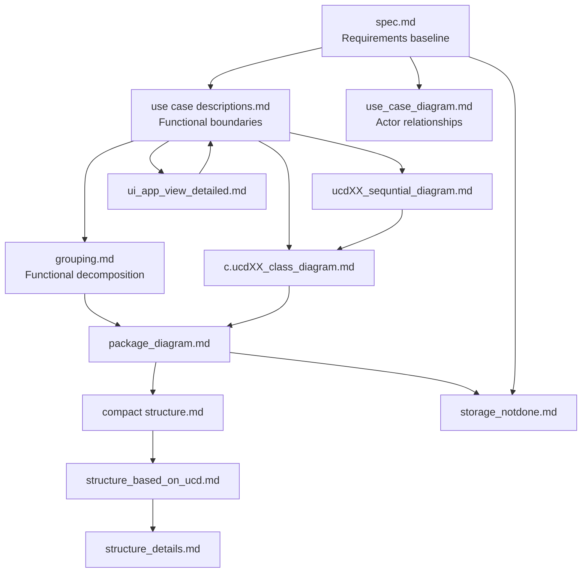

# Pharmacy Inventory & Prescription System — Documentation Index

This index is the entry point for the project documentation.

All links use **relative paths**, so `index.md` should be placed in the **same folder** as the Markdown files listed below.

---

## 1. Recommended Reading Order

1. [Feature Specification](spec.md)
2. [Use Case Diagram](use_case_diagram.md)
3. [Use Case Descriptions](<use case descriptions.md>)
4. [UCD Grouping / Functional Decomposition](grouping.md)
5. [Package Diagram](package_diagram.md)
6. [Compact Structure](<compact structure.md>)
7. [Structure Based on UCD](structure_based_on_ucd.md)
8. [Structure Details](structure_details.md)
9. [UI Application View](ui_app_view_detailed.md)
10. Class diagrams and sequence diagrams for each UCD
11. [Storage Design — Reserved / Not Final](storage_notdone.md)

---

# 2. Requirements and Functional Scope

| Document | Purpose |
| --- | --- |
| [spec.md](spec.md) | Clarified Spec-Driven Development requirement baseline, user stories, functional requirements, edge cases, assumptions, and success criteria. |
| [use_case_diagram.md](use_case_diagram.md) | High-level actor-to-use-case relationship diagram. |
| [use case descriptions.md](<use case descriptions.md>) | Consolidated UCD-01 to UCD-10 functional boundaries, actors, triggers, flows, exceptions, and ownership rules. |
| [grouping.md](grouping.md) | Functional decomposition / grouping of related UCD responsibilities. |

---

# 3. Architecture and Project Structure

| Document | Purpose |
| --- | --- |
| [package_diagram.md](package_diagram.md) | Package-level architecture and dependencies between View, Controller, Model, and Storage. |
| [compact structure.md](<compact structure.md>) | Compact Java project/package structure. |
| [structure_based_on_ucd.md](structure_based_on_ucd.md) | Project structure organised around UCD responsibilities. |
| [structure_details.md](structure_details.md) | More detailed structural description and implementation organisation. |
| [storage_notdone.md](storage_notdone.md) | Storage-layer notes. Persistence technology remains reserved until implementation planning. |

---

# 4. UI / Prototype Specification

| Document | Purpose |
| --- | --- |
| [ui_app_view_detailed.md](ui_app_view_detailed.md) | Detailed UI screen matrix covering Inputs, Data, Display, Surfaces, Navigation, Utilities, Layout, hierarchy, states, and prototype behaviour. |
| [ui_app_view_detailed_high_fidelity_desktop_v3.md](ui_app_view_detailed_high_fidelity_desktop_v3.md) | Detailed UI looks and the layout |


---

# 5. Class Diagrams

The class diagrams define the static design for each UCD.

| UCD | Class Diagram |
| --- | --- |
| UCD-01 — Manage Prescription | [c.ucd01_class_diagram.md](c.ucd01_class_diagram.md) |
| UCD-02 — View Prescription Status | [c.ucd02_class_diagram.md](c.ucd02_class_diagram.md) |
| UCD-03 — Send Alerts and Notifications | [c.ucd03_class_diagram.md](c.ucd03_class_diagram.md) |
| UCD-04 — Authenticate and Authorise User | [c.ucd04_class_diagram.md](c.ucd04_class_diagram.md) |
| UCD-05 — Manage Profile | [c.ucd05_class_diagram.md](c.ucd05_class_diagram.md) |
| UCD-06 — Manage User Accounts | [c.ucd06_class_diagram.md](c.ucd06_class_diagram.md) |
| UCD-07 — Update Prescription Status | [c.ucd07_class_diagram.md](c.ucd07_class_diagram.md) |
| UCD-08 — Dispense Medication | [c.ucd08_class_diagram.md](c.ucd08_class_diagram.md) |
| UCD-09 — Generate Reports | [c.ucd09_class_diagram.md](c.ucd09_class_diagram.md) |
| UCD-10 — Manage Medicine Inventory | [c.ucd10_class_diagram.md](c.ucd10_class_diagram.md) |

---

# 6. Sequence Diagrams

The sequence diagrams define the runtime interaction flow for each UCD.

| UCD | Sequence Diagram |
| --- | --- |
| UCD-01 — Manage Prescription | [ucd01_sequntial_diagram.md](ucd01_sequntial_diagram.md) |
| UCD-02 — View Prescription Status | [ucd02_sequntial_diagram.md](ucd02_sequntial_diagram.md) |
| UCD-03 — Send Alerts and Notifications | [ucd03_sequntial_diagram.md](ucd03_sequntial_diagram.md) |
| UCD-04 — Authenticate and Authorise User | [ucd04_sequntial_diagram.md](ucd04_sequntial_diagram.md) |
| UCD-05 — Manage Profile | [ucd05_sequntial_diagram.md](ucd05_sequntial_diagram.md) |
| UCD-06 — Manage User Accounts | [ucd06_sequntial_diagram.md](ucd06_sequntial_diagram.md) |
| UCD-07 — Update Prescription Status | [ucd07_sequntial_diagram.md](ucd07_sequntial_diagram.md) |
| UCD-08 — Dispense Medication | [ucd08_sequntial_diagram.md](ucd08_sequntial_diagram.md) |
| UCD-09 — Generate Reports | [ucd09_sequntial_diagram.md](ucd09_sequntial_diagram.md) |
| UCD-10 — Manage Medicine Inventory | [ucd10_sequntial_diagram.md](ucd10_sequntial_diagram.md) |

---

# 7. UCD Traceability Index

Use this table when reviewing one use case from requirement through UI and implementation design.

| UCD | Functional Definition | Class Design | Runtime Flow | UI Coverage |
| --- | --- | --- | --- | --- |
| UCD-01 | [Use Case Descriptions](<use case descriptions.md>) | [Class Diagram](c.ucd01_class_diagram.md) | [Sequence Diagram](ucd01_sequntial_diagram.md) | [UI App View](ui_app_view_detailed.md) |
| UCD-02 | [Use Case Descriptions](<use case descriptions.md>) | [Class Diagram](c.ucd02_class_diagram.md) | [Sequence Diagram](ucd02_sequntial_diagram.md) | [UI App View](ui_app_view_detailed.md) |
| UCD-03 | [Use Case Descriptions](<use case descriptions.md>) | [Class Diagram](c.ucd03_class_diagram.md) | [Sequence Diagram](ucd03_sequntial_diagram.md) | [UI App View](ui_app_view_detailed.md) |
| UCD-04 | [Use Case Descriptions](<use case descriptions.md>) | [Class Diagram](c.ucd04_class_diagram.md) | [Sequence Diagram](ucd04_sequntial_diagram.md) | [UI App View](ui_app_view_detailed.md) |
| UCD-05 | [Use Case Descriptions](<use case descriptions.md>) | [Class Diagram](c.ucd05_class_diagram.md) | [Sequence Diagram](ucd05_sequntial_diagram.md) | [UI App View](ui_app_view_detailed.md) |
| UCD-06 | [Use Case Descriptions](<use case descriptions.md>) | [Class Diagram](c.ucd06_class_diagram.md) | [Sequence Diagram](ucd06_sequntial_diagram.md) | [UI App View](ui_app_view_detailed.md) |
| UCD-07 | [Use Case Descriptions](<use case descriptions.md>) | [Class Diagram](c.ucd07_class_diagram.md) | [Sequence Diagram](ucd07_sequntial_diagram.md) | [UI App View](ui_app_view_detailed.md) |
| UCD-08 | [Use Case Descriptions](<use case descriptions.md>) | [Class Diagram](c.ucd08_class_diagram.md) | [Sequence Diagram](ucd08_sequntial_diagram.md) | [UI App View](ui_app_view_detailed.md) |
| UCD-09 | [Use Case Descriptions](<use case descriptions.md>) | [Class Diagram](c.ucd09_class_diagram.md) | [Sequence Diagram](ucd09_sequntial_diagram.md) | [UI App View](ui_app_view_detailed.md) |
| UCD-10 | [Use Case Descriptions](<use case descriptions.md>) | [Class Diagram](c.ucd10_class_diagram.md) | [Sequence Diagram](ucd10_sequntial_diagram.md) | [UI App View](ui_app_view_detailed.md) |

---

# 8. Documentation Relationship



---

# 9. Source-of-Truth Order

When documents appear to conflict, review them in this order:

```text
1. spec.md
      ↓
2. use case descriptions.md
      ↓
3. use_case_diagram.md / grouping.md
      ↓
4. class + sequence diagrams
      ↓
5. package / project structure
      ↓
6. ui_app_view_detailed.md
      ↓
7. implementation
```

### Interpretation

- `spec.md` defines the latest clarified requirements.
- `use case descriptions.md` defines UCD ownership and functional boundaries.
- Class diagrams define static object responsibilities.
- Sequence diagrams define runtime interaction.
- Package/structure documents define physical code organisation.
- `ui_app_view_detailed.md` translates requirements and UCDs into prototype behaviour.
- `storage_notdone.md` is not authoritative for persistence technology until that decision is finalised.

---

# 10. File-Link Convention

For files without spaces:

```md
[Feature Specification](spec.md)
[Package Diagram](package_diagram.md)
```

For existing filenames containing spaces, use angle brackets around the relative path:

```md
[Use Case Descriptions](<use case descriptions.md>)
[Compact Structure](<compact structure.md>)
```

This avoids manually writing `%20` for spaces and keeps the repository links readable.

---

# 11. Naming Note

The existing filename `sequntial` is retained in this index because the files currently use that spelling.

If the repository is renamed later, a more consistent convention would be:

```text
ucd01_sequence_diagram.md
ucd01_class_diagram.md
```

Do not rename files unless all references are updated at the same time.
