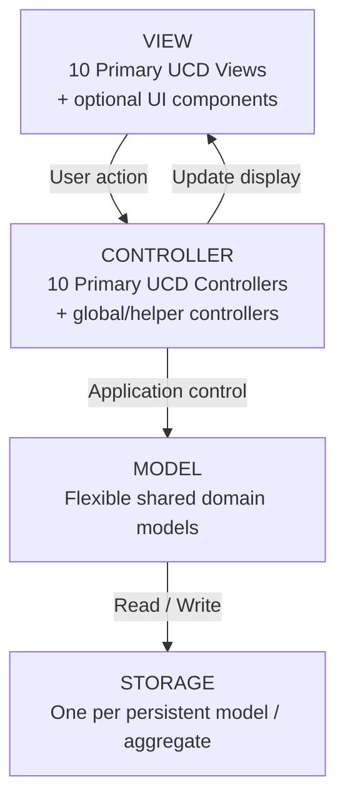

Yes. With your revised rule, I would **stop forcing Model into one class per domain**. The architecture should be asymmetric:

* **Model:** flexible; split according to domain entities/complexity and reuse across UCDs.
* **View:** minimum **1 primary View per UCD**; complex UIs may have subordinate view components.
* **Controller:** minimum **1 primary Controller per UCD**; shared/global controllers are allowed when genuinely cross-cutting.
* **Storage:** follows the **persistent Model/aggregate**, not the UCD count.
* Keep only **MVC + S** as architectural layers—no Service/Repository/DAO layer.

## Full Java project structure

```text
src/
└── main/
    └── java/
        └── pharmacy_system/
            │
            ├── Main.java
            │
            │
            │
            ├── model/
            │   │
            │   ├── security_user/
            │   │   │
            │   │   ├── UserAccount.java
            │   │   │      [UCD-04, UCD-06]
            │   │   │
            │   │   ├── Credential.java
            │   │   │      [UCD-04]
            │   │   │
            │   │   ├── RolePermission.java
            │   │   │      [UCD-04, UCD-06]
            │   │   │
            │   │   └── profile/
            │   │       │
            │   │       ├── UserProfile.java
            │   │       │      [UCD-05]
            │   │       │
            │   │       ├── DoctorProfile.java
            │   │       ├── PatientProfile.java
            │   │       ├── PharmacyProfile.java
            │   │       └── AdminProfile.java
            │   │
            │   │
            │   ├── clinical_prescription/
            │   │   │
            │   │   ├── Prescription.java
            │   │   │      [UCD-01, UCD-07]
            │   │   │
            │   │   ├── PrescriptionItem.java
            │   │   │      [UCD-01]
            │   │   │
            │   │   └── PrescriptionStatus.java
            │   │          [UCD-07]
            │   │
            │   │
            │   ├── patient_information/
            │   │   │
            │   │   ├── PrescriptionStatusSummary.java
            │   │   │      [UCD-02]
            │   │   │
            │   │   └── Notification.java
            │   │          [UCD-03]
            │   │
            │   │
            │   ├── pharmacy_operations/
            │   │   │
            │   │   ├── DispenseRecord.java
            │   │   │      [UCD-08]
            │   │   │
            │   │   ├── Medicine.java
            │   │   │      [UCD-10]
            │   │   │
            │   │   ├── InventoryItem.java
            │   │   │      [UCD-08, UCD-10]
            │   │   │
            │   │   └── StockMovement.java
            │   │          [UCD-08, UCD-10]
            │   │
            │   │
            │   └── management_dss/
            │       │
            │       ├── Report.java
            │       │      [UCD-09]
            │       │
            │       └── ReportCriteria.java
            │              [UCD-09]
            │
            │
            │
            ├── view/
            │   │
            │   ├── security_user/
            │   │   │
            │   │   ├── ucd04_authenticate_authorise/
            │   │   │   │
            │   │   │   ├── AuthenticateAuthoriseView.java
            │   │   │   │
            │   │   │   └── components/
            │   │   │       ├── LoginFormView.java
            │   │   │       └── AccessDeniedView.java
            │   │   │
            │   │   ├── ucd05_manage_profile/
            │   │   │   │
            │   │   │   ├── ManageProfileView.java
            │   │   │   │
            │   │   │   └── components/
            │   │   │       ├── ProfileDetailsView.java
            │   │   │       └── ProfileFormView.java
            │   │   │
            │   │   └── ucd06_manage_user_account/
            │   │       │
            │   │       ├── ManageUserAccountView.java
            │   │       │
            │   │       └── components/
            │   │           ├── UserAccountListView.java
            │   │           └── UserAccountFormView.java
            │   │
            │   │
            │   ├── clinical_prescription/
            │   │   │
            │   │   ├── ucd01_manage_prescription/
            │   │   │   │
            │   │   │   ├── ManagePrescriptionView.java
            │   │   │   │
            │   │   │   └── components/
            │   │   │       ├── PrescriptionFormView.java
            │   │   │       └── PrescriptionItemView.java
            │   │   │
            │   │   └── ucd07_update_prescription_status/
            │   │       │
            │   │       ├── UpdatePrescriptionStatusView.java
            │   │       │
            │   │       └── components/
            │   │           └── PrescriptionStatusFormView.java
            │   │
            │   │
            │   ├── patient_information/
            │   │   │
            │   │   ├── ucd02_view_prescription_status/
            │   │   │   │
            │   │   │   ├── ViewPrescriptionStatusView.java
            │   │   │   │
            │   │   │   └── components/
            │   │   │       └── PrescriptionStatusDetailsView.java
            │   │   │
            │   │   └── ucd03_send_alerts_notifications/
            │   │       │
            │   │       ├── SendAlertsNotificationsView.java
            │   │       │
            │   │       └── components/
            │   │           └── NotificationView.java
            │   │
            │   │
            │   ├── pharmacy_operations/
            │   │   │
            │   │   ├── ucd08_dispense_medication/
            │   │   │   │
            │   │   │   ├── DispenseMedicationView.java
            │   │   │   │
            │   │   │   └── components/
            │   │   │       ├── DispenseFormView.java
            │   │   │       └── DispenseResultView.java
            │   │   │
            │   │   └── ucd10_manage_medicine_inventory/
            │   │       │
            │   │       ├── ManageMedicineInventoryView.java
            │   │       │
            │   │       └── components/
            │   │           ├── MedicineListView.java
            │   │           ├── MedicineFormView.java
            │   │           └── StockAdjustmentView.java
            │   │
            │   │
            │   └── management_dss/
            │       │
            │       └── ucd09_generate_reports/
            │           │
            │           ├── GenerateReportsView.java
            │           │
            │           └── components/
            │               ├── ReportCriteriaView.java
            │               └── ReportResultView.java
            │
            │
            │
            ├── controller/
            │   │
            │   ├── common/
            │   │   │
            │   │   ├── NavigationController.java
            │   │   └── SessionController.java
            │   │
            │   │
            │   ├── security_user/
            │   │   │
            │   │   ├── AuthenticateAuthoriseController.java
            │   │   │      [UCD-04]
            │   │   │
            │   │   ├── ManageProfileController.java
            │   │   │      [UCD-05]
            │   │   │
            │   │   └── ManageUserAccountController.java
            │   │          [UCD-06]
            │   │
            │   │
            │   ├── clinical_prescription/
            │   │   │
            │   │   ├── ManagePrescriptionController.java
            │   │   │      [UCD-01]
            │   │   │
            │   │   └── UpdatePrescriptionStatusController.java
            │   │          [UCD-07]
            │   │
            │   │
            │   ├── patient_information/
            │   │   │
            │   │   ├── ViewPrescriptionStatusController.java
            │   │   │      [UCD-02]
            │   │   │
            │   │   └── SendAlertsNotificationsController.java
            │   │          [UCD-03]
            │   │
            │   │
            │   ├── pharmacy_operations/
            │   │   │
            │   │   ├── DispenseMedicationController.java
            │   │   │      [UCD-08]
            │   │   │
            │   │   └── ManageMedicineInventoryController.java
            │   │          [UCD-10]
            │   │
            │   │
            │   └── management_dss/
            │       │
            │       └── GenerateReportsController.java
            │              [UCD-09]
            │
            │
            │
            └── storage/
                │
                ├── security_user/
                │   │
                │   ├── UserAccountStorage.java
                │   │      UserAccount
                │   │      [UCD-04, UCD-06]
                │   │
                │   ├── CredentialStorage.java
                │   │      Credential
                │   │      [UCD-04]
                │   │
                │   ├── RolePermissionStorage.java
                │   │      RolePermission
                │   │      [UCD-04, UCD-06]
                │   │
                │   └── ProfileStorage.java
                │          UserProfile
                │          DoctorProfile
                │          PatientProfile
                │          PharmacyProfile
                │          AdminProfile
                │          [UCD-05]
                │
                │
                ├── clinical_prescription/
                │   │
                │   └── PrescriptionStorage.java
                │          Prescription
                │          PrescriptionItem
                │          PrescriptionStatus
                │          [UCD-01, UCD-07]
                │
                │
                ├── patient_information/
                │   │
                │   └── NotificationStorage.java
                │          Notification
                │          [UCD-03]
                │
                │
                ├── pharmacy_operations/
                │   │
                │   ├── DispenseStorage.java
                │   │      DispenseRecord
                │   │      [UCD-08]
                │   │
                │   ├── MedicineStorage.java
                │   │      Medicine
                │   │      [UCD-10]
                │   │
                │   └── InventoryStorage.java
                │          InventoryItem
                │          StockMovement
                │          [UCD-08, UCD-10]
                │
                │
                └── management_dss/
                    │
                    └── ReportStorage.java
                           Report
                           [UCD-09]
                           optional if reports are persisted
```

## Why this structure fits your rule

The important difference is that the four layers **do not need to have matching file counts**.

```text
MODEL
Flexible domain objects
        │
        │ many UCDs may reuse the same model
        ▼

CONTROLLER
Minimum one controller / UCD
        │
        ▼

VIEW
Minimum one primary view / UCD
+ component views when UI becomes complex
        │
        ▼

STORAGE
Follows persistent model/aggregate
not UCD number
```

For example, **UCD-01 and UCD-07 should share `Prescription`** rather than having:

```text
ManagePrescriptionModel
UpdatePrescriptionStatusModel
```

as two copies of essentially the same domain object.

Instead:

```text
Prescription
├── prescriptionId
├── patientId
├── doctorId
├── items
├── issueDate
└── status
```

Then the two controllers manipulate different responsibilities:

```text
ManagePrescriptionController          UCD-01
├── createPrescription()
├── viewPrescription()
├── editPrescription()
└── delete/cancel request if allowed

UpdatePrescriptionStatusController    UCD-07
├── viewCurrentStatus()
├── issuePrescription()
├── holdPrescription()
├── resumePrescription()
└── updateStatus()
```

Both reuse:

```text
Prescription
PrescriptionStatus
PrescriptionStorage
```

---

## UCD → Controller → Model → Storage mapping

| UCD                                | Primary Controller                   | Main Model(s)                                            | Storage                                    |
| ---------------------------------- | ------------------------------------ | -------------------------------------------------------- | ------------------------------------------ |
| **04 Authenticate & Authorise**    | `AuthenticateAuthoriseController`    | `UserAccount`, `Credential`, `RolePermission`            | UserAccount, Credential, RolePermission    |
| **05 Manage Profile**              | `ManageProfileController`            | `UserProfile` + 4 profile types                          | ProfileStorage                             |
| **06 Manage User Account**         | `ManageUserAccountController`        | `UserAccount`, `RolePermission`                          | UserAccount, RolePermission                |
| **01 Manage Prescription**         | `ManagePrescriptionController`       | `Prescription`, `PrescriptionItem`                       | PrescriptionStorage                        |
| **07 Update Prescription Status**  | `UpdatePrescriptionStatusController` | `Prescription`, `PrescriptionStatus`                     | PrescriptionStorage                        |
| **02 View Prescription Status**    | `ViewPrescriptionStatusController`   | `PrescriptionStatusSummary` + existing Prescription data | Existing Prescription/Dispense storage     |
| **03 Send Alerts & Notifications** | `SendAlertsNotificationsController`  | `Notification`                                           | NotificationStorage                        |
| **08 Dispense Medication**         | `DispenseMedicationController`       | `DispenseRecord`, `InventoryItem`                        | Dispense + Inventory                       |
| **10 Manage Medicine Inventory**   | `ManageMedicineInventoryController`  | `Medicine`, `InventoryItem`, `StockMovement`             | Medicine + Inventory                       |
| **09 Generate Reports**            | `GenerateReportsController`          | `Report`, `ReportCriteria`                               | Existing storages + optional ReportStorage |

There is one particularly useful rule for **UCD-02**: `PrescriptionStatusSummary` is a derived/read model, so it does **not automatically require** a `PrescriptionStatusSummaryStorage`. It can be constructed from:

```text
PrescriptionStorage
        +
DispenseStorage
        ↓
PrescriptionStatusSummary
        ↓
ViewPrescriptionStatusController
        ↓
ViewPrescriptionStatusView
```

Likewise, `ReportCriteria` is transient input and does not require storage.

## Final architecture


