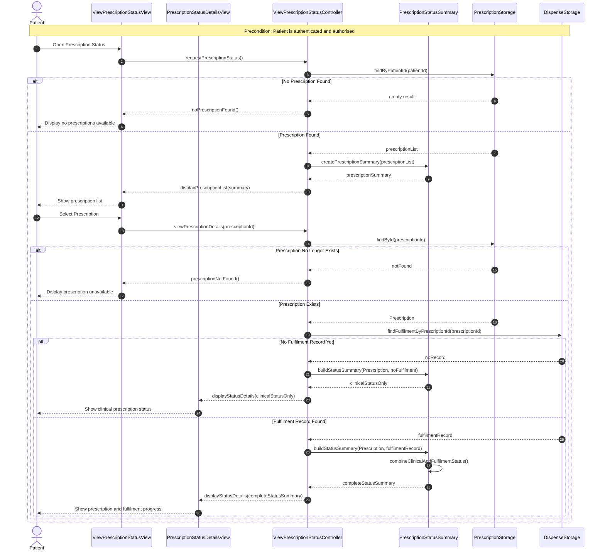

```mermaid
sequenceDiagram
    autonumber

    actor Patient

    participant VPSV as ViewPrescriptionStatusView
    participant PSDV as PrescriptionStatusDetailsView

    participant VPSC as ViewPrescriptionStatusController

    participant PSS as PrescriptionStatusSummary

    participant PS as PrescriptionStorage
    participant DS as DispenseStorage

    Note over Patient,DS: Precondition: Patient is authenticated and authorised

    Patient->>VPSV: Open Prescription Status

    VPSV->>VPSC: requestPrescriptionStatus()

    VPSC->>PS: findByPatientId(patientId)

    alt No Prescription Found

        PS-->>VPSC: empty result

        VPSC-->>VPSV: noPrescriptionFound()
        VPSV-->>Patient: Display no prescriptions available

    else Prescription Found

        PS-->>VPSC: prescriptionList

        VPSC->>PSS: createPrescriptionSummary(prescriptionList)

        PSS-->>VPSC: prescriptionSummary

        VPSC-->>VPSV: displayPrescriptionList(summary)

        VPSV-->>Patient: Show prescription list

        Patient->>VPSV: Select Prescription

        VPSV->>VPSC: viewPrescriptionDetails(prescriptionId)

        VPSC->>PS: findById(prescriptionId)

        alt Prescription No Longer Exists

            PS-->>VPSC: notFound

            VPSC-->>VPSV: prescriptionNotFound()
            VPSV-->>Patient: Display prescription unavailable

        else Prescription Exists

            PS-->>VPSC: Prescription

            VPSC->>DS: findFulfilmentByPrescriptionId(prescriptionId)

            alt No Fulfilment Record Yet

                DS-->>VPSC: noRecord

                VPSC->>PSS: buildStatusSummary(Prescription, noFulfilment)

                PSS-->>VPSC: clinicalStatusOnly

                VPSC-->>PSDV: displayStatusDetails(clinicalStatusOnly)

                PSDV-->>Patient: Show clinical prescription status

            else Fulfilment Record Found

                DS-->>VPSC: fulfilmentRecord

                VPSC->>PSS: buildStatusSummary(Prescription, fulfilmentRecord)

                PSS->>PSS: combineClinicalAndFulfilmentStatus()

                PSS-->>VPSC: completeStatusSummary

                VPSC-->>PSDV: displayStatusDetails(completeStatusSummary)

                PSDV-->>Patient: Show prescription and fulfilment progress
            end
        end
    end
```
