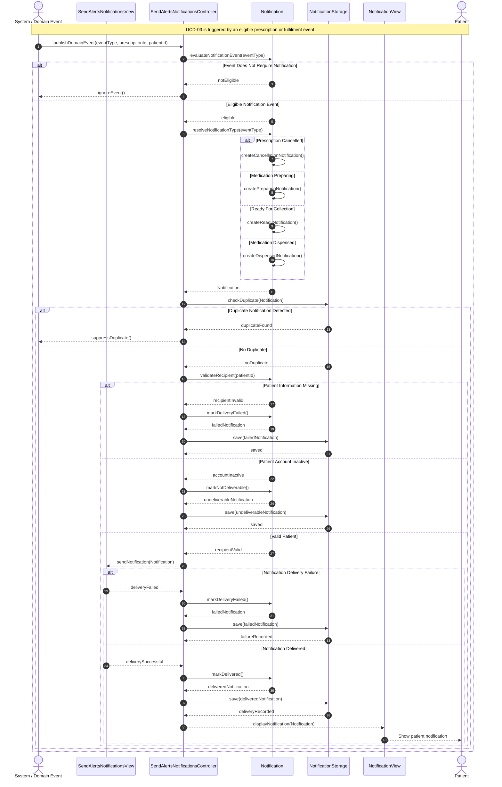

```mermaid
sequenceDiagram
    autonumber

    actor Event as System / Domain Event

    participant SANV as SendAlertsNotificationsView
    participant SANC as SendAlertsNotificationsController

    participant N as Notification

    participant NS as NotificationStorage

    participant NV as NotificationView

    actor Patient

    Note over Event,Patient: UCD-03 is triggered by an eligible prescription or fulfilment event

    Event->>SANC: publishDomainEvent(eventType, prescriptionId, patientId)

    SANC->>N: evaluateNotificationEvent(eventType)

    alt Event Does Not Require Notification

        N-->>SANC: notEligible

        SANC-->>Event: ignoreEvent()

    else Eligible Notification Event

        N-->>SANC: eligible

        SANC->>N: resolveNotificationType(eventType)

        alt Prescription Cancelled

            N->>N: createCancellationNotification()

        else Medication Preparing

            N->>N: createPreparingNotification()

        else Ready For Collection

            N->>N: createReadyNotification()

        else Medication Dispensed

            N->>N: createDispensedNotification()

        end

        N-->>SANC: Notification

        SANC->>NS: checkDuplicate(Notification)

        alt Duplicate Notification Detected

            NS-->>SANC: duplicateFound

            SANC-->>Event: suppressDuplicate()

        else No Duplicate

            NS-->>SANC: noDuplicate

            SANC->>N: validateRecipient(patientId)

            alt Patient Information Missing

                N-->>SANC: recipientInvalid

                SANC->>N: markDeliveryFailed()
                N-->>SANC: failedNotification

                SANC->>NS: save(failedNotification)
                NS-->>SANC: saved

            else Patient Account Inactive

                N-->>SANC: accountInactive

                SANC->>N: markNotDeliverable()
                N-->>SANC: undeliverableNotification

                SANC->>NS: save(undeliverableNotification)
                NS-->>SANC: saved

            else Valid Patient

                N-->>SANC: recipientValid

                SANC->>SANV: sendNotification(Notification)

                alt Notification Delivery Failure

                    SANV-->>SANC: deliveryFailed

                    SANC->>N: markDeliveryFailed()
                    N-->>SANC: failedNotification

                    SANC->>NS: save(failedNotification)
                    NS-->>SANC: failureRecorded

                else Notification Delivered

                    SANV-->>SANC: deliverySuccessful

                    SANC->>N: markDelivered()
                    N-->>SANC: deliveredNotification

                    SANC->>NS: save(deliveredNotification)
                    NS-->>SANC: deliveryRecorded

                    SANC-->>NV: displayNotification(Notification)
                    NV-->>Patient: Show patient notification
                end
            end
        end
    end
```
