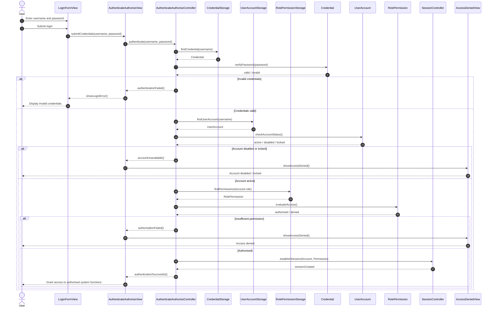

```mermaid
sequenceDiagram
    autonumber

    actor User

    participant LoginView as LoginFormView
    participant AuthView as AuthenticateAuthoriseView
    participant AuthController as AuthenticateAuthoriseController

    participant CredentialStorage as CredentialStorage
    participant AccountStorage as UserAccountStorage
    participant RoleStorage as RolePermissionStorage

    participant Credential as Credential
    participant Account as UserAccount
    participant Permission as RolePermission

    participant Session as SessionController
    participant DeniedView as AccessDeniedView

    User->>LoginView: Enter username and password
    User->>LoginView: Submit login

    LoginView->>AuthView: submitCredentials(username, password)
    AuthView->>AuthController: authenticate(username, password)

    AuthController->>CredentialStorage: findCredential(username)
    CredentialStorage-->>AuthController: Credential

    AuthController->>Credential: verifyPassword(password)
    Credential-->>AuthController: valid / invalid

    alt Invalid credentials
        AuthController-->>AuthView: authenticationFailed()
        AuthView-->>LoginView: showLoginError()
        LoginView-->>User: Display invalid credentials

    else Credentials valid

        AuthController->>AccountStorage: findUserAccount(username)
        AccountStorage-->>AuthController: UserAccount

        AuthController->>Account: checkAccountStatus()
        Account-->>AuthController: active / disabled / locked

        alt Account disabled or locked
            AuthController-->>AuthView: accountUnavailable()
            AuthView->>DeniedView: showAccessDenied()
            DeniedView-->>User: Account disabled / locked

        else Account active

            AuthController->>RoleStorage: findPermissions(Account.role)
            RoleStorage-->>AuthController: RolePermission

            AuthController->>Permission: evaluateAccess()
            Permission-->>AuthController: authorised / denied

            alt Insufficient permission
                AuthController-->>AuthView: authorisationFailed()
                AuthView->>DeniedView: showAccessDenied()
                DeniedView-->>User: Access denied

            else Authorised
                AuthController->>Session: establishSession(Account, Permission)
                Session-->>AuthController: sessionCreated

                AuthController-->>AuthView: authenticationSuccessful()
                AuthView-->>User: Grant access to authorised system functions
            end
        end
    end
```
