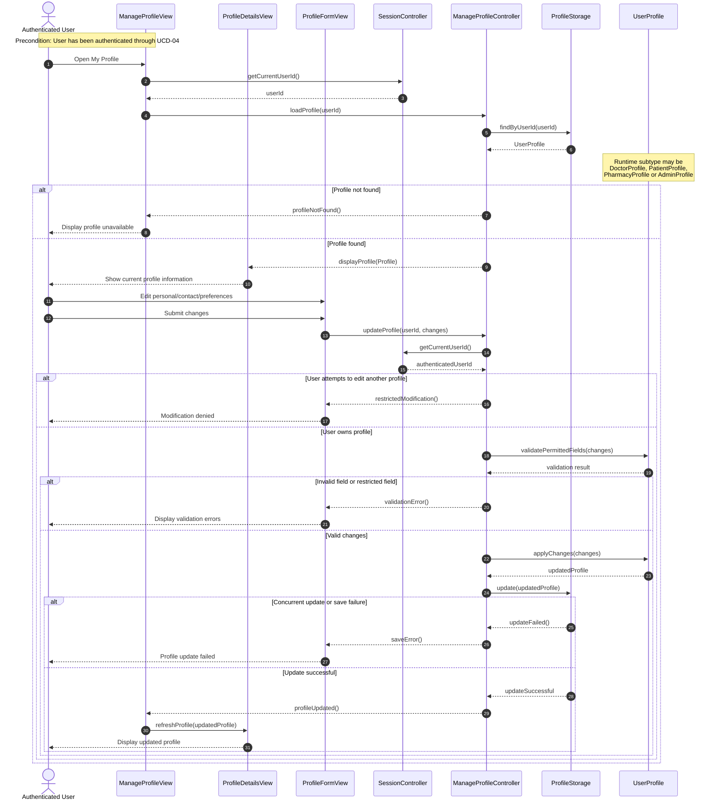

```mermaid
sequenceDiagram
    autonumber

    actor User as Authenticated User

    participant ProfileView as ManageProfileView
    participant DetailsView as ProfileDetailsView
    participant FormView as ProfileFormView

    participant Session as SessionController
    participant ProfileController as ManageProfileController

    participant ProfileStorage as ProfileStorage
    participant Profile as UserProfile

    Note over User,ProfileView: Precondition: User has been authenticated through UCD-04

    User->>ProfileView: Open My Profile

    ProfileView->>Session: getCurrentUserId()
    Session-->>ProfileView: userId

    ProfileView->>ProfileController: loadProfile(userId)

    ProfileController->>ProfileStorage: findByUserId(userId)
    ProfileStorage-->>ProfileController: UserProfile

    Note over Profile: Runtime subtype may be<br/>DoctorProfile, PatientProfile,<br/>PharmacyProfile or AdminProfile

    alt Profile not found
        ProfileController-->>ProfileView: profileNotFound()
        ProfileView-->>User: Display profile unavailable

    else Profile found
        ProfileController-->>DetailsView: displayProfile(Profile)
        DetailsView-->>User: Show current profile information

        User->>FormView: Edit personal/contact/preferences
        User->>FormView: Submit changes

        FormView->>ProfileController: updateProfile(userId, changes)

        ProfileController->>Session: getCurrentUserId()
        Session-->>ProfileController: authenticatedUserId

        alt User attempts to edit another profile
            ProfileController-->>FormView: restrictedModification()
            FormView-->>User: Modification denied

        else User owns profile

            ProfileController->>Profile: validatePermittedFields(changes)
            Profile-->>ProfileController: validation result

            alt Invalid field or restricted field
                ProfileController-->>FormView: validationError()
                FormView-->>User: Display validation errors

            else Valid changes
                ProfileController->>Profile: applyChanges(changes)
                Profile-->>ProfileController: updatedProfile

                ProfileController->>ProfileStorage: update(updatedProfile)

                alt Concurrent update or save failure
                    ProfileStorage-->>ProfileController: updateFailed()
                    ProfileController-->>FormView: saveError()
                    FormView-->>User: Profile update failed

                else Update successful
                    ProfileStorage-->>ProfileController: updateSuccessful
                    ProfileController-->>ProfileView: profileUpdated()
                    ProfileView->>DetailsView: refreshProfile(updatedProfile)
                    DetailsView-->>User: Display updated profile
                end
            end
        end
    end
```
