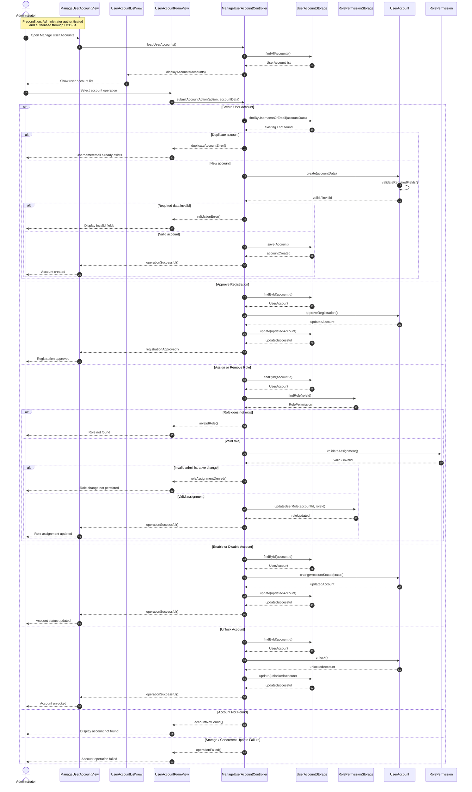

```mermaid
sequenceDiagram
    autonumber

    actor Admin as Administrator

    participant AccountView as ManageUserAccountView
    participant ListView as UserAccountListView
    participant FormView as UserAccountFormView

    participant AccountController as ManageUserAccountController

    participant AccountStorage as UserAccountStorage
    participant RoleStorage as RolePermissionStorage

    participant Account as UserAccount
    participant Permission as RolePermission

    Note over Admin,AccountView: Precondition: Administrator authenticated<br/>and authorised through UCD-04

    Admin->>AccountView: Open Manage User Accounts

    AccountView->>AccountController: loadUserAccounts()
    AccountController->>AccountStorage: findAllAccounts()
    AccountStorage-->>AccountController: UserAccount list
    AccountController-->>ListView: displayAccounts(accounts)
    ListView-->>Admin: Show user account list

    Admin->>FormView: Select account operation
    FormView->>AccountController: submitAccountAction(action, accountData)

    alt Create User Account

        AccountController->>AccountStorage: findByUsernameOrEmail(accountData)
        AccountStorage-->>AccountController: existing / not found

        alt Duplicate account
            AccountController-->>FormView: duplicateAccountError()
            FormView-->>Admin: Username/email already exists

        else New account
            AccountController->>Account: create(accountData)
            Account->>Account: validateRequiredFields()
            Account-->>AccountController: valid / invalid

            alt Required data invalid
                AccountController-->>FormView: validationError()
                FormView-->>Admin: Display invalid fields

            else Valid account
                AccountController->>AccountStorage: save(Account)
                AccountStorage-->>AccountController: accountCreated
                AccountController-->>AccountView: operationSuccessful()
                AccountView-->>Admin: Account created
            end
        end

    else Approve Registration

        AccountController->>AccountStorage: findById(accountId)
        AccountStorage-->>AccountController: UserAccount

        AccountController->>Account: approveRegistration()
        Account-->>AccountController: updatedAccount

        AccountController->>AccountStorage: update(updatedAccount)
        AccountStorage-->>AccountController: updateSuccessful

        AccountController-->>AccountView: registrationApproved()
        AccountView-->>Admin: Registration approved

    else Assign or Remove Role

        AccountController->>AccountStorage: findById(accountId)
        AccountStorage-->>AccountController: UserAccount

        AccountController->>RoleStorage: findRole(roleId)
        RoleStorage-->>AccountController: RolePermission

        alt Role does not exist
            AccountController-->>FormView: invalidRole()
            FormView-->>Admin: Role not found

        else Valid role
            AccountController->>Permission: validateAssignment()
            Permission-->>AccountController: valid / invalid

            alt Invalid administrative change
                AccountController-->>FormView: roleAssignmentDenied()
                FormView-->>Admin: Role change not permitted

            else Valid assignment
                AccountController->>RoleStorage: updateUserRole(accountId, roleId)
                RoleStorage-->>AccountController: roleUpdated

                AccountController-->>AccountView: operationSuccessful()
                AccountView-->>Admin: Role assignment updated
            end
        end

    else Enable or Disable Account

        AccountController->>AccountStorage: findById(accountId)
        AccountStorage-->>AccountController: UserAccount

        AccountController->>Account: changeAccountStatus(status)
        Account-->>AccountController: updatedAccount

        AccountController->>AccountStorage: update(updatedAccount)
        AccountStorage-->>AccountController: updateSuccessful

        AccountController-->>AccountView: operationSuccessful()
        AccountView-->>Admin: Account status updated

    else Unlock Account

        AccountController->>AccountStorage: findById(accountId)
        AccountStorage-->>AccountController: UserAccount

        AccountController->>Account: unlock()
        Account-->>AccountController: unlockedAccount

        AccountController->>AccountStorage: update(unlockedAccount)
        AccountStorage-->>AccountController: updateSuccessful

        AccountController-->>AccountView: operationSuccessful()
        AccountView-->>Admin: Account unlocked

    else Account Not Found

        AccountController-->>FormView: accountNotFound()
        FormView-->>Admin: Display account not found

    else Storage / Concurrent Update Failure

        AccountController-->>FormView: operationFailed()
        FormView-->>Admin: Account operation failed
    end
```
