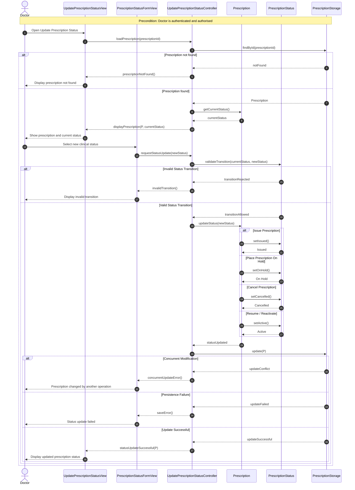

```mermaid
sequenceDiagram
    autonumber

    actor Doctor

    participant UPSV as UpdatePrescriptionStatusView
    participant PSFV as PrescriptionStatusFormView

    participant UPSC as UpdatePrescriptionStatusController

    participant P as Prescription
    participant Status as PrescriptionStatus

    participant PS as PrescriptionStorage

    Note over Doctor,PS: Precondition: Doctor is authenticated and authorised

    Doctor->>UPSV: Open Update Prescription Status

    UPSV->>UPSC: loadPrescription(prescriptionId)

    UPSC->>PS: findById(prescriptionId)

    alt Prescription not found
        PS-->>UPSC: notFound
        UPSC-->>UPSV: prescriptionNotFound()
        UPSV-->>Doctor: Display prescription not found

    else Prescription found

        PS-->>UPSC: Prescription

        UPSC->>P: getCurrentStatus()
        P-->>UPSC: currentStatus

        UPSC-->>UPSV: displayPrescription(P, currentStatus)
        UPSV-->>Doctor: Show prescription and current status

        Doctor->>PSFV: Select new clinical status

        PSFV->>UPSC: requestStatusUpdate(newStatus)

        UPSC->>Status: validateTransition(currentStatus, newStatus)

        alt Invalid Status Transition

            Status-->>UPSC: transitionRejected

            UPSC-->>PSFV: invalidTransition()
            PSFV-->>Doctor: Display invalid transition

        else Valid Status Transition

            Status-->>UPSC: transitionAllowed

            UPSC->>P: updateStatus(newStatus)

            alt Issue Prescription

                P->>Status: setIssued()
                Status-->>P: Issued

            else Place Prescription On Hold

                P->>Status: setOnHold()
                Status-->>P: On Hold

            else Cancel Prescription

                P->>Status: setCancelled()
                Status-->>P: Cancelled

            else Resume / Reactivate

                P->>Status: setActive()
                Status-->>P: Active
            end

            P-->>UPSC: statusUpdated

            UPSC->>PS: update(P)

            alt Concurrent Modification

                PS-->>UPSC: updateConflict

                UPSC-->>PSFV: concurrentUpdateError()
                PSFV-->>Doctor: Prescription changed by another operation

            else Persistence Failure

                PS-->>UPSC: updateFailed

                UPSC-->>PSFV: saveError()
                PSFV-->>Doctor: Status update failed

            else Update Successful

                PS-->>UPSC: updateSuccessful

                UPSC-->>UPSV: statusUpdateSuccessful(P)
                UPSV-->>Doctor: Display updated prescription status
            end
        end
    end
```
