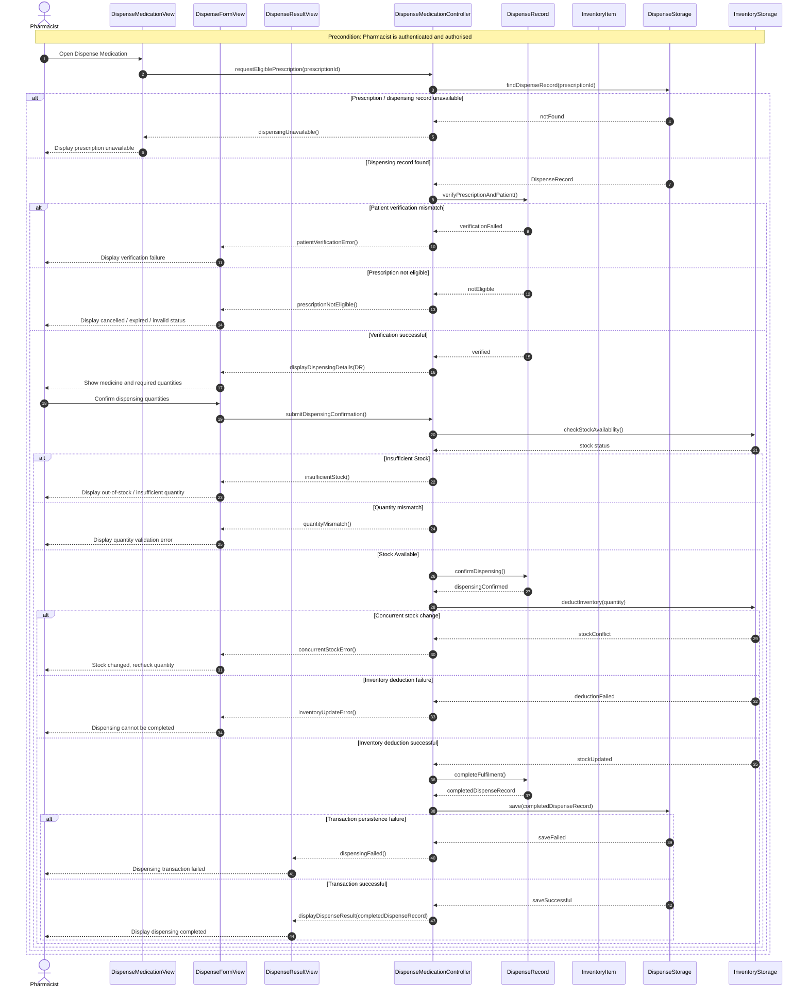

```mermaid
sequenceDiagram
    autonumber

    actor Pharmacist

    participant DMV as DispenseMedicationView
    participant DFV as DispenseFormView
    participant DRV as DispenseResultView

    participant DMC as DispenseMedicationController

    participant DR as DispenseRecord
    participant II as InventoryItem

    participant DS as DispenseStorage
    participant IS as InventoryStorage

    Note over Pharmacist,IS: Precondition: Pharmacist is authenticated and authorised

    Pharmacist->>DMV: Open Dispense Medication
    DMV->>DMC: requestEligiblePrescription(prescriptionId)

    DMC->>DS: findDispenseRecord(prescriptionId)

    alt Prescription / dispensing record unavailable
        DS-->>DMC: notFound
        DMC-->>DMV: dispensingUnavailable()
        DMV-->>Pharmacist: Display prescription unavailable

    else Dispensing record found

        DS-->>DMC: DispenseRecord

        DMC->>DR: verifyPrescriptionAndPatient()

        alt Patient verification mismatch
            DR-->>DMC: verificationFailed
            DMC-->>DFV: patientVerificationError()
            DFV-->>Pharmacist: Display verification failure

        else Prescription not eligible
            DR-->>DMC: notEligible
            DMC-->>DFV: prescriptionNotEligible()
            DFV-->>Pharmacist: Display cancelled / expired / invalid status

        else Verification successful

            DR-->>DMC: verified

            DMC-->>DFV: displayDispensingDetails(DR)
            DFV-->>Pharmacist: Show medicine and required quantities

            Pharmacist->>DFV: Confirm dispensing quantities
            DFV->>DMC: submitDispensingConfirmation()

            DMC->>IS: checkStockAvailability()

            IS-->>DMC: stock status

            alt Insufficient Stock

                DMC-->>DFV: insufficientStock()
                DFV-->>Pharmacist: Display out-of-stock / insufficient quantity

            else Quantity mismatch

                DMC-->>DFV: quantityMismatch()
                DFV-->>Pharmacist: Display quantity validation error

            else Stock Available

                DMC->>DR: confirmDispensing()
                DR-->>DMC: dispensingConfirmed

                DMC->>IS: deductInventory(quantity)

                alt Concurrent stock change

                    IS-->>DMC: stockConflict
                    DMC-->>DFV: concurrentStockError()
                    DFV-->>Pharmacist: Stock changed, recheck quantity

                else Inventory deduction failure

                    IS-->>DMC: deductionFailed
                    DMC-->>DFV: inventoryUpdateError()
                    DFV-->>Pharmacist: Dispensing cannot be completed

                else Inventory deduction successful

                    IS-->>DMC: stockUpdated

                    DMC->>DR: completeFulfilment()
                    DR-->>DMC: completedDispenseRecord

                    DMC->>DS: save(completedDispenseRecord)

                    alt Transaction persistence failure

                        DS-->>DMC: saveFailed
                        DMC-->>DRV: dispensingFailed()
                        DRV-->>Pharmacist: Dispensing transaction failed

                    else Transaction successful

                        DS-->>DMC: saveSuccessful
                        DMC-->>DRV: displayDispenseResult(completedDispenseRecord)
                        DRV-->>Pharmacist: Display dispensing completed

                    end
                end
            end
        end
    end
```
