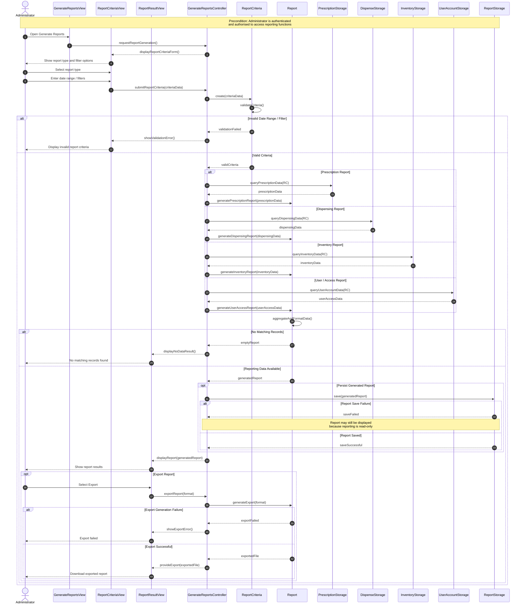

```mermaid
sequenceDiagram
    autonumber

    actor Admin as Administrator

    participant GRV as GenerateReportsView
    participant RCV as ReportCriteriaView
    participant RRV as ReportResultView

    participant GRC as GenerateReportsController

    participant RC as ReportCriteria
    participant R as Report

    participant PS as PrescriptionStorage
    participant DS as DispenseStorage
    participant IS as InventoryStorage
    participant UAS as UserAccountStorage
    participant RS as ReportStorage

    Note over Admin,RS: Precondition: Administrator is authenticated<br/>and authorised to access reporting functions

    Admin->>GRV: Open Generate Reports

    GRV->>GRC: requestReportGeneration()

    GRC-->>RCV: displayReportCriteriaForm()

    RCV-->>Admin: Show report type and filter options

    Admin->>RCV: Select report type
    Admin->>RCV: Enter date range / filters

    RCV->>GRC: submitReportCriteria(criteriaData)

    GRC->>RC: create(criteriaData)

    RC->>RC: validateCriteria()

    alt Invalid Date Range / Filter

        RC-->>GRC: validationFailed

        GRC-->>RCV: showValidationError()

        RCV-->>Admin: Display invalid report criteria

    else Valid Criteria

        RC-->>GRC: validCriteria

        alt Prescription Report

            GRC->>PS: queryPrescriptionData(RC)
            PS-->>GRC: prescriptionData

            GRC->>R: generatePrescriptionReport(prescriptionData)

        else Dispensing Report

            GRC->>DS: queryDispensingData(RC)
            DS-->>GRC: dispensingData

            GRC->>R: generateDispensingReport(dispensingData)

        else Inventory Report

            GRC->>IS: queryInventoryData(RC)
            IS-->>GRC: inventoryData

            GRC->>R: generateInventoryReport(inventoryData)

        else User / Access Report

            GRC->>UAS: queryUserAccountData(RC)
            UAS-->>GRC: userAccessData

            GRC->>R: generateUserAccessReport(userAccessData)

        end

        R->>R: aggregateAndFormatData()

        alt No Matching Records

            R-->>GRC: emptyReport

            GRC-->>RRV: displayNoDataResult()

            RRV-->>Admin: No matching records found

        else Reporting Data Available

            R-->>GRC: generatedReport

            opt Persist Generated Report

                GRC->>RS: save(generatedReport)

                alt Report Save Failure
                    RS-->>GRC: saveFailed
                    Note over GRC,RS: Report may still be displayed<br/>because reporting is read-only
                else Report Saved
                    RS-->>GRC: saveSuccessful
                end

            end

            GRC-->>RRV: displayReport(generatedReport)

            RRV-->>Admin: Show report results

            opt Export Report

                Admin->>RRV: Select Export

                RRV->>GRC: exportReport(format)

                GRC->>R: generateExport(format)

                alt Export Generation Failure

                    R-->>GRC: exportFailed

                    GRC-->>RRV: showExportError()

                    RRV-->>Admin: Export failed

                else Export Successful

                    R-->>GRC: exportedFile

                    GRC-->>RRV: provideExport(exportedFile)

                    RRV-->>Admin: Download exported report

                end
            end
        end
    end
```
