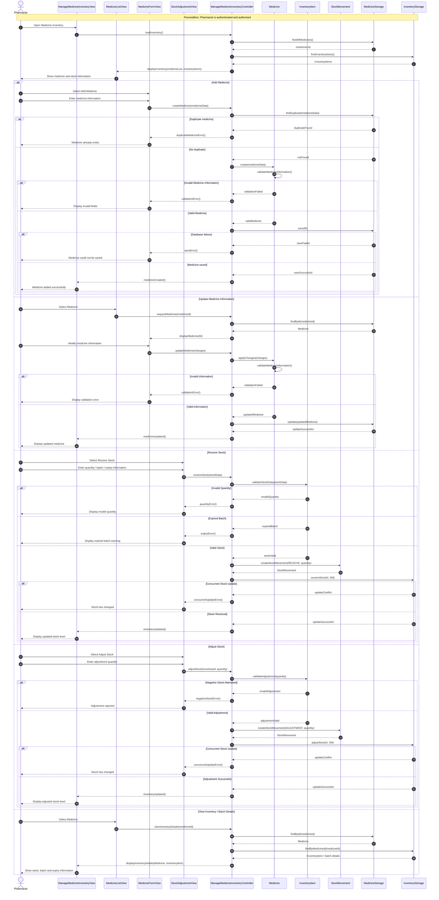

```mermaid
sequenceDiagram
    autonumber

    actor Pharmacist

    participant MMIV as ManageMedicineInventoryView
    participant MLV as MedicineListView
    participant MFV as MedicineFormView
    participant SAV as StockAdjustmentView

    participant MMIC as ManageMedicineInventoryController

    participant M as Medicine
    participant II as InventoryItem
    participant SM as StockMovement

    participant MS as MedicineStorage
    participant IS as InventoryStorage

    Note over Pharmacist,IS: Precondition: Pharmacist is authenticated and authorised

    Pharmacist->>MMIV: Open Medicine Inventory

    MMIV->>MMIC: loadInventory()

    MMIC->>MS: findAllMedicines()
    MS-->>MMIC: medicineList

    MMIC->>IS: findInventoryItems()
    IS-->>MMIC: inventoryItems

    MMIC-->>MLV: displayInventory(medicineList, inventoryItems)
    MLV-->>Pharmacist: Show medicine and stock information

    alt Add Medicine

        Pharmacist->>MFV: Select Add Medicine
        Pharmacist->>MFV: Enter medicine information

        MFV->>MMIC: createMedicine(medicineData)

        MMIC->>MS: findDuplicate(medicineData)

        alt Duplicate medicine
            MS-->>MMIC: duplicateFound
            MMIC-->>MFV: duplicateMedicineError()
            MFV-->>Pharmacist: Medicine already exists

        else No duplicate

            MS-->>MMIC: notFound

            MMIC->>M: create(medicineData)
            M->>M: validateMedicineInformation()

            alt Invalid Medicine Information
                M-->>MMIC: validationFailed
                MMIC-->>MFV: validationError()
                MFV-->>Pharmacist: Display invalid fields

            else Valid Medicine
                M-->>MMIC: validMedicine

                MMIC->>MS: save(M)

                alt Database failure
                    MS-->>MMIC: saveFailed
                    MMIC-->>MFV: saveError()
                    MFV-->>Pharmacist: Medicine could not be saved

                else Medicine saved
                    MS-->>MMIC: saveSuccessful
                    MMIC-->>MMIV: medicineCreated()
                    MMIV-->>Pharmacist: Medicine added successfully
                end
            end
        end

    else Update Medicine Information

        Pharmacist->>MLV: Select Medicine
        MLV->>MMIC: requestMedicine(medicineId)

        MMIC->>MS: findById(medicineId)
        MS-->>MMIC: Medicine

        MMIC-->>MFV: displayMedicine(M)

        Pharmacist->>MFV: Modify medicine information
        MFV->>MMIC: updateMedicine(changes)

        MMIC->>M: applyChanges(changes)
        M->>M: validateMedicineInformation()

        alt Invalid information
            M-->>MMIC: validationFailed
            MMIC-->>MFV: validationError()
            MFV-->>Pharmacist: Display validation error

        else Valid information
            M-->>MMIC: updatedMedicine

            MMIC->>MS: update(updatedMedicine)
            MS-->>MMIC: updateSuccessful

            MMIC-->>MMIV: medicineUpdated()
            MMIV-->>Pharmacist: Display updated medicine
        end

    else Receive Stock

        Pharmacist->>SAV: Select Receive Stock
        Pharmacist->>SAV: Enter quantity / batch / expiry information

        SAV->>MMIC: receiveStock(stockData)

        MMIC->>II: validateStockData(stockData)

        alt Invalid Quantity
            II-->>MMIC: invalidQuantity
            MMIC-->>SAV: quantityError()
            SAV-->>Pharmacist: Display invalid quantity

        else Expired Batch
            II-->>MMIC: expiredBatch
            MMIC-->>SAV: expiryError()
            SAV-->>Pharmacist: Display expired batch warning

        else Valid Stock

            II-->>MMIC: stockValid

            MMIC->>SM: createStockMovement(RECEIVE, quantity)
            SM-->>MMIC: StockMovement

            MMIC->>IS: receiveStock(II, SM)

            alt Concurrent Stock Update
                IS-->>MMIC: updateConflict
                MMIC-->>SAV: concurrentUpdateError()
                SAV-->>Pharmacist: Stock has changed

            else Stock Received
                IS-->>MMIC: updateSuccessful
                MMIC-->>MMIV: inventoryUpdated()
                MMIV-->>Pharmacist: Display updated stock level
            end
        end

    else Adjust Stock

        Pharmacist->>SAV: Select Adjust Stock
        Pharmacist->>SAV: Enter adjustment quantity

        SAV->>MMIC: adjustStock(inventoryId, quantity)

        MMIC->>II: validateAdjustment(quantity)

        alt Negative Stock Attempted

            II-->>MMIC: invalidAdjustment
            MMIC-->>SAV: negativeStockError()
            SAV-->>Pharmacist: Adjustment rejected

        else Valid Adjustment

            II-->>MMIC: adjustmentValid

            MMIC->>SM: createStockMovement(ADJUSTMENT, quantity)
            SM-->>MMIC: StockMovement

            MMIC->>IS: adjustStock(II, SM)

            alt Concurrent Stock Update
                IS-->>MMIC: updateConflict
                MMIC-->>SAV: concurrentUpdateError()
                SAV-->>Pharmacist: Stock has changed

            else Adjustment Successful
                IS-->>MMIC: updateSuccessful
                MMIC-->>MMIV: inventoryUpdated()
                MMIV-->>Pharmacist: Display adjusted stock level
            end
        end

    else View Inventory / Batch Details

        Pharmacist->>MLV: Select Medicine

        MLV->>MMIC: viewInventoryDetails(medicineId)

        MMIC->>MS: findById(medicineId)
        MS-->>MMIC: Medicine

        MMIC->>IS: findByMedicineId(medicineId)
        IS-->>MMIC: InventoryItem / batch details

        MMIC-->>MMIV: displayInventoryDetails(Medicine, InventoryItem)
        MMIV-->>Pharmacist: Show stock, batch and expiry information
    end
```
