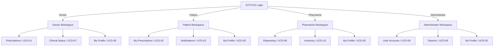
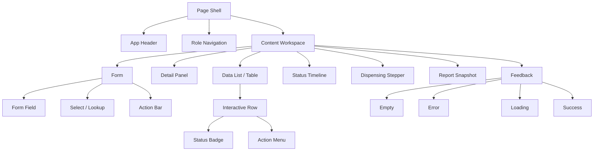
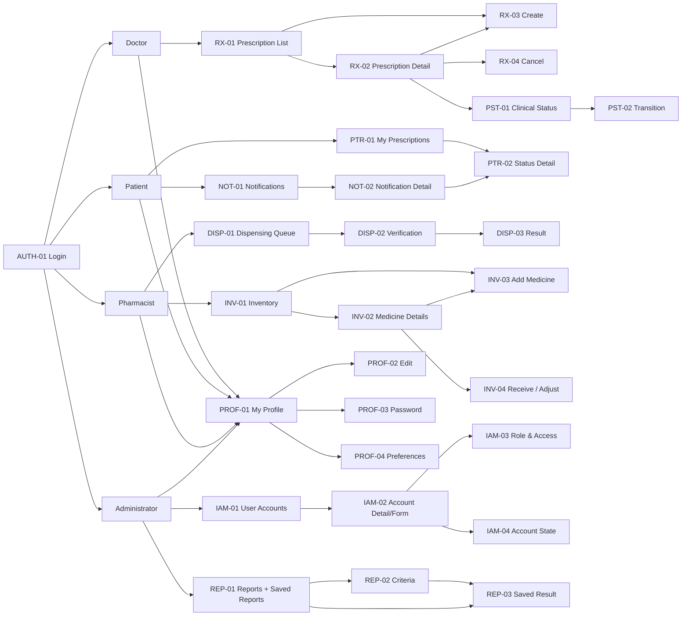

# Pharmacy Inventory & Prescription System — Detailed UI Application View

**Document Type:** UI / Prototype Behaviour Specification  
**Status:** Updated from clarified feature specification and consolidated UCD boundaries  
**Purpose:** Define the prototype-level behaviour of every listed UI surface without repeating sequence diagrams, class diagrams, or full use-case descriptions.

## Source-of-Truth Rule

This document translates the approved requirements and UCD boundaries into UI behaviour. It does not redefine domain ownership.

When a UI surface displays data owned by another domain, that information is contextual/read-only unless the owning UCD explicitly authorises mutation.

The clarified specification adds several UI-visible rules that were not explicit in the earlier UI document:

- a Patient business record may exist without login access;
- a Doctor may create the Patient business record needed for clinical work but may not administer Patient credentials or permissions;
- an Administrator may later provision/link login access to an existing Patient record;
- a Prescription contains one or more Prescription Items;
- Draft prescriptions are not visible to Patients;
- a Prescription becomes Expired one month after issue and Expired prescriptions are not dispensable;
- cancelled prescriptions are final in the current scope;
- partial dispensing and repeat dispensing are not supported;
- stock availability is aggregated across eligible non-expired batches and allocated earliest-expiry-first;
- stock is deducted only at final dispensing confirmation;
- manual stock adjustment requires a reason;
- in-system notifications are persisted and retain read/delivery state;
- generated reports are persisted as historical snapshots and PDF export uses the saved snapshot;
- minimum password length is eight characters;
- authenticated sessions expire after one hour.

These rules are incorporated into the cells below rather than documented as separate duplicate workflows.

# 1. Overall UI Architecture

The UI uses one authenticated application shell with role-filtered navigation. Authentication and permission evaluation remain UCD-04 responsibilities; role/account administration remains UCD-06. Clinical and fulfilment state are displayed separately even when a Patient-facing timeline combines them visually.



# 2. Global Application Shell

| Region | Detailed UI / Behaviour Contract |
| --- | --- |
| **Primary Navigation** | Persistent role-filtered navigation after sign-in. Doctor: Prescriptions, My Profile; Patient: My Prescriptions, Notifications, My Profile; Pharmacist: Dispensing, Inventory, My Profile; Administrator: User Accounts, Reports, My Profile, plus any system-wide access already authorised by the design. Unauthorised modules are omitted from normal navigation; a direct protected-route attempt resolves to AUTH-04 rather than silently rendering an empty page. |
| **Header** | Shows current module/page title, compact breadcrumb or parent-record context, unread notification indicator where relevant, current user identity/role, and profile/logout menu. It must not expose editable RBAC controls. When the session expires after one hour, protected actions stop and re-authentication is required. |
| **Main Workspace** | Contains the active UCD-specific list, detail, form, timeline, workflow, or report result. Keep the record identity and current authoritative status visible during edits or transactions so the user does not lose context. Read-only cross-domain information must be visually distinguishable from editable fields. |
| **Context Actions** | Page-level commands are limited to actions valid for the current actor, record state, and UCD boundary. Examples: Create Prescription, Change Clinical Status, Add Medicine, Receive Stock, Generate Report. Invalid or forbidden actions should be removed from the normal action set rather than shown as misleading choices. |
| **Status Feedback** | Use inline field validation for input errors; inline contextual alerts for business restrictions such as Expired or insufficient stock; toast/snackbar for routine successful saves; dedicated result state for high-impact transactions such as dispensing; preserved working context and retry action for persistence failures. |
| **Critical Confirmation** | Use a modal or focused confirmation surface for actions with meaningful irreversible/transactional impact: prescription cancellation, account disable/enable/unlock where confirmation is required, clinical status transition where applicable, final dispensing confirmation, and stock adjustment. Show the object, current state, intended action, consequence, and explicit confirm/cancel controls. |
| **Session State** | Authenticated session lifetime is one hour. Before executing a protected mutation, the UI must rely on current session validity. On expiry, block the operation, preserve safe unsaved form data where possible, route to authentication, and never imply that an unexecuted action succeeded. |
| **Access Control** | Every screen assumes server/controller-side permission enforcement in addition to UI filtering. UI behaviour: hide non-applicable navigation, remove unavailable mutation affordances, render read-only information when allowed, and show AUTH-04 for direct access to a protected surface without permission. |

# 3. Complete UI Screen / Surface Listing

The current design contains **32 primary prototype surfaces**. Reusable component states, drawers, alerts, modals, loading states, and validation variants should not be counted as separate full screens.

| ID | UCD | Prototype Screen / Surface | Source View | Dense Purpose / Behaviour |
| --- | --- | --- | --- | --- |
| AUTH-01 | 04 | Login | `LoginFormView` | Entry point for all users; validates identifier/password, establishes one-hour session, then routes to the workspace authorised for the account's single operational role. |
| AUTH-02 | 04 | Password Recovery | `AuthenticateAuthoriseView` | Recovery initiation; collects registered identity/contact value, avoids account-enumeration wording, and moves to a safe confirmation/recovery continuation. |
| AUTH-03 | 04 | Reset Password | `AuthenticateAuthoriseView` | Sets a replacement password using valid recovery context; enforces minimum eight characters and confirmation match before returning to Login. |
| AUTH-04 | 04 | Access Denied | `AccessDeniedView` | Protected-route denial surface for insufficient permission; gives safe reason/context and a route back to an authorised location without exposing security internals. |
| RX-01 | 01 | Prescription Workspace / List | `ManagePrescriptionView` | Doctor's primary prescription workspace; search/filter clinical records, identify Draft/Issued/On Hold/Cancelled/Expired states, create a new prescription, and open an existing record. |
| RX-02 | 01 | Prescription Details | `ManagePrescriptionView` + `PrescriptionItemView` | Read-focused Doctor detail showing Patient, one-to-many medication items, clinical status, and contextual read-only fulfilment information; routes to edit/status/cancel only when permitted. |
| RX-03 | 01 | Create / Edit Prescription | `PrescriptionFormView` + `PrescriptionItemView` | Clinical form for Patient selection plus one-to-many Prescription Items; supports contextual Patient creation when no business record exists, without giving the Doctor account/credential administration. |
| RX-04 | 01 | Cancel Prescription | Contextual confirmation modal | Final cancellation command; identifies the prescription, shows consequence/current state, captures reason where required, prevents duplicate submission, and does not provide restore. |
| PST-01 | 07 | Clinical Status Management | `UpdatePrescriptionStatusView` | Doctor-only status surface showing current clinical state, expiry/ineligibility context, and only currently permitted clinical transitions. |
| PST-02 | 07 | Status Transition | `PrescriptionStatusFormView` | Focused transition form/confirmation for target clinical state and required reason; revalidates current state before commit. |
| PTR-01 | 02 | My Prescriptions | `ViewPrescriptionStatusView` | Patient-only read view of own visible prescriptions; Draft excluded, Expired clearly labelled, clinical and fulfilment status presented separately but compactly. |
| PTR-02 | 02 | Prescription Status Details | `PrescriptionStatusDetailsView` | Read-only Patient detail with medication instructions plus a patient-readable clinical/fulfilment timeline; Cancelled/Expired/Dispensed are handled as clear terminal or blocking states. |
| NOT-01 | 03 | Notification Centre | `NotificationView` | Persistent in-system notification history for the signed-in Patient; unread/read filtering, chronological ordering, related prescription context, and mark-read behaviour. |
| NOT-02 | 03 | Notification Detail | `NotificationView` | Full persisted notification message and metadata safe for Patient display; marks read and can deep-link to the related Patient prescription detail. |
| PROF-01 | 05 | My Profile | `ManageProfileView` + `ProfileDetailsView` | Self-service profile summary for the current authenticated user only; separates editable personal information from protected role/account/system identifiers. |
| PROF-02 | 05 | Edit Profile | `ProfileFormView` | Edits permitted current-user personal/contact fields with validation, version/concurrency handling, and unsaved-change protection; cannot modify RBAC/account state. |
| PROF-03 | 05 | Change Password | Profile security surface | Current-password/new-password/confirmation workflow; minimum eight-character rule, mismatch feedback, safe success return, and no role/account changes. |
| PROF-04 | 05 | Notification Preferences | Profile preferences surface | Current-user preference controls only; baseline in-system notification remains supported and event-generation ownership remains UCD-03. |
| IAM-01 | 06 | User Account Management | `ManageUserAccountView` + `UserAccountListView` | Administrator account workspace; search/filter account lifecycle state and role, create account, open account detail, and identify Patient records that may require login provisioning. |
| IAM-02 | 06 | Create / Edit Account | `UserAccountFormView` | Administrator account form for identity/access lifecycle data; validates duplicate username/email and supports linking a Patient-role account to an existing Patient business record instead of duplicating it. |
| IAM-03 | 06 | Role & Account Access | `UserAccountFormView` | Administrator-only access configuration; one operational role per account, account state/approval context, permission summary, and Patient-account linkage context where applicable. |
| IAM-04 | 06 | Disable / Enable / Unlock | Contextual confirmation modal | Focused account-state command; shows current account, requested state, impact, optional reason where the existing design requires it, and refreshes authoritative state after commit. |
| DISP-01 | 08 | Dispensing Queue | `DispenseMedicationView` | Pharmacist queue of eligible fulfilments; surfaces clinical eligibility, fulfilment state, Patient, and blocking states such as Cancelled/Expired/already Dispensed. |
| DISP-02 | 08 | Verification & Dispensing | `DispenseFormView` | Controlled transaction: verify Patient/prescription, show all prescription items and full required quantities, aggregate eligible stock across non-expired batches, preview earliest-expiry-first allocation, and confirm full handover only. |
| DISP-03 | 08 | Dispensing Result | `DispenseResultView` | Dedicated immutable transaction outcome; success shows recorded DispenseRecord, deducted quantities/batches and timestamp; failure never appears as success and retains a safe route back for correction/retry. |
| INV-01 | 10 | Medicine Inventory | `ManageMedicineInventoryView` + `MedicineListView` | Pharmacist inventory overview of medicine master plus aggregate dispensable stock; visually separates normal/low/out/expiring/expired/inactive states and supports search/filter/sort. |
| INV-02 | 10 | Medicine / Batch Details | `ManageMedicineInventoryView` | Medicine detail plus all batches, including expired batches retained for records; shows dispensable vs physical/on-hand quantity, expiry ordering, and stock-movement context. |
| INV-03 | 10 | Add / Edit Medicine | `MedicineFormView` | Medicine master-data form for code/name/generic/form/strength/unit/description and active state; duplicate and field validation; does not directly change stock quantity. |
| INV-04 | 10 | Receive / Adjust Stock | `StockAdjustmentView` | Transactional stock drawer/modal for receiving or adjustment; quantity/batch/expiry inputs as applicable, mandatory adjustment reason for manual adjustment, current/projected balance, negative-balance prevention. |
| REP-01 | 09 | Reports Home / Saved Reports | `GenerateReportsView` | Administrator reporting entry; four required report categories plus persisted historical report list with type, generated timestamp, generated-by, row count, and open/export actions. |
| REP-02 | 09 | Report Criteria | `ReportCriteriaView` | Criteria builder for Prescription, Dispensing, Inventory, or User/Access report; validates date/filter combinations and preserves criteria if generation returns no data. |
| REP-03 | 09 | Report Result / Snapshot | `ReportResultView` | Read-only generated historical snapshot with title/criteria/timestamp/row count, summary visualisation/detail table as appropriate, save state, and PDF export from persisted snapshot rather than live recalculation. |

# 4. UCD-04 — Authentication Prototype Matrix

UCD-04 owns authentication, session establishment, identity verification and RBAC permission evaluation. It must not become a user/role administration screen.

| Screen | Inputs | Data | Display | Surfaces | Navigation | Utilities | Layout | Hierarchy |
| --- | --- | --- | --- | --- | --- | --- | --- | --- |
| **AUTH-01 Login** | Identifier/username or email according to current account model; password; submit. Password field supports show/hide. Empty values validate inline before submission; authentication failures remain generic. | Current account lookup, credential verification result, account active/disabled/locked state, assigned single operational role, permission set, session expiry metadata. Never expose password/hash or internal denial details. | System/brand title; identifier + password fields; primary Sign In; Forgot Password link; generic invalid-credential alert; specific safe states for disabled/locked account where approved; loading state during verification. Do not show role selector because one account has one role. | Unauthenticated full page with centred auth card; inline alert region; optional compact recovery link. No application sidebar before session establishment. | Success → authorised role workspace; Forgot Password → AUTH-02; insufficient protected-route access after sign-in → AUTH-04. Back navigation must not reveal previously protected data after logout/expiry. | Enter submits when valid; show/hide password; disable duplicate submit while authenticating; keyboard focus order; preserve identifier after failed authentication but clear/retain password according to safe implementation choice. | Single vertical form: identity/brand header → identifier → password → error area → Sign In → recovery. Keep security feedback near the form and avoid unrelated content. | **P:** successful sign-in action and current error; **S:** credentials; **T:** recovery/help. Security state is clear without exposing implementation metadata. |
| **AUTH-02 Password Recovery** | Registered email/identity value; submit; optional back-to-login. Validate required and basic format before requesting recovery. | Recovery lookup outcome, safe recovery eligibility, recovery request/token context if used. UI must not disclose whether an arbitrary account exists. | Recovery title, concise instructions, identity field, generic confirmation such as 'If the account can be recovered, follow the provided recovery process', validation error, progress state. | Full-page auth card or same auth shell as Login; success may use an inline confirmation panel rather than a separate full frame. | Back → AUTH-01; successful initiation → recovery confirmation or AUTH-03 when the current design provides valid reset context; invalid/expired recovery context returns to safe recovery entry. | Email/identity formatting; duplicate-submit prevention; resend/retry only where existing workflow permits; keyboard-first interaction. | Narrow single column: explanation → field → primary Recover action → secondary Back to Sign In; confirmation replaces form body after successful request. | **P:** recovery action/status; **S:** instruction and entered identity; **T:** return-to-login. |
| **AUTH-03 Reset Password** | New password; confirm new password; valid reset/recovery context. Minimum length 8; confirmation must match; fields support show/hide. | Recovery/reset-token validity where used; password-policy result; account identity only if safe to display. No role/account administration data. | New-password form; concise 'minimum 8 characters' requirement; mismatch/invalid-token feedback; success confirmation. Avoid unnecessary complexity such as invented special-character rules. | Auth card/full page; invalid or expired context uses inline blocking state with recovery-again action. | Success → AUTH-01; expired/invalid recovery context → AUTH-02; Cancel/Back → AUTH-01 where safe. | Live minimum-length and match feedback; show/hide password; disable submit until required values exist; prevent duplicate reset request. | Single security form: heading → policy → new password → confirmation → inline errors → Reset Password → return link. | **P:** establish valid new password; **S:** clear policy/match state; **T:** recovery fallback. |
| **AUTH-04 Access Denied** | No editable input. Optional Back or Go to authorised home action. | Current authenticated session identity/role; requested route/module; permission denial result. Do not display raw permission internals unless intended for admin debugging outside this prototype. | Access Denied title/icon; concise explanation that current account cannot access the requested function; safe navigation choices. If denial is caused by expired session, route through authentication rather than presenting it as ordinary RBAC denial. | Protected-route status page within minimal authenticated shell or standalone denial state depending on session validity. | Back to previous authorised page; Home → current role workspace; Login if session no longer valid. | Retry/refresh permission check only if state could legitimately change; no mutation utilities. | Centred status panel with dominant denial message, short context, then recovery navigation. Avoid a blank page or disabled controls without explanation. | **P:** denial and safe recovery path; **S:** requested area context; **T:** support/reference information if any. |

# 5. UCD-01 — Manage Prescription Prototype Matrix

UCD-01 owns prescription clinical content only. The clarified specification additionally requires one-to-many Prescription Items and allows a Doctor to create the Patient business record needed for clinical work while keeping login/account administration outside this UCD.

| Screen | Inputs | Data | Display | Surfaces | Navigation | Utilities | Layout | Hierarchy |
| --- | --- | --- | --- | --- | --- | --- | --- | --- |
| **RX-01 Prescription Workspace** | Search by prescription/patient/medicine text as supported; patient filter; clinical-status filter; date filter if already available; Create Prescription action. Inputs affect only retrieval, not fulfilment state. | Doctor-authorised prescription summaries with prescription ID, Patient identity, issue/created date, clinical state, one-month expiry evaluation, item summary/count, current version; optional read-only fulfilment summary. Draft records remain Doctor-visible; Cancelled/Expired clearly retained. | Dense table/list: Prescription ID, Patient, date, medication/item summary, Clinical Status badge, optional Fulfilment Status badge in a distinct column, Expiry indicator, row action. Empty state offers Create Prescription; error state preserves filters. | Main authenticated page; filter bar; table; optional quick-detail preview. Create opens RX-03 as page/drawer according to prototype implementation. | Row → RX-02; Create → RX-03; status action from eligible row may deep-link PST-01; profile/navigation remains role shell. Filters persist when returning from details where practical. | Search, filter, sort, refresh; clear filters; pagination only if needed by data volume; visible loading skeleton; no direct stock/dispense controls. Stale list refresh after mutation. | Page header with title + Create action; compact filter row; results summary; dense table. Status columns stay visually separate: clinical first, fulfilment contextual second. | **P:** Patient + prescription identity + clinical state; **S:** medication summary/date/expiry; **T:** IDs, version/audit metadata. |
| **RX-02 Prescription Details** | Primarily read-only. Context actions: Edit when clinically permitted; Change Status; Cancel when permitted. No direct fulfilment or stock inputs. | Full Prescription aggregate; 1..* Prescription Items; Patient summary; Doctor identity; clinical status and status metadata; issue date and computed expiry; optional latest fulfilment status as read-only context; version for concurrency. | Header: prescription ID, Patient, Doctor/date, Clinical Status, Expired/Cancelled warning if applicable. Item table/cards: medicine, dosage, quantity, frequency, instructions for every item. Separate read-only Fulfilment section if available. Show final cancellation clearly and no restore action. | Detail page using summary header + medication-item section + clinical status panel + contextual fulfilment panel. Confirmation modal RX-04 overlays this page when cancelling. | Back → RX-01; Edit → RX-03 only if permitted; Clinical Status → PST-01; Cancel → RX-04. If record no longer exists/stale, show contextual not-found/reload state without losing navigation shell. | Print/read-only rendering only if already desired; refresh latest; copy ID optional; no inventory mutation. Loading skeleton preserves section structure. | Top summary band → Patient/clinical context → one-to-many medication items → read-only fulfilment → audit/metadata collapsed or tertiary → action bar. | **P:** medication instructions + current clinical state; **S:** Patient/date/expiry and contextual fulfilment; **T:** IDs/timestamps/version. |
| **RX-03 Create / Edit Prescription** | Patient lookup/select; if Patient not found, contextual Create Patient action collecting Patient ID, full name, email, phone, date of birth, address, emergency contact. Prescription form contains one or more item rows: medicine, dosage, quantity, frequency, instructions. Add/remove item; Save/Cancel. Doctor cannot enter Patient login credentials, role or permissions. | Patient business record independent of login; medicine reference/master information; existing Prescription + Prescription Items for edit; current clinical state and edit eligibility; current version. Inventory availability may be looked up only as context if displayed and must not prevent clinically valid prescribing solely because stock is absent. | Patient selector with clear 'no login required' behaviour; selected Patient summary; optional inline Patient-create drawer; repeated Prescription Item blocks/table; validation messages per item; Draft/Issued behaviour follows current implementation; expired/cancelled/non-editable records show blocking banner instead of editable form. | Full page or large drawer; nested Patient quick-create drawer/modal may be used from the Patient selector; repeated item component; sticky/anchored Save/Cancel action bar. | From RX-01/RX-02; Patient quick-create returns to same form with newly created Patient selected; Save → RX-02; Cancel → previous surface; unsaved navigation triggers discard confirmation where needed. | Patient search; medicine lookup; Add item; Remove item with confirmation only if losing meaningful entered data; inline validation; dirty-state guard; duplicate-submit prevention; preserve entered values on recoverable persistence failure. | Section 1 Patient → Section 2 Prescription Items (repeatable rows/cards) → Section 3 notes/instructions if separated → validation summary → action bar. Keep Patient identity visible while scrolling items. | **P:** correct Patient + required medication instructions; **S:** item management and validation; **T:** record/version metadata. |
| **RX-04 Cancel Prescription** | Cancellation reason when the current status operation requires/supports one; explicit Cancel Prescription confirmation; secondary Keep Prescription/Close. | Prescription ID, Patient, current clinical state, fulfilment state for eligibility check, current version; cancellation eligibility. Cancelled is final for current scope. | Strong consequence statement naming prescription/Patient; current clinical state; warning that cancellation is final and may stop further fulfilment; reason field where required; validation or stale-state alert. | Modal over RX-02 or contextual action surface; destructive primary action visually distinct from ordinary Save. | Confirm → commit then return RX-02/RX-01 with Cancelled status; secondary action closes without change. If state changed/dispensed and cancellation becomes invalid, remain on modal/detail with Reload latest. | Disable confirm during submission; require reason if rule says required; prevent double-submit; show persistence/concurrency failure inline without closing and pretending success. | Compact confirmation: object summary → consequence → reason → Cancel Prescription / Back. No unrelated prescription editing controls. | **P:** irreversible cancellation consequence; **S:** reason/current state; **T:** ID metadata. |

# 6. UCD-07 — Clinical Prescription Status

Clinical lifecycle mutation remains Doctor-owned and must stay separate from pharmacy fulfilment states such as Preparing, Ready, and Dispensed.

| Screen | Inputs | Data | Display | Surfaces | Navigation | Utilities | Layout | Hierarchy |
| --- | --- | --- | --- | --- | --- | --- | --- | --- |
| **PST-01 Clinical Status Management** | No free-form status editing. User enters through selected prescription; available action is choosing one of the currently permitted transitions. Optional refresh. | Prescription ID, Patient, issue date, current clinical state, computed Expired state, permitted transition set, changed-at/by/reason metadata where available, current version; fulfilment status may be read-only validation/context only. | Current clinical status as dominant badge; issue/expiry context; transition history/last change where available; only valid next-state actions. On Hold is Doctor-controlled; Expired is visibly ineligible; clinical and fulfilment badges are visually separated. | Detail page/panel reached from RX-02; transition action opens PST-02 modal/drawer. | Back → RX-02; choose transition → PST-02; after success stay on PST-01/RX-02 with refreshed state. Invalid direct access or missing record returns safe not-found/access handling. | Refresh latest; audit/history reveal if supported; no editing of dosage/medicine; no fulfilment status controls. | Summary: Prescription/Patient → Current Clinical Status → expiry/eligibility banner → allowed actions → recent transition metadata. Read-only fulfilment context, if present, appears secondary. | **P:** current state + valid next actions; **S:** reason/history/expiry; **T:** fulfilment/audit metadata. |
| **PST-02 Status Transition** | Target status chosen from allowed set; reason input when required; Confirm/Cancel. Do not present arbitrary status dropdown values. | Current state, allowed transition matrix, current version, fulfilment/expiry constraints used for validation, actor permission. Re-fetch/revalidate before commit to detect concurrent change. | Current → Target visual; reason requirement; concise consequence; blocking errors for invalid transition, expired/ineligible state, already-fulfilled constraint, or stale version. | Modal or drawer over PST-01; stays contextual to selected prescription. | Confirm → refreshed PST-01/RX-02; Cancel → close; stale/invalid → remain with Reload latest rather than navigate away. | State validation; required-reason validation; disable during submit; prevent double-submit; Reload latest after concurrent update. | Compact sequence: current state → target action → reason → consequence → confirm. No prescription-item editing inside this surface. | **P:** exact transition being committed; **S:** reason/consequence; **T:** version/change metadata. |

# 7. UCD-02 — Patient Prescription Tracking

This UCD is strictly read-only and restricted to the authenticated Patient's own visible prescriptions. Draft is excluded; Expired must be clearly displayed.

| Screen | Inputs | Data | Display | Surfaces | Navigation | Utilities | Layout | Hierarchy |
| --- | --- | --- | --- | --- | --- | --- | --- | --- |
| **PTR-01 My Prescriptions** | Optional patient-safe search; clinical status filter; fulfilment status filter; date/sort control. No create/edit inputs. | Only prescriptions owned by authenticated Patient and allowed for Patient visibility; Draft excluded. Summary includes prescription ID, issue date, Doctor, item/medicine summary, clinical status, fulfilment status, and computed Expired state. | Cards/table with clear dual-state presentation: Clinical Status badge and Fulfilment Status badge in separate labels; Doctor/date; medicine/item summary. Expired, Cancelled, Ready, and Dispensed must be quickly recognisable. Empty state explains no visible prescriptions rather than offering a Doctor action. | Patient main page; list/table/card components; loading/empty/error variants. | Row/card → PTR-02; notification deep links may enter PTR-02 directly; Back/Home remains Patient shell. No navigation to Doctor or Pharmacist mutation surfaces. | Filter/sort/refresh; clear filters; accessible status labels; unread-related indicator optional if linked from notification. No bulk actions or edit menus. | Header + compact filters → prescription list. Current/important statuses should visually dominate IDs. Grouping by recent/current vs older may be used without changing domain state. | **P:** prescription + current clinical/fulfilment status; **S:** medicine/Doctor/date; **T:** ID. |
| **PTR-02 Prescription Status Details** | None beyond Back and related read-only navigation; no editable clinical/fulfilment controls. | Authorised Patient prescription detail; all Prescription Items; Doctor; issue date; clinical status; latest fulfilment progress; collection/completion info when available. Draft must never reach this surface for Patient. Expired/Cancelled/Dispensed handled explicitly. | Patient-friendly header; medication list with medicine/dosage/quantity/frequency/instructions; separate Clinical section and Fulfilment timeline. Cancelled foregrounds cancellation and stops implying normal progress; Expired foregrounds expiry/non-fulfilment; Dispensed shows completion as terminal state. | Read-only detail page with timeline component and medication cards/table. | Back → PTR-01; related notification path returns to NOT-02/NOT-01 as browser/app history allows. No links to edit/status/dispense/inventory. | Refresh latest; copy/reference ID optional; print only if later required. Status timeline labels use readable terms while retaining separate domain concepts underneath. | Header/current outcome → clinical state → fulfilment timeline → medication instructions → collection/completion details → tertiary ID/date metadata. | **P:** current outcome/status; **S:** medication instructions + timeline; **T:** IDs and generated timestamps. |

# 8. UCD-03 — Notifications

UCD-03 is event-driven. The Patient UI is a persisted notification centre, not a manual notification-sending module.

| Screen | Inputs | Data | Display | Surfaces | Navigation | Utilities | Layout | Hierarchy |
| --- | --- | --- | --- | --- | --- | --- | --- | --- |
| **NOT-01 Notification Centre** | Read/unread filter; optional event/type filter; optional search if useful; Mark all read only if supported. No manual 'send notification' input. | Persisted notifications for authenticated Patient only; notification ID, related prescription ID, event/type, title/message preview, created/delivered/failed/read timestamps, delivery state, deduplication outcome. Baseline channel is in-system. | Chronological list with unread emphasis, event/status icon/badge, title, concise message preview, relative/absolute timestamp, related prescription reference. Failed delivery/system-processing internals are shown only if patient-safe and useful; duplicates must not appear as separate successful notifications. | Patient page or notification panel/dropdown backed by the same persisted list; empty/loading/error states. | Select notification → NOT-02; related prescription shortcut may go PTR-02 after permission/ownership check; header notification indicator opens NOT-01. | Read/unread filter; mark read; refresh; optional mark all read. Unread count updates consistently after read action. | Header + unread count/filter → newest notifications first. Separate unread/current from older read items with clear but restrained emphasis. | **P:** unread important message/event; **S:** related prescription/time; **T:** delivery metadata. |
| **NOT-02 Notification Detail** | No business mutation input; Mark read action if unread; optional Back. | Single persisted Notification plus authorised related prescription reference. Read timestamp updates through notification behaviour only; underlying prescription/dispensing state is not changed here. | Full title and patient-safe message body; event type; created/delivered/read time where useful; related prescription action. If notification refers to a state that has since changed, the notification remains historical and the related prescription shows current state separately. | Drawer or detail page depending entry context. | Back → NOT-01; related prescription → PTR-02; mark-read keeps user on detail while updating indicator/count. | Mark read; copy message/reference optional; no resend, stock, status, or dispensing controls. | Message header → body → event/time metadata → related prescription action. Keep technical delivery identifiers tertiary. | **P:** message content; **S:** related prescription/action; **T:** notification/delivery metadata. |

# 9. UCD-05 — My Profile

UCD-05 remains self-service only. Account lifecycle and RBAC belong to UCD-06.

| Screen | Inputs | Data | Display | Surfaces | Navigation | Utilities | Layout | Hierarchy |
| --- | --- | --- | --- | --- | --- | --- | --- | --- |
| **PROF-01 My Profile** | No form input until Edit/Security/Preferences action. Actions: Edit Profile, Change Password, Notification Preferences. | Current authenticated user's own profile subtype; permitted personal/contact fields; role-specific profile information; protected account/system identifiers as read-only context only; current version. | Identity summary, contact details, address, role-specific section, protected role/account status displayed read-only only if useful. Patient profile shown only to that Patient in this self-service module; Doctor does not manage another Patient here. | Authenticated profile page with sections/cards; edit/security actions route to dedicated surfaces. | Edit → PROF-02; Change Password → PROF-03; Preferences → PROF-04; back/home → role workspace. | Refresh; copy contact info optional; no role assignment/account state buttons. | Profile identity header → contact/personal sections → role-specific section → security/preferences shortcuts → tertiary read-only system metadata. | **P:** personal identity/contact; **S:** role-specific profile details; **T:** protected system/account metadata. |
| **PROF-02 Edit Profile** | Permitted current-user fields such as full/display name, phone, contact email, address, emergency contact where supported by subtype; Save/Cancel. Protected fields never become editable controls. | Current profile values + version/concurrency token; field permission map by profile subtype. Does not own account role/status or Patient account provisioning. | Grouped form showing only editable fields as inputs; protected fields either omitted or explicitly read-only with clear label. Inline format/required errors; concurrent-update alert; save success feedback. | Page or drawer from profile detail; unsaved-change confirm when leaving. | Save → PROF-01 refreshed; Cancel → PROF-01; stale update → stay with Reload latest; invalid field → remain on form. | Validation; dirty-state detection; Reset/Revert current edits; prevent duplicate save; preserve entered values on recoverable persistence failure. | Identity/contact groups → address/emergency information → validation summary → Save/Cancel. Avoid mixing security/password controls into general edit form. | **P:** editable personal information; **S:** validation/current values; **T:** read-only protected context. |
| **PROF-03 Change Password** | Current password; new password; confirm new password. New password minimum 8 characters and confirmation must match. | Credential verification result and password-change eligibility. Do not expose stored credential data. | Security form with concise minimum-length rule, current-password error, mismatch error, success message. No invented special-character complexity unless later specified. | Modal or compact page from My Profile. | Success → PROF-01; Cancel → PROF-01; failed current password/validation stays on form. | Show/hide each password; live length/match feedback; disable submit during change; clear sensitive fields after success/failure according to safe implementation. | Current password → new password → confirm → policy/error → Change Password. Keep focus on one security task. | **P:** secure password change; **S:** policy/match feedback; **T:** none. |
| **PROF-04 Notification Preferences** | Supported preference toggles/controls for current user; Save/Reset. Do not expose event-generation logic as if the user owns notification delivery. | Current profile preference values; baseline in-system notification capability. Mandatory system events may remain enabled where required by current system behaviour. | Settings list with each preference name, concise meaning, current state, and save feedback. Distinguish preference from actual historical notifications. | Settings section/page within profile module. | Save → PROF-01 or remain with saved state; Cancel → PROF-01; notification centre is separate Patient module, not this page. | Reset/revert unsaved values; validation if any preference dependencies exist; unsaved-change guard. | Preference groups → explanatory text → controls → Save. Avoid notification-history content here. | **P:** chosen preferences; **S:** explanation; **T:** save metadata. |

# 10. UCD-06 — User Account Administration

Only Administrators operate this module. The clarified specification adds provisioning/linking of login access to an existing Patient business record.

| Screen | Inputs | Data | Display | Surfaces | Navigation | Utilities | Layout | Hierarchy |
| --- | --- | --- | --- | --- | --- | --- | --- | --- |
| **IAM-01 User Account Management** | Search username/email/name; role filter; account status filter; approval/lock filter where supported; Add Account. Optional Patient-access filter such as 'Patient record without login' only if implementation exposes it through this workspace. | Authorised account summaries: user ID, username, email, single role, active/disabled/locked/pending state, approval state, linked Patient ID where account is Patient-role, version/timestamps. Existing Patient business records may exist without any account. | Dense admin table with account identity, role badge, account status, approval/lock indicators, Patient-link indicator when relevant, row actions. Empty results retain filter context. Do not show credential secrets. | Administrator main page/table; filters; optional status summary counts; row opens IAM-02. | Row → IAM-02; Add → IAM-02; account-state action → IAM-04; role/access → IAM-03. Direct protected access by non-admin → AUTH-04. | Search/filter/sort/refresh; clear filters; pagination if needed; no ordinary profile self-editing. Refresh after account-state changes. | Header + Add Account → filter row → account table. Status/role visible without opening detail; sensitive internals remain hidden. | **P:** account identity + state + role; **S:** email/approval/Patient link; **T:** created/updated/version metadata. |
| **IAM-02 Create / Edit Account** | Username, email, supported administrative identity fields, single role selection or route to IAM-03, account approval/activation fields where design permits. For Patient role: search/select existing Patient business record and link it; do not create duplicate Patient when one already exists. | Existing account + version; duplicate username/email checks; role catalogue; existing Patient records eligible for linking; current linked Patient ID when applicable; account state. No raw password/hash display. | Structured account form; role/account status summary; Patient-link section conditionally shown for Patient role; duplicate/required-field validation; clear distinction between account data and personal profile data. | Page/drawer from IAM-01; optional Patient lookup panel embedded in form; no Doctor-style clinical Patient editor. | Save → IAM-01 or remain on account detail; Role & Access → IAM-03; account-state command → IAM-04; Cancel → IAM-01. Concurrent change stays with Reload latest. | Duplicate validation; Patient search/link validation; dirty-state guard; prevent duplicate save; clear indication if Patient already linked to another account. | Account identity → Patient link if applicable → role/access summary → account state → Save/Cancel. Keep profile-edit fields out unless explicitly administrative identity fields. | **P:** correct account identity/link; **S:** role/state; **T:** version/timestamps. |
| **IAM-03 Role & Account Access** | One operational role selection; approval/access state controls supported by design; Apply/Cancel. No multi-role selection in current scope. | Current account, current single role, available role catalogue, permission summary derived from role, current state, linked Patient reference where relevant. UCD-04 later evaluates these permissions during access. | Role choices with concise capability summary; current role clearly selected; account state/approval context; warning if change affects future access. Do not provide fine-grained arbitrary permission editing unless existing design explicitly supports it. | Side panel/page from IAM-02; role selection component plus account-state summary. | Apply → IAM-02 refreshed; Cancel → IAM-02; disable/unlock may route IAM-04 if kept as separate confirmation. | Validate one-role constraint; prevent invalid/non-existent role; refresh catalogue; double-submit prevention; stale-account handling. | Current account header → role choice → permission summary → access consequence → Apply. Account lifecycle action secondary. | **P:** assigned operational role; **S:** resulting access/account state; **T:** permission details. |
| **IAM-04 Disable / Enable / Unlock** | Explicit state action confirmation; reason only where current design requires; secondary cancel. | Current UserAccount state, account identity, role, lock/disabled status, version; active session implications are reflected by subsequent authentication behaviour. | Impact warning naming account and target state; current → target status; reason if applicable; success/error/concurrency feedback. Never reveal credential internals. | Modal over IAM-01/IAM-02. | Confirm → refresh IAM-01/IAM-02; Cancel → close. Stale state → Reload latest. Successful disable means future authentication is blocked. | Disable duplicate submit; confirm exact action; focus trap/keyboard escape where appropriate; safe retry on persistence failure. | Account summary → current/target state → consequence → reason if any → confirm/cancel. | **P:** consequence and target state; **S:** account identity/reason; **T:** version/audit metadata. |

# 11. UCD-08 — Dispense Medication

This is a controlled transaction. Full quantity must be available across eligible non-expired batches; earliest-expiry stock is used first; stock deduction occurs only at final confirmation; duplicate/repeat dispensing is not allowed.

| Screen | Inputs | Data | Display | Surfaces | Navigation | Utilities | Layout | Hierarchy |
| --- | --- | --- | --- | --- | --- | --- | --- | --- |
| **DISP-01 Dispensing Queue** | Search prescription ID/Patient; fulfilment/eligibility filter; optional Ready/current status filter; refresh. No manual stock adjustment from queue. | Eligible fulfilment summaries plus authoritative clinical eligibility: Prescription ID, Patient, issue/expiry, clinical status, fulfilment status, item summary, already-dispensed indicator. Cancelled/Expired/already Dispensed are blocked/excluded according to queue policy. | Actionable queue with clear eligibility badge, Patient, prescription, medication/item summary, clinical and fulfilment states. Blocked records, if shown for context, have explicit reason and no Dispense action. | Pharmacist main page/table/queue; filters; loading/empty/error states. | Eligible row → DISP-02; blocked rows may open read-only reason/detail but never bypass validation; Done from DISP-03 returns here. | Search/filter/refresh/sort; no prescription clinical edit; no general inventory adjustment. Queue refresh after successful dispense. | Header + filters → actionable queue. Eligibility/Patient/medication dominate; IDs/status metadata secondary. | **P:** prescriptions ready/eligible for action; **S:** Patient/medication/status; **T:** timestamps/IDs. |
| **DISP-02 Verification & Dispensing** | Patient verification inputs according to current design; confirmation of prescription/medication; no editable prescribed quantity for partial dispense because partial dispensing is unsupported; final Confirm Handover. Any displayed quantity is full required quantity. | Prescription + all Prescription Items; Patient identity; current clinical and fulfilment state; expiry; total eligible non-expired stock by medicine; batch list ordered by expiry; computed earliest-expiry-first allocation plan; duplicate-dispense check; current inventory versions. | Step-based verification: Patient summary; prescription eligibility; every medication with prescribed full quantity; Available Eligible Stock; batch allocation preview when multiple batches are used; explicit Insufficient Stock block; Expired batches excluded from eligible total but may be mentioned as non-dispensable context; final consequence states that confirmation records dispense and deducts stock. | Dedicated workflow page with stepper/sections; final confirmation panel/modal within the same workflow. This is not a generic editable CRUD form. | Back → DISP-01 before commit; Confirm → transactional operation then DISP-03 on success only. Insufficient stock, Patient mismatch, Cancelled/Expired, duplicate dispense, stale stock, or transaction failure stays on workflow with corrective guidance/reload. | Re-check stock before final confirm; calculate aggregate eligible stock; preview FEFO allocation; disable confirm until all verification passes; prevent double-submit; Reload latest on concurrent stock; no partial-quantity override. | Persistent Patient/prescription context → Verify Patient → Verify Medication → Check Stock/Allocation → Confirm Handover. Keep final full quantity and stock consequence visible at confirmation. | **P:** correct Patient + full medication handover; **S:** eligibility/stock allocation; **T:** batch/version metadata. |
| **DISP-03 Dispensing Result** | No transaction input after completion. Actions: Done/Back to Queue; print/reference only if supported. | Persisted DispenseRecord, prescription ID, Patient, medication/full quantities, deducted batch allocations if exposed, pharmacist, transaction timestamp, final fulfilment state. Failure result exists only for an attempted transaction that did not commit and must not mimic success. | Success: strong Dispensed outcome, transaction/reference ID, Patient, medication quantities, timestamp, final status, optional batch deduction summary. Failure: clear 'not completed/no stock deducted' message with reason/retry path where applicable. | Dedicated result page or high-prominence result state; routine toast alone is insufficient for this high-impact operation. | Done → DISP-01 refreshed; related prescription detail read-only if supported; failure → back to DISP-02 with preserved safe context/reload. | Copy transaction ID; print receipt only if required; no second Dispense button for completed transaction. | Outcome banner → transaction summary → medication quantities/batches → timestamp/pharmacist → Done. Success/failure visual semantics must be unmistakable. | **P:** whether dispensing committed; **S:** what was dispensed and quantity; **T:** transaction metadata. |

# 12. UCD-10 — Medicine Inventory

UCD-10 owns medicine master, stock receipt/adjustment, batches, expiry and operational stock visibility. Expired stock remains recorded but is not dispensable; manual adjustment requires a reason.

| Screen | Inputs | Data | Display | Surfaces | Navigation | Utilities | Layout | Hierarchy |
| --- | --- | --- | --- | --- | --- | --- | --- | --- |
| **INV-01 Inventory List** | Search medicine code/name/generic; stock-status filter; expiry filter; active/inactive filter; low-stock filter; Add Medicine; refresh. | Medicine master + aggregate inventory: code, name, strength/form/unit, active state, total physical/on-hand quantity if tracked, total dispensable quantity excluding expired stock, low-stock/reorder threshold, nearest expiry, batch count. | Dense inventory table with Medicine, formulation, Dispensable Stock as dominant quantity, low/out badge, nearest expiry/expiring indicator, inactive status. If physical quantity includes expired stock, do not label it simply 'available'; distinguish total vs dispensable. | Pharmacist main inventory page/table; optional KPI summary for Low Stock/Out of Stock/Expiring; filters. | Row → INV-02; Add → INV-03; receiving/adjustment usually from INV-02 → INV-04. No direct prescription or Patient notification action. | Search/filter/sort/refresh; clear filters; status badges; loading skeleton. Low-stock is operational inventory feedback, not automatically a Patient notification. | Header + Add Medicine → compact KPI/status strip → filters → dense inventory table. Available/dispensable stock visually precedes tertiary metadata. | **P:** medicine + dispensable stock/status; **S:** strength/batch/expiry; **T:** IDs/version. |
| **INV-02 Medicine / Batch Details** | Batch filter/sort; actions Edit Medicine, Receive Stock, Adjust Stock; optional movement-history filter. | Medicine master; all InventoryItem batches including expired; quantity per batch, expiry date, reorder level, active state, stock movements, version. Eligible/dispensable total excludes expired quantity. Batch ordering may default expiry ascending to reflect FEFO. | Medicine summary and aggregate dispensable stock; batch table with batch ID, expiry, quantity, eligibility/non-dispensable status, warning for expiring/expired; optional stock movement history with movement type/quantity/reason/time. | Detail page with medicine summary + batch table + optional movement panel; INV-04 overlays as drawer/modal. | Back → INV-01; Edit → INV-03; Receive/Adjust → INV-04; successful stock action returns refreshed here. | Filter/sort batches; show expired; movement history; refresh latest; no delete of historical movement unless existing model explicitly supports it. | Medicine identity/available summary → action bar → batch table → movement history → metadata. Expired quantity retained but visually excluded from 'dispensable'. | **P:** current dispensable quantity + batch expiry; **S:** medicine details/movements; **T:** version/audit metadata. |
| **INV-03 Add / Edit Medicine** | Medicine code, medicine name, generic name, dosage form, strength, unit, description, active state where supported; Save/Cancel. | Medicine master record + version for edit; duplicate-code/name checks as defined; no stock quantity ownership in this form. | Grouped master-data form; required/duplicate validation; active/inactive state; for Edit, current inventory quantity may appear only as read-only context with link back to INV-02. | Page/drawer from list/detail. | Save → INV-02 or INV-01; Cancel → previous; duplicate/invalid/stale stays on form with correction/reload. | Duplicate check; dirty-state guard; inline validation; prevent duplicate save; Reset/Revert. | Identity (code/name) → formulation (generic/form/strength/unit) → description/state → Save. Stock controls are absent. | **P:** unique medicine identity; **S:** formulation; **T:** description/state metadata. |
| **INV-04 Receive / Adjust Stock** | Operation type Receive or Adjust; quantity; batch number and expiry for receipt/new batch as applicable; selected existing batch for adjustment; **mandatory adjustment reason** for manual adjustment; Confirm/Cancel. | Current selected medicine/batch, current quantity, projected quantity, expiry/eligibility, current version, movement type. Negative-balance rule and expiry rule applied before commit. | Current balance and projected balance side-by-side; operation summary; batch/expiry; mandatory reason on Adjust; clear warning if result invalid/negative; expired batch remains recordable but is non-dispensable. Successful commit produces movement record and refreshed balance. | Modal/drawer from INV-02; Receive and Adjust can be variants of the same component with different required fields. | Commit → close + refresh INV-02; Cancel → close; concurrent/stale → stay with Reload latest; invalid negative quantity → inline block. | Quantity calculator/projected balance; required-reason validation; date/expiry validation; disable duplicate submit; clear indication of sign/direction of adjustment. | Operation type → batch context → current quantity → quantity change → projected result → reason → Confirm. Resulting stock is visually dominant. | **P:** resulting stock and exact change; **S:** batch/expiry/reason; **T:** movement/version metadata. |

# 13. UCD-09 — Reporting / DSS

Reporting is Administrator-only, read-only with respect to operational data, and now includes mandatory persisted historical snapshots. PDF export uses the saved snapshot rather than recalculating current live data.

| Screen | Inputs | Data | Display | Surfaces | Navigation | Utilities | Layout | Hierarchy |
| --- | --- | --- | --- | --- | --- | --- | --- | --- |
| **REP-01 Reports Home / Saved Reports** | Select one of four required report types: Prescription, Dispensing, Inventory, User/Access. Search/filter saved reports by type/date/generated-by if useful; Generate New; open/export existing snapshot. | Available report categories plus persisted Report summaries: report ID, type, title, criteria summary, generatedBy, generatedAt, rowCount, saved snapshot availability. Saved reports are mandatory under clarified spec. | Category cards/actions for new report plus Saved Reports table/list with report type, generated time, generated-by, criteria summary, row count, Open, Export PDF. Empty saved-report state still allows Generate. | Administrator report main page; report-category area + persisted history list. | Choose type/Generate → REP-02; open saved report → REP-03 using stored snapshot; Export saved report may invoke export directly or via REP-03. No operational edit links. | Search/filter/sort saved reports; refresh; export action; no mutation of prescription/inventory/account source records. | Top: Generate Report categories/actions. Bottom: Saved Reports history sorted newest first. Keep new-generation and historical retrieval visually distinct. | **P:** choose/report history; **S:** generated time/type/row count; **T:** report ID/generated-by. |
| **REP-02 Report Criteria** | Report type fixed/selected; start date; end date; type-specific filters using only fields supported by current report design; Generate; Clear Filters; Cancel. | ReportCriteria under construction; available filter options from read-only source data. Validation includes required report type and valid date range. No operational mutations. | Criteria form with selected report type description, date range, additional filters, criteria summary before generation, inline invalid-range feedback. Preserve criteria if no data or generation failure. | Page/panel reached from REP-01; could be drawer if keeping report history visible. | Generate → system creates persisted report snapshot then REP-03; Cancel → REP-01; no-data → REP-03 empty result or remain with explicit empty result while preserving criteria according to implementation. | Date-range validation; clear filters; sensible defaults only if already agreed; loading/progress during generation; prevent duplicate Generate. | Report type → date range → additional filters → criteria summary → Generate. Keep optional filters subordinate to required type/date. | **P:** report type + valid criteria; **S:** optional filters; **T:** helper descriptions. |
| **REP-03 Report Result / Snapshot** | No operational edit input. Actions: Export PDF; Back to Reports; Modify Criteria for a new report generation. Existing saved snapshot is read-only. | Persisted Report snapshot with report ID, type, title, original criteria, generatedBy, generatedAt, rowCount, and saved JSON content rendered into appropriate summary/table/chart. Export uses the saved snapshot even if live data has changed. | Report title; original criteria/date range; generated timestamp; row count; decision-relevant KPIs/summary; primary visualisation only where meaningful; detailed table; generated-by metadata; Saved indicator; Export PDF. Empty snapshot clearly states no matching records while preserving criteria. | Full results page; export progress/error may use modal/toast/inline alert but must not destroy the visible snapshot. | Back → REP-01; Modify Criteria → REP-02 as a new generation path; Export → PDF generation from current persisted snapshot. Export failure leaves REP-03 intact with Retry. | Export PDF; print only if later supported; copy report ID; no source-record mutation. When opening saved report, do not silently recalculate data. | Title/criteria/generated time → KPI/summary → visualisation → detailed data → generated-by/row count/report ID → Export action. Historical snapshot identity is explicit. | **P:** report findings as generated; **S:** detail/criteria; **T:** generated metadata/export. |

# 14. Global Prototype Behaviour Matrix

These should be component variants/states, not separate full prototype pages.

| State | Detailed Prototype Behaviour |
| --- | --- |
| **Initial loading** | Render skeletons that preserve the expected table/card/form geometry; keep page title/context visible; mutation actions disabled until authoritative record state and permissions are known; do not flash stale success/empty states. |
| **Action loading** | Keep current record/form visible; primary action changes to progress state; disable repeated submission and conflicting actions; show exact operation being processed, especially for dispense/cancel/status/stock/account mutations. |
| **Empty** | Differentiate 'no records exist' from 'filters returned no results'. Preserve active filters/criteria; provide only actor-appropriate next action such as Create Prescription/Add Medicine/Generate Report or Clear Filters; Patient empty states never expose staff actions. |
| **Validation failure** | Show error adjacent to each invalid field and an error summary when multiple fields fail; retain entered values; move focus/scroll to first invalid field; business-rule failures such as insufficient stock or Expired are contextual alerts, not merely generic field errors. |
| **Not found** | Show the requested record cannot be retrieved; provide Back/Return and Refresh where useful; never expose another user's data in fallback content; distinguish deleted/missing from permission denial when safe. |
| **Permission denied** | Route direct protected access to AUTH-04; normal navigation omits unauthorised modules/actions; do not rely on disabled buttons as the only access-control signal. |
| **Session expired** | After one hour, protected operations are not executed until re-authentication; preserve safe unsaved form data where possible; sensitive transactional confirmation must be revalidated after sign-in before execution. |
| **Concurrent update** | Tell user that the record/stock/account changed since loaded; primary recovery is Reload latest; do not silently overwrite. For dispensing, recalculate stock and FEFO allocation before allowing confirmation again. |
| **Persistence failure** | Keep working context and entered values where safe; show operation-specific failure and Retry; never show success or navigate to a completed result when persistence/transaction did not commit. |
| **Success** | Routine profile/account/medicine/prescription saves use toast plus refreshed authoritative state; high-impact dispense uses DISP-03 result; report generation opens persisted REP-03 snapshot; status/cancel/stock changes refresh the affected status/balance immediately. |
| **Destructive / high-impact confirmation** | Name the target object, current state, intended change, consequence, and final action. Use for prescription cancellation, account state change where applicable, final dispensing, manual stock adjustment, and significant clinical transition. |
| **Read-only state** | Remove edit affordances for Patient tracking/report snapshots/contextual cross-domain data; use labels/text/badges rather than disabled form inputs. If an action is unavailable due to state, explain why near the action area. |
| **Expired state** | Prescription: show Expired and block dispensing. Inventory batch: retain/display quantity but mark non-dispensable and exclude from available/eligible total. Expiry must never be represented only by colour. |
| **Duplicate prevention** | Disable repeated submit client-side and rely on authoritative duplicate checks. Notifications: no duplicate successful notification for same event; Dispensing: completed fulfilment cannot be repeated; account/prescription saves must not imply multiple commits. |

# 15. Surface Strategy

| Surface | Detailed Use / Behaviour |
| --- | --- |
| **Page** | Lists, major workspaces, record details, Patient tracking, reporting results, transactional workflow when context must remain visible. Page owns title, breadcrumb/context, primary action and state handling. |
| **Drawer** | Context-preserving create/edit tasks such as Prescription edit or Medicine edit where user benefits from seeing parent list/detail behind it. Drawer must still support validation, unsaved changes, and loading/error states. |
| **Modal** | Short focused confirmation or atomic command: Cancel Prescription, status transition, account-state action, stock adjustment variant, final confirmation. Keep scope narrow; do not place long multi-item workflows into a modal. |
| **Popover / Menu** | Minor row actions, account menu, filter options. Never use as sole presentation for critical warnings or multi-step transactional state. |
| **Toast / Snackbar** | Routine non-blocking success such as profile saved or medicine updated. Not sufficient as the only confirmation for dispensing or other high-impact transaction. |
| **Inline Alert** | Business restriction, validation summary, low stock, Expired/non-dispensable, stale record, persistence failure. Place close to the affected data/action. |
| **Empty State** | No records/no results/no notifications/no saved reports. Explain condition and provide only relevant next action while retaining actor context. |
| **Result State** | Explicit final outcome for dispensing and persisted report generation where the user needs proof of completion/record identity. |
| **Skeleton** | Initial loading placeholder shaped like target content; do not show fake values or enabled mutation actions. |
| **Badge** | Clinical, fulfilment, account, notification, inventory/expiry states. Use text labels plus visual treatment; clinical and fulfilment badges remain distinct. |
| **Timeline** | Patient-readable prescription/fulfilment progression; historical notification may link to current prescription state without rewriting the historical event. |
| **Stepper** | Dispensing verification sequence: Prescription → Verify Patient → Verify Medication → Check Stock/Allocation → Confirm Handover → Dispensed. Step progression depends on validation, not mere clicking. |

# 16. Figma Prototype Component Model

Use interactive components and variants instead of duplicating full screens for every state.



| Component | Required Variants / Interaction Contract |
| --- | --- |
| **Button** | Default; hover/focus; pressed; loading; disabled; destructive; secondary. Loading prevents duplicate action; destructive variant reserved for meaningful irreversible/high-impact commands. |
| **Input / Textarea** | Default; focus; populated; invalid; read-only. Invalid state includes message and accessible association; read-only uses non-editable presentation when possible. |
| **Lookup / Select** | Closed/open; searching; result list; selected; no result; invalid; read-only. Patient lookup can expose contextual Create Patient for Doctor; Patient-account link lookup can expose eligible existing Patient records for Admin. |
| **Status Badge** | Clinical: Draft, Issued, On Hold, Cancelled, Expired. Fulfilment: Pending/Preparing/Ready/Dispensed according to current workflow. Account: Active/Disabled/Locked/Pending. Inventory: Normal/Low/Out/Expiring/Expired/Inactive. Never merge clinical and fulfilment into one underlying badge state. |
| **Data Table** | Loading; populated; empty; filtered-empty; error; stale/refreshing. Row actions are permission/state aware; table retains filters after returning from detail where practical. |
| **Modal / Drawer** | Default; validating; submitting; success-close; error; stale-data. Focus on one operation; preserve entered values on recoverable failure. |
| **Notification Item** | Unread; read; event types; delivery-failure state only where useful/safe; related prescription link; historical timestamp. Duplicate successful events do not create duplicate visible items. |
| **Inventory Row / Batch Row** | Normal; low-stock; out-of-stock; expiring; expired non-dispensable; inactive medicine; selected for stock action. Display both quantity and eligibility, not quantity alone. |
| **Prescription Item** | Default view; editable; invalid; removed-pending-save. Supports one-to-many items within a Prescription and keeps medicine/dosage/quantity/frequency/instructions together. |
| **Report Snapshot** | Generating; generated/saved; empty result; export-in-progress; export-failed; historical opened. Historical state always renders saved snapshot rather than silently recalculating live data. |

# 17. Information Hierarchy Across the Entire System

The hierarchy follows the user's operational decision rather than database-column order.

| Domain | Primary | Secondary | Tertiary / Metadata |
| --- | --- | --- | --- |
| Prescription | Patient identity + medication items + current clinical status | Dosage/quantity/frequency/instructions; issue/expiry; read-only fulfilment context | Prescription ID, version, created/updated/audit metadata |
| Patient tracking | Current clinical outcome + current fulfilment outcome | Timeline + medication instructions + Doctor/date | Prescription ID and secondary timestamps |
| Notification | Unread/current message and event | Related prescription + created/delivered/read time | Notification ID/delivery internals |
| Profile | Current user's identity/contact | Role-specific personal/profile fields; preferences/security shortcuts | Protected system/account identifiers read-only |
| User account | Account identity + lifecycle state + single role | Email/approval/lock state; linked Patient reference where applicable | User ID, created/updated/version metadata |
| Clinical transition | Current → target clinical state | Required reason + consequence/expiry eligibility | Changed-by/time/version/audit metadata |
| Dispensing | Correct Patient + full medication handover outcome | Eligibility, required quantity, eligible stock and FEFO allocation | Batch/version detail and transaction ID/timestamp |
| Inventory | Medicine + dispensable quantity | Batch/expiry/low-stock/movement context | Inventory IDs, version and movement metadata |
| Reports | Saved report findings/summary | Original criteria, visualisation, detail table, row count | Report ID, generated-by/time, snapshot/export metadata |

# 18. Final Prototype Navigation Map



## Embedded Supporting Flows

Two clarified requirements are implemented as contextual subflows rather than adding new top-level modules:

```text
RX-03 Patient Lookup
    → Patient not found
    → Create Patient business record
    → return to RX-03 with Patient selected
    → Doctor still cannot manage Patient login credentials/permissions

IAM-02 Patient-role Account
    → Find existing Patient business record
    → Link login account
    → do not create duplicate Patient record
```

This keeps the UI traceable to the existing UCD structure while still satisfying the clarified Patient-record requirements.

# 19. UI Requirement Traceability Summary

| Requirement Area | Main UI Coverage |
| --- | --- |
| Authentication, RBAC, 1-hour session, 8-character password | AUTH-01..04, PROF-03 |
| Admin account lifecycle and one-role model | IAM-01..04 |
| Patient record without login / later account linkage | RX-03 embedded Patient create; IAM-02/03 Patient link |
| One-to-many prescription items | RX-02, RX-03 |
| Draft hidden / one-month Expired / Cancelled final | RX-01..04, PST-01..02, PTR-01..02, DISP-01..02 |
| Patient read-only status visibility | PTR-01..02 |
| Persisted in-system notifications | NOT-01..02 |
| No partial/repeat dispense; aggregate eligible stock; FEFO | DISP-01..03 |
| Expired stock non-dispensable; adjustment reason required | INV-01..04 |
| Four report types; persisted historical snapshot; PDF from saved snapshot | REP-01..03 |
| Clear validation, success/failure, read-only and permission states | Global behaviour matrix + all screens |

---

## Final Prototype Rule

The prototype should remain **screen-light but state-dense**:

- keep the 32 primary surfaces;
- represent loading, validation, empty, error, access, stale, success and confirmation through variants;
- keep UCD ownership visible in which actions are editable;
- show cross-domain information read-only when it is only contextual;
- preserve the clarified requirements in the UI without duplicating class, sequence, or use-case documentation.
