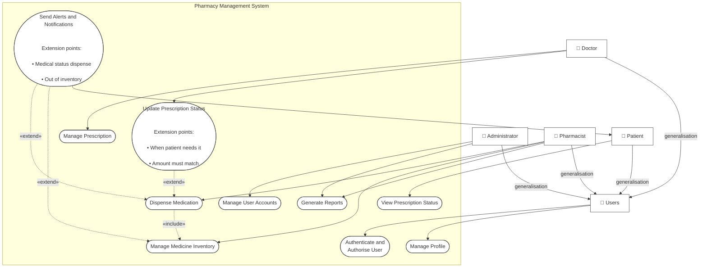

Users
├── Administrator
│   ├── Manage User Accounts
│   └── Generate Reports
│
├── Doctor
│   ├── Manage Prescription
│   └── Update Prescription Status
│
├── Pharmacist
│   ├── Dispense Medication
│   ├── Manage Medicine Inventory
│   └── Generate Reports
│
└── Patient
    └── View Prescription Status

Users
├── Authenticate and Authorise User
└── Manage Profile

Update Prescription Status
    ──«extend»──> Dispense Medication

Send Alerts and Notifications
    ├──«extend»──> Dispense Medication
    └──«extend»──> Manage Medicine Inventory

Dispense Medication
    ──«include»──> Manage Medicine Inventory