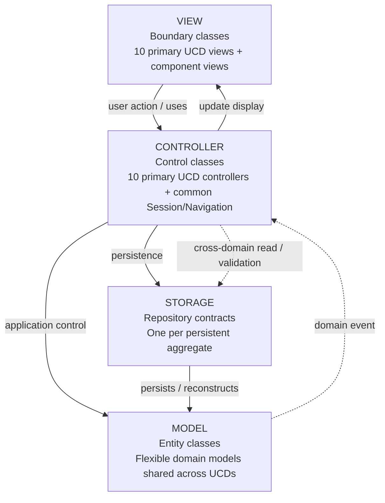
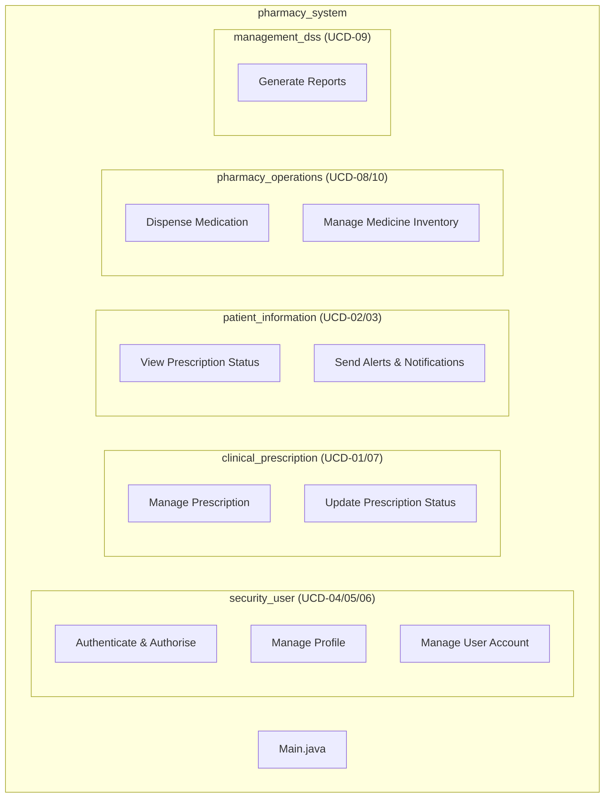
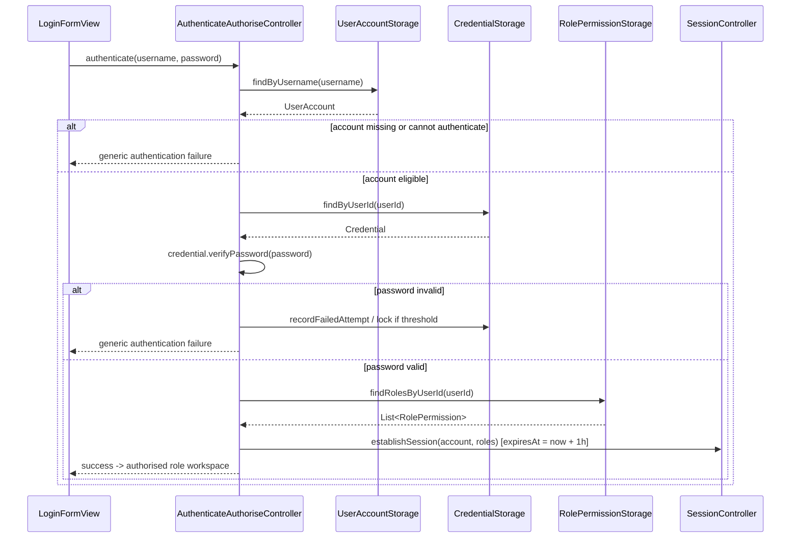
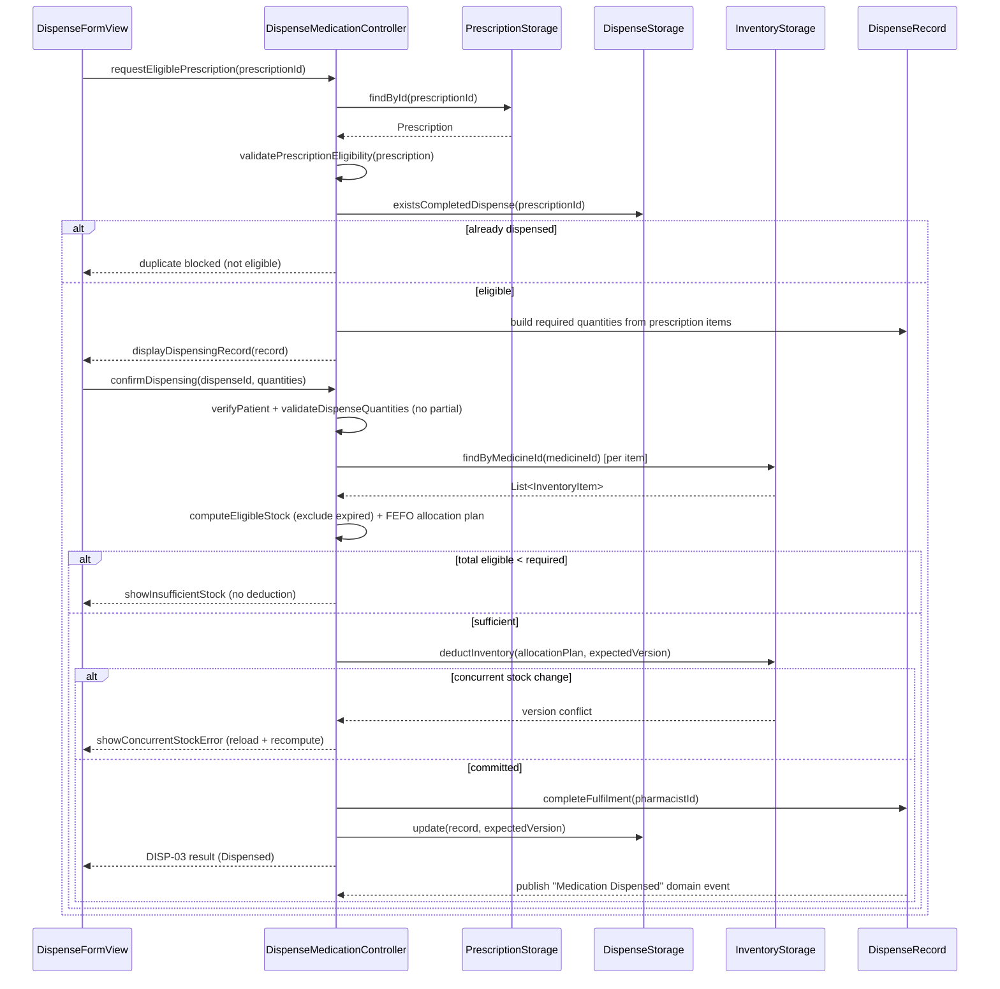
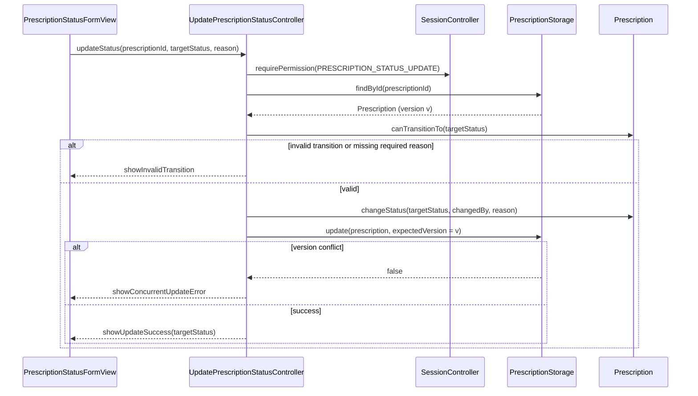

# Design Document: Pharmacy Inventory & Prescription System

## Overview

The Pharmacy Inventory & Prescription System is a single-organisation Java desktop application that digitises the core clinical and pharmacy workflows for four operational roles: Patient, Doctor, Pharmacist, and Administrator. It authenticates and authorises users, lets Doctors author and manage clinical prescriptions, lets Pharmacists dispense medication and maintain inventory, gives Patients read-only visibility of their prescription and fulfilment progress with persisted notifications, and lets Administrators manage user accounts and generate persisted operational reports.

This design consolidates and formalises the existing documentation set (see `index.md` for the source-of-truth ordering). It does not introduce persistence technology, service/repository layers, or actors beyond those already specified. The authoritative requirement baseline is `spec.md` (FR-001..FR-060, SC-001..SC-018), the functional boundaries are defined in `use case descriptions.md`, and the static/runtime designs are the per-UCD class and sequence diagrams. Where documents conflict, the ordering in `index.md` section 9 applies.

The architecture is strictly **MVC + Storage** (Model, View, Controller, Storage) with no Service/Repository/DAO layer. Models are flexible and shared across use cases; each of the ten use cases (UCD-01..UCD-10) has at least one primary View and one primary Controller; Storage classes follow persistent aggregates rather than the use-case count. Persistence technology remains deliberately deferred to planning (see `storage_notdone.md`), so Storage classes are defined as behavioural contracts only.

## Architecture

### Layering (MVC + Storage)

The system uses four architectural layers and no others. The dependency direction is fixed: View depends on Controller, Controller depends on Model and Storage, and Storage persists/reconstructs Model. This mirrors `package_diagram.md`.



Key architectural rules carried over from the existing design:

- **Asymmetric layering.** Model and Storage file counts do not need to match the UCD count. For example, UCD-01 (Manage Prescription) and UCD-07 (Update Prescription Status) share `Prescription`, `PrescriptionStatus`, and `PrescriptionStorage` instead of duplicating them.
- **Command authority lives in the domain.** Status mutation, stock deduction, and similar state changes belong to the Model entity; the Controller coordinates authorisation, cross-domain reads, and the transaction. Views never mutate Storage directly.
- **Cross-domain reads are allowed but ownership is not shared.** A Controller may read another domain's Storage for validation or display (e.g. Dispensing reads `PrescriptionStorage`; Reports read operational storages), but it must not administer another domain's data.
- **Event-driven notifications.** Relevant prescription/fulfilment state changes are represented as domain events that trigger downstream patient notification processing rather than direct module-to-module calls.

### Domain package organisation

Use cases are grouped into five functional domains (per `grouping.md`). The Java package layout below reproduces `compact structure.md` / `structure_details.md`.



Full package tree (authoritative structure from `structure_details.md`):

```text
src/main/java/pharmacy_system/
├── Main.java
├── model/
│   ├── security_user/            UserAccount, Credential, RolePermission, AccountStatus
│   │   └── profile/              UserProfile (abstract) + Doctor/Patient/Pharmacy/Admin
│   ├── clinical_prescription/    Prescription, PrescriptionItem, PrescriptionStatus
│   ├── patient_information/       PrescriptionStatusSummary, Notification
│   ├── pharmacy_operations/       DispenseRecord, Medicine, InventoryItem, StockMovement, StockMovementType
│   └── management_dss/            Report, ReportCriteria
├── view/                          one primary View per UCD + components/ subpackages
├── controller/
│   ├── common/                    NavigationController, SessionController
│   ├── security_user/             Authenticate, ManageProfile, ManageUserAccount controllers
│   ├── clinical_prescription/     ManagePrescription, UpdatePrescriptionStatus controllers
│   ├── patient_information/        ViewPrescriptionStatus, SendAlertsNotifications controllers
│   ├── pharmacy_operations/        DispenseMedication, ManageMedicineInventory controllers
│   └── management_dss/            GenerateReports controller
└── storage/                       9 aggregate storages + optional ReportStorage
```

### Authenticated shell and session

The UI uses one authenticated application shell with role-filtered navigation (per `ui_app_view_detailed.md`). `SessionController` and `NavigationController` in `controller/common/` are the cross-cutting controllers. Every protected Controller operation revalidates authorisation at the controller level rather than relying on UI hiding alone.

## Sequence Diagrams

### Authentication and session establishment (UCD-04)



### Dispensing transaction with FEFO allocation (UCD-08)



### Clinical status transition with optimistic concurrency (UCD-07)



## Components and Interfaces

Each UCD has one primary Controller whose responsibilities are summarised below. Signatures are drawn from the per-UCD class diagrams (`c.ucd01..c.ucd10`). Common controllers are shared.

### Common controllers (`controller.common`)

```java
class SessionController {
    void establishSession(UserAccount account, List<RolePermission> roles); // sets expiresAt = now + 1h
    long getCurrentUserId();
    boolean isAuthenticated();
    boolean isExpired();
    boolean hasPermission(String permissionCode);
    void requirePermission(String permissionCode); // denies if missing or session expired
    void invalidateSession();
}

class NavigationController {
    void navigateToAuthorisedHome();
    void navigateToLogin();
    void navigateToAccessDenied();
}
```

### UCD-04 — Authenticate & Authorise (`AuthenticateAuthoriseController`)

**Owns:** authentication, session establishment, identity verification, RBAC permission evaluation. **Must not own:** user creation, role assignment, profile editing.

```java
boolean authenticate(String username, char[] password);
boolean authorise(long userId, String permissionCode);
boolean requestPasswordReset(String email);
boolean resetPassword(String token, char[] newPassword); // enforces >= 8 chars
void logout();
```

### UCD-05 — Manage Profile (`ManageProfileController`)

**Owns:** self-service edits to permitted personal/profile fields and personal security preferences. **Must not own:** role assignment, account activation, account lifecycle.

```java
UserProfile loadProfile(long userId);
boolean updateProfile(long userId, Map<String,Object> changes); // rejects restricted fields
```

### UCD-06 — Manage User Account (`ManageUserAccountController`)

**Owns:** administrative account lifecycle and role administration. **Must not own:** self-service profile edits or authentication execution.

```java
List<UserAccount> loadUserAccounts();
UserAccount createUserAccount(String username, String email);
boolean approveRegistration(long userId);
boolean assignRole(long userId, long roleId);
boolean removeRole(long userId, long roleId);
boolean enableAccount(long userId);
boolean disableAccount(long userId, String reason);
boolean unlockAccount(long userId);
```

### UCD-01 — Manage Prescription (`ManagePrescriptionController`)

**Owns:** clinical prescription creation, viewing, modification, cancellation; medicine, dosage, quantity, frequency, instructions. **Must not own:** pharmacy preparation, stock deduction, fulfilment status.

```java
Prescription createPrescription(long patientId, long doctorId, List<PrescriptionItem> items);
Prescription viewPrescription(long prescriptionId);
boolean editPrescription(long prescriptionId, Map<String,Object> changes); // editable states only
boolean cancelPrescription(long prescriptionId, String reason);
```

### UCD-07 — Update Prescription Status (`UpdatePrescriptionStatusController`)

**Owns:** clinical lifecycle transitions only (DRAFT/ISSUED/ON_HOLD/CANCELLED/EXPIRED). **Must not own:** dosage editing or fulfilment states.

```java
Prescription loadPrescription(long prescriptionId);
Set<PrescriptionStatus> getAllowedTransitions(long prescriptionId);
boolean updateStatus(long prescriptionId, PrescriptionStatus target, String reason);
boolean issuePrescription(long prescriptionId);
boolean placeOnHold(long prescriptionId, String reason); // Doctor only
boolean cancelPrescription(long prescriptionId, String reason);
boolean resumePrescription(long prescriptionId);
```

### UCD-02 — View Prescription Status (`ViewPrescriptionStatusController`)

**Owns:** patient-facing read-only visibility of prescription + fulfilment progress. **Must not own:** any mutation.

```java
List<PrescriptionStatusSummary> requestPrescriptionStatus(long patientId);
PrescriptionStatusSummary viewPrescriptionDetails(long patientId, long prescriptionId); // re-verifies ownership
```

### UCD-03 — Send Alerts & Notifications (`SendAlertsNotificationsController`)

**Owns:** generation, delivery, recording of patient-facing notifications from events. **Must not own:** validity decisions, stock changes, dispensing.

```java
void publishDomainEvent(String eventType, long prescriptionId, long patientId, String recipient, boolean patientActive);
Notification processNotification(String eventType, long prescriptionId, long patientId, String recipient, boolean patientActive);
boolean markNotificationRead(long notificationId);
```

### UCD-08 — Dispense Medication (`DispenseMedicationController`)

**Owns:** pharmacist fulfilment transaction (verify, confirm, deduct, complete). **Must not own:** inventory master administration, prescription authoring, notification delivery implementation.

```java
DispenseRecord requestEligiblePrescription(long prescriptionId);
boolean verifyPrescriptionAndPatient(long prescriptionId, long patientId);
boolean checkStockAvailability(Map<Long,Integer> quantities);
boolean confirmDispensing(long dispenseId, Map<Long,Integer> quantities);
DispenseRecord completeDispensing(long dispenseId);
```

### UCD-10 — Manage Medicine Inventory (`ManageMedicineInventoryController`)

**Owns:** medicine master, stock receipt, batch/expiry, authorised adjustments, stock visibility. **Must not own:** prescription authoring, patient notifications, the full dispensing transaction.

```java
Medicine createMedicine(Map<String,Object> medicineData);
boolean updateMedicine(long medicineId, Map<String,Object> changes);
boolean receiveStock(long medicineId, String batchNumber, LocalDate expiryDate, int quantity);
boolean adjustStock(long inventoryId, int quantityDelta, String reason); // reason mandatory
List<InventoryItem> viewInventoryDetails(long medicineId);
```

### UCD-09 — Generate Reports (`GenerateReportsController`)

**Owns:** authorised read-only reporting/aggregation and persisted snapshots. **Must not own:** any operational mutation.

```java
Report generateReport(ReportCriteria criteria);
boolean persistReport(Report report);              // snapshot persisted (spec: mandatory)
byte[] exportReport(Report report, String format);  // export from saved snapshot only
```

## Data Models

Key entities from `spec.md` (Key Entities) formalised as Java models. Attributes follow the per-UCD class diagrams. All mutable aggregates carry a `version` field for optimistic concurrency.

### Security / User domain

```java
class UserAccount {                     // [UCD-04, UCD-06]
    long userId;
    String username;
    String email;
    AccountStatus status;               // PENDING, ACTIVE, DISABLED, LOCKED
    boolean registrationApproved;
    LocalDateTime createdAt, updatedAt, lastLoginAt, disabledAt;
    String disabledReason;
    long version;

    boolean isActive();
    boolean canAuthenticate();          // ACTIVE + approved + not locked
    void approveRegistration();
    void enable();
    void disable(String reason);
    void lock();
    void unlock();
    List<String> validateRequiredFields();
}

class Credential {                      // [UCD-04] — raw passwords never stored
    long credentialId, userId;
    String passwordHash;                // salted adaptive hash (algorithm deferred)
    int failedAttempts;
    LocalDateTime lockedUntil, passwordUpdatedAt, resetTokenExpiry;
    String resetTokenHash;

    boolean verifyPassword(char[] password);
    void recordFailedAttempt();
    void resetFailedAttempts();
    boolean isTemporarilyLocked();
    boolean isResetTokenValid(String token);
    void changePasswordHash(String newHash);
}

class RolePermission {                  // [UCD-04, UCD-06]
    long roleId;
    String roleName;                    // Patient, Doctor, Pharmacist, Administrator
    Set<String> permissionCodes;
    boolean active;
    boolean hasPermission(String permissionCode);
}

abstract class UserProfile {            // [UCD-05] — self-service fields only
    long profileId, userId;
    String fullName, phoneNumber, contactEmail, address;
    Map<String,String> preferences;
    long version;
    List<String> validateProfileData();
    void applyChanges(Map<String,Object> changes); // must reject restricted fields
}
// DoctorProfile, PatientProfile, PharmacyProfile, AdminProfile extend UserProfile.
// PatientProfile doubles as the Patient business record (dateOfBirth, emergencyContact)
// and may exist without a linked UserAccount (FR-010).
```

### Clinical prescription domain

```java
class Prescription {                    // [UCD-01, UCD-07] — shared aggregate
    long prescriptionId, patientId, doctorId;
    String clinicalNotes;
    PrescriptionStatus status;
    LocalDateTime issuedAt, statusChangedAt, createdAt, updatedAt;
    long statusChangedBy;
    String statusChangeReason;
    long version;
    List<PrescriptionItem> items;        // one or more (FR-016)

    boolean canTransitionTo(PrescriptionStatus target);
    void changeStatus(PrescriptionStatus target, long changedBy, String reason);
    boolean isExpired(LocalDate today);  // issuedAt + 1 month (FR-021)
    boolean isEligibleForDispensing();   // ISSUED and not expired/cancelled
    boolean isTerminalState();
}

enum PrescriptionStatus { DRAFT, ISSUED, ON_HOLD, CANCELLED, EXPIRED;
    // DRAFT -> ISSUED|CANCELLED ; ISSUED -> ON_HOLD|CANCELLED ;
    // ON_HOLD -> ISSUED|CANCELLED ; CANCELLED/EXPIRED -> terminal
    Set<PrescriptionStatus> allowedTransitions();
}

class PrescriptionItem {                 // [UCD-01]
    long prescriptionItemId, medicineId;
    String medicineName, dosage, frequency, instructions;
    int quantity;
}
```

### Patient information domain

```java
class PrescriptionStatusSummary {        // [UCD-02] — read model, no storage of its own
    long prescriptionId, patientId, doctorId;
    LocalDateTime prescribedAt, lastUpdatedAt;
    String clinicalStatus;               // distinct from fulfilment (FR-026)
    String fulfilmentStatus;
    boolean hasFulfilmentRecord;
    // built from Prescription (+ optional DispenseRecord); never mutates either source
}

class Notification {                     // [UCD-03]
    long notificationId, patientId, prescriptionId;
    String eventType, notificationType, title, message, recipient;
    String deliveryStatus;
    String deduplicationKey;             // patientId + prescriptionId + eventType
    LocalDateTime createdAt, deliveredAt, failedAt, readAt;
    String failureReason;
    void markDelivered();
    void markDeliveryFailed(String reason);
    void markRead();
}
```

### Pharmacy operations domain

```java
class DispenseRecord {                    // [UCD-08]
    long dispenseId, prescriptionId, patientId, pharmacistId;
    Map<Long,Integer> requiredQuantities;   // medicineId -> qty
    Map<Long,Integer> dispensedQuantities;
    String status;                          // PENDING/VERIFIED/DISPENSED/FAILED
    LocalDateTime verifiedAt, dispensedAt, createdAt, updatedAt;
    String failureReason;
    long version;
    boolean verifyPatient(long patientId);
    void confirmDispensing(Map<Long,Integer> quantities);
    void completeFulfilment(long pharmacistId);
    boolean isCompleted();
}

class Medicine {                          // [UCD-10] master data, no quantity
    long medicineId;
    String medicineCode, medicineName, genericName, dosageForm, strength, unit, description;
    boolean active;
    long version;
}

class InventoryItem {                     // [UCD-08, UCD-10] one batch position
    long inventoryId, medicineId;
    String batchNumber;
    LocalDate expiryDate;
    int quantityOnHand, reorderLevel;
    long version;
    int getAvailableQuantity();           // 0 if expired, else quantityOnHand
    boolean isExpired();                  // expiryDate < today
    boolean isLowStock();
    boolean canDeduct(int quantity);      // quantityOnHand - quantity >= 0
    void deduct(int quantity);
}

class StockMovement {                     // [UCD-08, UCD-10] audit trail
    long movementId, inventoryId, medicineId, performedBy;
    StockMovementType movementType;       // RECEIVE, ADJUSTMENT, DISPENSE
    int quantityDelta, balanceAfter;
    String reason;                        // mandatory for ADJUSTMENT (FR-047)
    LocalDateTime createdAt;
}
```

### Management / DSS domain

```java
class ReportCriteria {                    // [UCD-09] transient, no storage
    String reportType;                    // Prescription|Dispensing|Inventory|UserAccess
    LocalDate startDate, endDate;
    Map<String,String> filters;
    boolean hasValidDateRange();
    List<String> validateCriteria();
}

class Report {                            // [UCD-09] persisted snapshot
    long reportId;
    String reportType, title;
    ReportCriteria criteria;
    long generatedBy;
    LocalDateTime generatedAt;
    int rowCount;
    List<Map<String,Object>> data;        // stored as minified JSON snapshot
    boolean isEmpty();
    byte[] generateExport(String format); // PDF from saved snapshot only
}
```

### Validation rules (selected)

| Model | Rule | Requirement |
| --- | --- | --- |
| Credential | password length ≥ 8 characters | FR-005, SC-015 |
| UserAccount | one operational role per account; DISABLED cannot authenticate | FR-002, FR-007 |
| UserProfile | self-service edits cannot change role/status/privileged/system id | FR-009 |
| Prescription | 1..* items; Draft hidden from patients; Expired after 1 month | FR-016, FR-019, FR-021 |
| InventoryItem | no negative balance; expired excluded from dispensable | FR-046, FR-048 |
| StockMovement | ADJUSTMENT requires a reason | FR-047 |
| Report | snapshot preserved as generated; export from snapshot | FR-052, FR-054 |

## Key Algorithms with Formal Specifications

These are the behaviourally critical algorithms. Each carries preconditions, postconditions, and loop invariants where relevant. They implement the rules in `spec.md` and the exceptional flows in `use case descriptions.md`.

### Algorithm 1: FEFO (First-Expiry-First-Out) stock allocation for dispensing

Implements FR-037 (no partial dispense), FR-038 (full quantity across eligible batches), FR-039 (evaluate before deducting), FR-040 (earliest-expiring first), FR-046 (exclude expired). SC-007/SC-008/SC-010.

```java
// Returns an allocation plan (inventoryId -> qty) or empty Optional if total eligible < required.
// No stock is mutated by this method; deduction happens only after the full plan succeeds.
Optional<Map<Long,Integer>> planFefoAllocation(List<InventoryItem> batches, int requiredQty, LocalDate today) {
    // Precondition: requiredQty > 0; batches all belong to the same medicine.
    List<InventoryItem> eligible = batches.stream()
        .filter(b -> !b.isExpired())                 // exclude expired (FR-046)
        .filter(b -> b.getAvailableQuantity() > 0)
        .sorted(Comparator.comparing(InventoryItem::getExpiryDate)) // earliest expiry first (FR-040)
        .toList();

    int totalEligible = eligible.stream().mapToInt(InventoryItem::getAvailableQuantity).sum();
    if (totalEligible < requiredQty) return Optional.empty();  // block, no deduction (FR-038, FR-039)

    Map<Long,Integer> plan = new LinkedHashMap<>();
    int remaining = requiredQty;
    for (InventoryItem batch : eligible) {
        // Loop invariant: remaining == requiredQty - (sum of quantities already placed in plan)
        //                 and every batch already visited is expiry <= current batch.
        if (remaining == 0) break;
        int take = Math.min(remaining, batch.getAvailableQuantity());
        plan.put(batch.getInventoryId(), take);
        remaining -= take;
    }
    // Postcondition: remaining == 0 and sum(plan.values()) == requiredQty.
    return Optional.of(plan);
}
```

Preconditions: `requiredQty > 0`; all batches share one `medicineId`.
Postconditions: returns a plan whose quantities sum exactly to `requiredQty` allocated from earliest-expiring eligible batches, or empty when eligible stock is insufficient; input `batches` are not mutated.
Loop invariant: `remaining` equals the unallocated quantity, and batches are consumed in non-decreasing expiry order.

### Algorithm 2: Dispensing transaction orchestration (UCD-08)

```java
DispenseRecord completeDispensing(long dispenseId) {
    session.requirePermission("DISPENSE_MEDICATION");
    DispenseRecord record = dispenseStorage.findById(dispenseId);
    Prescription rx = prescriptionStorage.findById(record.getPrescriptionId()); // cross-domain read

    // Guard 1: eligibility (issued, not expired, not cancelled) — FR-035, FR-022
    if (!rx.isEligibleForDispensing()) return fail(record, "Prescription not eligible");
    // Guard 2: duplicate fulfilment — FR-042, SC-009
    if (dispenseStorage.existsCompletedDispense(rx.getPrescriptionId())) return fail(record, "Already dispensed");
    // Guard 3: patient verification — FR-036
    if (!record.verifyPatient(rx.getPatientId())) return fail(record, "Patient verification mismatch");

    // Plan all items BEFORE any deduction — FR-039
    Map<Long,Map<Long,Integer>> allocationByMedicine = new HashMap<>();
    for (var entry : record.getRequiredQuantities().entrySet()) {
        var plan = planFefoAllocation(inventoryStorage.findByMedicineId(entry.getKey()), entry.getValue(), today());
        if (plan.isEmpty()) return fail(record, "Insufficient stock"); // no deduction happened
        allocationByMedicine.put(entry.getKey(), plan.get());
    }

    // Deduct with optimistic concurrency; recompute on version conflict — FR-041, FR-043
    boolean deducted = inventoryStorage.deductInventory(flatten(allocationByMedicine)); // per-item expectedVersion
    if (!deducted) return fail(record, "Concurrent stock change - reload and retry");

    record.completeFulfilment(session.getCurrentUserId());
    dispenseStorage.update(record, record.getVersion());
    notifications.publishDomainEvent("MEDICATION_DISPENSED", rx.getPrescriptionId(), rx.getPatientId(), ...);
    return record;
}
```

Postconditions: on success exactly one completed `DispenseRecord` exists for the prescription and inventory is reduced by the required quantity once; on any guard failure or insufficient stock, no inventory is deducted.

### Algorithm 3: Prescription expiry evaluation

Implements FR-021, FR-022, SC-006. Expiry is derived, not stored, so it stays correct without a scheduled job.

```java
boolean isExpired(LocalDate today) {
    // Precondition: issuedAt is set once the prescription is ISSUED.
    if (status == PrescriptionStatus.DRAFT || issuedAt == null) return false;
    if (status == PrescriptionStatus.CANCELLED) return false; // cancelled is terminal, not "expired"
    return today.isAfter(issuedAt.toLocalDate().plusMonths(1));
}
// Effective display status: an ISSUED/ON_HOLD prescription past one month is presented as EXPIRED
// and is ineligible for dispensing.
```

### Algorithm 4: Session expiry check (one hour)

Implements FR-006, SC-016.

```java
void requirePermission(String permissionCode) {
    // Precondition: a session may or may not exist.
    if (!authenticated || isExpired()) { navigation.navigateToLogin(); deny("Session expired"); return; }
    if (!permissionCodes.contains(permissionCode)) { navigation.navigateToAccessDenied(); deny("Insufficient permission"); }
}
boolean isExpired() { return LocalDateTime.now().isAfter(expiresAt); } // expiresAt = loginTime + 1 hour
```

### Algorithm 5: Manual stock adjustment with negative-balance prevention

Implements FR-047 (reason required), FR-048 (no negative balance), SC-011.

```java
boolean adjustStock(long inventoryId, int quantityDelta, String reason) {
    session.requirePermission("MANAGE_INVENTORY");
    if (reason == null || reason.isBlank()) return false;               // FR-047
    InventoryItem item = inventoryStorage.findById(inventoryId);
    if (item.getQuantityOnHand() + quantityDelta < 0) return false;     // FR-048 (reject before commit)
    item.adjust(quantityDelta);
    StockMovement movement = StockMovement.of(ADJUSTMENT, item, quantityDelta, reason, session.getCurrentUserId());
    return inventoryStorage.adjustStock(item, movement, item.getVersion()); // item + movement persisted together
}
```

### Algorithm 6: Notification de-duplication (UCD-03)

Implements FR-033 (no duplicate successful notification), FR-034 (failure does not reverse the transaction), SC-012.

```java
Notification processNotification(String eventType, long prescriptionId, long patientId, String recipient, boolean patientActive) {
    if (!isEligibleEvent(eventType)) return null;                       // FR-031 supported events only
    Notification n = createNotification(eventType, prescriptionId, patientId, recipient);
    String key = n.generateDeduplicationKey();                          // patientId+prescriptionId+eventType
    if (notificationStorage.existsByDeduplicationKey(key)) return existing(key); // FR-033
    if (!n.validateRecipient(patientActive)) { n.markNotDeliverable("Inactive/invalid recipient"); }
    else if (send(n)) n.markDelivered(); else n.markDeliveryFailed("Delivery failed"); // FR-034: still persisted
    notificationStorage.save(n);
    return n;
}
```

### Algorithm 7: Report generation and snapshot persistence (UCD-09)

Implements FR-050/FR-051/FR-052/FR-054, SC-013/SC-014. The snapshot is stored as minified JSON (per the Implementation Constraints Handoff in `spec.md`); export reconstructs from the snapshot, never from live data.

```java
Report generateReport(ReportCriteria criteria) {
    session.requirePermission("GENERATE_REPORTS");
    List<String> errors = criteria.validateCriteria();
    if (!errors.isEmpty()) throw new ValidationException(errors);
    // Cross-domain READ ONLY — never mutate operational records (FR-050)
    List<Map<String,Object>> rows = switch (criteria.getReportType()) {
        case "Prescription" -> prescriptionStorage.queryForReport(criteria.getStartDate(), criteria.getEndDate(), criteria.getFilters());
        case "Dispensing"   -> dispenseStorage.queryForReport(...);
        case "Inventory"    -> inventoryStorage.queryForReport(criteria.getFilters());
        case "UserAccess"   -> userAccountStorage.queryForReport(...);
        default -> throw new ValidationException("Unknown report type");
    };
    Report report = Report.of(criteria, session.getCurrentUserId(), rows); // rowCount = rows.size(); may be empty (SC-005-like)
    reportStorage.save(report);   // snapshot persisted as minified JSON (FR-051, FR-052)
    return report;
}
byte[] exportReport(Report report, String format) {
    // Reconstructs from the persisted snapshot, ignoring any later live-data changes (FR-054, SC-014).
    return report.generateExport(format);
}
```

## Example Usage

```java
// 1. Authenticate; role-filtered workspace is presented on success.
boolean ok = authController.authenticate("dr.smith", password);

// 2. Doctor creates a prescription with multiple items (Patient record may pre-exist without login).
List<PrescriptionItem> items = List.of(
    new PrescriptionItem(medicineId, "500mg", 20, "Twice daily", "After meals"),
    new PrescriptionItem(medicineId2, "250mg", 10, "Once daily", "Morning"));
Prescription rx = managePrescriptionController.createPrescription(patientId, doctorId, items);
updateStatusController.issuePrescription(rx.getPrescriptionId()); // DRAFT -> ISSUED

// 3. Pharmacist dispenses — FEFO allocation, full quantity only, single deduction.
DispenseRecord dr = dispenseController.requestEligiblePrescription(rx.getPrescriptionId());
dispenseController.confirmDispensing(dr.getDispenseId(), dr.getRequiredQuantities());
DispenseRecord result = dispenseController.completeDispensing(dr.getDispenseId());

// 4. Patient views read-only status; a "Medication Dispensed" notification is recorded.
List<PrescriptionStatusSummary> mine = viewStatusController.requestPrescriptionStatus(patientId);

// 5. Administrator generates and later exports a persisted report snapshot.
Report report = reportsController.generateReport(new ReportCriteria("Dispensing", from, to, filters));
byte[] pdf = reportsController.exportReport(report, "PDF"); // from saved snapshot
```

## Correctness Properties

These are universally-quantified properties intended for property-based testing. Each maps to functional requirements and success criteria.

### Property 1: No over-dispensing (FR-038, SC-007)
For all prescriptions and inventory states, if total eligible non-expired stock for any item is less than its required quantity, `completeDispensing` returns a failure and leaves every `InventoryItem.quantityOnHand` unchanged.
`∀ rx, inv. insufficientEligible(rx, inv) ⟹ dispense(rx) = FAILED ∧ inv' = inv`
**Validates: Requirements 8.2**

### Property 2: FEFO ordering (FR-040, SC-008)
For all successful allocations, if batch `a` contributes before batch `b`, then `a.expiryDate ≤ b.expiryDate`, and no expired batch contributes.
`∀ plan. allocatedBefore(a,b) ⟹ a.expiry ≤ b.expiry ∧ (∀ x ∈ plan. ¬x.isExpired)`
**Validates: Requirements 8.3**

### Property 3: Allocation conservation
For all successful FEFO plans, the sum of allocated quantities equals the required quantity exactly (no partial, no surplus — FR-037).
`∀ plan. Σ plan.values = requiredQty`
**Validates: Requirements 8.1**

### Property 4: Idempotent fulfilment (FR-042, SC-009)
For all prescriptions, at most one completed `DispenseRecord` exists, and total inventory deducted for a fulfilment is exactly the required quantity regardless of repeated `completeDispensing` calls.
**Validates: Requirements 8.4**

### Property 5: Non-negative stock (FR-048, SC-011)
For all adjustment sequences, `quantityOnHand ≥ 0` always holds; any adjustment that would violate this is rejected before commit.
**Validates: Requirements 9.5**

### Property 6: Adjustment reason required (FR-047, SC-011)
For all manual adjustments, a committed `StockMovement` of type ADJUSTMENT has a non-blank reason.
**Validates: Requirements 9.3**

### Property 7: Expiry monotonicity (FR-021, SC-006)
For all prescriptions, `isExpired(today)` is false before `issuedAt + 1 month` and true after, and expired prescriptions are never eligible for dispensing.
**Validates: Requirements 4.5**

### Property 8: Session expiry (FR-006, SC-016)
For all protected operations, if `now > loginTime + 1h`, the operation is denied and re-authentication is required.
**Validates: Requirements 1.4**

### Property 9: Password policy (FR-005, SC-015)
For all password create/change attempts, a password shorter than 8 characters is rejected.
**Validates: Requirements 1.5**

### Property 10: Draft invisibility (FR-019, SC-005)
For all patient status queries, the returned set contains no DRAFT prescriptions.
**Validates: Requirements 6.3**

### Property 11: Patient isolation (FR-027)
For all patients `p` and prescriptions `r`, if `r.patientId ≠ p`, then `viewPrescriptionDetails(p, r)` denies access.
**Validates: Requirements 6.5**

### Property 12: Self-service field protection (FR-009)
For all profile updates, role, account status, privileged permissions, and system identifiers remain unchanged.
**Validates: Requirements 2.4**

### Property 13: Notification de-duplication (FR-033, SC-012)
For all repeated equivalent events, at most one successfully delivered notification exists per `(patientId, prescriptionId, eventType)`.
**Validates: Requirements 7.3**

### Property 14: Transaction independence of notification (FR-034)
For all dispensing/prescription transactions, a notification delivery failure does not roll back the underlying committed transaction.
**Validates: Requirements 7.4**

### Property 15: Report snapshot immutability (FR-052, FR-054, SC-014)
For all saved reports, exporting after live operational data changes produces content identical to the snapshot captured at generation time.
**Validates: Requirements 10.4**

### Property 16: Valid transitions only (FR-023)
For all status transitions, the result state is in `currentStatus.allowedTransitions()`; otherwise the transition is rejected.
**Validates: Requirements 5.1**

## Error Handling

Error handling follows the exceptional flows in `use case descriptions.md` and the global state matrix in `ui_app_view_detailed.md` section 14.

| Scenario | Condition | Controller response | UI surface |
| --- | --- | --- | --- |
| Invalid credentials | password mismatch / account missing | generic failure; increment failed attempts; lock at threshold | AUTH-01 inline generic alert |
| Session expired | `now > loginTime + 1h` on protected op | block op; route to login; preserve safe form data | Session-expired state |
| Insufficient permission | permission code absent | deny; navigate to Access Denied | AUTH-04 |
| Prescription not found / stale | missing id or version conflict | not-found or concurrent-update error; offer reload | RX-02 / PST-02 alert |
| Invalid status transition | target ∉ allowed set | reject; keep current state | PST-02 inline error |
| Insufficient stock | eligible < required | block; no deduction | DISP-02 Insufficient Stock alert |
| Concurrent stock change | version conflict at deduct | recompute FEFO; require re-confirm | DISP-02 reload + recompute |
| Duplicate dispense | completed record exists | reject transaction | DISP-01/02 blocked |
| Negative stock adjustment | balance would go < 0 | reject before commit | INV-04 inline block |
| Missing adjustment reason | blank reason on ADJUSTMENT | reject | INV-04 validation |
| Notification delivery failure | send fails | record failure; do not reverse transaction | NOT centre failure state |
| Report no data | empty result set | return empty snapshot; preserve criteria | REP-03 empty result |
| Export failure | export generation fails | keep snapshot intact; offer retry | REP-03 retry |
| Persistence failure | storage error | preserve entered values; never imply success | operation-specific retry |

## Testing Strategy

### Unit testing

Focus on domain-model behaviour where the business rules live: `Prescription` transition/expiry logic, `InventoryItem` deduction/expiry, `Credential` verification and lockout, `DispenseRecord` state machine, `Notification` state and dedup key, and each Controller's guard checks. Cover every exceptional flow listed in `use case descriptions.md`.

### Property-based testing

Encode the Correctness Properties above as generative tests.

**Property Test Library:** jqwik (Java). Alternatives: junit-quickcheck.

Priority property tests: FEFO ordering and conservation (properties 1–4), non-negative stock (5), expiry monotonicity (7), draft invisibility (10), patient isolation (11), and report snapshot immutability (15). Generators should produce randomised batch sets (varied expiry dates and quantities, including expired batches), prescription item sets, and concurrent-version scenarios.

### Integration testing

Verify controller-to-storage flows against the sequence diagrams: full dispensing transaction (verify → check → deduct → complete → event), status transition with optimistic concurrency, and report generation reading multiple operational storages read-only. Use in-memory storage implementations so tests remain independent of the deferred persistence technology.

## Security Considerations

- **Authentication and RBAC.** All protected operations revalidate permission and session validity at the Controller layer; UI filtering is not an access control (FR-003, FR-004). This is a desktop application with local session state, so there is no network-exposed endpoint in the current scope.
- **Credential storage.** Raw passwords are never persisted; `Credential.passwordHash` holds a salted adaptive hash. The exact hashing algorithm is a deferred planning decision (`storage_notdone.md`) but must be an adaptive KDF.
- **Least privilege.** One operational role per account (FR-002); role administration (UCD-06) is separated from authentication (UCD-04) and from self-service profile editing (UCD-05).
- **Patient data isolation.** Ownership is re-verified on every patient status detail request to prevent identifier tampering (FR-027).
- **Auditability.** `StockMovement` provides an inventory audit trail; prescription status changes record `changedBy`/`reason`; reports are immutable snapshots.

## Performance Considerations

Scope is a single-organisation desktop application, so throughput requirements are modest. The main considerations are: FEFO allocation is O(n log n) in batch count per item (dominated by the expiry sort); optimistic concurrency (version fields) avoids lock contention on prescriptions, inventory, and accounts; report snapshots are stored as compact minified JSON to keep persisted size small and export deterministic.

## Dependencies

- **Java** standard library (`java.time` for dates/expiry/session, collections). Java desktop UI toolkit for the View layer (specific toolkit deferred to planning).
- **Persistence technology:** deliberately undefined (`storage_notdone.md`) — database, file, or in-memory are all valid implementations behind the Storage contracts.
- **JSON serialization:** for report snapshots (minified). Library deferred to planning.
- **PDF generation:** for report export from snapshot. Library deferred to planning.
- **Testing:** JUnit 5 plus a property-based library (jqwik) for the correctness properties.

## Traceability

Every UCD traces to at least one user story and testable requirement (SC-018). Summary:

| UCD | Domain | User Story | Key FRs |
| --- | --- | --- | --- |
| UCD-04 Authenticate & Authorise | security_user | US1 | FR-003..FR-006 |
| UCD-06 Manage User Account | security_user | US2 | FR-007, FR-013 |
| UCD-05 Manage Profile | security_user | US2 | FR-008, FR-009 |
| UCD-01 Manage Prescription | clinical_prescription | US3, US4 | FR-010..FR-021 |
| UCD-07 Update Prescription Status | clinical_prescription | US5 | FR-022..FR-026 |
| UCD-02 View Prescription Status | patient_information | US6 | FR-027..FR-029 |
| UCD-03 Send Alerts & Notifications | patient_information | US7 | FR-030..FR-034 |
| UCD-08 Dispense Medication | pharmacy_operations | US8 | FR-035..FR-043 |
| UCD-10 Manage Medicine Inventory | pharmacy_operations | US9 | FR-044..FR-048 |
| UCD-09 Generate Reports | management_dss | US10 | FR-049..FR-054 |

Cross-cutting requirements FR-055..FR-060 (search/retrieval, duplicate/consistency protection, record preservation, consistent terminology, clear editable/read-only/status/success/failure presentation) apply across all UCDs and are realised through the common controllers and the UI global behaviour matrix.
