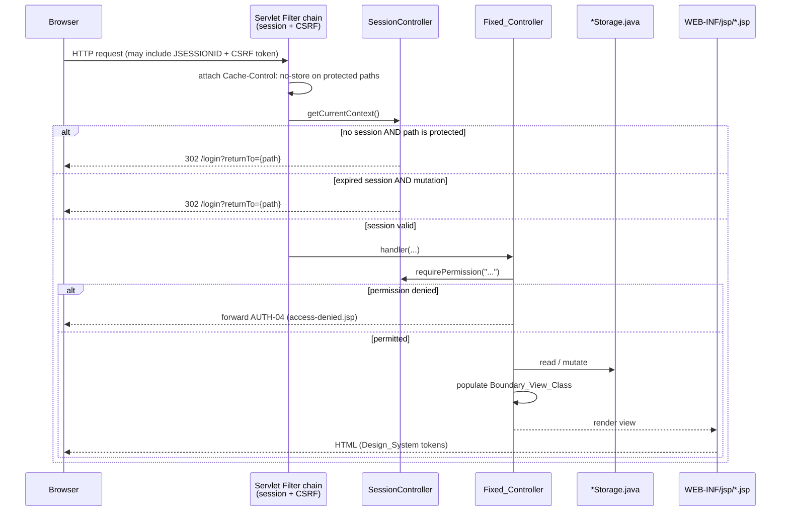
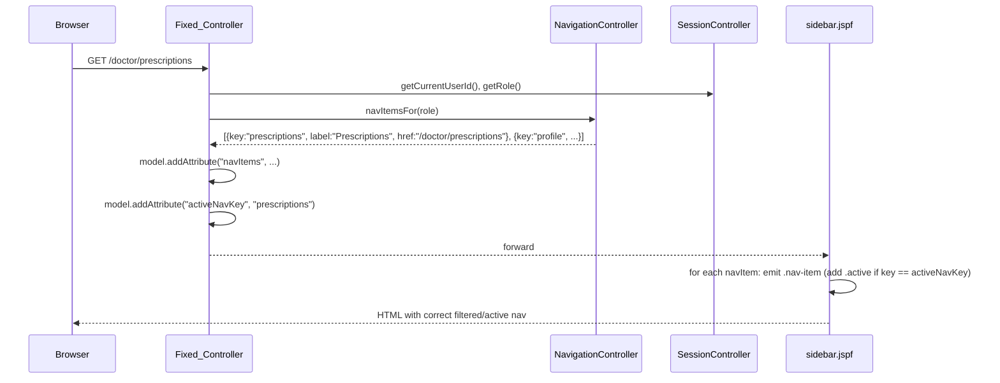
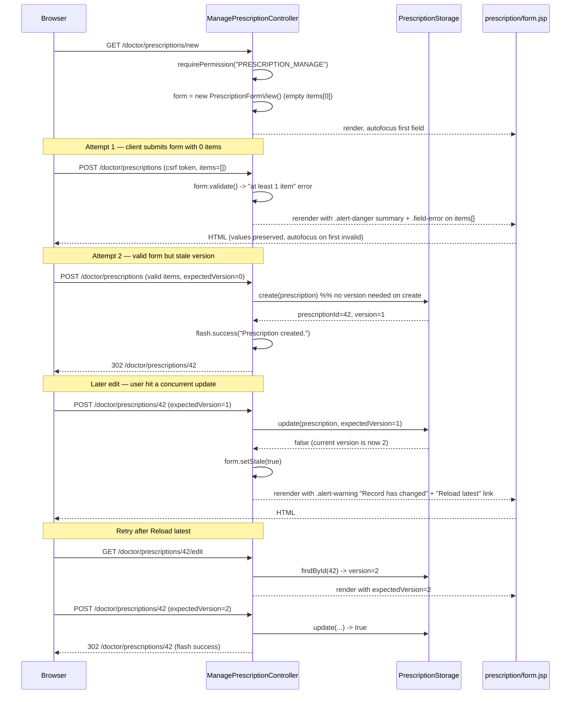

# Design Document: Pharmacy UI Implementation

## Overview

The Pharmacy UI Implementation feature delivers the complete server-rendered desktop user interface for the Pharmacy Inventory & Prescription System. It is a presentation-layer feature only: every domain rule (FEFO allocation, one-month prescription expiry, one-hour session expiry, mandatory adjustment reasons, persisted report snapshots) is already owned by the backend spec at `.kiro/specs/pharmacy-inventory-prescription-system/design.md`. This spec constrains only how those rules appear and are interacted with in JSP.

Two documents are authoritative for this design:

1. `.docs/Pharmacy_SpringBoot_Java_JSP_High_Fidelity_Implementation_Plan_FIXED_STRUCTURE.md` — the fixed Java package structure, the 32 UI surfaces, the per-surface controller/view/route mapping (Section 21), and the forbidden-layer rule.
2. `.docs/pharmacare.css` — the design tokens (`--pc-*` custom properties) and Component_Classes (`.btn`, `.data-table`, `.status`, `.alert`, `.field`, `.sticky-actions`, `.app-shell`, `.sidebar`, `.topbar`, etc.).

The design must not contradict either source and must not introduce any Java package named `service`, `dto`, `repository`, `mapper`, `config`, `facade`, or `usecase`. It reuses the existing Fixed_Controllers, Boundary_View_Classes, and `*Storage.java` classes as the entire non-view Java surface for the UI feature.

The 17 EARS requirements in `requirements.md` cover: application shell + role-filtered navigation (R1), design system compliance (R2), authentication (R3), self-service profile (R4), account administration (R5), prescription management (R6), clinical status transitions (R7), patient tracking (R8), notifications (R9), dispensing (R10), inventory (R11), reports (R12), form validation/PRG/concurrency (R13), loading/empty/not-found/session states (R14), accessibility (R15), responsive desktop behaviour (R16), and controller/route integration (R17).

## Architecture

### Layering

The UI feature sits entirely on top of the existing MVC + Storage backend. It adds JSP views, JSP fragments, one CSS asset, and a small progressive-enhancement JavaScript layer. No new Java layer is introduced.

```mermaid
graph TD
    B["Browser<br/>HTML + progressive JS"]
    JSP["JSP Views<br/>WEB-INF/jsp/**"]
    F["JSP Fragments<br/>fragments/*.jspf"]
    C["Fixed Controllers<br/>controller.security_user, .clinical_prescription,<br/>.patient_information, .pharmacy_operations,<br/>.management_dss, .common"]
    V["Boundary View Classes<br/>view.**"]
    M["Models<br/>model.**"]
    S["Storage Classes<br/>storage.**"]
    CSS["static/css/pharmacare.css"]
    JS["static/js/**.js"]

    B -->|GET / POST + CSRF| C
    C -->|@ModelAttribute| V
    C -->|read / write| S
    S -->|reconstruct / persist| M
    C -->|view name| JSP
    JSP -->|render fields from| V
    JSP -->|include| F
    B -.->|link tag| CSS
    B -.->|defer script| JS
```

Rules inherited from the FIXED_STRUCTURE plan:

- Every HTTP handler lives on one of the existing `@Controller` classes in `controller.security_user`, `controller.clinical_prescription`, `controller.patient_information`, `controller.pharmacy_operations`, `controller.management_dss`, or `controller.common`. No new Spring `@Controller` class is created.
- Every form GET populates a Boundary_View_Class via `@ModelAttribute`. Every form POST binds to the same class. No parallel DTO/Request/ViewModel class is introduced.
- Every mutation routes through the corresponding `*Storage.java` method (for example `PrescriptionStorage.update(prescription, expectedVersion)`).
- JSPs contain no scriptlets and no domain-rule logic. Every derived value (Expired evaluation, FEFO allocation preview, permitted transitions, dispensable stock) is computed by the controller and passed in the model.

### Request lifecycle

Every authenticated request follows the same lifecycle. The lifecycle is what makes Requirement 1 (App Shell), Requirement 14 (session/permission states), Requirement 17 (controller integration) and Property 12 (session expiry with `returnTo`) hold.



Key decisions:

- `SessionController.requirePermission(...)` is the single access-control call in every mutation handler. Hiding UI controls is never the sole enforcement (Requirement 17.8, Property 2).
- Session expiry (age > 1 h) is handled before permission evaluation, so an expired session always sees Login, not AUTH-04 (Requirement 14.5, Property 12).
- The `Cache-Control: no-store` header is set on every protected response so the browser back button cannot resurrect protected content after logout (Requirement 1.7).
- The redirect for an expired session preserves the intended path via `?returnTo={urlEncode(path)}` so the user resumes safely after re-authentication (Property 12).

### Package boundaries

The feature is realised inside the fixed Java tree plus web-resource directories. No new Java packages are created.

```text
src/main/java/pharmacy_system/
├── controller/
│   ├── common/                     (SessionController, NavigationController)
│   ├── security_user/              (AuthenticateAuthoriseController, ManageProfileController,
│   │                                ManageUserAccountController)
│   ├── clinical_prescription/      (ManagePrescriptionController,
│   │                                UpdatePrescriptionStatusController)
│   ├── patient_information/        (ViewPrescriptionStatusController,
│   │                                SendAlertsNotificationsController)
│   ├── pharmacy_operations/        (DispenseMedicationController,
│   │                                ManageMedicineInventoryController)
│   └── management_dss/             (GenerateReportsController)
├── view/                           (existing Boundary_View_Classes only)
└── model/, storage/                (unchanged by this feature)

src/main/webapp/WEB-INF/jsp/
├── fragments/
│   ├── head.jspf
│   ├── shell.jspf
│   ├── sidebar.jspf
│   ├── topbar.jspf
│   ├── flash.jspf
│   ├── csrf.jspf
│   ├── pagination.jspf
│   └── status-badge.jspf
├── auth/
├── profile/
├── admin/users/
├── prescription/
├── prescription-status/
├── patient/
├── notifications/
├── dispensing/
├── inventory/
└── reports/

src/main/resources/
├── application.properties           (spring.mvc.view.prefix=/WEB-INF/jsp/, suffix=.jsp)
└── static/
    ├── css/
    │   └── pharmacare.css           (copy of .docs/pharmacare.css, byte-for-byte)
    └── js/
        ├── app-shell.js             (logout POST helper)
        ├── password-visibility.js
        ├── form-submit-lock.js
        ├── projected-balance.js
        ├── filter-clear.js
        └── focus-first-invalid.js
```

The forbidden-layer rule from the FIXED_STRUCTURE plan is preserved: no `service`, `dto`, `repository`, `mapper`, `config`, `facade`, or `usecase` package appears. View resolution is configured in `application.properties`, not in a Java `config` package.

## Components and Interfaces

### JSP fragment library

Fragments live in `src/main/webapp/WEB-INF/jsp/fragments/`. Every primary JSP includes them, so a Design_System change or shell change touches exactly one file. Fragments are strictly presentation; they never call storage or evaluate domain rules.

| Fragment | Role | Consumers |
| --- | --- | --- |
| `head.jspf` | `<head>` block; imports `/static/css/pharmacare.css` exactly once; sets `<meta charset>`, viewport, and page title from `${title}`; declares `<script defer>` tags for enhancement modules. | Every primary JSP. Requirement 2.1. |
| `shell.jspf` | Renders the `.app-shell` container, includes `sidebar.jspf` and `topbar.jspf`, opens `<main class="main-panel">`, and closes it at the end. | Every authenticated JSP. Requirement 1.1. |
| `sidebar.jspf` | Renders `<nav class="nav">` with `.nav-item` links, filtered by `${session.role}` (see Role-Filtered Navigation Model below). Applies `.nav-item.active` to the item whose route matches `${activeNavKey}`. | Every authenticated JSP. Requirement 1.2, 1.3. |
| `topbar.jspf` | Renders `.topbar` with breadcrumb (`${breadcrumb}`), current-user label, `.role-badge`, logout POST form. | Every authenticated JSP. Requirement 1.4. |
| `flash.jspf` | Renders `.alert-success` / `.alert-warning` / `.alert-danger` from `flash.type` and `flash.message` (populated by `RedirectAttributes`). Absent when there is no flash. | Every JSP that follows a PRG mutation. Requirement 13.5. |
| `csrf.jspf` | Emits `<input type="hidden" name="${_csrf.parameterName}" value="${_csrf.token}"/>` for use inside every POST form. | Every POST form. Requirement 13.1, Property 13. |
| `pagination.jspf` | Optional; renders numeric pagination controls when `${page.totalPages > 1}`. Not required by any current EARS clause but reused across list surfaces. | IAM-01, RX-01, INV-01, REP-01 when needed. |
| `status-badge.jspf` | Given `${statusKind}` (`clinical`, `fulfilment`, `inventory`, `account`) and `${statusValue}`, emits `<span class="status status-...">Text</span>`. Enforces the enum → variant mapping (see Status Badge Contract). | All list and detail JSPs. Requirement 2.4, 15.3, Property 15. |

### Primary JSP catalogue (32 surfaces)

Every surface is served by the Fixed_Controller and Boundary_View_Class named in Section 21 of the FIXED_STRUCTURE plan. The table below records the JSP path, the controller/route, the Boundary_View_Class that backs the model, the special components used, and the requirements each JSP satisfies.

**Authentication (UCD-04, no App Shell):**

| Surface | JSP path | Controller · Route | Boundary View | Special components | Requirements |
| --- | --- | --- | --- | --- | --- |
| AUTH-01 Login | `auth/login.jsp` | `AuthenticateAuthoriseController` · `GET /login · POST /login` | `LoginFormView` | Centred auth card (no `.app-shell`); `.alert-danger` for generic invalid credentials; show/hide password toggle (progressive) | 3.1–3.4, 13.1, 13.6, 15.5 |
| AUTH-02 Password Recovery | `auth/password-recovery.jsp` | `AuthenticateAuthoriseController` · `GET /password/recovery · POST /password/recovery` | `LoginFormView` (reused) | Non-enumerating `.alert` on submit | 3.5 |
| AUTH-03 Reset Password | `auth/reset-password.jsp` | `AuthenticateAuthoriseController` · `GET /password/reset · POST /password/reset` | Request params + optional view helper under `view.security_user.ucd04_authenticate_authorise.components` | Two password fields, `.field-error` on length/mismatch | 3.6, 3.7, 15.4 |
| AUTH-04 Access Denied | `auth/access-denied.jsp` | `AuthenticateAuthoriseController / NavigationController` · `GET /access-denied` (also served as forward target from any Fixed_Controller) | `AccessDeniedView` | Centred status panel; "Back" + "Home" links only, no editable controls | 1.6, 3.8, 5.8, 6.8, 7.5, 8.4, 9.5, 12.7 |

**Self-service profile (UCD-05):**

| Surface | JSP path | Controller · Route | Boundary View | Special components | Requirements |
| --- | --- | --- | --- | --- | --- |
| PROF-01 My Profile | `profile/detail.jsp` | `ManageProfileController` · `GET /profile` | `ProfileDetailsView` | Read-only role/account fields; three action links | 4.1, 4.2 |
| PROF-02 Edit Profile | `profile/edit.jsp` | `ManageProfileController` · `GET /profile/edit · POST /profile` | `ProfileFormView` | `.form-grid`, `.sticky-actions`, PRG on success | 4.3, 4.4, 4.5, 13.1–13.6 |
| PROF-03 Change Password | `profile/change-password.jsp` | `AuthenticateAuthoriseController` · `GET /profile/password · POST /profile/password` | Request params or view helper under UCD-05 components | Three password fields with show/hide | 4.6, 4.7, 15.4 |
| PROF-04 Notification Preferences | `profile/preferences.jsp` | `ManageProfileController` · `GET /profile/preferences · POST /profile/preferences` | `ProfileFormView` | `.sticky-actions` with Save/Reset | 4.8 |

**Account administration (UCD-06, Administrator-only):**

| Surface | JSP path | Controller · Route | Boundary View | Special components | Requirements |
| --- | --- | --- | --- | --- | --- |
| IAM-01 User Accounts | `admin/users/list.jsp` | `ManageUserAccountController` · `GET /admin/users` | `UserAccountListView` | `.data-table`, filter toolbar, Empty vs Filtered_Empty variants | 5.1, 5.2, 5.3, 14.1, 14.2 |
| IAM-02 Create/Edit Account | `admin/users/form.jsp` | `ManageUserAccountController` · `GET /admin/users/new · GET /admin/users/{id}/edit · POST /admin/users · POST /admin/users/{id}` | `UserAccountFormView` | Patient-record lookup section (Patient role only); no password inputs | 5.4, 5.5, 5.6 |
| IAM-03 Role & Account Access | `admin/users/access.jsp` | `ManageUserAccountController` · `GET /admin/users/{id}/access · POST /admin/users/{id}/roles` | `UserAccountFormView` | Operational_Role selector, permission summary | 5.4 |
| IAM-04 Disable/Enable/Unlock | `admin/users/state.jsp` | `ManageUserAccountController` · `GET /admin/users/{id}/state · POST /admin/users/{id}/enable · .../disable · .../unlock` | `UserAccountFormView` (state confirmation helper under UCD-06 components allowed) | Critical_Confirmation layout | 5.7 |

**Prescription management (UCD-01, Doctor):**

| Surface | JSP path | Controller · Route | Boundary View | Special components | Requirements |
| --- | --- | --- | --- | --- | --- |
| RX-01 Prescription Workspace | `prescription/list.jsp` | `ManagePrescriptionController` · `GET /doctor/prescriptions` | `ManagePrescriptionView` | `.data-table`, filter toolbar, "Create Prescription" primary control | 6.1, 6.2 |
| RX-02 Prescription Details | `prescription/detail.jsp` | `ManagePrescriptionController` · `GET /doctor/prescriptions/{id}` | `ManagePrescriptionView` + `PrescriptionItemView` | Sticky record header, medication items table, read-only Fulfilment section; Edit/Change Status controls hidden on CANCELLED/EXPIRED | 6.3, 6.4 |
| RX-03 Create/Edit Prescription | `prescription/form.jsp` | `ManagePrescriptionController` · `GET /doctor/prescriptions/new · GET /doctor/prescriptions/{id}/edit · POST /doctor/prescriptions · POST /doctor/prescriptions/{id}` | `PrescriptionFormView` + `PrescriptionItemView` | Patient selector, repeatable item rows, `.sticky-actions` | 6.5, 6.6, 13.1–13.6 |
| RX-04 Cancel Prescription | `prescription/cancel.jsp` | `ManagePrescriptionController` · `GET /doctor/prescriptions/{id}/cancel · POST /doctor/prescriptions/{id}/cancel` | View-only helper under UCD-01 components | Critical_Confirmation with reason field | 6.7 |

**Clinical status (UCD-07, Doctor):**

| Surface | JSP path | Controller · Route | Boundary View | Special components | Requirements |
| --- | --- | --- | --- | --- | --- |
| PST-01 Clinical Status Management | `prescription-status/manage.jsp` | `UpdatePrescriptionStatusController` · `GET /doctor/prescriptions/{id}/status` | `UpdatePrescriptionStatusView` | Current status badge + one button per allowed transition | 7.1, 7.2 |
| PST-02 Status Transition | `prescription-status/transition.jsp` | `UpdatePrescriptionStatusController` · `GET /doctor/prescriptions/{id}/status/change · POST /doctor/prescriptions/{id}/status` | `PrescriptionStatusFormView` | Critical_Confirmation, reason input, "Reload latest" on version conflict | 7.3, 7.4, 7.5, 7.6 |

**Patient tracking (UCD-02, Patient, read-only):**

| Surface | JSP path | Controller · Route | Boundary View | Special components | Requirements |
| --- | --- | --- | --- | --- | --- |
| PTR-01 My Prescriptions | `patient/prescriptions.jsp` | `ViewPrescriptionStatusController` · `GET /patient/prescriptions` | `ViewPrescriptionStatusView` | `.data-table` with dual Clinical/Fulfilment badges; DRAFT excluded by controller | 8.1, 8.2 |
| PTR-02 Status Details | `patient/prescription-detail.jsp` | `ViewPrescriptionStatusController` · `GET /patient/prescriptions/{id}` | `PrescriptionStatusDetailsView` | Read-only timeline; ownership check enforced before rendering | 8.3, 8.4, 8.5 |

**Notifications (UCD-03, Patient):**

| Surface | JSP path | Controller · Route | Boundary View | Special components | Requirements |
| --- | --- | --- | --- | --- | --- |
| NOT-01 Notification Centre | `notifications/list.jsp` | `SendAlertsNotificationsController` · `GET /patient/notifications · POST /patient/notifications/{id}/read` | `SendAlertsNotificationsView` | Chronological list with unread emphasis | 9.1, 9.2 |
| NOT-02 Notification Detail | `notifications/detail.jsp` | `SendAlertsNotificationsController` · `GET /patient/notifications/{id} · POST /patient/notifications/{id}/read` | `NotificationView` | Related-prescription link (when the notification is patient-owned) | 9.3, 9.4, 9.5 |

**Dispensing (UCD-08, Pharmacist):**

| Surface | JSP path | Controller · Route | Boundary View | Special components | Requirements |
| --- | --- | --- | --- | --- | --- |
| DISP-01 Dispensing Queue | `dispensing/queue.jsp` | `DispenseMedicationController` · `GET /pharmacy/dispensing · GET /pharmacy/dispensing/prescription/{id}` | `DispenseMedicationView` | `.data-table`, block reason column for Cancelled/Expired/Dispensed | 10.1, 10.2 |
| DISP-02 Verification & Dispensing | `dispensing/verify.jsp` | `DispenseMedicationController` · `GET /pharmacy/dispensing/{dispenseId}/verify · POST /pharmacy/dispensing/{dispenseId}/confirm` | `DispenseFormView` | Stepper (Verify Patient → Verify Medication → Check Stock → Confirm Handover); sticky transaction summary; Insufficient Stock alert | 10.3, 10.4, 10.5, 10.6 |
| DISP-03 Dispensing Result | `dispensing/result.jsp` | `DispenseMedicationController` · `GET /pharmacy/dispensing/{dispenseId}/result` | `DispenseResultView` | `.alert-success` or `.alert-danger` outcome banner; "Back to Queue" link | 10.7, 10.8 |

**Inventory (UCD-10, Pharmacist):**

| Surface | JSP path | Controller · Route | Boundary View | Special components | Requirements |
| --- | --- | --- | --- | --- | --- |
| INV-01 Inventory List | `inventory/list.jsp` | `ManageMedicineInventoryController` · `GET /pharmacy/inventory` | `MedicineListView` | `.data-table`, Low/Out/Expiring status columns | 11.1, 11.2 |
| INV-02 Medicine/Batch Details | `inventory/detail.jsp` | `ManageMedicineInventoryController` · `GET /pharmacy/inventory/{medicineId}` | `MedicineListView` | Batch table + movement history; expired batches marked non-dispensable | 11.3, 11.4 |
| INV-03 Add/Edit Medicine | `inventory/form.jsp` | `ManageMedicineInventoryController` · `GET /pharmacy/inventory/new · GET /pharmacy/inventory/{id}/edit · POST /pharmacy/inventory/medicine · POST /pharmacy/inventory/{id}/medicine` | `MedicineFormView` | `.form-grid`, `.sticky-actions`, no stock quantity input | (implied by 11.1) |
| INV-04 Receive/Adjust Stock | `inventory/stock-action.jsp` | `ManageMedicineInventoryController` · `GET /pharmacy/inventory/{id}/stock · POST /pharmacy/inventory/{id}/receive · POST /pharmacy/inventory/{inventoryId}/adjust` | `StockAdjustmentView` | Current/projected balance side-by-side; mandatory reason on Adjust | 11.5, 11.6, 11.7, 11.8 |

**Reports (UCD-09, Administrator):**

| Surface | JSP path | Controller · Route | Boundary View | Special components | Requirements |
| --- | --- | --- | --- | --- | --- |
| REP-01 Reports Home | `reports/list.jsp` | `GenerateReportsController` · `GET /admin/reports` | `GenerateReportsView` | Four report-type cards + saved-reports `.data-table` | 12.1 |
| REP-02 Report Criteria | `reports/criteria.jsp` | `GenerateReportsController` · `GET /admin/reports/new · POST /admin/reports/generate` | `ReportCriteriaView` | Date range validation, `.field-error` on inverted range | 12.2, 12.3, 12.4 |
| REP-03 Report Snapshot | `reports/result.jsp` | `GenerateReportsController` · `GET /admin/reports/{reportId} · GET /admin/reports/{reportId}/export` | `ReportResultView` | Snapshot table, "Export PDF" link (renders from persisted snapshot, never live data) | 12.5, 12.6, 12.7 |

### Boundary_View_Class family

Boundary_View_Class objects are the only presentation-layer state; no parallel DTO/ViewModel package is created (Requirement 17.2, 17.3). The classes below already exist in the fixed structure — this feature reuses them exactly as documented. The diagram shows which JSPs consume each class as a Spring `@ModelAttribute`.

```mermaid
classDiagram
    class LoginFormView
    class AccessDeniedView
    class ManageProfileView
    class ProfileDetailsView
    class ProfileFormView
    class ManageUserAccountView
    class UserAccountListView
    class UserAccountFormView
    class ManagePrescriptionView
    class PrescriptionFormView
    class PrescriptionItemView
    class UpdatePrescriptionStatusView
    class PrescriptionStatusFormView
    class ViewPrescriptionStatusView
    class PrescriptionStatusDetailsView
    class SendAlertsNotificationsView
    class NotificationView
    class DispenseMedicationView
    class DispenseFormView
    class DispenseResultView
    class ManageMedicineInventoryView
    class MedicineListView
    class MedicineFormView
    class StockAdjustmentView
    class GenerateReportsView
    class ReportCriteriaView
    class ReportResultView

    LoginFormView <.. auth_login_jsp : @ModelAttribute
    LoginFormView <.. auth_password_recovery_jsp : @ModelAttribute
    AccessDeniedView <.. auth_access_denied_jsp : @ModelAttribute
    ProfileDetailsView <.. profile_detail_jsp : @ModelAttribute
    ProfileFormView <.. profile_edit_jsp : @ModelAttribute
    ProfileFormView <.. profile_preferences_jsp : @ModelAttribute
    UserAccountListView <.. admin_users_list_jsp : @ModelAttribute
    UserAccountFormView <.. admin_users_form_jsp : @ModelAttribute
    UserAccountFormView <.. admin_users_access_jsp : @ModelAttribute
    UserAccountFormView <.. admin_users_state_jsp : @ModelAttribute
    ManagePrescriptionView <.. prescription_list_jsp : @ModelAttribute
    ManagePrescriptionView <.. prescription_detail_jsp : @ModelAttribute
    PrescriptionFormView <.. prescription_form_jsp : @ModelAttribute
    PrescriptionItemView <.. prescription_form_jsp : nested items
    PrescriptionItemView <.. prescription_detail_jsp : nested items
    UpdatePrescriptionStatusView <.. prescription_status_manage_jsp : @ModelAttribute
    PrescriptionStatusFormView <.. prescription_status_transition_jsp : @ModelAttribute
    ViewPrescriptionStatusView <.. patient_prescriptions_jsp : @ModelAttribute
    PrescriptionStatusDetailsView <.. patient_prescription_detail_jsp : @ModelAttribute
    SendAlertsNotificationsView <.. notifications_list_jsp : @ModelAttribute
    NotificationView <.. notifications_detail_jsp : @ModelAttribute
    DispenseMedicationView <.. dispensing_queue_jsp : @ModelAttribute
    DispenseFormView <.. dispensing_verify_jsp : @ModelAttribute
    DispenseResultView <.. dispensing_result_jsp : @ModelAttribute
    MedicineListView <.. inventory_list_jsp : @ModelAttribute
    MedicineListView <.. inventory_detail_jsp : @ModelAttribute
    MedicineFormView <.. inventory_form_jsp : @ModelAttribute
    StockAdjustmentView <.. inventory_stock_action_jsp : @ModelAttribute
    GenerateReportsView <.. reports_list_jsp : @ModelAttribute
    ReportCriteriaView <.. reports_criteria_jsp : @ModelAttribute
    ReportResultView <.. reports_result_jsp : @ModelAttribute
```



Every JSP that binds a form uses the exact class named above. Extra presentation-only helper classes (e.g. a state-confirmation helper for IAM-04, a password-change helper for PROF-03) may only be added under `view/.../components/` in the owning UCD package (Requirement 17.4).

### Role-filtered navigation model

The sidebar renders exactly the nav items whose destination is a Permitted_Function for the account's Operational_Role (Requirement 1.2, Property 1). The decision is computed by `NavigationController` on every request and exposed as a model attribute; the JSP fragment iterates it and never contains role-conditional logic.



`NavigationController.navItemsFor(role)` is a pure function of role → ordered list of nav-item records (key, label, href, iconName). The mapping for each role is:

- **Doctor**: Prescriptions (`/doctor/prescriptions`), My Profile (`/profile`).
- **Patient**: My Prescriptions (`/patient/prescriptions`), Notifications (`/patient/notifications`), My Profile (`/profile`).
- **Pharmacist**: Dispensing (`/pharmacy/dispensing`), Inventory (`/pharmacy/inventory`), My Profile (`/profile`).
- **Administrator**: User Accounts (`/admin/users`), Reports (`/admin/reports`), My Profile (`/profile`).

Absent items are omitted from the DOM entirely (Requirement 1.2, Property 1); they are never rendered as disabled links. A separate `@ControllerAdvice` (added inside `controller.common`, not a new `config` package) injects `navItems` and current-user attributes into every model so individual handlers do not have to repeat the code.

### Form handling design

Every mutation follows the PRG (Post/Redirect/Get) pattern (Requirement 13.5, Property 9). This section documents the standard shape.

**GET (render):**

```java
// e.g. GET /pharmacy/inventory/{id}/stock
@GetMapping("/{id}/stock")
public String openStockAction(@PathVariable long id, Model model) {
    sessionController.requirePermission("MANAGE_INVENTORY");
    InventoryItem item = inventoryStorage.findById(id);
    StockAdjustmentView view = new StockAdjustmentView();
    view.loadFrom(item);                        // populates currentBalance, expectedVersion, etc.
    model.addAttribute("form", view);           // @ModelAttribute name = "form"
    model.addAttribute("activeNavKey", "inventory");
    return "inventory/stock-action";
}
```

**POST (bind, validate, revalidate, persist, redirect):**

```java
@PostMapping("/{id}/adjust")
public String adjust(@PathVariable long id,
                     @ModelAttribute("form") StockAdjustmentView form,
                     BindingResult bindingResult,
                     RedirectAttributes flash) {
    sessionController.requirePermission("MANAGE_INVENTORY");

    // 1. Field validation
    form.validate(bindingResult);               // required, blank-reason, sign
    if (bindingResult.hasErrors()) {
        return "inventory/stock-action";        // rerender with .field-error + autofocus
    }

    // 2. Business revalidation + persistence
    boolean ok = inventoryStorage.adjustStock(id, form.getQuantityDelta(),
                                              form.getReason(), form.getExpectedVersion());
    if (!ok) {
        form.setStale(true);                    // triggers .alert-warning "Record has changed"
        return "inventory/stock-action";
    }

    // 3. PRG success
    flash.addFlashAttribute("flash",
        new Flash("success", "Stock adjusted."));
    return "redirect:/pharmacy/inventory/" + form.getMedicineId();
}
```

Design decisions embedded in this shape:

- **CSRF.** Every POST form includes `<%@ include file="/WEB-INF/jsp/fragments/csrf.jspf" %>` inside the `<form>` element. Spring Security rejects the POST with 403 if the token is missing or invalid (Requirement 13.1, Property 13).
- **Version conflict handling.** Every Boundary_View_Class carrying a mutation exposes `expectedVersion` as a hidden field. A `false` return from `*Storage.update(record, expectedVersion)` sets `form.setStale(true)` and rerenders the JSP with an `.alert-warning` "Record has changed" plus a "Reload latest" link (Requirement 13.4).
- **Focus-first-invalid.** When `BindingResult.hasErrors()` is true, the JSP walks the ordered field list and emits `autofocus` on the first invalid input (Requirement 13.3). A no-JS baseline therefore focuses the correct field on page load. The optional `focus-first-invalid.js` module simply preserves scroll position; the correctness contract does not depend on JS.
- **Value preservation.** Non-password fields are retained across a validation failure because the Boundary_View_Class is re-serialised on the model attribute (Requirement 13.2). Password fields are wiped by `LoginFormView.clearSensitive()` / `ProfileFormView.clearSensitive()` before rerender (Requirement 13.3).
- **Duplicate-submit prevention.** The submit button carries `data-submit-lock`; `form-submit-lock.js` disables it on submit until the response arrives. Without JS, the submit control remains enabled; the server treats duplicate POSTs as a single logical operation via the version token / idempotent lifecycle rules already documented in the backend design (Requirement 13.6).
- **Flash messages.** `flash.jspf` renders the flash object from `RedirectAttributes` exactly once. On a subsequent refresh the flash is absent (Spring's flash scope clears after the first render).

The following sequence shows the whole flow for the most representative case: Doctor creating a prescription that first fails on validation, then hits a version conflict, then finally succeeds.



### Status badge and alert component contracts

Status is text plus a `.status-*` variant, never colour alone (Requirement 2.4, 15.3, Property 15). The `status-badge.jspf` fragment enforces the mapping below. Clinical and Fulfilment badges are always separate elements in separate columns/regions (Property 15 vocabulary + Property 15 requires clinical/fulfilment distinguishability).

| Domain / enum | Value | `.status` variant | Rendered text |
| --- | --- | --- | --- |
| Clinical_Status | DRAFT | `.status-neutral` | "Draft" |
| Clinical_Status | ISSUED | `.status-info` | "Issued" |
| Clinical_Status | ON_HOLD | `.status-warning` | "On Hold" |
| Clinical_Status | CANCELLED | `.status-danger` | "Cancelled" |
| Clinical_Status | EXPIRED | `.status-warning` | "Expired" |
| Fulfilment_Status | PENDING | `.status-neutral` | "Pending" |
| Fulfilment_Status | PREPARING | `.status-info` | "Preparing" |
| Fulfilment_Status | READY | `.status-info` | "Ready" |
| Fulfilment_Status | DISPENSED | `.status-success` | "Dispensed" |
| Fulfilment_Status | FAILED | `.status-danger` | "Failed" |
| Account_Status | ACTIVE | `.status-success` | "Active" |
| Account_Status | PENDING | `.status-warning` | "Pending" |
| Account_Status | DISABLED | `.status-neutral` | "Disabled" |
| Account_Status | LOCKED | `.status-danger` | "Locked" |
| Inventory stock level | NORMAL | `.status-success` | "Normal" |
| Inventory stock level | LOW | `.status-warning` | "Low" |
| Inventory stock level | OUT | `.status-danger` | "Out" |
| Inventory stock level | EXPIRING | `.status-warning` | "Expiring" |
| Inventory stock level | EXPIRED | `.status-danger` | "Expired" |
| Inventory stock level | INACTIVE | `.status-neutral` | "Inactive" |

Alert variant selection (Requirement 2.5):

| Situation | Alert variant | Fragment surface |
| --- | --- | --- |
| Successful save flash after PRG | `.alert-success` | `flash.jspf` |
| Business restriction (Expired, Cancelled, insufficient stock) | `.alert-warning` or `.alert-danger` depending on severity | inline on affected JSP |
| Version conflict (`update(...)` returned false) | `.alert-warning` with "Reload latest" link | inline on the form JSP |
| Authentication failure (generic) | `.alert-danger` | `auth/login.jsp` |
| Dispensing outcome | `.alert-success` for committed, `.alert-danger` for not committed | `dispensing/result.jsp` |

### Access control layer

Every Fixed_Controller enforces access in three places (Requirement 17.8, Property 2):

1. **Permission check.** The first line of every mutation handler is `sessionController.requirePermission("...")`. This throws an unchecked exception mapped by a `@ControllerAdvice` in `controller.common` to a forward to `AUTH-04`. UI filtering (omitting nav items, hiding buttons) is a UX concern only, never an authorisation mechanism.
2. **Ownership check.** Handlers that operate on a single record confirm ownership before rendering data. Examples: `ViewPrescriptionStatusController.viewPrescriptionDetails(prescriptionId)` reverifies `prescription.patientId == session.userId` (Requirement 8.4, Property 6); `SendAlertsNotificationsController` verifies `notification.patientId == session.userId` (Requirement 9.5); Doctor prescription editors verify `prescription.doctorId == session.userId`.
3. **State check.** Handlers that operate on stateful records confirm the record is in a legal state for the requested mutation. Examples: RX-02 hides Edit / Change Status when `status ∈ {CANCELLED, EXPIRED}` (Requirement 6.4, Property 7); DISP-02 disables Confirm Handover when insufficient stock (Requirement 10.4, Property 8); PST-02 recomputes allowed transitions before commit (Requirement 7.6).

The `Cache-Control: no-store` header is applied by a filter in `controller.common` to every response whose path is protected (Requirement 1.7). Unauthenticated paths (`/login`, `/password/recovery`, `/password/reset`, `/access-denied`, `/static/**`) are excluded so static assets remain cacheable.

### Session and CSRF

- **Session establishment.** `SessionController.establishSession(account, roles)` sets `expiresAt = now + 1h` (backend design). The session token is a server-side value; Spring's `HttpSession` stores it.
- **Session expiry.** A servlet filter in `controller.common` intercepts every protected request. If `SessionController.isExpired()` is true, the filter issues `302 /login?returnTo={urlEncode(originalPath)}` (Requirement 14.5, Property 12). After successful login, `AuthenticateAuthoriseController` reads the `returnTo` parameter and 302s to that path (whitelisted against protocol/host injection).
- **CSRF.** Spring Security's default CSRF filter is enabled. `csrf.jspf` renders `<input type="hidden" name="${_csrf.parameterName}" value="${_csrf.token}">`. Every JSP-authored POST form includes the fragment. POST requests without a valid token get 403; the browser then follows the standard error-page mechanism (Requirement 13.1, Property 13).
- **Logout.** The topbar renders a single-button POST form to `/logout` (POST, CSRF included). `SessionController.invalidateSession()` invalidates the session; the response 302s to `/login`.

### Accessibility design

The Design_System already handles focus visibility (`:focus-visible { outline: 2px solid var(--pc-primary); }` in `pharmacare.css`) and the reduced-motion query. This feature adds the HTML/ARIA patterns that make Requirement 15 and Property 16 hold.

- **Label association (15.1).** Every input in every form uses `<div class="field"><label for="X">…</label><input id="X" name="X" …></div>`. Placeholders are decorative only.
- **Table semantics (15.2).** Every `<table class="data-table">` sets `<caption>` or `aria-label` and every column header is `<th scope="col">`.
- **Status text (15.3, Property 15).** Rendered via `status-badge.jspf` per the vocabulary table.
- **Error association (15.4).** `.field-error` fragments emit `<div id="X-error" class="field-error">…</div>` and the paired input adds `aria-describedby="X-error"`. When multiple fields fail, a summary `<div class="alert alert-danger" role="alert">` appears above the form.
- **Focus visibility (15.5, Property 16).** No JSP sets inline `style="outline:none"` (Requirement 2.8, Property 4).
- **Modal focus trap (15.6).** Critical_Confirmation surfaces (RX-04, PST-02, IAM-04, INV-04, DISP-02 confirmation panel) are rendered as dedicated pages, not floating dialogs, so the browser handles focus naturally. Where a JS enhancement adds a real overlay (progressive only), the module traps focus and returns it to the invoking control on close.
- **Source order (15.7, Property 20).** Every JSP source order is `sidebar.jspf → topbar.jspf → page heading → primary task region → secondary/contextual region`. CSS does not reorder regions.

### Responsive strategy

`pharmacare.css` already declares the only responsive rules the application needs. This feature does not introduce additional media queries (Requirement 16.5).

- **≥ 1101 px (Requirement 16.1, 16.2).** Sidebar 260 px (`--pc-sidebar-width`), page padding 32 px (`--pc-page-x`), full-width tables.
- **≤ 1100 px (Requirement 16.3).** The stylesheet reduces `.sidebar` to 220 px and `.page`/`.topbar` padding to 24 px, and applies `overflow-x: auto` to `.table-wrap` with `min-width: 900 px` on `.data-table`. The horizontal scroll preserves data density without hiding columns.
- **Grid (Requirement 16.4).** Forms use `.form-grid` which is a 12-column CSS grid defined once in the stylesheet. Individual JSPs pick column spans by adding utility classes on the field (e.g. inline `style="grid-column: span 6"` is prohibited; a small set of `col-span-N` utilities may live inside `pharmacare.css` if genuinely required; today only `.form-grid` is defined, so single-column layout is the default).
- **No mobile patterns.** No hamburger menu, no bottom tab bar (Requirement 16.5).

### Progressive JavaScript design

JavaScript is progressive enhancement only. Every feature functions with JS disabled (Requirement 13.6 explicitly allows "through a progressive-enhancement JavaScript handler").

```text
src/main/resources/static/js/
├── app-shell.js              // ensures topbar logout uses POST (already server-rendered)
├── password-visibility.js    // toggle button on password inputs
├── form-submit-lock.js       // disables submit + adds aria-busy on submit
├── projected-balance.js      // updates a data-projected element as data-current +/- input
├── filter-clear.js           // clears filter inputs, resubmits form
└── focus-first-invalid.js    // scrolls to autofocus target on error rerender
```

Each module is declared once in `head.jspf` with `<script defer src="/static/js/...">`. Every module follows the same contract:

1. Do nothing if no matching DOM element is found (`document.querySelectorAll('[data-...]').length === 0` → return).
2. Attach behaviour via `data-*` attributes only; never require classes that the CSS also uses.
3. Never call the server directly; the server-rendered `<form>` remains the source of truth.

DOM contracts:

- `data-password-toggle="input-id"` on a `<button>` → toggles the paired input's `type` between `password` and `text`.
- `data-submit-lock` on a `<form>` → on submit, disables the primary button and sets `aria-busy="true"` on the form.
- `data-projected-balance="currentId:inputId:projectedId"` on an element → updates `#projectedId` textContent as `Number(#currentId.value) + Number(#inputId.value)`.
- `data-filter-clear="form-id"` on a `<button>` → clears every `<input>` and `<select>` in the target form, then submits it.
- `[autofocus]` on any input → `focus-first-invalid.js` calls `element.scrollIntoView({block:'center'})` on load. The `autofocus` attribute alone would already move focus without JS.

Baseline (no-JS) behaviour:

- Password fields display as password (no reveal). The server still validates length/match, and the user sees the reveal-button as a plain `<button>` with no effect.
- Duplicate submits are handled server-side via the version token and idempotent lifecycle rules.
- Projected balance is not shown until submit; the server still rejects negative results.
- Filter Clear is a POST to the same route with empty parameters.
- Focus moves to the `autofocus` field on page load automatically.

## Data Models

This feature introduces zero new models. Every model referenced by JSP is an existing entity or Boundary_View_Class from the backend spec.

**Consumed models (rendered as read-only or bound as `@ModelAttribute`):**

- `UserAccount`, `Credential`, `RolePermission`, `UserProfile` and its subtypes (from `model.security_user`).
- `Prescription`, `PrescriptionItem`, `PrescriptionStatus` (from `model.clinical_prescription`).
- `PrescriptionStatusSummary`, `Notification` (from `model.patient_information`).
- `DispenseRecord`, `Medicine`, `InventoryItem`, `StockMovement`, `StockMovementType` (from `model.pharmacy_operations`).
- `Report`, `ReportCriteria` (from `model.management_dss`).

**New presentation-only helper types (view layer only, allowed by Requirement 17.4):**

| Helper | Location | Purpose |
| --- | --- | --- |
| `NavItem` (record) | `view/common/` | key, label, href, iconName; produced by `NavigationController.navItemsFor(role)`. |
| `Flash` (record) | `view/common/` | type ("success"/"warning"/"danger") + message; used with `RedirectAttributes` and rendered by `flash.jspf`. |
| Optional `PasswordChangeView` | `view/security_user/ucd05_manage_profile/components/` | Fields for PROF-03 current/new/confirm inputs, if a typed backing object is preferred over request parameters. |
| Optional state-confirmation helpers | `view/security_user/ucd06_manage_user_account/components/`, `view/clinical_prescription/ucd01_manage_prescription/components/` | Small view classes for RX-04/IAM-04 confirmation forms if request parameters are insufficient. |

These helpers must obey the Requirement 17.4 constraint: presentation-only, in the same UCD package as the owning View, no direct storage access, no domain rule evaluation.

## Correctness Properties

*A property is a characteristic or behavior that should hold true across all valid executions of a system-essentially, a formal statement about what the system should do. Properties serve as the bridge between human-readable specifications and machine-verifiable correctness guarantees.*

Property-based testing IS appropriate for this feature. Requirement 13 (form validation with universal preservation rules), Requirement 14 (state distinguishability across all list surfaces), Requirement 15 (accessibility invariants over all rendered HTML), and the correctness properties enumerated below are all "for all rendered pages / for all forms / for all controllers" statements. Snapshot-only or example-only testing would miss the universal quantification.

The 20 correctness properties below mirror the 20 properties in `requirements.md` (renumbered here for design-level traceability). Each is universally quantified, testable, and mapped to a concrete test surface (MockMvc DOM assertion, jqwik generator + HTML parse, ArchUnit rule, or JSP source scan). Property numbers correspond exactly to the requirements-document numbering, so the same identifier is used in both documents.

### Property 1: Role-filtered navigation

*For all* authenticated sessions and *for all* rendered protected pages, the set of `.nav-item` elements in the rendered sidebar equals the set of nav items whose destination route is a Permitted_Function for the session's Operational_Role.

`∀ session, page. renderedNavItems(page, session) = { item | permitted(session.role, item.route) }`

**Validates: Requirements 1.2, 1.3**

**Test surface.** jqwik generates a random (role, permitted route) pair; MockMvc requests the route; JSoup parses the response; the test asserts the set of `.nav-item` `href` attributes equals the expected set for that role and asserts exactly one `.nav-item.active` whose href matches.

### Property 2: Protected-route access control

*For all* HTTP requests to any route other than `/login`, `/password/recovery`, `/password/reset`, `/access-denied`, and `/static/**`, if the request carries no valid Session_Context then the response is HTTP 302 to `/login`; if the request carries a Session_Context whose Operational_Role lacks permission for the requested route, the response renders `AUTH-04`.

**Validates: Requirements 1.5, 1.6, 3.8, 5.8, 6.8, 7.5, 8.4, 9.5, 12.7**

**Test surface.** jqwik generates arbitrary paths from the protected-route set and (role, path) pairs; MockMvc requests each; asserts status/location for the unauthenticated case and asserts `AUTH-04` template resolution for the unpermitted case.

### Property 3: Design System exclusivity

*For all* rendered JSP responses, every `<button>` uses the `.btn` Component_Class combined with exactly one Design_System variant; every table uses the `.data-table` class wrapped in `.table-wrap`; every status indicator uses `.status` plus exactly one variant; every alert uses `.alert` plus exactly one variant.

`∀ page, btn ∈ buttons(page). classes(btn) ⊇ {.btn} ∧ |classes(btn) ∩ btnVariants| = 1`

**Validates: Requirements 2.2, 2.3, 2.4, 2.5**

**Test surface.** MockMvc requests each of the 32 JSP surfaces with a valid session; JSoup parses; jqwik iterates the elements and asserts the cardinality conditions.

### Property 4: No inline style overrides

*For all* rendered HTML elements across *for all* JSP responses, no element carries a `style` attribute whose declaration list intersects the set of properties defined by Design_Tokens (`color`, `background-color`, `background`, `border`, `border-*`, `border-radius`, `box-shadow`, `font-family`).

**Validates: Requirements 2.8**

**Test surface.** Two-layer test: (a) a JSP source scan (JUnit test that walks `WEB-INF/jsp/**/*.jsp`) asserts no `style="..."` literal appears; (b) MockMvc + JSoup asserts no element in any rendered page carries a matching `style` attribute.

### Property 5: Draft prescriptions invisible to Patient

*For all* authenticated Patient sessions, no rendered `PTR-01` UI_Surface contains a prescription row whose Clinical_Status is DRAFT, and no `GET /patient/prescriptions/{id}` request for a DRAFT prescription returns a response that renders the prescription data.

**Validates: Requirements 8.2**

**Test surface.** jqwik generates a patient with a mixed prescription set (arbitrary counts of DRAFT/ISSUED/ON_HOLD/CANCELLED/EXPIRED); MockMvc requests PTR-01; JSoup extracts rendered prescription IDs; asserts intersection with DRAFT-status IDs is empty.

### Property 6: Patient prescription isolation

*For all* authenticated Patient sessions and *for all* prescription identifiers `id`, if the prescription's `patientId` differs from the session's patient identifier, the response to `GET /patient/prescriptions/{id}` renders the not-found variant and contains none of the prescription's medication or Doctor details.

**Validates: Requirements 8.4**

**Test surface.** jqwik generates (session-patient, prescription-patient) with `session ≠ owner`; MockMvc requests the detail path; asserts the not-found variant renders and asserts the response body does not contain the prescription's medicine names, doctor name, or item IDs.

### Property 7: Terminal state hides mutating controls

*For all* rendered `RX-02` UI_Surfaces where the prescription's Clinical_Status is CANCELLED or EXPIRED, no "Edit" control and no "Change Status" control appears in the rendered HTML.

`∀ page = renderRX02(p). p.status ∈ {CANCELLED, EXPIRED} ⟹ "Edit" ∉ actions(page) ∧ "Change Status" ∉ actions(page)`

**Validates: Requirements 6.4**

**Test surface.** jqwik generates prescriptions across all Clinical_Status values; MockMvc requests RX-02; JSoup asserts control presence/absence.

### Property 8: Full-quantity dispensing UI

*For all* rendered `DISP-02` UI_Surfaces, no input element accepts a quantity value below the prescribed full required quantity, and the "Confirm Handover" control's `disabled` attribute is present whenever the aggregate Eligible_Stock for any prescription item is less than that item's required quantity.

**Validates: Requirements 10.4, 10.5**

**Test surface.** jqwik generates (prescription, inventory) pairs across a wide range of sufficiency; MockMvc requests DISP-02; asserts (a) no `<input type="number">` for prescribed-quantity exists, (b) `disabled` on confirm control appears iff insufficient.

### Property 9: PRG pattern after successful mutation

*For all* successful POST responses served by a Fixed_Controller, the HTTP status is 302 and the `Location` header targets a GET route of the same or a related UI_Surface, and the response body does not directly render the mutated record.

`∀ req ∈ successfulPosts. response(req).status = 302 ∧ response(req).location.method = GET`

**Validates: Requirements 4.5, 10.6, 12.4, 13.5**

**Test surface.** jqwik generates arbitrary valid form submissions across every POST endpoint in the app; MockMvc submits; asserts 302 + `Location` header + empty body.

### Property 10: Adjustment reason required in UI

*For all* POST submissions to `/pharmacy/inventory/{id}/adjust` with a reason value that is empty or whitespace-only, the response rerenders the `INV-04` UI_Surface with a `.field-error` on the reason input and the underlying `InventoryStorage.adjustStock(...)` is never invoked.

**Validates: Requirements 11.6**

**Test surface.** jqwik generates whitespace-only reason strings (empty, single space, tab, mixed unicode whitespace); MockMvc posts; asserts (a) rendered HTML shows `.field-error` associated with reason field via `aria-describedby`, (b) a mock `InventoryStorage` receives zero invocations.

### Property 11: Negative-balance prevention in UI

*For all* POST submissions to `/pharmacy/inventory/{inventoryId}/adjust` whose signed quantity would reduce the InventoryItem balance below zero, the response rerenders the `INV-04` UI_Surface with an `.alert-danger` explaining insufficient stock and no stock mutation is executed.

**Validates: Requirements 11.7**

**Test surface.** jqwik generates (current balance, delta) pairs with `current + delta < 0`; MockMvc posts; asserts `.alert-danger` presence and mock storage un-invoked.

### Property 12: Session expiry redirect preservation

*For all* protected mutation requests received more than one hour after Session_Context establishment, the response is HTTP 302 to `/login` with a `returnTo` query parameter equal to `urlEncode(request.path)`, and no mutation is invoked.

`∀ req. protectedMutation(req) ∧ sessionAge(req) > 1h ⟹ response.location = "/login?returnTo=" + urlEncode(req.path)`

**Validates: Requirements 14.5**

**Test surface.** jqwik generates arbitrary protected mutation paths; MockMvc submits with a session whose `expiresAt` is in the past; asserts 302 + correct `Location` and mock storage un-invoked.

### Property 13: CSRF token on every mutating form

*For all* rendered JSP responses containing a `<form method="post">`, the form contains a hidden input carrying the CSRF token; *for all* POST requests without a valid CSRF token, the response is HTTP 403.

`∀ page, form ∈ postForms(page). ∃ input ∈ form.hidden. input.name = csrfParamName ∧ validCsrf(input.value)`

**Validates: Requirements 13.1**

**Test surface.** (a) MockMvc requests every GET route that renders a POST form; JSoup extracts each `<form method="post">`; asserts a hidden `_csrf` input with a non-empty value exists inside. (b) MockMvc posts every mutation endpoint with the CSRF header stripped; asserts 403.

### Property 14: Empty vs filtered-empty distinguishability

*For all* rendered list UI_Surfaces where the underlying query returned zero records, the presence of at least one active filter value implies the rendered page contains a "Clear Filters" control; the absence of any active filter value implies the rendered page contains only the Operational_Role's primary create/generate control (where such a control is defined for the surface).

`∀ page. queryCount(page) = 0 ⟹ (hasActiveFilters(page) ⟺ "Clear Filters" ∈ controls(page))`

**Validates: Requirements 5.2, 5.3, 14.1, 14.2**

**Test surface.** jqwik generates (list-route, filter-state) pairs including empty backing data; MockMvc requests; JSoup asserts the presence/absence of "Clear Filters".

### Property 15: Status semantic text presence

*For all* rendered `.status` badges, the badge element's text content is non-empty and belongs to the status vocabulary: `{Draft, Issued, On Hold, Cancelled, Expired, Pending, Preparing, Ready, Dispensed, Failed, Active, Disabled, Locked, Normal, Low, Out, Expiring, Inactive}`.

`∀ page, badge ∈ statusBadges(page). textContent(badge) ≠ "" ∧ textContent(badge) ∈ statusVocab`

**Validates: Requirements 2.4, 15.3**

**Test surface.** MockMvc requests every JSP surface where status badges can appear (across a generated mix of underlying enum values); JSoup extracts every `.status` element; asserts text belongs to the vocabulary.

### Property 16: Focus visibility invariant

*For all* rendered JSP responses and *for all* focusable elements (buttons, links, inputs, selects, textareas), the effective CSS `outline` style on `:focus-visible` matches the Design_System's `--pc-primary` colour (2 px solid), and no element sets `outline: none` inline or in project CSS.

**Validates: Requirements 15.5**

**Test surface.** Two-layer test: (a) source scan confirms only `pharmacare.css` is served and its `:focus-visible` rule is unchanged; (b) MockMvc + JSoup confirms no element in any rendered response carries an inline `style` attribute containing `outline`.

### Property 17: Fixed Controller route ownership

*For all* HTTP routes served by the application, the handler class belongs to one of the packages `controller.security_user`, `controller.clinical_prescription`, `controller.patient_information`, `controller.pharmacy_operations`, `controller.management_dss`, or `controller.common`; no Java class outside these packages carries a `@Controller` or `@RestController` annotation.

`∀ handler. package(handler) ∈ fixedControllerPackages`

**Validates: Requirements 17.1**

**Test surface.** ArchUnit rule: `classes().withAnyAnnotationOf(Controller.class, RestController.class).should().resideInAnyPackage(...)` scanning the entire `pharmacy_system` package.

### Property 18: No forbidden Java layers

*For all* Java source files under `src/main/java/pharmacy_system/`, no top-level package name equals `service`, `dto`, `repository`, `mapper`, `config`, `facade`, or `usecase`.

**Validates: Requirements 17.3**

**Test surface.** ArchUnit `noClasses().should().resideInAnyPackage("..service..", "..dto..", "..repository..", "..mapper..", "..config..", "..facade..", "..usecase..")`.

### Property 19: JSP business-logic absence

*For all* JSP source files under `src/main/webapp/WEB-INF/jsp/`, no `<% %>` scriptlet contains a domain method call (`isExpired`, `canTransitionTo`, `planFefoAllocation`, `hasPermission`, `findByX`, `update`, `save`, `deduct`, `adjust`, `requirePermission`), and every dynamic value in the rendered HTML originates from an `${...}` EL expression or a JSTL tag reading from the controller-supplied model.

`∀ jsp. scriptletCalls(jsp) ∩ domainMethods = ∅`

**Validates: Requirements 17.7**

**Test surface.** A JUnit test walks every `*.jsp` and `*.jspf` under `WEB-INF/jsp/` and asserts (a) no `<% %>` scriptlet delimiters exist and (b) no domain-method identifier appears in the file.

### Property 20: Semantic source order

*For all* rendered JSP responses, the DOM order of the primary regions is `sidebar → topbar → page heading (h1) → primary task region → secondary/contextual region`, and no CSS rule reorders those regions such that assistive technology receives a different sequence.

`∀ page. domOrder(page.regions) = [sidebar, topbar, pageHeading, primary, secondary]`

**Validates: Requirements 15.7**

**Test surface.** MockMvc + JSoup extracts the ordered list of top-level landmark elements (`nav.sidebar`, `header.topbar`, `main > h1`, `main > .card`/`main > .page > *`); asserts the sequence and asserts no `order:` or `flex-direction: row-reverse` rule appears in project CSS beyond what `pharmacare.css` already defines.

## Error Handling

Error handling follows the state matrix in the FIXED_STRUCTURE plan Section 14 (Global Prototype Behaviour Matrix) and Requirement 14. Each state maps to a specific Component_Class variant plus a specific controller behaviour.

| Situation | Detection point | Rendered outcome | Requirement / Property |
| --- | --- | --- | --- |
| Unauthenticated request to protected route | Session filter (`controller.common`) | 302 → `/login?returnTo={path}` | R1.5, R14.5, Property 2 & 12 |
| Session expired during protected mutation | `SessionController.requirePermission` | 302 → `/login?returnTo={path}` (no mutation invoked) | R14.5, Property 12 |
| Insufficient permission | `SessionController.requirePermission` | Forward to `AUTH-04` (`auth/access-denied.jsp`) | R1.6, R3.8, R5.8, R6.8, R7.5, R8.4, R9.5, R12.7, Property 2 |
| Missing CSRF token on POST | Spring Security CSRF filter | 403 error page | R13.1, Property 13 |
| Field validation failure | Controller after `bindingResult.hasErrors()` | Rerender same JSP with `.field-error` on invalid fields, `.alert-danger` summary if ≥ 2 fields fail, `autofocus` on first invalid field, non-sensitive values preserved, password fields cleared | R13.2, R13.3, R15.4 |
| Business restriction (Expired prescription, CANCELLED, insufficient stock, non-dispensable batch) | Controller after storage/state read | Rerender with inline `.alert-warning` or `.alert-danger`; mutation controls disabled or omitted | R6.4, R7.2, R8.5, R10.4, R11.7 |
| Version conflict (`*Storage.update` returned false) | Controller | Rerender same JSP with `.alert-warning` "Record has changed" + "Reload latest" link (GET on same record); safe values preserved | R13.4 |
| Record not found | Controller when `*Storage.findById` returns null/absent | Rerender the containing UI_Surface's Not_Found variant with `.alert-warning` and a link back to the parent list route | R14.4 |
| Duplicate submit | `form-submit-lock.js` disables control client-side; server enforces via version token / lifecycle guards | Rerender or PRG success; server never commits twice | R13.6 |
| Persistence failure (transaction did not commit) | Controller after storage call returned an error | Rerender same JSP with `.alert-danger` retaining entered values; never 302 to a success page | R13.5 negative case |
| Successful mutation | Controller | 302 → GET target with `RedirectAttributes` flash rendered as `.alert-success` on the redirected page | R13.5, Property 9 |
| Dispensing succeeded | `DispenseMedicationController` after commit | 302 → `DISP-03` with `.alert-success` outcome banner and DispenseRecord ID | R10.6, R10.7 |
| Dispensing failed (not committed) | `DispenseMedicationController` after storage rejected | 302 or forward → `DISP-03` with `.alert-danger` outcome banner and "Back to Verification" link; never success language | R10.8 |
| Report generated with zero rows | `GenerateReportsController` | Persist empty snapshot; 302 → `REP-03` which shows Empty_State but preserves "Export PDF" | R12.4, R12.6 |
| Notification failed delivery | Notification list detects `deliveryStatus == FAILED` | Row renders `.status-danger` label; notification is not hidden | R9.2 |

Every one of these paths is deterministic given the model state produced by the Fixed_Controller. JSPs never invent an outcome; they render exactly the Boundary_View_Class values placed on the model.

## Testing Strategy

The feature is validated with a dual approach: example-based unit/integration tests for concrete scenarios and property-based tests for the 20 universal invariants.

### Unit and integration tests (JUnit 5 + Spring MockMvc)

- **Controller integration tests.** One test class per Fixed_Controller, exercising:
  - Happy-path GET (renders the expected JSP with the right Boundary_View_Class on the model).
  - Happy-path POST (returns 302 with flash + `Location` header).
  - Validation failure (rerenders with `.field-error`, preserves non-password values).
  - Permission denial (forward to `AUTH-04`).
  - Version conflict (rerenders with stale banner).
- **JSP rendering tests.** For every one of the 32 JSPs, an integration test renders it against a canned Boundary_View_Class instance and uses JSoup to assert the required structural elements (shell fragments, `.data-table`/`.form-grid`, primary control label, at least one status badge where applicable).
- **Session/CSRF tests.** Explicit scenarios for expired session on mutation, missing CSRF on POST, and `returnTo` round-trip after login.
- **Access-control tests.** For each protected route × each Operational_Role, exactly one test verifies the outcome (200/302/AUTH-04) matches the role → permitted-route matrix.

### Property-based tests (jqwik + JSoup)

Property tests operate at the MockMvc + rendered-HTML level so they can quantify over "for all rendered pages" and "for all form submissions". The 20 properties above map 1-to-1 to `@Property`-annotated methods.

- **Library.** [jqwik](https://jqwik.net/) for Java, integrated with JUnit 5. Alternative: junit-quickcheck.
- **Iteration count.** 100 iterations per property test (Requirement 13's Property configuration guidance from the workflow). Complex generators (e.g. random prescription with 1..50 items × 20 medicines × arbitrary status) get 250 iterations.
- **Tags.** Each property test is annotated `@Property(tries = 100) @Tag("Feature: pharmacy-ui-implementation, Property N: {title}")` for traceability back to this document.
- **Generators.**
  - `sessionArb()` → `(role, userId, expiresAt)`.
  - `protectedRouteArb()` → paths from an exhaustive route table derived from Section 21 of the FIXED_STRUCTURE plan.
  - `prescriptionArb()` → `(patientId, doctorId, status, items[1..50], issueDate)`.
  - `inventoryArb()` → `(medicineId, batches[0..20], reorderLevel)` with expiry dates spanning past/present/future.
  - `dispenseArb()` → `(prescription, inventoryForItems, patientMatch)`.
- **Assertions.** Every property test parses the rendered HTML with JSoup and asserts structural facts (`select`, `hasClass`, `attr`).

### Static analysis tests (ArchUnit + JSP source scan)

Some properties (17, 18, 19, 4 partial, 16 partial) are best expressed as static rules over the source tree. These run in the standard Maven test phase.

- **ArchUnit rules** in `src/test/java/pharmacy_system/architecture/`:
  - `NoForbiddenPackagesTest` implements Property 18.
  - `FixedControllerPackagesTest` implements Property 17.
  - `ViewClassLocationTest` asserts every Boundary_View_Class resides under `view.<domain>.ucdNN_<name>` or `view.<domain>.ucdNN_<name>.components`.
  - `StorageBoundaryTest` asserts JSPs and Boundary_View_Classes do not import from `storage.*`.
- **JSP source scan** in `src/test/java/pharmacy_system/architecture/JspHygieneTest.java` (a plain JUnit test walking `WEB-INF/jsp/`):
  - Asserts no `<%` or `%>` sequences anywhere (Property 19).
  - Asserts no `style="..."` attribute contains token-covered properties (Property 4).
  - Asserts every POST form includes `csrf.jspf` (Property 13 static half).
  - Asserts every `<table>` element carries the `data-table` class and lives inside `.table-wrap` at source (Property 3 static half).
- **CSS integrity test**. `PharmaCareStylesheetTest` asserts `src/main/resources/static/css/pharmacare.css` matches `.docs/pharmacare.css` byte-for-byte and that no other `.css` file exists under `static/`.

### End-to-end smoke coverage

Two end-to-end smoke tests validate the fully wired application against an in-memory Storage implementation:

1. Doctor login → create prescription with three items → verify RX-02 renders items + status badge → cancel → verify Cancelled banner and Edit control absent.
2. Pharmacist login → open dispensing queue → verify DISP-02 with FEFO allocation preview → confirm → verify DISP-03 success banner + inventory refreshed on INV-02.

These are example-based (Cucumber-style scenarios or plain JUnit + MockMvc chains); they do not replicate the universal properties above.

### What is deliberately NOT tested by PBT

- Visual pixel fidelity to the Figma frames. Property-based testing does not assert visual layout; that remains a manual visual review against `.docs/Pharmacy_SpringBoot_Java_JSP_High_Fidelity_Implementation_Plan_FIXED_STRUCTURE.md` Section 21.
- Third-party library behaviour (Spring Security's CSRF filter, JSP EL evaluation). These are covered by their maintainers.
- Full WCAG compliance. Automated tests catch label-association, source-order, and status-text invariants; comprehensive WCAG validation requires assistive-technology manual review outside the automated suite.
